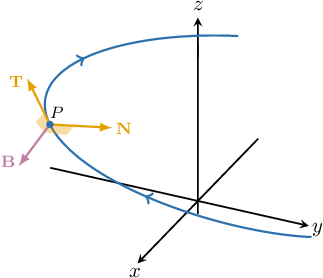

# Binormal Vectors

Source: https://www.mathacademy.com/topics/3176?courseId=154
Topic ID: 3176

## Prerequisites

- [Calculating the Cross Product Using Determinants](../../../high-school/integrated-math-honors/lessons/integrated-math-iii-honors/245-calculating-the-cross-product-using-determinants.md)
- [Principal Normal Vectors](./1795-principal-normal-vectors.md)

## Lesson

### Introduction

The **binormal vector** to a curve $C$ defined by the vector-valued function $\mathbf{r}(t)$ is defined as

$$

\mathbf{B}(t) = \mathbf{T}(t) \times \mathbf{N}(t),

$$

where $\mathbf{T}$ and $\mathbf{N}$ denote the unit tangent and principal normal vectors, respectively.

The diagram below shows the binormal vector to a curve at some point $P$ on the curve.

Since $\mathbf B = \mathbf T\times \mathbf N,$ we can conclude that $\mathbf B$ is perpendicular to both $\mathbf T$ and $\mathbf N,$ and it's pointing downward.

Also, since $\mathbf T$ and $\mathbf N$ are perpendicular *unit* vectors, it follows that $\mathbf B$ is also a unit vector.

### Example: Calculating the General Binormal Vector to a Curve Given the Unit Tangent and Principal Normal

#### Question

Find the binormal vector to the curve $\mathbf r(t)$ at an arbitrary point, given that

$$

\begin{aligned}𝐓(𝑡) & =\frac{1}{\sqrt{√𝑡^{2}+16}}⟨0,𝑡,4⟩, \\ 𝐍(𝑡) & =\frac{1}{\sqrt{√𝑡^{2}+16}}⟨0,4,−𝑡⟩.\end{aligned}

$$

Note that $\mathbf T$ and $\mathbf N$ denote the unit tangent and principal normal, respectively.

#### Explanation

The binormal vector is given by

$$

\mathbf B(t) = \mathbf T(t) \times \mathbf N(t).

$$

Therefore, we have

$$

\begin{aligned}𝐁(𝑡) & =𝐓(𝑡)×𝐍(𝑡) \\ & =\frac{1}{\sqrt{√𝑡^{2}+16}}⟨0,𝑡,4⟩×\frac{1}{\sqrt{√𝑡^{2}+16}}⟨0,4,−𝑡⟩ \\ & =\frac{1}{𝑡^{2}+16}\,\begin{aligned}𝐢 & 𝐣 & 𝐤 \\ 0 & 𝑡 & 4 \\ 0 & 4 & −𝑡\end{aligned} \\ & =\frac{1}{𝑡^{2}+16}[ \begin{aligned}𝑡 & 4 \\ 4 & −𝑡\end{aligned}\,𝐢−\begin{aligned}0 & 4 \\ 0 & −𝑡\end{aligned}\,𝐣+\begin{aligned}0 & 𝑡 \\ 0 & 4\end{aligned}\,𝐤 ] \\ & =\frac{1}{𝑡^{2}+16}⟨(−𝑡^{2}−16),−(0−0),(0−0)⟩ \\ & =\frac{1}{𝑡^{2}+16}⟨−(𝑡^{2}+16),0,0⟩ \\ & =⟨−1,0,0⟩.\end{aligned}

$$

### Example: Calculating a Specific Binormal Vector to a Curve Given the Unit Tangent and Principal Normal

#### Question

Find the binormal vector to the curve $\mathbf r(t)$ at the point $t=\pi$, given that

$$

\begin{aligned}𝐓(𝜋) & =\frac{1}{5}⟨0,−3,4⟩, \\ 𝐍(𝜋) & =⟨1,0,0⟩.\end{aligned}

$$

Note that $\mathbf T$ and $\mathbf N$ denote the unit tangent and principal normal, respectively.

#### Explanation

The binormal vector is given by

$$

\mathbf B(t) = \mathbf T(t) \times \mathbf N(t).

$$

Therefore, we have

$$

\begin{aligned}𝐁(𝜋) & =𝐓(𝜋)×𝐍(𝜋) \\ & =\frac{1}{5}⟨0,−3,4⟩×⟨1,0,0⟩ \\ & =\frac{1}{5}\begin{aligned}𝐢 & 𝐣 & 𝐤 \\ 0 & −3 & 4 \\ 1 & 0 & 0\end{aligned} \\ & =\frac{1}{5}[ \begin{aligned}−3 & 4 \\ 0 & 0\end{aligned}\,𝐢−\begin{aligned}0 & 4 \\ 1 & 0\end{aligned}\,𝐣+\begin{aligned}0 & −3 \\ 1 & 0\end{aligned}\,𝐤 ] \\ & =\frac{1}{5}⟨(0−0),−(0−4),(0−(−3))⟩ \\ & =\frac{1}{5}⟨0,4,3⟩.\end{aligned}

$$

### Example: Calculating the General Binormal Vector to a Curve Given the Unit Tangent

#### Question

Find the binormal vector to the curve $\mathbf r(t)$ at an arbitrary point, given that

$$

\begin{aligned}𝐓(𝑡) & =\frac{1}{\sqrt{√5}}⟨sin⁡4𝑡,2,cos⁡4𝑡⟩.\end{aligned}

$$

Note that $\mathbf T$ denotes the unit tangent vector.

#### Explanation

The binormal vector is given by

$$

\mathbf B(t) = \mathbf T(t) \times \mathbf N(t),

$$

where the principal normal vector $\mathbf N(t)$ is given by

$$

\mathbf N(t)= \dfrac{\mathbf T'(t)}{\|\mathbf T'(t)\|}.

$$

First, we find the principal normal $\mathbf{N}(t).$ To do this, we calculate $\mathbf T'(t)$ and its magnitude as follows:

$$

\begin{aligned}𝐓^{′}(𝑡) & =\frac{1}{\sqrt{√5}}⟨\frac{d}{d𝑡}(sin⁡4𝑡),\,\frac{d}{d𝑡}(2),\,\frac{d}{d𝑡}(cos⁡4𝑡)⟩ \\ & =\frac{1}{\sqrt{√5}}⟨4cos⁡4𝑡,\,0,\,−4sin⁡4𝑡⟩ \\ & =\frac{4}{\sqrt{√5}}⟨cos⁡4𝑡,\,0,\,−sin⁡4𝑡⟩ \\ 𝐓^{′}(𝑡) & =\frac{1}{\sqrt{√5}}\sqrt{√(4cos⁡4𝑡)^{2}+0^{2}+(−4sin⁡4𝑡)^{2}} \\ & =\frac{1}{\sqrt{√5}}\sqrt{√16cos^{2}⁡4𝑡+16sin^{2}⁡4𝑡} \\ & =\frac{1}{\sqrt{√5}}\sqrt{√16(cos^{2}⁡4𝑡+sin^{2}⁡4𝑡)} \\ & =\frac{1}{\sqrt{√5}}\sqrt{√16} \\ & =\frac{4}{\sqrt{√5}}\end{aligned}

$$

Now, we normalize $\mathbf T'(t)$ and obtain the principal normal to the curve:

$$

\begin{aligned}𝐍(𝑡) & =\frac{𝐓^{′}(𝑡)}{∥𝐓^{′}(𝑡)∥} \\ & =\frac{\frac{4}{\sqrt{√5}}⟨cos⁡4𝑡,\,0,\,−sin⁡4𝑡⟩}{\sqrt{√5}} \\ & =⟨cos⁡4𝑡,\,0,\,−sin⁡4𝑡⟩\end{aligned}

$$

Finally, we calculate the binormal vector, as follows:

$$

\begin{aligned}𝐁(𝑡) & =𝐓(𝑡)×𝐍(𝑡) \\ & =\frac{1}{\sqrt{√5}}⟨sin⁡4𝑡,2,cos⁡4𝑡⟩×⟨cos⁡4𝑡,\,0,\,−sin⁡4𝑡⟩ \\ & =\frac{1}{\sqrt{√5}}\,\begin{aligned}𝐢 & 𝐣 & 𝐤 \\ sin⁡4𝑡 & 2 & cos⁡4𝑡 \\ cos⁡4𝑡 & 0 & −sin⁡4𝑡\end{aligned} \\ & =\frac{1}{\sqrt{√5}}[ \begin{aligned}2 & cos⁡4𝑡 \\ 0 & −sin⁡4𝑡\end{aligned}\,𝐢−\begin{aligned}sin⁡4𝑡 & cos⁡4𝑡 \\ cos⁡4𝑡 & −sin⁡4𝑡\end{aligned}\,𝐣+\begin{aligned}sin⁡4𝑡 & 2 \\ cos⁡4𝑡 & 0\end{aligned}\,𝐤 ] \\ & =\frac{1}{\sqrt{√5}}⟨−2sin⁡4𝑡−0,−(−sin^{2}⁡4𝑡−cos^{2}⁡4𝑡),0−2cos⁡4𝑡⟩ \\ & =\frac{1}{\sqrt{√5}}⟨−2sin⁡4𝑡,\,1,\,−2cos⁡4𝑡⟩\end{aligned}

$$
