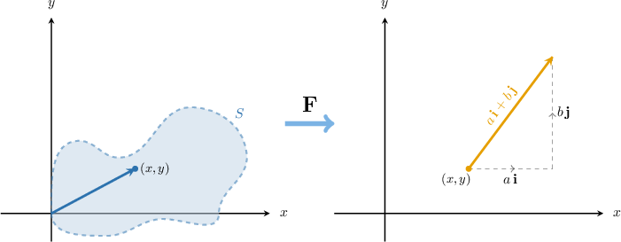
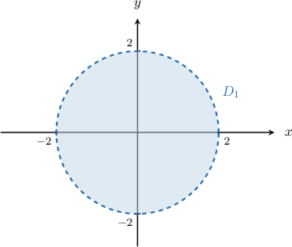
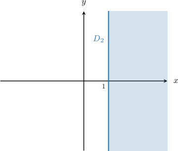
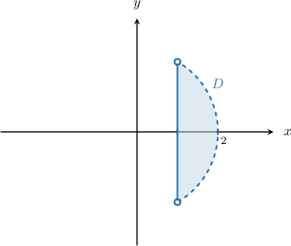
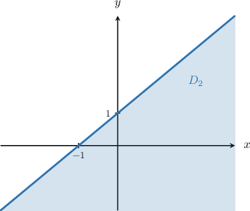

# Vector Fields

Source: https://www.mathacademy.com/topics/3343?courseId=154
Topic ID: 3343

## Prerequisites

- [The Domain of a Vector-Valued Function](./1737-the-domain-of-a-vector-valued-function.md)
- [Vectors in N-Dimensional Euclidean Space](./1849-vectors-in-n-dimensional-euclidean-space.md)
- [The Domain of a Multivariable Function](./1899-the-domain-of-a-multivariable-function.md)

## Lesson

### Introduction

Suppose that is a subset of A **vector field** on is a function that maps every point in to a *vector* in

For example, consider the vector field given by

This vector field maps the point to the vector because

In general, any vector field on can be expressed in terms of its component functions and as follows: In the example above, we had

**Note:** We can easily extend our definition of a vector field to three-dimensional or even -dimensional space. For example, if is a subset of then a vector field on is a function that maps every point in to a vector in

### Example: Identifying Vector Fields on Two-Dimensions

#### Question

Which of the following are vector fields on $\mathbb R^2?$

1. $\mathbf A(x,y) = \sqrt{x}\,\mathbf i + y^3\,\mathbf j$

2. $\mathbf B(x,y,z) = \ln y\,\mathbf i - (x+y)\,\mathbf j + z\,\mathbf k$

3. $\mathbf C(t) = \sin{t}\,\mathbf i + (2-t^3)\,\mathbf j$

#### Explanation

Suppose that $S$ is a subset of $\mathbb R^2.$ A vector field on $\mathbb R^2$ is a function $\mathbf F$ that maps every point $(x,y)$ in $S$ to a vector $\mathbf F(x,y)\in \mathbb R^2.$

With that in mind, let's examine each function.

- The function $\mathbf A(x,y)$ is a vector field on $\mathbb R^2.$ It maps every point in the set $S,$ given by to a vector in $\mathbb R^2.$

- The function $\mathbf B(x,y,z)$ is ** a vector field on $\mathbb R^2.$ It is a vector field on $\mathbb R^3.$

- The function $\mathbf C(t)$ is ** a vector field on $\mathbb R^2.$ It assigns points in $\mathbb{R}$ (not $\mathbb{R^2}$) to vectors in $\mathbb{R^2}.$

Therefore, the correct answer is "I only."

### Example: Identifying Vector Fields on Three-Dimensions

#### Question

Which of the following are vector fields on $\mathbb R^3?$

1. $\mathbf R(x,y,z) = 2\,\mathbf i - x\,\mathbf j + y\,\mathbf k$

2. $\mathbf S(x,y) = 2x\,\mathbf i - y^3\,\mathbf j$

3. $\mathbf T(x,y,z) = \dfrac{x}{z}\,\mathbf i - \dfrac{y}{z}\,\mathbf j + \dfrac{z}{2}\,\mathbf k$

#### Explanation

Suppose that $S$ is a subset of $\mathbb R^3.$ A vector field on $\mathbb R^3$ is a function $\mathbf F$ that maps every point $(x,y,z)\in S$ to a vector $\mathbf F(x,y,z)\in\mathbb R^3.$

With that in mind, let's examine each function.

- The function $\mathbf R(x,y,z)$ is a vector field on $\mathbb R^3.$ It assigns every point $(x,y,z) \in \mathbb{R^3}$ to a vector in $\mathbb{R^3}.$

- The function $\mathbf S(x,y)$ is ** a vector field on $\mathbb R^3.$ It assigns points in $\mathbb R^2$ (not $\mathbb R^3$) to vectors in $\mathbb R^2$ (not $\mathbb R^3$).

- The function $\mathbf T(x,y,z)$ is a vector field on $\mathbb R^3.$ It assigns every point in the set $S,$ given by to a vector in $\mathbb R^3.$

Therefore, the correct answer is "I and III only."

### The Domain of a Vector Field

We can find the domain of a vector field by calculating the intersection of the domains of its component functions.

To demonstrate, let's find the domain of the vector field $\mathbf F$ on $\mathbb{R}^2,$ given by

$$

\mathbf F(x,y) = \ln\left(4-x^2-y^2\right)\,\mathbf{i} + \sqrt{x-1}\,\mathbf{j},

$$

whose component functions are

$$

P(x,y) = \ln\left(4-x^2-y^2\right), \qquad Q(x,y) = \sqrt{x-1}.

$$

To find the domain of $\mathbf F,$ we find the domain of each component function and then compute their intersection.

- The function $P(x,y)$ is defined when the expression under the logarithm is positive. To find the domain, we solve the following inequality: Therefore, the domain of $P$ is given by which is the interior of a circle of radius $2,$ as shown below:

- The function $Q(x,y)$ is defined when the expression under the radical is positive or zero. To find the domain, we solve the following inequality: Therefore, the domain of $Q$ is given by which is the half-plane shown below:

Finally, the domain $D$ of $\mathbf F$ is given by

$$

D = D_1 \cap D_2 = \big\{(x,y)\in\mathbb R^2\: | \: x^2 + y^2 \lt 4, \, x\geq 1 \big\}.

$$

The domain of $\mathbf F$ is shown below.

### Example: Finding the Domain of a Vector Field

#### Question

Find the domain of the vector field $\mathbf F$ on $\mathbb R^2,$ given by

$$

\mathbf F(x,y) =\dfrac{1}{x^2+y^2}\, \mathbf{i} + \sqrt{1+x-y} \, \mathbf{j}\,.

$$

#### Explanation

The function $\mathbf F$ can be expressed in terms of its components $P(x,y)$ and $Q(x,y)$ as

$$

\mathbf F(x,y) = P(x,y)\,\mathbf i + Q(x,y)\,\mathbf j,

$$

where

$$

P(x,y) =\dfrac{1}{x^2+y^2}, \qquad Q(x,y) = \sqrt{1+x-y} .

$$

We first find the domain of each component function. Then, we compute their intersection to find the domain of $\mathbf F\mathbin{:}$

- The function $P(x,y)$ is defined everywhere other than when the denominator vanishes. To find where the denominator vanishes, we set it equal to zero and solve: Therefore, the domain of $P$ is given by The region $D_1$ is the entire plane $\mathbb R^2$ with the origin removed, as shown below.

- The function $Q(x,y)$ is defined when the expression under the radical is positive or zero. To find the domain, we solve the following inequality: Therefore, the domain of $Q$ is given by

The region $D_2,$ shown below:

Finally, the domain $D$ of $\mathbf F$ is given by

$$

D = D_1\cap D_2 = \big\{(x,y)\in\mathbb R^2\: | \: (x,y)\neq 0,\, y \leq 1 + x\big\}.

$$

The region $D$ is shown below.

