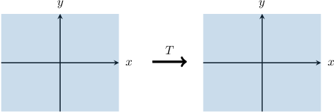
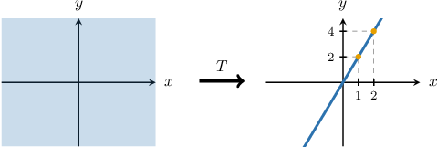
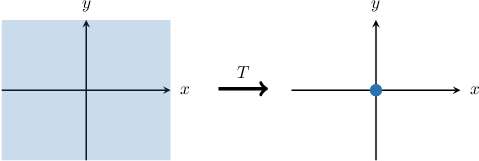

# The Image of a Linear Transformation in the Cartesian Plane

Source: https://www.mathacademy.com/topics/3645?courseId=154
Topic ID: 3645

## Prerequisites

- [Singular Linear Transformations in the Plane](../../../high-school/integrated-math-honors/lessons/integrated-math-iii-honors/1351-singular-linear-transformations-in-the-plane.md)
- [The Kernel of a Linear Transformation](./1960-the-kernel-of-a-linear-transformation.md)
- [The Image and Rank of a Linear Transformation](./1963-the-image-and-rank-of-a-linear-transformation.md)
- [The Rank-Nullity Theorem](./3836-the-rank-nullity-theorem.md)

## Lesson

### Introduction

Suppose we have the following linear transformation:

$$

\mathbf{T}: \mathbb{R}^2 \to \mathbb{R}^2

$$

The image of $\mathbf{T}$ is a subspace of $\mathbb{R}^2.$ Therefore, it can only be one of the following:

- the whole of $\mathbb{R}^2,$

- a line through the origin, or

- a single point (vector), namely the origin $(0,0).$

Let's denote the standard matrix of $\mathbf{T}$ by $T.$ It turns out that the dimension of the image of $\mathbf{T}$ depends on $\text{rank}(T)$ (or equivalently on $\text{nullity}(T)$ by the rank-nullity theorem). Indeed, we have the following:

- If $\text{rank}(T)=2,$ then the two columns of $T$ are linearly independent. This means $T$ is invertible and therefore, $\text{Im}(\mathbf{T}) = \mathbb{R}^2.$ For example, the following transformation maps $\mathbb{R}^2$ onto $\mathbb{R}^2\mathbin{:}$

- If $\text{rank}(T)=1,$ then there is a nonzero vector that generates the image of $\mathbf{T}.$ In this case, the image of $\mathbf{T}$ is a one-dimensional subspace of $\Bbb R^2$. So, it is a line passing through the origin. For example, the following transformation maps $\mathbb{R}^2$ onto the line $y=2x\mathbin{:}$ Notice that the points $(2,4)$ and $(1,2),$ defined by the columns of $T,$ lie on the line $y=2x.$

- If $\text{rank}(T)=0$ then, according to the rank-nullity theorem, This means that $\mathbf{T}(\mathbf{v})=\mathbf{0}$ for all $\mathbf{v}\in \Bbb R^2$. So, in this case, we have that which maps $\mathbb{R}^2$ onto $\{(0,0)\},$ i.e., the set containing only the zero vector $\mathbf{0}.$

### Example: Identitying the Type of the Image of a Linear Transformation

#### Question

Consider the standard matrices of three linear transformations shown below. Which of these transformations map $\mathbb{R}^2$ onto a line?

$$

[\begin{aligned}−2 & 2 \\ 1 & −1\end{aligned}]

$$

#### Explanation

Given a linear transformation over $\mathbb{R}^2$ with the standard matrix $T,$ we have the following:

- $T$ maps $\mathbb{R}^2$ onto $\mathbb{R}^2$ if and only if $\text{rank}(T)=2,$ i.e., $T$ is nonsingular.

- $T$ maps $\mathbb{R}^2$ onto a line if and only if $\text{rank}(T)=1.$

- $T$ maps $\mathbb{R}^2$ onto $(0,0)$ if and only if $\text{rank}(T)=0,$ i.e., $T$ is the zero matrix.

With that in mind, let's examine our matrices.

- $T_1$ maps $\mathbb{R}^2$ onto a line. Notice that the columns of $T_1$ are linearly dependent but it's not the zero matrix. So, $\text{rank}(T_1)=1.$

- $T_2$ maps $\mathbb{R}^2$ onto $\mathbb{R}^2.$ Indeed, $T_2$ is a nonsingular matrix, i.e. $\text{rank}(T_2)=2.$

- $T_3$ maps $\mathbb{R}^2$ onto $(0,0)$ since $T_3$ is the zero matrix, i.e. $\text{rank}(T_3)=0.$

Therefore, the correct answer is "$T_1$ only."

### Example: Determining the One-Dimensional Image of a Linear Transformation in the Cartesian Plane

#### Question

Consider the standard matrix $T$ of the linear transformation $\mathbf{T},$ given by

$$

[\begin{aligned}6 & −9 \\ 2 & −3\end{aligned}]

$$

Find the equation of the line that the transformation $\mathbf{T}$ maps $\mathbb{R}^2$ onto.

#### Explanation

Notice that $T$ has proportional rows, yet $T$ is not the zero matrix.

Therefore, $\text{rank}(\mathbf{T})=1$ and $\mathbf{T}$ maps $\mathbb{R}^2$ onto a line that passes through the origin.

Moreover, the line must pass through the origin $(0,0)$ and the points $(6,2)$ and $(-9,-3),$ which are defined by the columns of $T.$

Computing the slope $m$ of this line, we get

$$

m = \dfrac{-3-2}{-9-6} = \dfrac13.

$$

Therefore, $\mathbf{T}$ maps $\mathbb{R}^2$ onto the line $y=\dfrac13x.$

### Example: Identifying True Statements Regarding Linear Transformations in the Cartesian Plane

#### Question

Consider a linear transformation $\mathbf{T}$ that maps $\mathbb{R}^2$ onto the line $y=-5x.$ Which of the following statements are true?

1. $\langle -1, 5 \rangle \in \text{Im}(\mathbf{T})$

2. $\text{Ker}(\mathbf{T})=\{0\}$

3. $\text{Im}(\mathbf{T})=\Bbb R^2$

#### Explanation

Recall that when the image of a linear transformation $\mathbf{T}$ in $\mathbb{R}^2$ with the standard matrix $T$ is a one-dimensional line, then

$$

\text{rank}(T) = \text{rank}(\mathbf{T}) = 1,

$$

and, according to the rank-nullity theorem,

$$

\begin{aligned}nullity(𝑇)=nullity(𝐓) & =2−rank(𝑇) \\ & =2−1 \\ & =1.\end{aligned}

$$

With that in mind, let's examine our statements in turn.

- Statement I is true. Indeed, the point $(-1,5)$ satisfies the equation of the line $y=-5x$ since $5=-5\cdot (-1).$ Hence,

- Statement II is false. Since $\text{nullity}(T)=1,$ we get

- Statement III is false. Since $\text{rank}(\mathbf{T})=1,$ we get

Therefore, the correct answer is "I only."
