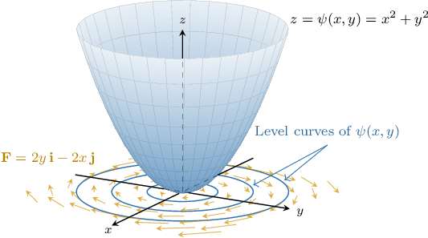
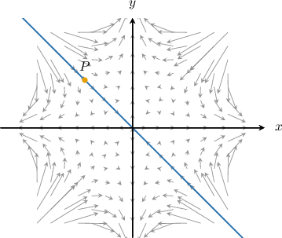

# Stream Functions

Source: https://www.mathacademy.com/topics/3717?courseId=154
Topic ID: 3717

## Prerequisites

- [Solving First-Order ODEs Using Direct Integration](../../../ap-courses/lessons/ap-calculus-ab/1061-solving-first-order-odes-using-direct-integration.md)
- [Tangent Lines to Level Curves](./1940-tangent-lines-to-level-curves.md)
- [Equality of Mixed Partial Derivatives](./1957-equality-of-mixed-partial-derivatives.md)
- [Visualizing Vector Fields](./3344-visualizing-vector-fields.md)
- [Connected and Simply-Connected Regions](./3357-connected-and-simply-connected-regions.md)

## Lesson

### Introduction

Let $\psi(x,y)$ be a two-variable function defined on a simply connected open set $D \subseteq \mathbb{R}^2.$ We know that for a point $(x_0,y_0)\in D,$ the vector

$$

\left.\left(\dfrac{\partial \psi}{\partial y}\,\mathbf i -\dfrac{\partial \psi}{\partial x}\,\mathbf j\right)\right|_{(x_0,y_0)}

$$

is *tangential* to the level curve $\psi(x,y) = \psi(x_0,y_0).$

By computing this tangent vector at *every* point, we can generate a vector *field* tangential to the level curves of $\psi$ at every point.

With that in mind, let

$$

\mathbf F(x,y)= P(x,y)\,\mathbf{i} + Q(x,y)\,\mathbf{j}

$$

be a vector field defined on $D.$ A function $\psi(x,y)$ is said to be a **stream function** of $\mathbf F$ if it satisfies

$$

P = \dfrac{\partial \psi}{\partial y}, \qquad Q = -\dfrac{\partial \psi}{\partial x}.

$$

For example, let's consider the function

$$

\psi(x,y) = x^2+y^2.

$$

To construct a vector field with this stream function, we first compute the partial derivatives:

$$

\begin{aligned}𝑃 & =\frac{𝜕𝜓}{𝜕𝑦} \\ & =\frac{𝜕}{𝜕𝑦}(𝑥^{2}+𝑦^{2}) \\ & =2𝑦, \\ 𝑄 & =−\frac{𝜕𝜓}{𝜕𝑥} \\ & =−\frac{𝜕}{𝜕𝑥}(𝑥^{2}+𝑦^{2}) \\ & =−2𝑥.\end{aligned}

$$

Thus, the vector field with the stream function $\psi$ is given by

$$

\begin{aligned}𝐅(𝑥,𝑦) & =𝑃\,𝐢+𝑄\,𝐣=2𝑦\,𝐢−2𝑥\,𝐣.\end{aligned}

$$

A diagram showing the surface $z = \psi(x,y),$ its level curves, and the vector field $\mathbf F$ are shown below.

Note the following:

- The level curves of $\psi(x,y)$ are circles of the form $x^2+y^2=c$, and the vector field $\mathbf{F}$ in the $xy$-plane is tangential to these level curves.

- Suppose $\mathbf F$ represents the velocity of a fluid in the $xy$-plane. Then, the level curves of $\psi(x,y)$ represent the path of a massless particle in the $xy$-plane moving with the flow. For this reason, the level curves of $\psi$ are called **streamlines.**

- The stream function of a vector field is typically not unique since we can add any constant to $\psi$ to generate another valid stream function.

### Example: Constructing a Vector Field From Its Stream Function

#### Question

Construct the vector field that has the stream function $\psi(x,y) = e^{x} \cos{y}.$

#### Explanation

A function $\psi(x,y)$ is a stream function of the vector field $\mathbf F= P\,\mathbf{i} + Q\,\mathbf{j}$ if the following equations hold:

$$

P = \dfrac{\partial \psi}{\partial y},\qquad Q = -\dfrac{\partial \psi}{\partial x}

$$

Computing the partial derivatives of the function $\psi(x,y),$ we have

$$

\begin{aligned}𝑃 & =\frac{𝜕𝜓}{𝜕𝑦} \\ & =\frac{𝜕}{𝜕𝑦}(𝑒^{𝑥}cos⁡𝑦) \\ & =−𝑒^{𝑥}sin⁡𝑦, \\ 𝑄 & =−\frac{𝜕𝜓}{𝜕𝑥} \\ & =−\frac{𝜕}{𝜕𝑥}(𝑒^{𝑥}cos⁡𝑦) \\ & =−𝑒^{𝑥}cos⁡𝑦.\end{aligned}

$$

Therefore, the vector field with the stream function $\psi(x,y) = e^{x} \cos{y}$ is

$$

\begin{aligned}𝐅(𝑥,𝑦) & =𝑃\,𝐢+𝑄\,𝐣 \\ & =−𝑒^{𝑥}sin⁡𝑦\,𝐢−𝑒^{𝑥}cos⁡𝑦\,𝐣.\end{aligned}

$$

### An Existence Condition for Stream Functions

Not all vector fields have an associated stream function! So, it's useful to have some way of determining whether a given vector field has a stream function or not. For this, we have the following theorem:

*Let $\mathbf F= P\,\mathbf{i} + Q\,\mathbf{j}$ be a vector field defined in a simply connected open set $D \subseteq \mathbb{R}^2.$ The vector field $\mathbf{F}$ has a stream function $\psi(x,y)$ if and only if*

$$

\dfrac{\partial P}{\partial x} + \dfrac{\partial Q}{\partial y} = 0.

$$

In other words, the divergence of $\mathbf F$ must be zero everywhere for a stream function to exist.

We won't give a detailed proof of this result here, but it's quite easy to see why it may be true.

Recall that if $\psi(x,y)$ is a stream function of $\mathbf F = P\,\mathbf i + Q\,\mathbf j$ if it satisfies

$$

P = \dfrac{\partial \psi}{\partial y}, \qquad Q = -\dfrac{\partial \psi}{\partial x}.

$$

Calculating the divergence of this vector field, we get

$$

\begin{aligned}\frac{𝜕𝑃}{𝜕𝑥}+\frac{𝜕𝑄}{𝜕𝑦} & =\frac{𝜕}{𝜕𝑥}(\frac{𝜕𝜓}{𝜕𝑦})+\frac{𝜕}{𝜕𝑦}(−\frac{𝜕𝜓}{𝜕𝑥}) \\ & =\frac{𝜕^{2}𝜓}{𝜕𝑥𝜕𝑦}−\frac{𝜕^{2}𝜓}{𝜕𝑦𝜕𝑥} \\ & =\frac{𝜕^{2}𝜓}{𝜕𝑥𝜕𝑦}−\frac{𝜕^{2}𝜓}{𝜕𝑥𝜕𝑦} \\ & =0\end{aligned}

$$

### Example: Determining Cases Where a Stream Function Exists

#### Question

Which of the following vector fields have a stream function?

1. $\mathbf{F}(x,y) = x^4y\,\mathbf{i} - 2x^3y^2\,\mathbf{j}$

2. $\mathbf{F}(x,y) = \sin x \sin y\,\mathbf{i} + \cos x \cos y\,\mathbf{j}$

3. $\mathbf{F}(x,y) = 4x^2y\,\mathbf{i} -4x^2y^2\,\mathbf{j}$

#### Explanation

A vector field $\mathbf{F} = P\,\mathbf{i} + Q\,\mathbf{j}$ with a simply connected domain $D \subseteq \mathbb{R}^2$ has a stream function $\psi(x,y)$ if and only if

$$

\dfrac{\partial P}{\partial x} + \dfrac{\partial Q}{\partial y} = 0.

$$

With that in mind, let's consider each vector field.

- Vector field I has a stream function. Indeed, the partial derivatives are given by Therefore,

- Vector field II has a stream function. Indeed, the partial derivatives are given by Therefore,

- Vector field III doesn't have a stream function. The partial derivatives are given by Therefore,

Therefore, the correct answer is "I and II only."

### Calculating a Stream Function From Its Vector Field

Let's find a stream function for the following vector field:

$$

\mathbf{F}(x,y) = e^x \sin y\,\mathbf{i} + e^x \cos y\,\mathbf{j}

$$

Note that our vector field $\mathbf{F} = P\,\mathbf{i} + Q\,\mathbf{j}$ has the simply connected domain $D=\mathbb{R}^2,$ where

$$

P(x,y) = e^x\sin y, \qquad Q(x,y) = e^x\cos y.

$$

Let's start by checking that a stream function exists. Computing the partial derivatives, we have

$$

\begin{aligned}\frac{𝜕𝑃}{𝜕𝑥}=𝑒^{𝑥}sin⁡𝑦,\,\frac{𝜕𝑄}{𝜕𝑦} & =−𝑒^{𝑥}sin⁡𝑦.\end{aligned}

$$

Hence, $\mathbf F$ has a stream function since $\dfrac{\partial P}{\partial x} + \dfrac{\partial Q}{\partial y} = 0.$

Next, we find a stream function. A function $\psi(x,y)$ is a stream function of the vector field $\mathbf F= P\,\mathbf{i} + Q\,\mathbf{j}$ if

$$

P = \dfrac{\partial \psi}{\partial y}, \qquad Q = -\dfrac{\partial \psi}{\partial x}.

$$

In our case, we have

$$

\dfrac{\partial \psi}{\partial y} = e^x\sin y, \qquad \dfrac{\partial \psi}{\partial x} = -e^x\cos y.

$$

To find a stream function, we **partially integrate** these two equations and compare the results:

- For the first equation, we have Partially integrating this equation with respect to $y$ (that is, treating $x$ as though it were a constant), we get where $f$ is an arbitrary function.

- For the second equation, we have Partially integrating this equation with respect to $x$ (that is, treating $y$ as though it were a constant), we get where $g$ is an arbitrary function.

Comparing our two expressions for $\psi,$ we get equality by setting $f=g=0.$ Therefore, we have

$$

\psi(x,y) = -e^x \cos y.

$$

Finally, remember that the streamlines of $\mathbf F$ are given by the level curves of $\psi.$ So, to find the streamlines of $\mathbf F,$ we plot the curves $\psi = k$ for different values of $k.$ The level curves of $\psi$ are always tangential to $\mathbf F.$

### Example: Determining a Stream Function for a Vector Field

#### Question

Find a stream function for the vector field $\mathbf F,$ given by

$$

\mathbf{F}(x,y) = 2y\,\mathbf{i} +2x\,\mathbf{j}.

$$

#### Explanation

A vector field $\mathbf{F} = P\,\mathbf{i} + Q\,\mathbf{j}$ with a simply connected domain $D \subseteq \mathbb{R}^2$ has a stream function $\psi(x,y)$ if and only if

$$

\dfrac{\partial P}{\partial x} + \dfrac{\partial Q}{\partial y} = 0.

$$

Note that $\mathbf{F}(x,y) = 2y\,\mathbf{i} +2x\,\mathbf{j}$ is a vector field with simply connected domain $D=\mathbb{R}^2,$ where $P(x,y) = 2y$ and $Q(x,y) =2x.$ Computing the partial derivatives, we have

$$

\begin{aligned}\frac{𝜕𝑃}{𝜕𝑥}=0,\,\frac{𝜕𝑄}{𝜕𝑦} & =0.\end{aligned}

$$

Hence, $\mathbf F$ has a stream function, since

$$

\dfrac{\partial P}{\partial x} + \dfrac{\partial Q}{\partial y} = 0 + 0 = 0.

$$

Next, we find a stream function. A function $\psi(x,y)$ is a stream function of the vector field $\mathbf F= P\,\mathbf{i} + Q\,\mathbf{j}$ if

$$

P = \dfrac{\partial \psi}{\partial y}, \qquad Q = -\dfrac{\partial \psi}{\partial x}.

$$

In our case, we have

$$

\dfrac{\partial \psi}{\partial y} = 2y, \qquad \dfrac{\partial \psi}{\partial x} = -2x.

$$

Integrating these equations, we obtain the following:

$$

\psi(x,y) = y^2 + f(x), \qquad \psi(x,y) = -x^2+ g(y)

$$

where $f$ and $g$ are arbitrary functions. Finally, setting $f(x)=-x^2$ and $g(y)=y^2,$ we have

$$

\psi(x,y) = y^2-x^2.

$$

### Example: Finding Streamlines of Vector Fields

#### Question

Determine the equation of the streamline that passes through the point $P(-1,1)$ for the vector field $\mathbf{F}(x,y) = (x^3-3xy^2)\,\mathbf{i} + (y^3-3x^2y)\,\mathbf{j}.$

#### Explanation

The streamlines of a vector field are the level curves of its stream function and are tangential to the vector field at every point.

If $\mathbf F$ represents the velocity field of a fluid flow, then they show the path traced out by a massless particle as it moves with the flow.

A vector field $\mathbf{F} = P\,\mathbf{i} + Q\,\mathbf{j}$ with a simply connected domain $D \subseteq \mathbb{R}^2$ has a stream function $\psi(x,y)$ if and only if

$$

\dfrac{\partial P}{\partial x} + \dfrac{\partial Q}{\partial y} = 0.

$$

Note that $\mathbf{F}(x,y) = (x^3-3xy^2)\,\mathbf{i} + (y^3-3x^2y)\,\mathbf{j}$ is a vector field with simply connected domain $D=\mathbb{R}^2,$ where $P(x,y) = x^3-3xy^2$ and $Q(x,y) = y^3 - 3x^2y.$ Computing the partial derivatives, we have

$$

\begin{aligned}\frac{𝜕𝑃}{𝜕𝑥}=3𝑥^{2}−3𝑦^{2},\,\frac{𝜕𝑄}{𝜕𝑦} & =3𝑦^{2}−3𝑥^{2}.\end{aligned}

$$

Hence, $\mathbf F$ has a stream function, since

$$

\dfrac{\partial P}{\partial x} + \dfrac{\partial Q}{\partial y} = (3x^2-3y^2) + (3y^2 - 3x^2) = 0.

$$

Next, we find a stream function. A function $\psi(x,y)$ is a stream function of the vector field $\mathbf F= P\,\mathbf{i} + Q\,\mathbf{j}$ if

$$

P = \dfrac{\partial \psi}{\partial y}, \qquad Q = -\dfrac{\partial \psi}{\partial x}.

$$

In our case, we have

$$

\dfrac{\partial \psi}{\partial y} = x^3-3xy^2, \qquad \dfrac{\partial \psi}{\partial x} = -y^3+3x^2y.

$$

Integrating these equations, we obtain the following:

$$

\psi(x,y) = x^3y - xy^3 + f(x), \qquad \psi(x,y) = -xy^3 + x^3y + g(y)

$$

where $f$ and $g$ are arbitrary functions. Finally, setting $f=g=0,$ we have

$$

\psi(x,y) = x^3y - xy^3.

$$

Finally, we find the level curve of the stream function $\psi(x,y) = x^3y - xy^3$ that passes through $P.$ First, we find the value of the stream function at $P{:}$

$$

\begin{aligned}𝜓(−1,1) & =(−1)^{3}(1)−(−1)(1)^{3} \\ & =−1−(−1) \\ & =0\end{aligned}

$$

Hence, the streamline that passes through $P(-1,1)$ is the $0$-level curve:

$$

\begin{aligned}𝜓(𝑥,𝑦) & =0 \\ 𝑥^{3}𝑦−𝑥𝑦^{3} & =0 \\ 𝑥𝑦(𝑥^{2}−𝑦^{2}) & =0 \\ 𝑥𝑦(𝑥+𝑦)(𝑥−𝑦) & =0\end{aligned}

$$

Therefore, our possible streamlines are $x=0,$ $y=0,$ $y=-x,$ or $y=x.$ The streamline that passes through $P(-1,1)$ is $y=-x.$ The vector field and the streamline through the point $P$ are shown below.

