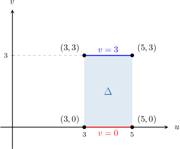

# Computing Double Integrals Using a Change of Variables

Source: https://www.mathacademy.com/topics/4132?courseId=154
Topic ID: 4132

## Prerequisites

- [Computing Areas Using a Change of Variables](./1998-computing-areas-using-a-change-of-variables.md)

## Lesson

### Introduction

Suppose that

$$

\mathbf T: (u,v) \to \left(x(u,v),y(u,v)\right)

$$

is a $C^1$ transformation that has no critical points (i.e., it is invertible) inside some region $\Delta\subset \mathbb R^2,$ and that $\mathbf T(\Delta) = D,$ as shown below.

We've already seen how the area of a non-trivial region $D$ can be computed using the change of variables formula:

$$

\iint\limits_{D} \mathrm d x \mathrm d y = \iint\limits_{\Delta} \left| \dfrac{\partial (x, y)}{\partial (u, v)} \right| \ \mathrm d u \mathrm d v

$$

We can extend this formula to compute the integral of a function $f(x,y)$ over $D,$ as follows:

$$

\iint\limits_{D} f(x,y) \ \mathrm d x \mathrm d y = \iint\limits_{\Delta} \ f(x(u,v), y(u,v)) \: \left| \dfrac{\partial (x, y)}{\partial (u, v)} \right| \ \mathrm d u \mathrm d v

$$

Note the similarity with the change of variables formula for the integral of a single-variable function $f(x)$ over $D = (a,b){:}$

$$

\int\limits_D f(x)\,\textrm d x = \int\limits_{\Delta} f(x(u))\,\dfrac{\textrm d x}{\textrm d u}\, \textrm d u

$$

Applying the change of variables formula is similar to when we were restricting our attention to areas in the plane. The only difference now is that we must also express the integrand $f(x,y)$ in terms of $u$ and $v.$

Let's see an example.

### Example: Performing a Change of Variables

#### Question

Consider the region $D$ in the $xy$-plane, given by

$$

D = \big\{ (x,y) \: : \: -2 \leq 4x+2y \leq 2, \:\: 0 \leq y-x \leq 3 \big\}.

$$

By performing the change of variables $u = 4x+2y$ and $v=y - x,$ write the following integral in terms of $u$ and $v.$

$$

\displaystyle \iint\limits_D \sin \left(3(x+y)\right) \: \mathrm{d}x \, \mathrm{d}y

$$

#### Explanation

Let's define a transformation $\mathbf{T}$ as follows:

$$

[\begin{aligned}𝑢 \\ 𝑣\end{aligned}]

$$

This transformation maps some region $\Delta$ in the $uv$-plane to our region $D$ in the $xy$-plane.

To compute the required integral, we can use the change of variables formula

$$

\iint\limits_{D} f(x,y) \, \mathrm d x \, \mathrm d y = \iint\limits_{\Delta} \ f(x(u,v), y(u,v)) \left| \dfrac{\partial (x, y)}{\partial (u, v)} \right| \mathrm d u \, \mathrm d v

$$

where $\dfrac{\partial (x, y)}{\partial (u, v)}$ is the Jacobian determinant corresponding to $\mathbf{T}.$

Note that the change of variables

$$

u = 4x + 2y, \qquad v = y - x

$$

gives us the ** function $\mathbf T^{-1},$ that is

$$

[\begin{aligned}𝑥 \\ 𝑦\end{aligned}]

$$

To compute the required integral, we proceed as follows:

****: Find $\Delta,$ which is the image of $D$ under the action of $\mathbf{T}^{-1}.$

Our domain in the $uv$-plane is

$$

\begin{aligned}Δ & ={(𝑢,𝑣)\,:\,−2≤𝑢≤2,\,0≤𝑣≤3}.\end{aligned}

$$

****: Compute the Jacobian determinant corresponding to $\mathbf T^{-1}.$

The Jacobian determinant corresponding to $\mathbf T^{-1}$ is

$$

\begin{aligned}\frac{𝜕(𝑢,𝑣)}{𝜕(𝑥,𝑦)} & =\begin{aligned}\frac{𝜕𝑢}{𝜕𝑥} & \frac{𝜕𝑢}{𝜕𝑦} \\ \frac{𝜕𝑣}{𝜕𝑥} & \frac{𝜕𝑣}{𝜕𝑦}\end{aligned} \\ & =\begin{aligned}4 & 2 \\ −1 & 1\end{aligned} \\ & =6.\end{aligned}

$$

****: Compute the Jacobian determinant corresponding to $\mathbf T.$

The Jacobian determinant corresponding to $\mathbf T$ is

$$

\dfrac{\partial (x, y)}{\partial (u, v)} = \left( \dfrac{\partial (u, v)}{\partial (x, y)} \right)^{-1} = \dfrac{1}{6}.

$$

Note that $\dfrac{\partial (x, y)}{\partial (u, v)} \neq 0$ everywhere inside $\Delta.$ In other words, $\mathbf T$ has no critical points inside $\Delta.$

****: Perform the change of variables.

In this case, we first need to solve the transformation equations

$$

u = 4x+2y, \qquad v = y-x

$$

for $x$ and $y$, which gives

$$

x = \dfrac{u-2v}6, \qquad y =\dfrac{u+4v}6.

$$

Performing the change of variables, we obtain

$$

\begin{aligned}\underset{𝐷}{∬}sin⁡(3(𝑥+𝑦))\,d𝑥\,d𝑦 & =\underset{Δ}{∬}sin⁡(3(\frac{𝑢−2𝑣}{6}+\frac{𝑢+4𝑣}{6}))\frac{𝜕(𝑥,𝑦)}{𝜕(𝑢,𝑣)}d𝑢\,d𝑣 \\ & =\underset{Δ}{∬}sin⁡(3(\frac{2𝑢+2𝑣}{6}))\frac{1}{6}d𝑢\,d𝑣 \\ & =\frac{1}{6}∫_{30}^{}∫_{2−2}^{}sin\,(𝑢+𝑣)\,d𝑢\,d𝑣.\end{aligned}

$$

### Example: Cases When the Transformation Is Inferred From the Domain

#### Question

Use a change of variables to evaluate the double integral

$$

\displaystyle \iint\limits_D \dfrac{y-x}{x+y} \: \mathrm{d}x \mathrm{d}y,

$$

where $D = \left\{(x,y) \:: \: 0 \leq y-x \leq 1, \: 1 \leq x+y \leq 4 \right\}.$

#### Explanation

Let's define a transformation $\mathbf{T}$ as follows:

$$

[\begin{aligned}𝑢 \\ 𝑣\end{aligned}]

$$

This transformation maps some region $\Delta$ in the $uv$-plane to our region $D$ in the $xy$-plane.

To compute the required integral, we can use the change of variables formula

$$

\iint\limits_{D} f(x,y) \ \mathrm d x \mathrm d y = \iint\limits_{\Delta} \ f(x(u,v), y(u,v)) \: \left| \dfrac{\partial (x, y)}{\partial (u, v)} \right| \ \mathrm d u \mathrm d v

$$

where $\dfrac{\partial (x, y)}{\partial (u, v)}$ is the Jacobian determinant corresponding to $\mathbf{T}.$

To compute the required integral, we proceed as follows:

****: Find a suitable change of variables.

The inequalities that define the region $D,$

$$

0 \leq y-x \leq 1, \qquad 1 \leq x+y \leq 4,

$$

suggest that we use the change of variables

$$

u = y-x \quad \text{and} \quad v = x+y.

$$

This change of variables gives us the ** function $\mathbf T^{-1},$ that is

$$

[\begin{aligned}𝑥 \\ 𝑦\end{aligned}]

$$

****: Find $\Delta,$ which is the image of $D$ under the action of $\mathbf{T}^{-1}.$

Our domain in the $uv$-plane is

$$

\begin{aligned}Δ & ={(𝑢,𝑣)\,:\,0≤𝑢≤1,\,1≤𝑣≤4}.\end{aligned}

$$

****: Compute the Jacobian determinant corresponding to $\mathbf T^{-1}.$

The Jacobian determinant corresponding to $\mathbf T^{-1}$ is

$$

\begin{aligned}\frac{𝜕(𝑢,𝑣)}{𝜕(𝑥,𝑦)} & =\begin{aligned}\frac{𝜕𝑢}{𝜕𝑥} & \frac{𝜕𝑢}{𝜕𝑦} \\ \frac{𝜕𝑣}{𝜕𝑥} & \frac{𝜕𝑣}{𝜕𝑦}\end{aligned} \\ & =\begin{aligned}−1 & 1 \\ 1 & 1\end{aligned} \\ & =−2.\end{aligned}

$$

****: Compute the Jacobian determinant corresponding to $\mathbf T.$

$$

\dfrac{\partial (x, y)}{\partial (u, v)} = \left( \dfrac{\partial (u, v)}{\partial (x, y)} \right)^{-1} = -\dfrac{1}{2}.

$$

Note that $\dfrac{\partial (x, y)}{\partial (u, v)} \neq 0$ everywhere inside $\Delta.$ In other words, $\mathbf T$ has no critical points inside $\Delta.$

****: Perform the change of variables, and evaluate the integral.

Performing the change of variables, we obtain

$$

\begin{aligned}\underset{𝐷}{∬}\frac{𝑦−𝑥}{𝑥+𝑦}\,d𝑥d𝑦 & =\underset{Δ}{∬}\frac{𝑢}{𝑣}\frac{𝜕(𝑥,𝑦)}{𝜕(𝑢,𝑣)}d𝑢d𝑣 \\ & =\underset{Δ}{∬}\frac{𝑢}{𝑣}\,−\frac{1}{2}d𝑢d𝑣 \\ & =\frac{1}{2}∫_{41}^{}[∫_{10}^{}\frac{𝑢}{𝑣}\,d𝑢]d𝑣 \\ & =\frac{1}{2}∫_{41}^{}\frac{1}{𝑣}[∫_{10}^{}𝑢\,d𝑢]d𝑣 \\ & =\frac{1}{2}∫_{41}^{}\frac{1}{𝑣}[\frac{𝑢^{2}}{2}]_{10}^{}\,d𝑣 \\ & =\frac{1}{4}∫_{41}^{}\frac{1}{𝑣}\,d𝑣 \\ & =\frac{1}{4}ln⁡|𝑣|\,_{41}^{} \\ & =\frac{1}{4}(ln⁡4−ln⁡1) \\ & =\frac{1}{2}\,ln⁡2.\end{aligned}

$$

### Example: Cases When the Transformation Is Inferred From the Integrand

#### Question

Use a change of variables to evaluate the double integral

$$

\displaystyle \iint\limits_D (2x+y)y^2 \:\mathrm{d}x \mathrm{d}y,

$$

where $D$ is the quadrilateral region with vertices $\left(\dfrac32,0\right),$ $\left(\dfrac52,0\right),$ $(1,3),$ and $(0,3).$

#### Explanation

Let's define a transformation $\mathbf{T}$ as follows:

$$

[\begin{aligned}𝑢 \\ 𝑣\end{aligned}]

$$

This transformation maps some region $\Delta$ in the $uv$-plane to our region $D$ in the $xy$-plane.

To compute the required integral, we can use the change of variables formula

$$

\iint\limits_{D} f(x,y) \ \mathrm d x \mathrm d y = \iint\limits_{\Delta} \ f(x(u,v), y(u,v)) \: \left| \dfrac{\partial (x, y)}{\partial (u, v)} \right| \ \mathrm d u \mathrm d v

$$

where $\dfrac{\partial (x, y)}{\partial (u, v)}$ is the Jacobian determinant corresponding to $\mathbf{T}.$

To compute the required integral, we proceed as follows:

****: Find a suitable change of variables.

The integrand

$$

f(x,y) = (2x+y)y^2

$$

suggests that we use the change of variables

$$

u=2x+y, \qquad v=y.

$$

This change of variables gives us the ** function $\mathbf T^{-1},$ that is

$$

[\begin{aligned}𝑥 \\ 𝑦\end{aligned}]

$$

****: Find $\Delta,$ which is the image of $D$ under the action of $\mathbf{T}^{-1}.$

The vertices of our domain $\Delta$ in the $uv$-plane are as follows:

$$

\begin{aligned}𝐓^{−1}(\frac{3}{2},0) & =(2⋅\frac{3}{2}+0,0) \\ & =(3,0) \\ 𝐓^{−1}(\frac{5}{2},0) & =(2⋅\frac{5}{2}+0,0) \\ & =(5,0) \\ 𝐓^{−1}(1,3) & =(2⋅1+3,3) \\ & =(5,3) \\ 𝐓^{−1}(0,3) & =(2⋅0+3,3) \\ & =(3,3)\end{aligned}

$$

Therefore, our domain in the $uv$-plane is the following rectangle:

$$

\Delta = \big\{ (u,v) \: : \: 3 \leq u \leq 5, \quad 0 \leq v \leq 3 \big\}

$$

****: Compute the Jacobian determinant corresponding to $\mathbf T^{-1}.$

The Jacobian determinant corresponding to $\mathbf T^{-1}$ is

$$

\begin{aligned}\frac{𝜕(𝑢,𝑣)}{𝜕(𝑥,𝑦)} & =\begin{aligned}\frac{𝜕𝑢}{𝜕𝑥} & \frac{𝜕𝑢}{𝜕𝑦} \\ \frac{𝜕𝑣}{𝜕𝑥} & \frac{𝜕𝑣}{𝜕𝑦}\end{aligned} \\ & =\begin{aligned}2 & 1 \\ 0 & 1\end{aligned} \\ & =2.\end{aligned}

$$

****: Compute the Jacobian determinant corresponding to $\mathbf T.$

$$

\dfrac{\partial (x, y)}{\partial (u, v)} = \left( \dfrac{\partial (u, v)}{\partial (x, y)} \right)^{-1} =\dfrac12

$$

Note that $\dfrac{\partial (x, y)}{\partial (u, v)} \neq 0$ everywhere inside $\Delta.$ In other words, $\mathbf T$ has no critical points inside $\Delta.$

****: Perform the change of variables, and evaluate the integral.

Performing the change of variables, we obtain

$$

\begin{aligned}\underset{𝐷}{∬}(2𝑥+𝑦)𝑦^{2}\,d𝑥d𝑦 & =\underset{Δ}{∬}𝑢𝑣^{2}\,\frac{𝜕(𝑥,𝑦)}{𝜕(𝑢,𝑣)}\,d𝑢d𝑣 \\ & =\underset{Δ}{∬}𝑢𝑣^{2}\,\frac{1}{2}\,d𝑢d𝑣 \\ & =\frac{1}{2}∫_{30}^{}∫_{53}^{}𝑢𝑣^{2}\,d𝑢\,d𝑣 \\ & =\frac{1}{2}∫_{30}^{}𝑣^{2}\,d𝑣∫_{53}^{}𝑢\,d𝑢 \\ & =\frac{1}{2}⋅[\frac{1}{3}𝑣^{3}]_{30}^{}⋅[\frac{1}{2}𝑢^{2}]_{53}^{}\,d𝑣 \\ & =\frac{1}{2}⋅9⋅8 \\ & =36.\end{aligned}

$$
