# Polar Coordinate Transformations

Source: https://www.mathacademy.com/topics/4135?courseId=154
Topic ID: 4135

## Prerequisites

- [Polar Equations of Radial Lines](../../../high-school/integrated-math-honors/lessons/integrated-math-iii-honors/2173-polar-equations-of-radial-lines.md)
- [Nonlinear Transformations of Plane Regions](./2832-nonlinear-transformations-of-plane-regions.md)

## Lesson

### Introduction

Consider the rectangular region $\Delta$ in the $uv$-plane, given by

$$

\Delta = \bigg\{ (u,v) \: : \: 1 \le u \le 2, \:\: \dfrac{\pi}{6} \leq v \leq \dfrac{2\pi}{5} \bigg\}

$$

and the transformation $\mathbf T,$ given by

$$

\mathbf{T}:(u,v) \to (u \cos v, \, u \sin v).

$$

A sketch of $\Delta$ is shown below.

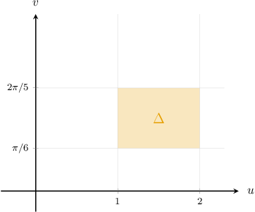

To find the image of $\Delta$ under the action of $\mathbf T$ onto the $xy$-plane, we need to transform each side (bottom, top, left, and right) of $\Delta$ separately:

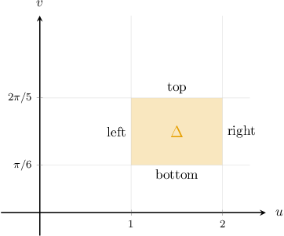

It can be shown that $\mathbf T$ has no critical points inside $\Delta.$ So, let's proceed to find the image of $\Delta$ under the action of $\mathbf T$ by mapping these four sides.

### Finding the Image of a Horizontal Segment

Our goal is to find the image of the region $\Delta$ under the action of $\mathbf T,$ given by

$$

\mathbf{T}:(u,v) \to (u \cos v, \, u \sin v).

$$

Let's first find the images of the horizontal sides:

- Consider the image of the bottom side, where we have $v=\dfrac{\pi}{6}$ and $1 \leq u \leq 2.$ Substituting $v=\dfrac{\pi}{6}$ into our transformation equations, we obtain This represents a line segment that lies on a line passing through the origin. The slope of this line must be meaning that the line makes an angle of $\dfrac{\pi}{6}$ with the positive $x$-axis in the $xy$-plane. The endpoints of the line segment lie on the circles of radii $1$ and $2$ centered at $O,$ as shown below.

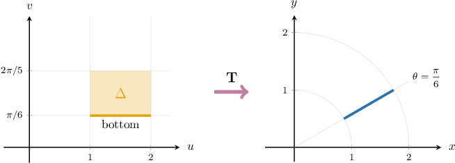

- Similarly, we can find the image of the top side, where $v=\dfrac{2\pi}{5}$ and $1 \leq u \leq 2.$

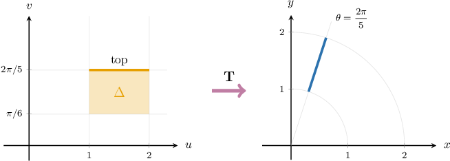

### Finding the Image of a Vertical Segment

Our transformation $\mathbf T$ is

$$

\mathbf{T}:(u,v) \to (u \cos v, \, u \sin v).

$$

Let's now find the images of the vertical lines:

- Consider the image of the left side, where we have $u=1$ and $\dfrac{\pi}{6} \leq v \leq \dfrac{2\pi}{5}.$ Substituting $u=1$ into our transformation equations, we obtain This is an arc of the circle of radius $1$ centered at the origin in the $xy$-plane. The arc lies in the first quadrant between the polar rays $\theta = \dfrac{\pi}{6}$ and $\theta = \dfrac{2\pi}{5},$ as shown below.

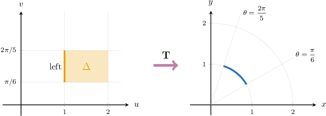

- Similarly, we can find the image of the right side, where we have $u=2$ and $\dfrac{\pi}{6} \leq v \leq \dfrac{2\pi}{5}.$

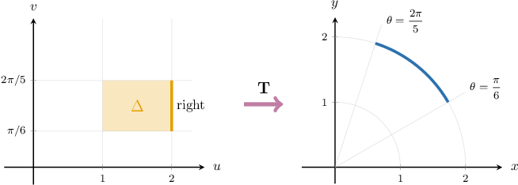

Therefore, the image $D$ of $\Delta$ under the action of $\mathbf{T}$ is the region that is enclosed between

- two circles with polar equations $r=1$ and $r=2,$ and

- two rays with polar equations $\theta=\dfrac{\pi}{6}$ and $\theta=\dfrac{2\pi}{5},$

as shown in the diagram below.

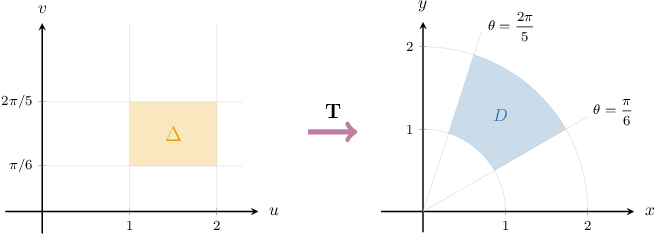

### Example: Finding the Image of a Vertical Segment Under a Polar Transformation

#### Question

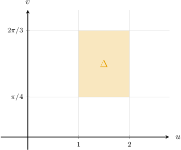

Consider the rectangular region $\Delta$ in the $uv$-plane, given by

$$

\Delta = \left\{ (u,v) \: : \: 1 \le u \le 2, \:\: \dfrac{\pi}{4} \leq v \leq \dfrac{2\pi}{3} \right\},

$$

and the transformation $\mathbf T,$ given by

$$

\mathbf{T}:(u,v) \to (u \cos v, \, u \sin v).

$$

Determine the image of the right side of $\Delta$ under the action of $\mathbf{T}.$

#### Explanation

To map the entire region $\Delta$ onto the $xy$-plane, we consider the transformation of each side. However, in this case, we consider only the right side.

For the right side, we have $u = 2$ and $\dfrac{\pi}{4} \leq v \leq \dfrac{2\pi}{3}.$

Substituting $u = 2$ into our transformation equations, we obtain

$$

\begin{aligned}(𝑥,𝑦) & =𝐓(𝑢,𝑣) \\ & =(𝑢cos⁡𝑣,\,𝑢sin⁡𝑣) \\ & =(2cos⁡𝑣,\,2sin⁡𝑣),\,\frac{𝜋}{4}≤𝑣≤\frac{2𝜋}{3}.\end{aligned}

$$

This is an equation of a circular arc of radius $2$ centered at the origin in the $xy$-plane. The arc lies in the first and second quadrants between the polar rays $\theta = \dfrac{\pi}{4}$ and $\theta = \dfrac{2\pi}{3},$ as shown below.

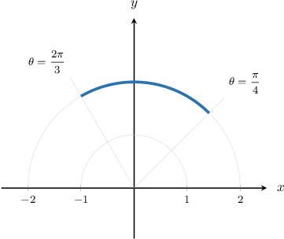

### Example: Finding the Image of a Horizontal Segment Under a Polar Transformation

#### Question

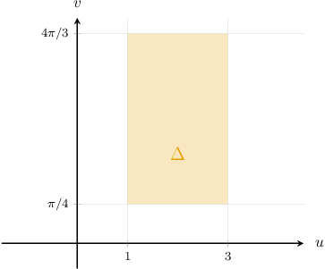

Consider the rectangular region $\Delta$ in the $uv$-plane, given by

$$

\Delta = \left\{ (u,v) \: : \: 1 \le u \le 3, \:\: \dfrac{\pi}{4} \leq v \leq \dfrac{4\pi}{3} \right\},

$$

and the transformation $\mathbf T,$ given by

$$

\mathbf{T}:(u,v) \to (u \cos v, \, u \sin v).

$$

Determine the image of the top side of $\Delta$ under the action of $\mathbf{T}.$

#### Explanation

To map the entire region $\Delta$ onto the $xy$-plane, we consider the transformation of each side. However, in this case, we consider only the top side.

For the top side, we have $v = \dfrac{4\pi}{3}$ and $1 \leq u \leq 3.$

Substituting $v = \dfrac{4\pi}{3}$ into our transformation equations, we obtain

$$

\begin{aligned}(𝑥,𝑦) & =𝐓(𝑢,𝑣) \\ & =(𝑢cos⁡𝑣,\,𝑢sin⁡𝑣) \\ & =(𝑢cos⁡(\frac{4𝜋}{3}),\,𝑢sin⁡(\frac{4𝜋}{3})),\,1≤𝑢≤3.\end{aligned}

$$

This is a parametric equation of the line segment that makes an angle of $\dfrac{4\pi}{3}$ with the positive $x$-axis and whose endpoints lie on circles of radii $1$ and $3$ centered at $O,$ as shown below.

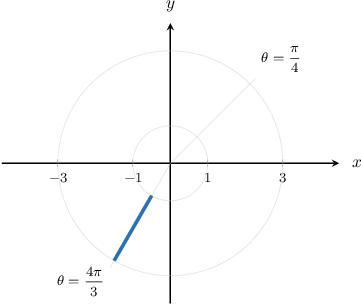

### Example: Finding the Image of a Rectangle Under a Polar Transformation

#### Question

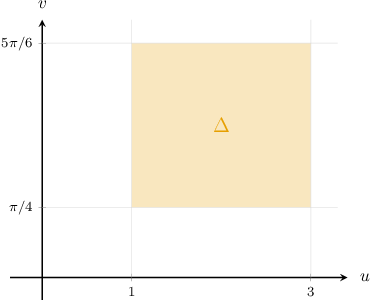

Consider the square region $\Delta$ in the $uv$-plane, given by

$$

\Delta = \bigg\{ (u,v) \: : \: 1 \le u \le 3, \:\: \dfrac{\pi}{4} \leq v \leq \dfrac{5\pi}{6} \bigg\},

$$

and the transformation $\mathbf T,$ given by

$$

\mathbf{T}:(u,v) \to (u \cos v, \, u \sin v).

$$

Find the image of $\Delta$ under the action of $\mathbf T.$

#### Explanation

To map the entire region $\Delta$ onto the $xy$-plane, we transform each side of $\Delta$ separately:

- Consider the image of the bottom side, where we have $v=\dfrac{\pi}{4}$ and $1 \leq u \leq 3.$ Substituting $v=\dfrac{\pi}{4}$ into our transformation equations, we obtain This line segment makes an angle of $\dfrac{\pi}{4}$ with the positive $x$-axis in the $xy$-plane. Moreover, this segment lies on a line that passes through the origin, and its endpoints lie on the circles of radii $1$ and $3$ centered at $O.$

- Consider the image of the top side, where we have $v=\dfrac{5\pi}{6}$ and $1 \leq u \leq 3.$ Substituting $v=\dfrac{5\pi}{6}$ into our transformation equations, we obtain This line segment makes an angle of $\dfrac{5\pi}{6}$ with the positive $x$-axis in the $xy$-plane. Moreover, this segment lies on a line that passes through the origin, and its endpoints lie on the circles of radii $1$ and $3$ centered at $O.$

- Consider the image of the left side, where we have $u=1$ and $\dfrac{\pi}{4} \leq v \leq \dfrac{5\pi}{6}.$ Substituting $u=1$ into our transformation equations, we obtain This is an arc of the circle of radius $1$ centered at the origin in the $xy$-plane. It lies between the first and second quadrants between the polar rays $\theta=\dfrac{\pi}{4}$ and $\theta=\dfrac{5\pi}{6}.$

- Consider the image of the right side, where we have $u=3$ and $\dfrac{\pi}{4} \leq v \leq \dfrac{5\pi}{6}.$ Substituting $u=3$ into our transformation equations, we obtain This is an arc of the circle of radius $3$ centered at the origin in the $xy$-plane. It lies between the first and second quadrants between the polar rays $\theta=\dfrac{\pi}{4}$ and $\theta=\dfrac{5\pi}{6}.$

Therefore, the image $D$ of $\Delta$ under the action of $\mathbf{T}$ is the region that is enclosed between

- two circles with polar equations $r=1$ and $r=3,$ and

- two rays with polar equations $\theta=\dfrac{\pi}{4}$ and $\theta=\dfrac{5\pi}{6},$

as shown in the diagram below.

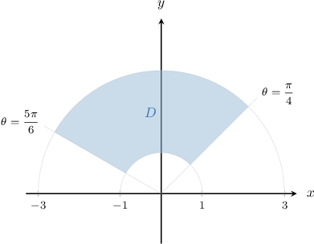

### Polar Coordinate Transformations

Let's consider the following transformation:

$$

\mathbf{T}:(u,v) \to (u \cos v, \, u \sin v), \qquad u > 0, \quad 0\leq v < 2\pi .

$$

If we substitute $u = r$ and $v = \theta,$ we get

$$

\mathbf{T}:(r,\theta) \to (r \cos \theta, \, r \sin \theta), \qquad r > 0, \quad 0\leq\theta < 2\pi ,

$$

which we can write as

$$

x = r\cos\theta, \qquad y = r\sin\theta.

$$

Notice that these are the usual formulas that we use to write the polar coordinates $(r,\theta)$ of a point in the plane in Cartesian $(x,y)$ coordinates.

This gives us a fresh perspective of the meaning behind the usual $(r,\theta)\to(x,y)$ formulas:

- Firstly, they describe a transformation that maps a region $\Delta$ in the $(r,\theta)$ plane (often a rectangle) to another region $D$ in the $xy$-plane.

- Similarly, the inverse transformation (which always exists) maps a region $D$ in the $xy$-plane to a region $\Delta$ in the $(r,\theta)$ plane.

This idea becomes important later on. But, broadly speaking, many problems become easier after transforming them to another coordinate system where the domain under consideration is rectangular.

### Example: Finding a Rectangular Preimage Given Its Image Under a Polar Transformation

#### Question

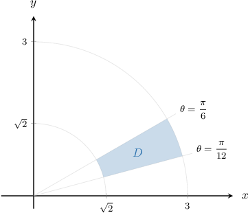

Consider the region $D$ in the $xy$-plane, shown above. The transformation $\mathbf{T},$ given by

$$

\mathbf{T}:(u,v) \to (x(u,v) , \, y(u,v)),

$$

where

$$

x = u \cos v, \qquad y= u \sin v,

$$

maps the region $\Delta$ from the $uv$-plane to $D.$ Sketch the region $\Delta.$

#### Explanation

For our transformation $\mathbf{T},$ we have

$$

x = u \cos v, \qquad y = u \sin v.

$$

Notice that if we change $u$ to $r$ and $v$ to $\theta,$ we obtain

$$

\begin{aligned}𝑥=𝑟cos⁡𝜃 \\ 𝑦=𝑟sin⁡𝜃\end{aligned}

$$

which represents the usual formulas for changing from polar to Cartesian coordinates.

Therefore, the pre-image $\Delta$ of $D$ under the action of $\mathbf{T}$ is the region that can be written as

$$

\Delta = \bigg\{ (u,v) \: : \: \sqrt 2 \le u \le 3, \:\: \dfrac{\pi}{12} \leq v \leq \dfrac{\pi}{6} \bigg\}.

$$

This is the rectangular region enclosed between

- two vertical lines with Cartesian equations $u=\sqrt 2$ and $u=3,$ and

- two horizontal lines with Cartesian equations $v=\dfrac{\pi}{12}$ and $v=\dfrac{\pi}{6},$

as shown in the diagram below.

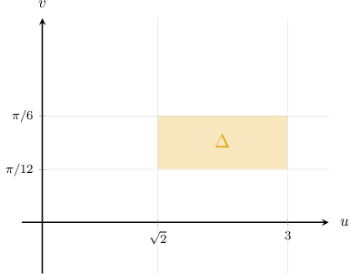
