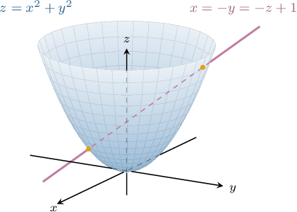
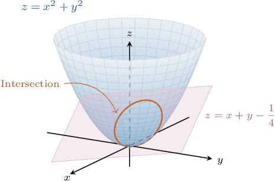
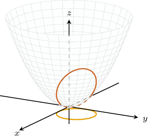
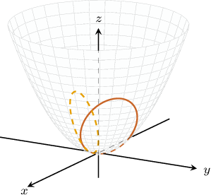
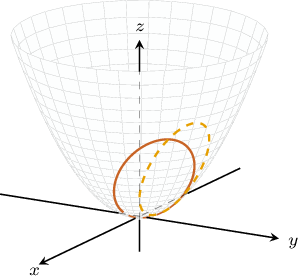

# Intersections of Lines and Planes With Surfaces

Source: https://www.mathacademy.com/topics/4208?courseId=154
Topic ID: 4208

## Prerequisites

- [The Intersection Between a Line and a Plane](./1808-the-intersection-between-a-line-and-a-plane.md)
- [Hyperboloids](./1892-hyperboloids.md)
- [Paraboloids](./1893-paraboloids.md)
- [Elliptic Cones](./1894-elliptic-cones.md)
- [Cylinders](./1895-cylinders.md)

## Lesson

### Introduction

Suppose we wish to find the points of intersection of the elliptic paraboloid $z=x^2+y^2$ and the line with the equation $x = -y = -z+1.$ The line, paraboloid, and their points of intersection are shown below.

The trick is to express the equation of the line in parametric form, substitute the parametric equations into the equation of the surface, and solve for the parameter.

So, first, we write the equation of our line in the parametric form:

$$

\begin{aligned}𝑥=𝑡 \\ 𝑦=−𝑡 \\ 𝑧=−𝑡+1\end{aligned}

$$

where $t \in (-\infty,\infty).$

Our intersection points must belong to the line and the surface simultaneously. So, substituting the expressions for $x$, $y$, and $z$ from the parametric equation of the line into the equation of the paraboloid, we obtain the following:

$$

\begin{aligned}𝑧 & =𝑥^{2}+𝑦^{2} \\ (−𝑡+1) & =(𝑡)^{2}+(−𝑡)^{2}\end{aligned}

$$

Simplifying this equation, we get

$$

2t^2+t - 1=0.

$$

The solutions to this equation are $t=\dfrac{1}{2}$ and $t=-1.$

Substituting these values back into the parametric equations of the line

- For $t=\dfrac{1}{2}$, we have

$$

\begin{aligned}𝑥=(\frac{1}{2})=\frac{1}{2} \\ 𝑦=−(\frac{1}{2})=−\frac{1}{2} \\ 𝑧=−(\frac{1}{2})+1=\frac{1}{2},\end{aligned}

$$

so the first point is $(\dfrac{1}{2},-\dfrac{1}{2},\dfrac{1}{2}).$

- For $t=-1$, we have so the second point is $(-1,1,2).$

Therefore, the points of intersection are $(\dfrac{1}{2},-\dfrac{1}{2},\dfrac{1}{2})$ and $(-1,1,2).$

Let's see another example.

### Example: Finding the Intersection of a Surface and a Line Given in Parametric Form

#### Question

Find the point(s) of the intersection of the ellipsoid $\dfrac{x^2}{24} + \dfrac{y^2}{24} +\dfrac{z^2}{6} = 1$ and the line $\begin{aligned}𝑥=4𝑡 \\ 𝑦=8𝑡, \\ 𝑧=2𝑡\end{aligned}$ where $t \in (-\infty,\infty).$

#### Explanation

Substituting the expressions for $x$, $y$, and $z$ from the parametric equation of the line into the equation of the ellipsoid, we obtain the following:

$$

\begin{aligned}\frac{𝑥^{2}}{24}+\frac{𝑦^{2}}{24}+\frac{𝑧^{2}}{6} & =1 \\ 𝑥^{2}+𝑦^{2}+4𝑧^{2} & =24 \\ (4𝑡)^{2}+(8𝑡)^{2}+4(2𝑡)^{2} & =24 \\ 16𝑡^{2}+64𝑡^{2}+16𝑡^{2} & =24 \\ 96𝑡^{2} & =24 \\ 𝑡^{2} & =\frac{1}{4}\end{aligned}

$$

Hence, we get the solution $t = \pm \dfrac{1}{2}.$

Now, we substitute our solutions back into the equations of the line.

- For $t=-\dfrac 1 2,$ we have so the first point is $\left(-2,-4,-1\right).$

- For $t=\dfrac 1 2,$ we have so the second point is $\left(2,4,1\right).$

Therefore, the points of intersection are $(-2,-4,-1)$ and $(2,4,1).$

### Example: Finding the Intersection of a Surface and a Line Given in Cartesian Form

#### Question

Find the points of the intersection of the elliptic cone $x^2 + y^2=z^2$ and the line $x +1=y-1 =\dfrac{z}{2}.$

#### Explanation

First, we write the equation of our line in the parametric form:

$$

\begin{aligned}𝑥=𝑡−1 \\ 𝑦=𝑡+1 \\ 𝑧=2𝑡,\end{aligned}

$$

where $t \in (-\infty,\infty).$

Substituting the above expressions for $x,$ $y,$ and $z$ into the equation of the elliptic cone, we obtain

$$

\begin{aligned}𝑥^{2}+𝑦^{2} & =𝑧^{2} \\ (𝑡−1)^{2}+(𝑡+1)^{2} & =(2𝑡)^{2} \\ 𝑡^{2}−2𝑡+1+𝑡^{2}+2𝑡+1 & =4𝑡^{2} \\ 2𝑡^{2}+2 & =4𝑡^{2} \\ 2 & =2𝑡^{2} \\ 𝑡^{2} & =1 \\ 𝑡 & =±1.\end{aligned}

$$

Now, we substitute our solutions back into the equations of the line.

- For $t=-1,$ we have so the first point is $\left(-2,0,-2\right).$

- For $t=1,$ we have so the second point is $\left(0,2,2\right).$

Therefore, the points of intersection are $(-2,0,-2)$ and $(0,2,2).$

### Intersections of Surfaces With Planes

Now, let's consider the intersection of the elliptic paraboloid $z=x^2+y^2$ and the plane $z = x+y-\dfrac{1}{4},$ as shown below.

Note that the intersection of the paraboloid and plane is given by the solution to the system

$$

\begin{aligned}𝑧=𝑥^{2}+𝑦^{2} \\ 𝑧=𝑥+𝑦−\frac{1}{4}.\end{aligned}

$$

- To find the projection of the intersection onto the $xy$-plane, we need to eliminate the variable $z$ from the system. The resulting projection curve will be an ellipse, as depicted below.

- To find the projection of the intersection onto the $xz$-plane, we need to eliminate the variable $y$ from the system. The resulting projection curve will be an ellipse, as depicted below.

- To find the projection of the intersection onto the $yz$-plane, we need to eliminate the variable $x$ from the system. The resulting projection curve will be an ellipse, as depicted below.

Let's see some examples.

### Example: Finding the Projection of the Intersection of a Surface and a Tilted Plane

#### Question

Find the projection of the intersection between the ellipsoid $\dfrac{(x+1)^2}{16}+\dfrac{y^2}{4}+\dfrac{z^2}{16}=1$ and the plane $x-z=3$ onto the $yz$-plane.

#### Explanation

Since we want to find the projection onto the $yz$-plane, we need to eliminate the variable $x.$ First, we solve for $x$ in the equation of the plane, as follows:

$$

\begin{aligned}𝑥−𝑧=3\,⟹\,𝑥=𝑧+3\end{aligned}

$$

Substituting the expression for $x$ into the equation of the ellipsoid, we obtain

$$

\begin{aligned}\frac{((𝑧+3)+1)^{2}}{16}+\frac{𝑦^{2}}{4}+\frac{𝑧^{2}}{16} & =1 \\ \frac{(𝑧+4)^{2}}{16}+\frac{𝑦^{2}}{4}+\frac{𝑧^{2}}{16} & =1 \\ \frac{𝑧^{2}+8𝑧+16}{16}+\frac{𝑦^{2}}{4}+\frac{𝑧^{2}}{16} & =1 \\ \frac{𝑦^{2}}{4}+\frac{2𝑧^{2}+8𝑧+16}{16} & =1 \\ \frac{𝑦^{2}}{4}+\frac{𝑧^{2}+4𝑧+8}{8} & =1.\end{aligned}

$$

Finally, by completing the square for the variable $z,$ we have

$$

\begin{aligned}\frac{𝑦^{2}}{4}+\frac{𝑧^{2}+4𝑧+8}{8} & =1 \\ \frac{𝑦^{2}}{4}+\frac{(𝑧^{2}+4𝑧+4)+4}{8} & =1 \\ \frac{𝑦^{2}}{4}+\frac{(𝑧+2)^{2}+4}{8} & =1 \\ \frac{𝑦^{2}}{4}+\frac{(𝑧+2)^{2}}{8}+\frac{1}{2} & =1 \\ \frac{𝑦^{2}}{4}+\frac{(𝑧+2)^{2}}{8} & =\frac{1}{2} \\ \frac{𝑦^{2}}{2}+\frac{(𝑧+2)^{2}}{4} & =1.\end{aligned}

$$

Therefore, the projection of the intersection is the ellipse $\dfrac{y^2}{2}+\dfrac{(z+2)^2}{4} = 1.$
