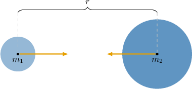

# Newton's Law of Universal Gravitation

Source: https://www.mathacademy.com/topics/6364?courseId=154
Topic ID: 6364

## Prerequisites

- [Solving Many-Variable Equations](../../../high-school/traditional/lessons/algebra-i/354-solving-many-variable-equations.md)
- [Dividing Numbers in Scientific Notation](../../../middle-school/lessons/grade-8/1138-dividing-numbers-in-scientific-notation.md)
- [Modeling With Inverse Variation](../../../high-school/traditional/lessons/algebra-i/3664-modeling-with-inverse-variation.md)

## Lesson

### Introduction

Gravitation is the attractive force that acts between *any two objects with mass*. This means that every pair of objects in the universe is pulling on each other, even if the effect is too small to notice in everyday life.

In many situations (especially when objects are far apart compared to their sizes), we model each object as if *all of its mass were concentrated at its center of mass*. Then the gravitational force depends only on the two masses and the distance between their centers of mass.

**Newton's law of universal gravitation** states that the gravitational force attracting two objects with masses is proportional to the product of the two masses and inversely proportional to the square of the distance between their centers of mass:

$$

F = G\dfrac{m_1m_2}{r^2},

$$

where

- $F$ is the magnitude of the gravitational force between the objects, measured in Newtons ($\text{N}$),

- $G \approx 6.674\times10^{-11}\,\text{m}^3/(\text{kg}\cdot\text{s}^2)$ is the Newtonian **constant of gravitation**,

- $m_1$ and $m_2$ are the masses of the objects, measured in $\text{kg},$ and

- $r$ is the distance between their centers of mass, measured in $\text{m}.$

The force acts along the line connecting the two centers of mass, and each object pulls on the other with the same magnitude.

Newton's law shows two key relationships:

- *More mass means more force:* If either mass increases, the gravitational force increases proportionally.

- *Greater distance means less force:* The force decreases with the square of the distance. So, for example, doubling the distance makes the force one quarter as large.

Let's see some examples.

### Example: Calculating the Gravitational Force Between Two Objects

#### Question

The Sun has a mass of $(1.99\times10^{30})\,\text{kg}$ and Mars has a mass of $(6.42\times10^{23})\,\text{kg}.$ The average distance between the centers of the Sun and Mars is $(2.28\times10^{11})\,\text{m}.$ According to Newton's law of universal gravitation, what is the magnitude of the gravitational force between the Sun and Mars? Write your answer in scientific notation, rounding to **** where appropriate. Assume the Newtonian constant of gravitation is $G = (6.67\times10^{-11})\,\text{m}^3/(\text{kg}\cdot\text{s}^2).$

#### Explanation

Newton's law of universal gravitation states that the gravitational force attracting two objects is proportional to the product of the two masses and inversely proportional to the square of the distance between their centers of mass:

$$

F = G\dfrac{m_1m_2}{r^2}

$$

where

- $F$ is the gravitational force between the objects, measured in Newtons $(\text{N}),$

- $G = (6.67\times10^{-11})\,\text{m}^3/(\text{kg}\cdot\text{s}^2)$ is the Newtonian constant of gravitation,

- $m_1$ and $m_2$ are the masses of the objects, measured in $\text{kg},$ and

- $r$ is the distance between their centers of mass, measured in $\text{m}.$

Let $m_1$ be the mass of the Sun and $m_2$ be the mass of Mars. Then, substituting in the known values, we get

$$

\begin{aligned}𝐹 & =(6.67×10^{−11})⋅\frac{(1.99×10^{30})⋅(6.42×10^{23})}{(2.28×10^{11})^{2}} \\ & =\frac{6.67⋅1.99⋅6.42}{(2.28)^{2}}×\frac{10^{−11}⋅10^{30}⋅10^{23}}{(10^{11})^{2}} \\ & =(16.392\,5…)×10^{20} \\ & =(1.639\,25…)×10^{21}.\end{aligned}

$$

Therefore, rounded to three significant figures, the gravitational force between the Sun and Mars is $\Big(1.64 \times 10^{21}\Big) \,\text{N}.$

### Example: Calculating the Mass of an Object

#### Question

The centers of two objects are separated by a distance of $(3.0\times10^3)\,\text{m}$ and the magnitude of the gravitational force between them is $(3.0\times10^{-4})\,\text{N}.$ If one object has mass $(2.0\times10^5)\,\text{kg},$ then according to Newton's law of universal gravitation, what is the mass of the other object? Write your answer in scientific notation, rounding to **** where appropriate. Assume the Newtonian constant of gravitation is $G = (6.67\times10^{-11})\,\text{m}^3/(\text{kg}\cdot\text{s}^2).$

#### Explanation

Newton's law of universal gravitation states that the gravitational force attracting two objects is proportional to the product of the two masses and inversely proportional to the square of the distance between their centers of mass:

$$

F = G\dfrac{m_1m_2}{r^2}

$$

where

- $F$ is the gravitational force between the objects, measured in Newtons $(\text{N}),$

- $G = (6.67\times10^{-11})\,\text{m}^3/(\text{kg}\cdot\text{s}^2)$ is the Newtonian constant of gravitation,

- $m_1$ and $m_2$ are the masses of the objects, measured in $\text{kg},$ and

- $r$ is the distance between their centers of mass, measured in $\text{m}.$

Let $m_2$ be the unknown mass. First, let's rearrange the formula to make $m_2$ the subject:

$$

\begin{aligned}𝐹 & =𝐺\frac{𝑚_{1}𝑚_{2}}{𝑟^{2}} \\ 𝐹𝑟^{2} & =𝐺𝑚_{1}𝑚_{2} \\ 𝑚_{2} & =\frac{𝐹𝑟^{2}}{𝐺𝑚_{1}}\end{aligned}

$$

Then, substituting in the known values, we get

$$

\begin{aligned}𝑚_{2} & =\frac{(3.0×10^{−4})⋅(3.0×10^{3})^{2}}{(6.67×10^{−11})⋅(2.0×10^{5})} \\ & =\frac{3.0⋅(3.0)^{2}}{6.67⋅2.0}×\frac{10^{−4}⋅(10^{3})^{2}}{10^{−11}⋅10^{5}} \\ & =(2.023…)×10^{8}.\end{aligned}

$$

Therefore, rounded to two significant figures, the mass of the other object is $\Big(2.0 \times 10^{8}\Big) \,\text{kg}.$

### Example: Calculating the Distance Between Two Objects

#### Question

Earth has a mass of $(5.97\times10^{24})\,\text{kg}$ and the Moon has a mass of $(7.35\times10^{22})\,\text{kg}.$ The magnitude of the gravitational force between them is $(1.98\times10^{20})\,\text{N}.$ According to Newton's law of universal gravitation, what is the distance between the centers of mass of Earth and the Moon? Write your answer in scientific notation, rounding to **** where appropriate. Assume the Newtonian constant of gravitation is $G = (6.67\times10^{-11})\,\text{m}^3/(\text{kg}\cdot\text{s}^2).$

#### Explanation

Newton's law of universal gravitation states that the gravitational force attracting two objects is proportional to the product of the two masses and inversely proportional to the square of the distance between their centers of mass:

$$

F = G\dfrac{m_1m_2}{r^2}

$$

where

- $F$ is the gravitational force between the objects, measured in Newtons $(\text{N}),$

- $G = (6.67\times10^{-11})\,\text{m}^3/(\text{kg}\cdot\text{s}^2)$ is the Newtonian constant of gravitation,

- $m_1$ and $m_2$ are the masses of the objects, measured in $\text{kg},$ and

- $r$ is the distance between their centers of mass, measured in $\text{m}.$

First, let's rearrange the formula to make $r$ the subject:

$$

\begin{aligned}𝐹 & =𝐺\frac{𝑚_{1}𝑚_{2}}{𝑟^{2}} \\ 𝑟^{2} & =𝐺\frac{𝑚_{1}𝑚_{2}}{𝐹} \\ 𝑟 & =\sqrt{𝐺\frac{𝑚_{1}𝑚_{2}}{𝐹}}\end{aligned}

$$

Let $m_1$ be the mass of Earth and $m_2$ be the mass of the Moon. Then, substituting in the known values, we have

$$

\begin{aligned}𝑟^{2} & =(6.67×10^{−11})⋅\frac{(5.97×10^{24})⋅(7.35×10^{22})}{1.98×10^{20}} \\ & =\frac{6.67⋅5.97⋅7.35}{1.98}×\frac{10^{−11}⋅10^{24}⋅10^{22}}{10^{20}} \\ & =(147.816…)×10^{15} \\ & =(14.7816…)×10^{16}.\end{aligned}

$$

Finally, taking the square root, we get

$$

\begin{aligned}𝑟 & =\sqrt{14.7816…×10^{16}} \\ & =\sqrt{14.7816…}×\sqrt{10^{16}} \\ & =(3.8446…)×10^{8}.\end{aligned}

$$

Therefore, rounded to three significant figures, the distance between Earth and the Moon is $\Big(3.84 \times 10^{8}\Big) \,\text{m}.$
