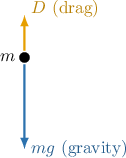

# Falling Body Problems With Quadratic Drag

Source: https://www.mathacademy.com/topics/6693?courseId=154
Topic ID: 6693

## Prerequisites

- [Falling Body Problems With Linear Drag](./1712-falling-body-problems-with-linear-drag.md)
- [Integration by Substitution With Inverse Hyperbolic Functions](../calculus-ii/3258-integration-by-substitution-with-inverse-hyperbolic-functions.md)

## Lesson

### Introduction

Consider a body of mass $m$ falling vertically, influenced only by gravity $g$ and drag $D.$

At higher speeds, or for larger objects, drag is often approximately proportional to the square of the body’s velocity. This model is called **quadratic drag**.

Assume that both $m$ and $g$ are constant, and choose the downward direction as the positive direction.

Two forces act on the body:

- The force due to gravity is the weight, which equals $mg.$

- The drag force is where $k>0$ is a constant of proportionality (this force is negative because it acts upward, opposite the motion).

Hence, the net force on the body is

$$

F = mg - kv^2.

$$

Applying Newton's second law, $F=ma,$ where $a$ is the acceleration of the body, we get

$$

\begin{aligned}𝐹 & =𝑚𝑔−𝑘𝑣^{2} \\ 𝑚𝑎 & =𝑚𝑔−𝑘𝑣^{2} \\ 𝑚\,\frac{d𝑣}{d𝑡} & =𝑚𝑔−𝑘𝑣^{2}\end{aligned}

$$

Finally, writing in standard form, we get

$$

m\,\dfrac{\mathrm{d}v}{\mathrm{d}t} + kv^2 = mg \qquad\Longrightarrow\qquad \boxed{\dfrac{\mathrm{d}v}{\mathrm{d}t} + \dfrac{k}{m}v^2 = g}.

$$

### A Worked Example

Suppose a body of mass $125\,\text{kg}$ is released from rest and falls vertically downward. Let $v(t)$ be the body's velocity, in meters per second, $t \geq 0$ seconds after release, with downward taken as the positive direction. The air resistance on the body is proportional to the square of its velocity with a constant of proportionality $k=49\,\text{kg/m}$ and acts in the direction opposite to motion.

Assuming the acceleration due to gravity is $g=9.8\,\text{m/s}^2,$ and the only forces acting on the body are the weight due to gravity and drag, let's find the equation for the velocity $v(t).$

First, note that only two forces act on the body: the force due to gravity, given by the weight

$$

w = mg = 125g,

$$

and the force due to drag $D,$ which is proportional to the velocity squared (and negative since it acts in the negative direction):

$$

D = -kv^2 = -49v^2

$$

Hence, the resultant force acting on the body is

$$

F = w + D = 125g - 49v^2.

$$

Applying Newton's second law, we obtain a separable first-order differential equation:

$$

\begin{aligned}𝐹 & =𝑚𝑎 \\ 125𝑔−49𝑣^{2} & =125⋅\frac{d𝑣}{d𝑡} \\ \frac{d𝑣}{d𝑡} & =𝑔−0.392𝑣^{2} \\ & =𝑔−0.04𝑔𝑣^{2}\end{aligned}

$$

Separating variables and integrating both sides with respect to $t,$ we get

$$

\begin{aligned}\frac{d𝑣}{d𝑡} & =𝑔(1−0.04𝑣^{2}) \\ \frac{1}{1−0.04𝑣^{2}}⋅\frac{d𝑣}{d𝑡} & =𝑔 \\ ∫\frac{1}{1−0.04𝑣^{2}}⋅\frac{d𝑣}{d𝑡}\,d𝑡 & =𝑔∫d𝑡 \\ ∫\frac{1}{1−(0.2𝑣)^{2}}\,d𝑣 & =𝑔∫d𝑡 \\ \frac{1}{0.2}artanh(0.2𝑣) & =𝑔𝑡+𝐶_{1} \\ artanh(0.2𝑣) & =\frac{1}{5}𝑔𝑡+𝐶 \\ 0.2𝑣 & =tanh⁡(\frac{1}{5}𝑔𝑡+𝐶) \\ 𝑣(𝑡) & =5tanh⁡(\frac{1}{5}𝑔𝑡+𝐶),\end{aligned}

$$

where $C = 0.2C_1$ is a constant of integration.

We're told that the body is released from rest. So, we can apply the initial condition $v(0) = 0,$ and solve for $C{:}$

$$

\begin{aligned}𝑣(0) & =5tanh⁡(\frac{1}{5}𝑔⋅0+𝐶) \\ 0 & =5tanh⁡(𝐶) \\ tanh⁡(𝐶) & =0 \\ 𝐶 & =0\end{aligned}

$$

Therefore, we have the following expression for $v(t){:}$

$$

v(t) = 5\tanh\left(\dfrac1{5} g t\right)

$$

### Example: Constructing a Falling Body Model With Quadratic Drag

#### Question

A supply crate of mass $24\,\text{kg}$ falls vertically downward. Let $v(t)$ be the crate's velocity, in meters per second, $t \geq 0$ seconds after the descent began, with downward taken as the positive direction. The air resistance on the crate is proportional to the square of its velocity with a constant of proportionality $k=\dfrac{4}{5}\,\text{kg/m}$ and acts in the direction opposite to motion.

What differential equation best models the velocity? Assume the acceleration due to gravity is $g,$ and the only forces acting on the crate are the weight due to gravity and drag.

#### Explanation

Recall Newton's second law, which states that the resultant force $F$ acting on a body equals the product of its mass $m$ and acceleration $a{:}$

$$

F = ma

$$

In our case, two forces are acting on the crate:

- The force due to gravity, given by the weight $w$ of the crate, which equals

- The force due to drag (air resistance) $D,$ which is proportional to the square of the velocity of the crate (and negative since it acts in the negative direction):

Summing the forces, the resultant force acting on the crate is

$$

F = w + D = 24g - \dfrac{4}{5}v^2.

$$

Also, recall that acceleration is the derivative of velocity: $a=\dfrac{\mathrm{d}v}{\mathrm{d}t}.$ Substituting this into Newton's second law, along with our expression for the resultant force on the crate, we have

$$

24g - \dfrac{4}{5}v^2 =24\,\dfrac{\mathrm{d}v}{\mathrm{d}t} \quad\Longrightarrow\quad \dfrac{\mathrm{d}v}{\mathrm{d}t} = g - \dfrac{1}{30}v^2.

$$

### Example: Constructing and Solving a Falling Body Model Given the Constant of Proportionality of Quadratic Drag

#### Question

A concrete cylinder of mass $50\,\text{kg}$ is released vertically downward with an initial velocity of $9\,\text{m/s}.$ Let $v(t)$ be the cylinder's velocity, in meters per second, $t \geq 0$ seconds after release, with downward taken as the positive direction. The air resistance on the cylinder is proportional to the square of its velocity with a constant of proportionality $k=4.9\,\text{kg/m}$ and acts in the direction opposite to motion.

Find the equation for the velocity $v(t).$ Assume the acceleration due to gravity is $g=9.8\,\text{m/s}^2,$ and the only forces acting on the cylinder are the weight due to gravity and drag.

#### Explanation

First, note that only two forces act on the package: the force due to gravity, given by the weight

$$

w = mg = 50g

$$

and the force due to drag $D,$ which is proportional to the velocity squared (and negative since it acts in the negative direction):

$$

D = -kv^2 = -4.9v^2

$$

Hence, the resultant force acting on the package is

$$

F = w + D =50g - 4.9v^2.

$$

Applying Newton's second law, we obtain a separable first-order differential equation:

$$

\begin{aligned}𝐹 & =𝑚𝑎 \\ 50𝑔−4.9𝑣^{2} & =50\,\frac{d𝑣}{d𝑡} \\ \frac{d𝑣}{d𝑡} & =𝑔−0.098𝑣^{2}\end{aligned}

$$

Separating variables and integrating both sides with respect to $t,$ we get

$$

\begin{aligned}\frac{d𝑣}{d𝑡} & =𝑔(1−0.01𝑣^{2}) \\ \frac{1}{1−0.01𝑣^{2}}⋅\frac{d𝑣}{d𝑡} & =𝑔 \\ ∫\frac{1}{1−0.01𝑣^{2}}⋅\frac{d𝑣}{d𝑡}\,d𝑡 & =𝑔∫d𝑡 \\ ∫\frac{1}{1−(0.1𝑣)^{2}}\,d𝑣 & =𝑔∫d𝑡 \\ \frac{1}{0.1}artanh(0.1𝑣) & =𝑔𝑡+𝐶_{1} \\ artanh(0.1𝑣) & =\frac{1}{10}𝑔𝑡+𝐶 \\ 0.1𝑣 & =tanh⁡(\frac{1}{10}𝑔𝑡+𝐶) \\ 𝑣(𝑡) & =10tanh⁡(\frac{1}{10}𝑔𝑡+𝐶),\end{aligned}

$$

where $C = 0.1C_1$ is a constant of integration.

We're told that the package is released with an initial velocity of $9\,\text{m/s}.$ So, we can apply the initial condition $v(0) = 9,$ and solve for $C{:}$

$$

\begin{aligned}𝑣(0) & =10tanh⁡(\frac{1}{10}𝑔⋅0+𝐶) \\ 9 & =10tanh⁡(𝐶) \\ tanh⁡(𝐶) & =0.9 \\ 𝐶 & =artanh(0.9)≈1.472\end{aligned}

$$

Therefore, we have the following expression for $v(t){:}$

$$

v(t) = 10\tanh\left(\dfrac1{10}g t+1.472\right)

$$

### Example: Constructing and Solving a Falling Body Model With Quadratic Drag

#### Question

An air mattress of mass $5\,\text{kg}$ is released from rest and falls vertically downward. Let $v(t)$ be the mattress's velocity, in meters per second, $t \geq 0$ seconds after release, with downward taken as the positive direction. The air resistance on the air mattress is proportional to the square of its velocity and acts in the direction opposite to motion. At a particular moment during the fall, the air mattress’s velocity is $0.5\,\text{m/s}$ and its instantaneous acceleration is $7.35\,\text{m/s}^2.$

Find the equation for the velocity $v(t).$ Assume the acceleration due to gravity is $g=9.8\,\text{m/s}^2,$ and the only forces acting on the air mattress are the weight due to gravity and drag.

#### Explanation

First, note that only two forces act on the air mattress: the force due to gravity, given by the weight

$$

w = mg = 5g

$$

and the force due to drag $D,$ which is proportional to the velocity squared (and negative since it acts in the negative direction),

$$

D=-kv^2,

$$

where $k>0$ is a constant of proportionality. Hence, the resultant force acting on the air mattress is

$$

F = w + D = 5g - kv^2.

$$

Applying Newton's second law, we obtain a separable first-order differential equation:

$$

\begin{aligned}𝐹 & =𝑚𝑎 \\ 5𝑔−𝑘𝑣^{2} & =5\,\frac{d𝑣}{d𝑡} \\ \frac{d𝑣}{d𝑡} & =𝑔−\frac{𝑘}{5}𝑣^{2}\end{aligned}

$$

We're told that, at a particular moment, the air mattress's velocity is $0.5\,\text{m/s}$ and its instantaneous acceleration is $7.35\,\text{m/s}^2.$ Substituting these values and $g = 9.8$ into the ODE, we can solve for $k{:}$

$$

7.35 = g - \dfrac{k}{5} \cdot (0.5)^2 \quad\Longrightarrow\quad k = 49\,\text{kg/m}

$$

Therefore, we have the following differential equation:

$$

\dfrac{\mathrm{d}v}{\mathrm{d}t} = g - 9.8v^2

$$

Separating variables and integrating both sides with respect to $t,$ we get

where $C$ is a constant of integration.

We're told that the air mattress is released from rest. So, we can apply the initial condition $v(0) = 0,$ and solve for $C{:}$

$$

\begin{aligned}𝑣(0) & =tanh⁡(𝑔⋅0+𝐶) \\ 0 & =tanh⁡(𝐶) \\ 𝐶 & =0\end{aligned}

$$

Therefore, we have the following expression for $v(t){:}$

$$

v(t) = \tanh\left(gt\right)

$$

### Terminal Velocity

Recall that the *terminal velocity* is the constant speed a falling object approaches when the upward resistive force (such as drag) becomes large enough to exactly balance the downward gravitational force.

If drag is proportional to the square of velocity, with a constant of proportionality $k > 0,$ this balance occurs when

$$

mg - k(v_\text{term})^2 = 0.

$$

Solving for the terminal velocity, we get

$$

\boxed{v_\text{term} = \sqrt{\dfrac{mg}{k}}}.

$$

Let's determine a terminal velocity in the next example.

### Example: Finding a Terminal Velocity

#### Question

A body of mass $80\,\text{kg}$ falls vertically downward. Let $v$ be its velocity, with downward taken as the positive direction. The air resistance on the body is proportional to the square of its velocity with a constant of proportionality $k=1\,\text{kg/m}$ and acts opposite to the direction of motion.

What is the terminal velocity $v_\text{term}$ of the body? Assume the acceleration due to gravity is $g = 9.8\,\text{m/s}^2,$ and the only forces acting on the body are the weight due to gravity and drag.

#### Explanation

Terminal velocity is the constant speed a falling object approaches as the upward resistive force (drag) grows to exactly balance the downward gravitational force. That is, at terminal velocity (a constant), acceleration is zero, so by $F=ma,$ the resultant force is zero.

First, note that only two forces act on the body: the force due to gravity, given by the weight

$$

w = mg = 80 \cdot 9.8 = 784\,\text{N},

$$

and the force due to drag $D,$ which is proportional to the square of the velocity (and negative since it acts in the negative direction),

$$

D = -kv^2 = -v^2.

$$

Hence, the resultant force acting on the body is

$$

F = w + D =784 - v^2.

$$

When the body reaches terminal velocity $v_\text{term},$ the resultant force is zero:

$$

784 - (v_\text{term})^2 = 0 \quad\Longrightarrow\quad v_\text{term} = \sqrt{784} =28

$$

Therefore, the terminal velocity of the body is $v_\text{term} =28\,\text{m/s}.$
