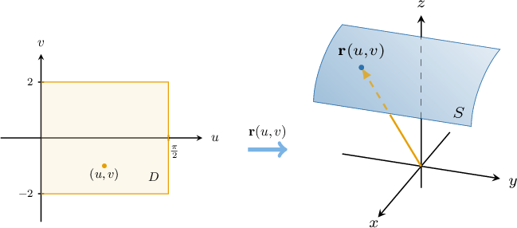

# Parametric Surfaces

Source: https://www.mathacademy.com/topics/1789?courseId=155
Topic ID: 1789

## Prerequisites

- [Graphing Curves Defined Parametrically](../../../high-school/integrated-math-honors/lessons/integrated-math-iii-honors/803-graphing-curves-defined-parametrically.md)
- [The Domain of a Multivariable Function](../mathematical-methods-for-the-physical-sciences-i/1899-the-domain-of-a-multivariable-function.md)
- [Cylindrical Polar Coordinates](./1981-cylindrical-polar-coordinates.md)
- [Spherical Polar Coordinates](./1982-spherical-polar-coordinates.md)

## Lesson

### Introduction

Just as a curve in three-dimensional space can be described using a vector-valued function $\mathbf r(t)$ of a single parameter $t,$ we can also describe a surface in three-dimensional space using a vector-valued function $\mathbf{r}(u,v)$ of two parameters $u$ and $v.$

For example, consider the vector-valued function given by

$$

\mathbf{r}(u,v) =\langle \cos u, \: v, \: \sin u + 1 \rangle, \qquad 0\leq u \leq \dfrac{\pi}2, \quad -2\leq v \leq 2.

$$

The domain of the parameter space $D$ and surface $S$ described by $\mathbf r(u,v)$ are both shown below.

As we vary $(u, v),$ the tip of the vector $\mathbf r(u,v)$ touches different points on the surface $S.$ Each choice of point $(u,v)$ in $D$ gives a unique point on $S,$ and varying $(u,v)$ throughout its entire domain traces out the entire surface $S.$

### Example: Finding a Parametrization of a Surface Defined by an Explicit Cartesian Equation

#### Question

Find a vector-valued function $\mathbf{r}(u,v)$ that parametrizes the surface defined in Cartesian coordinates as $z=y^5-x^2.$

#### Explanation

A point $(x,y,z)$ on our surface has the corresponding position vector given by

$$

\mathbf{r} = x \, \mathbf{i} + y \, \mathbf{j} + z \, \mathbf{k} = x \, \mathbf{i} + y \, \mathbf{j} + \big(y^5-x^2\big) \, \mathbf{k}.

$$

Now, setting $x=u$ and $y=v,$ we obtain the vector function that parametrizes the surface:

$$

\mathbf{r}(u,v) = u \, \mathbf{i} + v \, \mathbf{j} + \big(v^5-u^2\big) \, \mathbf{k}

$$

### Example: Finding a Parametrization of a Surface Defined by an Implicit Cartesian Equation

#### Question

$$

\mathbf{r}(u,v) =\big\langle u, \: v, \: \boxed{\phantom{0}} \big\rangle

$$

The vector-valued function $\mathbf{r}(u,v)$ parametrizes the surface defined in Cartesian coordinates as $x^2z-2y+z=6.$ What is the third component of $\mathbf{r}?$

#### Explanation

First, we write the equation of the surface in the form $z=f(x,y)\mathbin{:}$

$$

\begin{aligned}𝑥^{2}𝑧−2𝑦+𝑧 & =6 \\ (𝑥^{2}+1)𝑧 & =6+2𝑦 \\ 𝑧 & =\frac{2(𝑦+3)}{𝑥^{2}+1}\end{aligned}

$$

Now, a point $(x,y,z)$ on our surface has the corresponding position vector given by

$$

\mathbf{r} = \big\langle x, \: y, \: z \big\rangle = \left\langle x, \: y, \: \dfrac{2(y+3)}{x^2+1} \right\rangle.

$$

Finally, setting $x=u$ and $y=v,$ we obtain the vector function that parametrizes the surface:

$$

\mathbf{r}(u,v) =\left\langle u, \: v, \: {\color{black}\dfrac{2(v+3)}{u^2+1}} \right\rangle

$$

Therefore, the third component of $\mathbf{r}$ is ${\color{black}\dfrac{2(v+3)}{u^2+1}}.$

### Example: Finding a Parametrization of a Surface Defined in Cylindrical Polar Coordinates

#### Question

$$

\mathbf{f}(r,\theta) =\big\langle r\cos{\theta}, \: r\sin{\theta}, \: \boxed{\phantom{0}} \big\rangle

$$

The vector-valued function $\mathbf{f}(r,\theta)$ parametrizes the surface defined in cylindrical polar coordinates as ${r^2}-4z^2=0$ for $z \geq 0.$ What is the third component of $\mathbf{f}?$

#### Explanation

First, we write the equation of the surface in the form $z=f(r,\theta)\mathbin{:}$

$$

\begin{aligned}𝑟^{2}−4𝑧^{2} & =0 \\ 4𝑧^{2} & =𝑟^{2} \\ 𝑧^{2} & =\frac{𝑟^{2}}{4} \\ 𝑧 & =\frac{𝑟}{2}\end{aligned}

$$

We disregard the negative solution since we are given that $z\geq 0.$

If $(r, \theta, z)$ are the cylindrical coordinates of a point and $(x,y,z)$ are the corresponding Cartesian coordinates of that point, then we have

$$

x = r\cos\theta, \qquad y = r\sin\theta, \qquad z = z.

$$

Now, a point $(x,y,z)$ on our surface has the corresponding position vector given by

$$

\mathbf{f} = \big\langle x, \: y, \: z \big\rangle = \big\langle r\cos\theta, \: r\sin\theta, \: z \big\rangle.

$$

Finally, substituting $z= \dfrac r2,$ we obtain

$$

\mathbf{f}(r,\theta) =\left\langle r\cos{\theta}, \: r\sin{\theta}, \: {\color{black} \dfrac r2} \right\rangle.

$$

Therefore, the third component of $\mathbf{f}$ is ${\color{black} \dfrac r2}.$

### Example: Finding a Parametrization of a Surface Defined in Spherical Polar Coordinates

#### Question

$$

\mathbf{f}(\theta,\phi) = \big\langle \boxed{\phantom{0}}, \: \theta \sin\theta \sin^2 \phi, \: \theta \sin\phi \cos\phi \big\rangle

$$

The vector-valued function $\mathbf{f}(\theta,\phi)$ parametrizes the surface defined in spherical polar coordinates as $\rho=\theta \sin{\phi}.$ What is the first component of $\mathbf{f}?$

#### Explanation

If $(\rho, \theta, \phi)$ are the spherical coordinates of a point, then its Cartesian coordinates $(x,y,z)$ can be found by using the following formulas:

$$

x = \rho\cos\theta\sin\phi, \qquad y = \rho\sin\theta\sin\phi, \qquad z = \rho\cos\phi

$$

Now, a point $(x,y,z)$ on our surface has the corresponding position vector given by

$$

\mathbf{f} = \big\langle x, \: y, \: z \big\rangle = \big\langle \rho\cos\theta\sin\phi, \: \rho\sin\theta\sin\phi, \: \rho\cos\phi \big\rangle.

$$

Finally, substituting $\rho=\theta \sin{\phi},$ we obtain

$$

\begin{aligned}𝐟(𝜃,𝜙) & =⟨𝜃sin⁡𝜙⋅cos⁡𝜃sin⁡𝜙,\,𝜃sin⁡𝜙⋅sin⁡𝜃sin⁡𝜙,\,𝜃sin⁡𝜙⋅cos⁡𝜙⟩ \\ & =⟨𝜃cos⁡𝜃sin^{2}⁡𝜙,\,𝜃sin⁡𝜃sin^{2}⁡𝜙,\,𝜃sin⁡𝜙cos⁡𝜙⟩.\end{aligned}

$$

Therefore, the first component of $\mathbf{f}$ is ${\color{black}\theta \cos\theta \sin^2 \phi}.$
