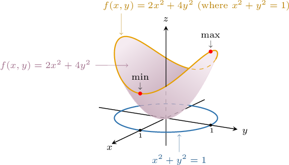
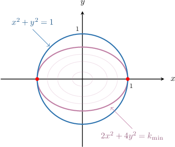
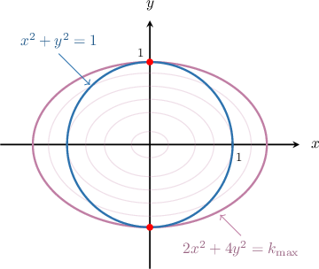

# Lagrange Multipliers With One Constraint

Source: https://www.mathacademy.com/topics/1948?courseId=155
Topic ID: 1948

## Prerequisites

- [The Gradient as a Normal Vector](../mathematical-methods-for-the-physical-sciences-i/1939-the-gradient-as-a-normal-vector.md)
- [Global vs. Local Extrema and Critical Points of Multivariable Functions](./1945-global-vs-local-extrema-and-critical-points-of-multivariable-functions.md)

## Lesson

### Introduction

Suppose we would like to find the minimum and maximum values of the function

$$

f(x,y) = 2x^2+4y^2

$$

subject to constraint $g(x,y) = x^2+y^2=1.$ In other words, we wish to find the global extrema of $f(x,y)$ defined on the circle of radius $1$ centered at the origin, as shown below.

First, let's draw our constraint circle ($x^2+y^2=1$) and consider the level curves of $f(x,y).$ These level curves are ellipses of the form

$$

f(x,y) = 2x^2+4y^2 = k.

$$

As we increase the parameter $k,$ we get ellipses with larger and larger axes, as shown below.

As we continue to increase $k,$ a level curve will touch the circle at the points $(\pm 1, 0)$ for some value of $k.$ The value of $k$ corresponding to that level curve gives us the *smallest* possible value of $f(x,y)$ on our circle $x^2+y^2=1.$

Increasing $k$ even further, we'll get another value of $k$ for which the corresponding level curve touches the circle at the points $(0, \pm 1),$ as shown below. This value of $k$ gives us the *largest* possible value of the function $f(x,y)$ on our circle.

Notice that the corresponding level curves touch the circle in both cases (the minimum and the maximum). So, the level curve $f(x,y)=k$ and the circle $g(x,y)=1$ have a common tangent at these points. This means that the *gradients* of both curves must be parallel at these points. Therefore, at the extreme points, we must have

$$

\nabla f(x,y) = \lambda \nabla g(x,y),

$$

where $\lambda$ is some real number. The number $\lambda$ is called a **Lagrange multiplier**.

We can now use these observations to write down a general method for optimizing a function subject to a constraint.

### The Method of Lagrange Multipliers

The **method of Lagrange multipliers** states that the extrema of a function $f(x,y)$ subject to constraint $g(x,y)=c$ can be found by solving the system

$$

\nabla f(x,y) = \lambda \nabla g(x,y), \qquad g(x,y)=c.

$$

The method of Lagrange multipliers assumes that $\nabla g \neq \mathbf{0}$ on the curve $g(x,y)=c.$

Note that solutions to this system do not always exist! For example, the function $f(x,y)=x+y$ does not have a minimum (or maximum) on the hyperbola $x^2-y^2=1.$

However, we can use the following theorem to guarantee the existence of solutions in some cases:

*If $f(x,y)$ is continuous and the constraint function $g(x,y) = c$ is closed and bounded, then $f(x,y)$ reaches a global maximum and a global minimum on the constraint.*

### A Worked Example

Let's now consider our previous example, where we wish to find the extrema of the function $f(x,y)=2x^2+4y^2$ on the circle $g(x,y)=x^2+y^2=1.$

The method of Lagrange multipliers states that we need to solve the following system:

$$

\nabla f(x,y) = \lambda \nabla g(x,y), \qquad g(x,y)=c

$$

We start by solving the first equation:

$$

\begin{aligned}∇𝑓(𝑥,𝑦) & =𝜆∇𝑔(𝑥,𝑦) \\ ⟨𝑓_{𝑥}(𝑥,𝑦),𝑓_{𝑦}(𝑥,𝑦)⟩ & =𝜆⟨𝑔_{𝑥}(𝑥,𝑦),𝑔_{𝑦}(𝑥,𝑦)⟩ \\ ⟨4𝑥,8𝑦⟩ & =𝜆⟨2𝑥,2𝑦⟩\end{aligned}

$$

Therefore, we have the following:

$$

\begin{aligned}\begin{matrix}4𝑥=2𝜆𝑥 \\ 8𝑦=2𝜆𝑦\end{matrix}\,⇒\,\begin{matrix}𝑥(2−𝜆)=0 \\ 𝑦(4−𝜆)=0\end{matrix}\end{aligned}

$$

To solve this system, we break it up into several cases:

- Assuming $x=0$ in the first equation, the constraint condition $x^2+y^2=1$ implies This gives the critical points $\left(0,\pm 1 \right).$

- Assuming $\lambda =2$ in the first equation, the second equation implies Then, the constraint condition $x^2+y^2=1$ implies This gives the critical points $\left(\pm 1, 0 \right).$

Therefore, $f$ has possible extreme values at the points

$$

(\pm 1, 0), \qquad (0, \pm1).

$$

Finally, we evaluate $f$ at these points:

Therefore, the function reaches a minimum of $2$ at the points $(\pm 1, 0)$ and a maximum of $4$ at points $(0, \pm 1).$

### Example: Finding the Extreme Values of a Constrained Linear Function

#### Question

Use the method of Lagrange multipliers to find the maximum value of the function $f(x,y) = x+y\,$ on the ellipse $x^2 + 2y^2 =6.$

#### Explanation

We must find the maximum value of $f(x,y)$ subject to the constraint $g(x,y)= x^2 + 2y^2 = 6.$

Since $f(x,y)$ is continuous and the constraint is closed and bounded, $f(x,y)$ reaches a global maximum and a global minimum on the constraint.

Therefore, by the method of Lagrange multipliers, we must solve the following system:

$$

\nabla f(x,y) = \lambda \nabla g(x,y), \qquad g(x,y)=6

$$

We start by solving the first equation:

$$

\begin{aligned}∇𝑓(𝑥,𝑦) & =𝜆∇𝑔(𝑥,𝑦) \\ ⟨𝑓_{𝑥}(𝑥,𝑦),𝑓_{𝑦}(𝑥,𝑦)⟩ & =𝜆⟨𝑔_{𝑥}(𝑥,𝑦),𝑔_{𝑦}(𝑥,𝑦)⟩ \\ ⟨1,1⟩ & =𝜆⟨2𝑥,4𝑦⟩\end{aligned}

$$

Notice that we cannot have $\lambda = 0$ since this leads to a contradiction in the above equation. Therefore, assuming $\lambda\neq 0,$ we have the following:

$$

\begin{aligned}\begin{matrix}1=2𝜆𝑥 \\ 1=4𝜆𝑦\end{matrix}\,⇒\,\begin{matrix}𝑥=\frac{1}{2𝜆} \\ 𝑦=\frac{1}{4𝜆}\end{matrix}\end{aligned}

$$

Next, we substitute our expressions for $x$ and $y$ into the condition $g(x,y) = 6$ and solve for $\lambda,$ as follows:

$$

\begin{aligned}(\frac{1}{2𝜆})^{2}+2⋅(\frac{1}{4𝜆})^{2} & =6 \\ \frac{1}{4𝜆^{2}}+2⋅\frac{1}{16𝜆^{2}} & =6 \\ \frac{1}{4𝜆^{2}}+\frac{1}{8𝜆^{2}} & =6 \\ \frac{2}{8𝜆^{2}}+\frac{1}{8𝜆^{2}} & =6 \\ \frac{2+1}{8𝜆^{2}} & =6 \\ 𝜆^{2} & =\frac{1}{16} \\ 𝜆 & =±\frac{1}{4}.\end{aligned}

$$

We can now find $x$ and $y.$ This gives

$$

x= \pm 2 \qquad y = \pm 1.

$$

Therefore, $f$ has possible extreme values at the points

$$

\left(-2, -1 \right), \quad \left(2, 1 \right).

$$

We evaluate $f$ at each of these points. These are given in the following table:

Therefore, the function reaches a maximum value at the point $\left(2, 1 \right),$ and its maximum value is $3.$

### Example: Finding the Extreme Values of a Constrained Quadratic Function

#### Question

Use the method of Lagrange multipliers to find the minimum value of the function $f(x,y) = x^2+y^2\,$ on the ellipse $x^2 +4y^2-4=0.$

#### Explanation

We must find the minimum value of $f(x,y)$ subject to the constraint $g(x,y)= x^2 +4y^2 -4=0.$

Since $f(x,y)$ is continuous and the constraint is closed and bounded, $f(x,y)$ reaches a global maximum and a global minimum on the constraint.

Therefore, by the method of Lagrange multipliers, we must solve the following system:

$$

\nabla f(x,y) = \lambda \nabla g(x,y), \qquad g(x,y)=0

$$

We start by solving the first equation:

$$

\begin{aligned}∇𝑓(𝑥,𝑦) & =𝜆∇𝑔(𝑥,𝑦) \\ ⟨𝑓_{𝑥}(𝑥,𝑦),𝑓_{𝑦}(𝑥,𝑦)⟩ & =𝜆⟨𝑔_{𝑥}(𝑥,𝑦),𝑔_{𝑦}(𝑥,𝑦)⟩ \\ ⟨2𝑥,2𝑦⟩ & =𝜆⟨2𝑥,8𝑦⟩\end{aligned}

$$

Therefore, we have the following:

$$

\begin{aligned}\begin{matrix}2𝑥=2𝜆𝑥 \\ 2𝑦=8𝜆𝑦\end{matrix}\,⇒\,\begin{matrix}𝑥(1−𝜆)=0 \\ 𝑦(4𝜆−1)=0\end{matrix}\end{aligned}

$$

To solve this system, we break it up into several cases:

- Assuming $x=0$ in the first equation of the system, the constraint condition $x^2 +4y^2 -4 =0$ implies This gives the critical points $\left(0,1 \right), \left(0,-1 \right).$

- Assuming $\lambda =1$ in the first equation of the system, the second equation of the system implies Then, the constraint condition $x^2 +4y^2 -4 =0$ implies This gives the critical points $\left(-2,0 \right), \left(2,0 \right).$

Therefore, $f$ has possible extreme values at the points

$$

(0, \pm 1), \qquad (\pm 2,0).

$$

We evaluate $f$ at these points. These are given in the following table:

Therefore, the function reaches a minimum value at the points $(0,\pm 1),$ and its minimum value is $1.$

### Example: Finding the Extreme Values of a Constrained Three-Variable Function

#### Question

Use the method of Lagrange multipliers to find the maximum value of the function $f(x,y,z) = x+y+z$ on the ellipsoid $x^2 + y^2 + 4z^2 = 36.$

#### Explanation

We need to find the maximum value of $f$ subject to the constraint $g(x,y,z) = x^2 + y^2 + 4z^2 = 36.$

Since $f(x,y,z)$ is continuous and the constraint is closed and bounded, $f(x,y,z)$ reaches a global maximum and a global minimum on the constraint.

Therefore, by the method of Lagrange multipliers, we must solve the following system:

$$

\nabla f(x,y,z) = \lambda \nabla g(x,y,z), \qquad g(x,y,z) = 36

$$

We start by solving the first equation:

$$

\begin{aligned}∇𝑓(𝑥,𝑦,𝑧) & =𝜆∇𝑔(𝑥,𝑦,𝑧) \\ ⟨𝑓_{𝑥}(𝑥,𝑦,𝑧),𝑓_{𝑦}(𝑥,𝑦,𝑧),𝑓_{𝑧}(𝑥,𝑦,𝑧)⟩ & =𝜆⟨𝑔_{𝑥}(𝑥,𝑦,𝑧),𝑔_{𝑦}(𝑥,𝑦,𝑧),𝑔_{𝑧}(𝑥,𝑦,𝑧)⟩ \\ ⟨1,1,1⟩ & =𝜆⟨2𝑥,2𝑦,8𝑧⟩\end{aligned}

$$

Notice that we cannot have $\lambda = 0$ since this leads to a contradiction in the above equation. Therefore, assuming $\lambda \neq 0,$ we have the following:

$$

\begin{aligned}1=2𝜆𝑥 \\ 1=2𝜆𝑦 \\ 1=8𝜆𝑧\end{aligned}

$$

Next, we substitute our expressions for $x,\, y$ and $z$ into the condition $g(x,y,z) = 36$ and solve for $\lambda,$ as follows:

$$

\begin{aligned}𝑥^{2}+𝑦^{2}+4𝑧^{2} & =36 \\ \frac{1}{4𝜆^{2}}+\frac{1}{4𝜆^{2}}+4(\frac{1}{64𝜆^{2}}) & =36 \\ \frac{1}{4𝜆^{2}}+\frac{1}{4𝜆^{2}}+\frac{1}{16𝜆^{2}} & =36 \\ \frac{9}{16𝜆^{2}} & =36 \\ 𝜆^{2} & =\frac{1}{64} \\ 𝜆 & =±\frac{1}{8}\end{aligned}

$$

We can now find $x,\, y$ and $z.$ This gives

$$

x = \pm 4 \qquad y = \pm 4 \qquad z= \pm 1.

$$

Therefore, $f$ has possible extreme values at the points

$$

(-4, -4, -1), \qquad (4, 4, 1).

$$

We evaluate $f$ at each of these points. These are given in the following table:

Therefore, the function reaches a maximum value at $(4, 4, 1),$ and its maximum value is $9.$
