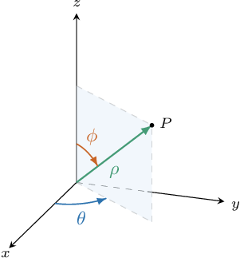
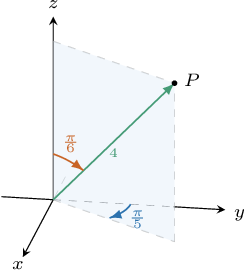
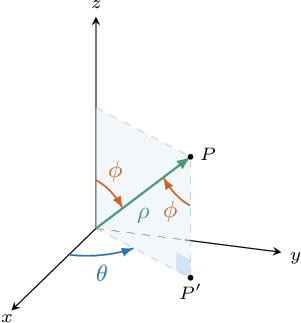
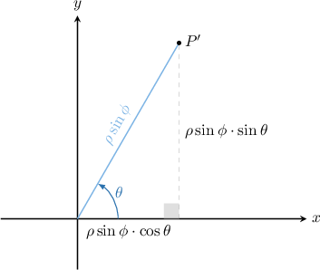
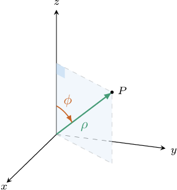

# Spherical Polar Coordinates

Source: https://www.mathacademy.com/topics/1982?courseId=155
Topic ID: 1982

## Prerequisites

- [Converting from Polar Coordinates to Cartesian Coordinates](../../../high-school/integrated-math-honors/lessons/integrated-math-iii-honors/936-converting-from-polar-coordinates-to-cartesian-coordinates.md)

## Lesson

### Introduction

We're used to specifying the position of a point $P$ in three-dimensional space using Cartesian coordinates. However, we can also use **spherical polar coordinates** to specify the position of the same point. We'll use a triple $\left(\rho,\theta,\phi \right)$, where:

- $\color{green}\rho$ (the Greek letter "rho") is the distance from $P$ to the origin $O$, so that $\rho \geq 0.$

- $\color{blue}\theta$ (the Greek letter "theta") is the angle formed by the positive $x$-axis and the half-plane that contains the point $P$ and whose boundary is the $z$-axis. This angle is measured in radians and $0 \leq \theta < 2\pi.$ Note that this is the same as the angle $\theta$ that we see in plane polar coordinates.

- $\color{brown}\phi$ (the Greek letter "phi") is the angle formed by the positive $z$-axis and line segment $\overline{OP}$, where $O$ is the origin. This angle is measured in radians, and $0 \le \phi \le \pi.$

Therefore, $\left(\rho,\theta,\phi \right)$ are the **spherical polar coordinates** of the point.

### Example: Identifying the Spherical Coordinates of a Point

#### Question

What are the spherical polar coordinates of the point $P?$

#### Explanation

We write the position of a point in spherical polar coordinates as $(\rho,\theta,\phi),$ where $\rho \geq 0,$ $0 \leq \theta < 2\pi,$ and $0 \leq \phi \leq \pi.$

According to the diagram, we have the following:

- The distance from the origin to the point $P$ equals $4$ units.

- The half-plane that contains the point $P$ and whose boundary is the $z$-axis forms an angle of radians with the positive $x$-axis.

- The line that passes through the origin and the point $P$ forms an angle of $\dfrac{\pi}{6}$ radians with the positive $z$-axis.

Therefore, the spherical coordinates of $P$ are $\left(4, \dfrac{3\pi}{10}, \dfrac{\pi}{6} \right).$

### Converting From Spherical Polar Coordinates to Cartesian Coordinates

We want to derive formulas to convert from spherical coordinates $(\rho, \theta, \phi)$ to Cartesian coordinates $(x,y,z).$ To do this, let's look at a general point with spherical coordinates $(\rho, \theta, \phi).$

Notice that the angle $\phi$ formed by the positive $z$-axis and line segment $\overline{OP}$ and the angle formed by the line segments $\overline{OP}$ and $\overline{PP'},$ where $P'$ is the projection of $P$ onto the $xy$-plane, are alternate interior angles. Therefore, they are equal.

Using basic trigonometry, $\overline{OP'}=\rho\sin\phi.$ With this in mind, let's look a little closer at the projection of $P$ onto the $xy$-plane:

Again, using basic trigonometry, we find that the Cartesian coordinates of $P'$ are

$$

x = \rho\cos\theta\sin\phi \qquad \text{and} \qquad y = \rho\sin\theta\sin\phi.

$$

Finally, to find the $z$-coordinate of $P,$ let's go back to our original diagram:

Using trigonometry once more, we find that the $z$-coordinate of $P$ is $z = \rho\cos\phi.$

To summarize, if $(\rho, \theta, \phi)$ are the spherical coordinates of a point, then its Cartesian coordinates $(x,y,z)$ can be found by using the following formulas:

$$

x = \rho\cos\theta\sin\phi, \qquad y = \rho\sin\theta\sin\phi, \qquad z = \rho\cos\phi.

$$

### Example: Converting the Spherical Coordinates of a Point Into the Cartesian Coordinates

#### Question

The point $Q$ has spherical coordinates $\left(2\sqrt3, \pi, \dfrac{5\pi}{6} \right).$ Find the Cartesian coordinates of $Q.$

#### Explanation

If $(\rho, \theta, \phi)$ are the spherical coordinates of a point, then its Cartesian coordinates $(x,y,z)$ can be found by using the following formulas:

$$

x = \rho\cos\theta\sin\phi, \qquad y = \rho\sin\theta\sin\phi, \qquad z = \rho\cos\phi.

$$

Calculating $x,$ we get

$$

\begin{aligned}𝑥 & =𝜌cos⁡𝜃sin⁡𝜙 \\ & =2\sqrt{3}cos⁡(𝜋)sin⁡(\frac{5𝜋}{6}) \\ & =2\sqrt{3}⋅(−1)⋅\frac{1}{2} \\ & =−\sqrt{3}.\end{aligned}

$$

Calculating $y,$ we get

$$

\begin{aligned}𝑦 & =𝜌sin⁡𝜃sin⁡𝜙 \\ & =2\sqrt{3}sin⁡(𝜋)sin⁡(\frac{5𝜋}{6}) \\ & =2\sqrt{3}⋅0⋅\frac{1}{2} \\ & =0.\end{aligned}

$$

Calculating $z,$ we get

$$

\begin{aligned}𝑧 & =𝜌cos⁡𝜙 \\ & =2\sqrt{3}cos⁡(\frac{5𝜋}{6}) \\ & =2\sqrt{3}⋅(−\frac{\sqrt{3}}{2}) \\ & =−3.\end{aligned}

$$

Therefore, the Cartesian coordinates of $Q$ are $(-\sqrt3, 0, -3).$

### Converting From Cartesian Coordinates to Spherical Polar Coordinates

We can express $\rho,$ $\theta,$ and $\phi$ in terms of $x,$ $y,$ and $z$ using the following relations:

$$

\rho = \sqrt{x^2+y^2+z^2}, \qquad \tan\theta = \dfrac{y}{x}, \qquad \cos\phi = \dfrac{z}{\rho}.

$$

To help to understand where these formulas come from, note that:

- The formula for $\rho$ is given by the distance of the point $(x,y,z)$ from the origin.

- Since the angle $\theta$ corresponds to the same polar angle that we see in plane polar coordinates $(r,\theta),$ the relationship between $x,y,$ and $\theta$ in spherical polar coordinates is the same as for plane polar coordinates.

- The formula for $\phi$ is simply a rearrangement of $z = \rho\cos\phi.$

Let's again consider our point $P$ with Cartesian coordinates $(1,\sqrt{3}, 2),$ and convert the coordinates into spherical polar coordinates.

First, we find $\rho\mathbin{:}$

$$

\begin{aligned}𝜌 & =\sqrt{𝑥^{2}+𝑦^{2}+𝑧^{2}} \\ & =\sqrt{1^{2}+(\sqrt{3})^{2}+2^{2}} \\ & =\sqrt{1+3+4} \\ & =\sqrt{8} \\ & =2\sqrt{2}\end{aligned}

$$

Now, since $(x,y) = (1,\sqrt{3})$ lies in the first quadrant, we can compute the corresponding angle $\theta\mathbin{:}$

$$

\begin{aligned}𝜃 & =arctan⁡\frac{𝑦}{𝑥} \\ & =arctan⁡\frac{\sqrt{3}}{1} \\ & =arctan⁡(\sqrt{3}) \\ & =\frac{𝜋}{3}\end{aligned}

$$

Finally, for $\phi$, we get

$$

\begin{aligned}𝜙 & =arccos⁡(\frac{𝑧}{𝜌}) \\ & =arccos⁡(\frac{2}{2\sqrt{2}}) \\ & =arccos⁡(\frac{\sqrt{2}}{2}) \\ & =\frac{𝜋}{4}.\end{aligned}

$$

Therefore, the spherical coordinates of $P$ are $\left(2\sqrt2, \dfrac{\pi}{3}, \dfrac{\pi}4 \right).$

### Example: Converting the Cartesian Coordinates of a Point Into the Spherical Coordinates

#### Question

The point $P$ has Cartesian coordinates $(-\sqrt2,0,\sqrt2).$ What are the spherical polar coordinates of $P?$

#### Explanation

If $(\rho, \theta, \phi)$ are the spherical coordinates of a point, then its Cartesian coordinates $(x,y,z)$ can be found by using the following formulas:

$$

x = \rho\cos\theta\sin\phi, \qquad y = \rho\sin\theta\sin\phi, \qquad z = \rho\cos\phi.

$$

From the above equations, we can express $\rho$, $\theta$, and $\phi$ in terms of $x$, $y$, and $z$ as follows:

$$

\rho = \sqrt{x^2+y^2+z^2}, \qquad \tan\theta = \dfrac{y}{x}, \qquad \cos\phi = \dfrac{z}{\rho}.

$$

First, we find $\rho\mathbin{:}$

$$

\begin{aligned}𝜌 & =\sqrt{𝑥^{2}+𝑦^{2}+𝑧^{2}} \\ & =\sqrt{(−\sqrt{2})^{2}+0^{2}+(\sqrt{2})^{2}} \\ & =\sqrt{2+0+2} \\ & =\sqrt{4} \\ & =2\end{aligned}

$$

Now, $(x,y) = (-\sqrt2,0)$ lies on the negative $x$-axis, so

$$

\begin{aligned}𝜃 & =𝜋.\end{aligned}

$$

Finally, for $\phi,$ we obtain

$$

\begin{aligned}𝜙 & =arccos⁡(\frac{𝑧}{𝜌}) \\ & =arccos⁡(\frac{\sqrt{2}}{2}) \\ & =\frac{𝜋}{4}.\end{aligned}

$$

Therefore, the spherical coordinates of $P$ are $\left(2, \pi, \dfrac{\pi}4 \right).$
