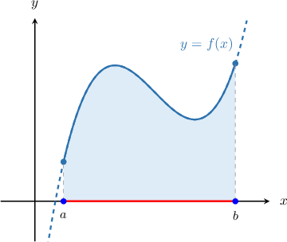
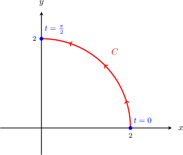
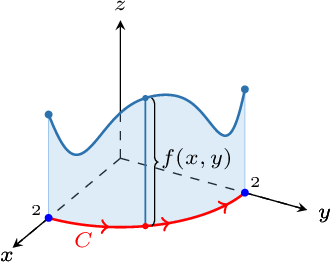
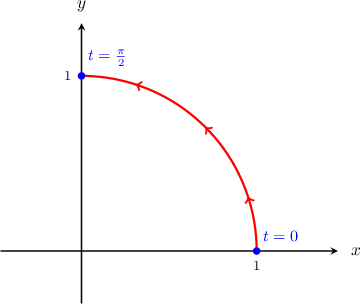
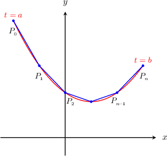

# Line Integrals of Scalar Functions

Source: https://www.mathacademy.com/topics/2107?courseId=155
Topic ID: 2107

## Prerequisites

- [Introduction to Integration by Parts](../../../ap-courses/lessons/ap-calculus-bc/317-introduction-to-integration-by-parts.md)
- [The Arc Length of a Vector-Valued Function](../mathematical-methods-for-the-physical-sciences-i/1837-the-arc-length-of-a-vector-valued-function.md)
- [The Domain of a Multivariable Function](../mathematical-methods-for-the-physical-sciences-i/1899-the-domain-of-a-multivariable-function.md)

## Lesson

### Introduction

A **line integral** $\displaystyle\int\limits_C f(x, y) \, \textrm{d}s$ is similar to a definite integral, but for a function of multiple variables along a general path $C.$

To understand the intuition behind line integrals, remember that the definite integral $\displaystyle\int_a^b f(x)\,\textrm{d}x$ can be interpreted as the (signed) area bounded between the function $y=f(x)$ and the $x$-axis between $x=a$ and $x=b,$ as shown below.

Intuitively, we can think of the integral as the result of summing the areas of many small rectangles that we accumulate as we move along the $x$-axis on the **path** from $x=a$ to $x=b.$

We can also draw paths as general curves in the plane. For example, consider the path $C,$ given by

$$

\mathbf r(t) = \langle 2\cos t, 2\sin t \rangle, \qquad t\in \left[ 0, \dfrac{\pi}{2}\right].

$$

This path represents a quarter circle of radius $2$ traversed counterclockwise from $(2,0)$ to $(0,2)$ in the first quadrant:

Let $f(x,y)= 3 - \sin (2xy).$ If we sum the areas of the thin rectangles that are formed by the curve $C$ and the surface $z=f(x,y)$ as we move along the curve $C$ from $(2,0)$ to $(0,2),$ we get a *signed area,* as shown in the diagram below.

This signed area is equal to the line integral $\displaystyle\int\limits_C f(x, y) \, \textrm{d}s.$

Finally, we sometimes call $\displaystyle\int\limits_C f(x, y) \, \textrm{d}s$ the line integral of $f$ **with respect to arc length.** Other types of line integral are possible, as we'll see soon.

### The General Formula

Let $C$ be a "smooth" curve, defined parametrically as

$$

\mathbf{r} = \mathbf{r}(t), \qquad t \in (a,b).

$$

Now let $f(x,y)$ be a continuous function that is defined everywhere on $C.$ The **line integral** of $f$ over $C,$ denoted

$$

\displaystyle\int\limits_C f(x, y) \, \textrm{d}s,

$$

can be calculated using the formula

$$

\int\limits_C f(x, y) \, \textrm{d}s = \int\limits_a^b f(\mathbf r(t)) \, \| \mathbf r'(t) \| \, \textrm{d}t.

$$

The line integral formula extends to functions of $n$ variables. For example, for functions of three variables, we can use the formula

$$

\int\limits_C f(x, y,z) \, \textrm{d}s = \int\limits_a^b f(\mathbf r(t)) \, \| \mathbf r'(t) \| \, \textrm{d}t.

$$

We'll go through the details of where this formula comes from at the end of the lesson. But for now, let's get some practice at computing line integrals.

### Example: Writing the Line Integral of a Scalar Function as a Definite Integral

#### Question

Find an integral that is equivalent to $\displaystyle\int\limits_C xy^3 \, \textrm{d}s,$ where $C$ is the curve parametrized by $\mathbf r(t)= \left \langle \cos t, \sin t \right\rangle$ for $t \in \left(0, \dfrac{\pi}{2}\right).$

#### Explanation

The path of integration is shown above. We will use the formula

$$

\int\limits_C f(x, y) \, \textrm{d}s = \int\limits_a^b f(\mathbf r(t)) \, \| \mathbf r'(t) \| \, \textrm{d}t.

$$

Here, we have $f(x,y) = xy^3$. Along the path, we have $x=\cos t$ and $y=\sin t,$ and so we get

$$

\begin{aligned}𝑓(𝐫(𝑡)) & =𝑓(cos⁡𝑡,sin⁡𝑡) \\ & =cos⁡𝑡⋅(sin⁡𝑡)^{3} \\ & =sin^{3}⁡𝑡cos⁡𝑡.\end{aligned}

$$

Computing $\mathbf{r}'(t)$ and $\| \mathbf{r}'(t) \|,$ we get

$$

\begin{aligned}𝐫^{′}(𝑡) & =\frac{d𝑥}{d𝑡}\,𝐢+\frac{d𝑦}{d𝑡}\,𝐣 \\ & =\frac{d}{d𝑡}(cos⁡𝑡)𝐢+\frac{d}{d𝑡}(sin⁡𝑡)𝐣 \\ & =−sin⁡𝑡\,𝐢+cos⁡𝑡\,𝐣 \\ ‖𝐫^{′}(𝑡)‖ & =\sqrt{√(\frac{d𝑥}{d𝑡})^{2}+(\frac{d𝑦}{d𝑡})^{2}} \\ & =\sqrt{√(−sin⁡𝑡)^{2}+(cos⁡𝑡)^{2}} \\ & =\sqrt{√sin^{2}⁡𝑡+cos^{2}⁡𝑡} \\ & =1.\end{aligned}

$$

Therefore, we can write the integral as

$$

\begin{aligned}\underset{𝐶}{∫}𝑥𝑦^{3}\,d𝑠 & =∫_{𝑏𝑎}^{}𝑓(𝐫(𝑡))\,‖𝐫^{′}(𝑡)‖\,d𝑡 \\ & =∫_{𝜋/20}^{}sin^{3}⁡𝑡cos⁡𝑡⋅1\,d𝑡 \\ & =∫_{𝜋/20}^{}sin^{3}⁡𝑡cos⁡𝑡\,d𝑡.\end{aligned}

$$

So, we conclude that

$$

\int\limits_C xy^3 \, \textrm{d}s = \int^{\pi/2}_{0} \sin^3 t \cos t \, \textrm{d}t .

$$

### Example: Evaluating the Line Integral of a Scalar Function

#### Question

Evaluate the integral $\displaystyle\int\limits_{C}xy\,\textrm{d}s,$ where $C$ is the curve parametrized by $\mathbf{r}(t) = 3t\,\mathbf{i}+4t\,\mathbf{j}\,$ for $0\leq t\leq 1.$

#### Explanation

To calculate the line integral, we will use the formula

$$

\int\limits_C f(x, y) \, \textrm{d}s = \int\limits_a^b f(\mathbf r(t)) \, \| \mathbf r'(t) \| \, \textrm{d}t.

$$

Since $\mathbf{r}(t) = 3t\,\mathbf{i}+4t\,\mathbf{j},$ then along the curve we have $x=3t$ and $y=4t.$

Computing $\mathbf{r}'(t)$ and $\| \mathbf{r}'(t) \|,$ we get the following:

$$

\begin{aligned}𝐫^{′}(𝑡) & =\frac{d𝑥}{d𝑡}\,𝐢+\frac{d𝑦}{d𝑡}\,𝐣 \\ & =\frac{d}{d𝑡}(3𝑡)𝐢+\frac{d}{d𝑡}(4𝑡)𝐣 \\ & =3\,𝐢+4\,𝐣 \\ ‖𝐫^{′}(𝑡)‖ & =\sqrt{√(\frac{d𝑥}{d𝑡})^{2}+(\frac{d𝑦}{d𝑡})^{2}} \\ & =\sqrt{√3^{2}+4^{2}} \\ & =\sqrt{√5^{2}} \\ & =5\end{aligned}

$$

Now, if $f(x,y) =xy,$ then we obtain

$$

\begin{aligned}𝑓(𝐫(𝑡)) & =3𝑡⋅4𝑡 \\ & =12𝑡^{2}.\end{aligned}

$$

Therefore, we can write the integral as

$$

\begin{aligned}\underset{𝐶}{∫}𝑥𝑦\,d𝑠 & =∫_{10}^{}𝑓(𝐫(𝑡))\,‖𝐫^{′}(𝑡)‖\,d𝑡 \\ & =∫_{10}^{}12𝑡^{2}⋅5\,d𝑡 \\ & =60∫_{10}^{}𝑡^{2}\,d𝑡 \\ & =60[\frac{𝑡^{3}}{3}]_{10}^{} \\ & =20[𝑡^{3}]_{10}^{} \\ & =20.\end{aligned}

$$

### Example: Evaluating the Line Integral of a Scalar Function Using a Substitution

#### Question

Evaluate the line integral of $f(x,y,z) = \dfrac{x}{yz}$ along the curve parametrized by $\mathbf{r}(t) = t^2\, \mathbf{i} + t \,\mathbf{j} + 1 \,\mathbf{k}$ for $t \in [0,\sqrt 2].$

#### Explanation

To calculate the line integral, we will use the formula

$$

\int\limits_C f(x, y) \, \textrm{d}s = \int\limits_a^b f(\mathbf r(t)) \, \| \mathbf r'(t) \| \, \textrm{d}t.

$$

Since $\mathbf{r}(t) =t^2\, \mathbf{i} + t \,\mathbf{j} + 1 \,\mathbf{k},$ then along the curve we have $x = t^2,$ $y = t,$ and $z=1.$

Computing $\mathbf{r}'(t)$ and $\| \mathbf{r}'(t) \|,$ we get the following:

$$

\begin{aligned}𝐫^{′}(𝑡) & =\frac{d𝑥}{d𝑡}\,𝐢+\frac{d𝑦}{d𝑡}\,𝐣+\frac{d𝑧}{d𝑡}\,𝐤 \\ & =\frac{d}{d𝑡}(𝑡^{2})\,𝐢+\frac{d}{d𝑡}(𝑡)\,𝐣+\frac{d}{d𝑡}(1)\,𝐤 \\ & =2𝑡\,𝐢+1\,𝐣+0\,𝐤 \\ & =2𝑡\,𝐢+𝐣 \\ ‖𝐫^{′}(𝑡)‖ & =\sqrt{√(\frac{d𝑥}{d𝑡})^{2}+(\frac{d𝑦}{d𝑡})^{2}+(\frac{d𝑧}{d𝑡})^{2}} \\ & =\sqrt{√(2𝑡)^{2}+1^{2}+0^{2}} \\ & =\sqrt{√4𝑡^{2}+1}\end{aligned}

$$

Now, since $f(x,y,z) = \dfrac{x}{yz},$ we obtain

$$

\begin{aligned}𝑓(𝐫(𝑡)) & =\frac{𝑡^{2}}{𝑡⋅1}=𝑡.\end{aligned}

$$

Therefore, we can write the integral as

$$

\begin{aligned}\underset{𝐶}{∫}𝑓(𝑥,𝑦)\,d𝑠 & =∫_{\sqrt{√2}0}^{}𝑓(𝐫(𝑡))\,‖𝐫^{′}(𝑡)‖\,d𝑡 \\ & =∫_{\sqrt{√2}0}^{}𝑡\sqrt{√4𝑡^{2}+1}\,d𝑡.\end{aligned}

$$

We can solve this using the substitution $u= 4t^2+1,$ $\textrm d u=8t\,\textrm d t$ as follows:

$$

\begin{aligned}∫_{\sqrt{√2}0}^{}𝑡\sqrt{√4𝑡^{2}+1}\,d𝑡 & =∫_{91}^{}\frac{1}{8}𝑢^{1/2}d𝑢 \\ & =\frac{1}{8}⋅\frac{2}{3}𝑢^{3/2}_{91}^{} \\ & =\frac{1}{12}[9^{3/2}−1^{3/2}] \\ & =\frac{1}{12}[27−1] \\ & =\frac{1}{12}⋅26 \\ & =\frac{13}{6}\end{aligned}

$$

### Derivation of the Line Integral Formula

We wish to derive the formula

$$

\int\limits_C f(x,y) \, \textrm{d}s =\int_{a}^{b} f(\mathbf r(t)) \| \mathbf r'(t) \| \, \textrm{d}t.

$$

To do this, we proceed in four steps, as follows:

**Step 1**: We break the integration path $C$ into a series of line segments.

We choose a finite number of points $P_0,$ $P_1,$ $\ldots,$ $P_n$ along $C$ and form the polygonal path

$$

\overline{P_0P_1} \cup \overline{P_1P_2} \cup \cdots \cup \overline{P_{n-1}P_n}.

$$

Our polygonal path is shown in the diagram below.

**Step 2**: For each line segment, we approximate the area enclosed by $f(x,y)$ and $C$ between the two endpoints of the segment. To do this, we calculate the area of a rectangle formed by the segment and the surface $z=f(x,y).$

The width of each line segment is given by

$$

||\overline{P_{k-1}P_k}|| .

$$

If $P_k$ is at the tip of $\mathbf r(t_k),$ then by the mean value theorem,

$$

\begin{aligned}\overset{𝑃_{𝑘−1}𝑃_{𝑘}}{} & =‖𝐫^{′}(𝑐_{𝑘})‖(𝑡_{𝑘}−𝑡_{𝑘−1}) \\ & =‖𝐫^{′}(𝑐_{𝑘})‖Δ𝑡_{𝑘}\end{aligned}

$$

for some intermediate point $c_k \in [t_{k-1}, t_k],$ where $\Delta t_k = t_k - t_{k-1}.$

Therefore, the area formed by the rectangle with a width of $\big\| \overline{P_{k-1}P_k} \big\|$ and a height of $f(c_k)$ is given by

$$

f(c_k) \| \mathbf r'(c_k)\|\Delta t_k.

$$

**Step 3**: We sum the areas of all of our small rectangles, which gives us an *approximation* of our line integral. We get

$$

\int\limits_C f(x,y) \, \textrm{d}s \approx \sum_{k=1}^{n} f(\mathbf r(c_k)) \| \mathbf{r}'(c_k) \| \Delta t_k.

$$

**Step 4**: We take the limit as the width of each rectangle tends to zero (or equivalently, as the number of rectangles tends to infinity). This gives us the exact representation of our line integral:

$$

\int\limits_C f(x,y) \, \textrm{d}s =\lim_{n\to\infty }\sum_{k=1}^{n} f(\mathbf r(c_k)) \| \mathbf{r}'(c_k) \| \Delta t_k = \int_{a}^{b} f(\mathbf r(t)) \| \mathbf r'(t) \| \, \textrm{d}t

$$
