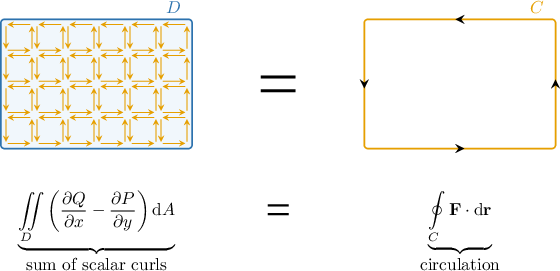
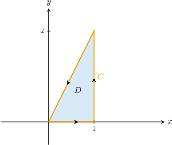
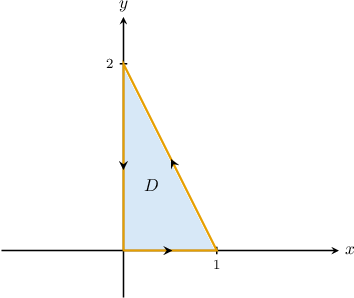
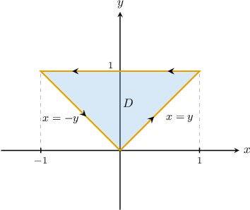
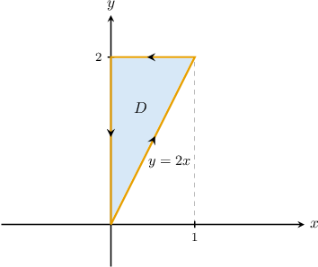

# Introduction to Green's Theorem

Source: https://www.mathacademy.com/topics/2116?courseId=155
Topic ID: 2116

## Prerequisites

- [Double Integrals Over Type II Regions](../mathematical-methods-for-the-physical-sciences-i/2152-double-integrals-over-type-ii-regions.md)
- [Properties of Line Integrals of Vector-Valued Functions](./3704-properties-of-line-integrals-of-vector-valued-functions.md)
- [Circulation](./3713-circulation.md)

## Lesson

### Introduction

Suppose that $f(x)$ is continuous on $[a,b].$ The fundamental theorem of calculus states that

$$

\int_a^b f'(x)\,\textrm d x = f(b) - f(a).

$$

This theorem relates the integral of $f'$ over the domain $D = [a,b]$ to the values of $f$ at the boundary of $D.$ Here, the boundary of $D$ consists of the endpoints $x=a$ and $x=b$ only.

An analogous result, known as **Green's theorem,** exists for double integrals. It states the following:

*Let $C$ be a positively oriented, piecewise-smooth, and simple closed curve in $\Bbb R^2,$ and let $D$ be the region enclosed by $C.$ If $P$ and $Q$ are scalar functions that have continuous partial derivatives, then*

$$

\iint\limits_D \left(\frac{\partial Q}{\partial x} - \frac{\partial P}{\partial y}\right) \: \text{d}A = \oint\limits_{C} P\,\mathrm{d}x + Q\,\mathrm{d}y.

$$

Green's theorem is seen as an analog of the fundamental theorem of calculus because it relates an integral of the derivatives of $P$ and $Q$ over a domain $D$ to the values of $P$ and $Q$ on the boundary of $D.$

### Intuition Behind Green's Theorem

There is some nice intuition behind Green's theorem that makes it easier to remember.

Suppose that $\mathbf F$ is a vector field on $\mathbb R^2$ with domain $D$ and component functions $P$ and $Q.$ So, we have

$$

\mathbf F(x,y) = P(x,y)\,\mathbf i + Q(x,y)\,\mathbf j.

$$

Green's theorem states that the sum of the microscopic curls of $\mathbf F$ inside $D$ equals the macroscopic curl of $\mathbf F$ at the boundary of $D.$

To keep the picture simple, we will deliberately choose $D$ to be a rectangle and imagine breaking it into many tiny squares.

Here is the key idea.

- Each tiny square has its own *local* circulation, which is measured by the scalar curl If we sum (integrate) the curl at every point over the entire domain $D,$ we get

- On the other hand, when we add up the contributions from all the tiny squares, the integrals along *shared interior edges* cancel: one square traverses a shared edge in one direction, the neighboring square traverses the *same* edge in the opposite direction.

- Because of this cancellation, the only edges that do *not* get canceled are the edges on the *outer boundary* $C.$

So, when we “sum all the microscopic curls” across $D,$ what remains is exactly the “macroscopic curl,” meaning the circulation around the boundary:

$$

\iint\limits_D \left(\frac{\partial Q}{\partial x} - \frac{\partial P}{\partial y}\right)\,\mathrm{d}A = \oint\limits_{C}\mathbf F\cdot \mathrm{d}\mathbf r

$$

Finally, using $\mathbf F(x,y)=P(x,y)\,\mathbf i+Q(x,y)\,\mathbf j,$ we can write the circulation as a line integral with respect to $x$ and $y{:}$

$$

\iint\limits_D \left(\frac{\partial Q}{\partial x} - \frac{\partial P}{\partial y}\right)\,\mathrm{d}A = \oint\limits_{C} P\,\mathrm{d}x + Q\,\mathrm{d}y

$$

Let's now look at a concrete example of how to apply Green's theorem.

### A Concrete Example

Suppose we wish to compute the line integral

$$

\oint\limits_{C} xy^2 \: \mathrm{d}x+ 2x^2y \: \mathrm{d}y

$$

where $C$ is the boundary of the region $D,$ given by

$$

D = \big\{ (x,y) \: : \: 0 \leq x \leq 1, \:\: 0 \leq y \leq 2x \big\}.

$$

We will use Green's theorem, which states that

$$

\iint\limits_D \left(\frac{\partial Q}{\partial x} - \frac{\partial P}{\partial y}\right) \: \text{d}A = \oint\limits_{C} P\,\mathrm{d}x + Q\,\mathrm{d}y.

$$

We denote $P(x,y)= xy^2$ and $Q(x,y)= 2x^2y.$ Then, we have

$$

\begin{aligned}\frac{𝜕𝑃}{𝜕𝑦}=2𝑥𝑦,\,\frac{𝜕𝑄}{𝜕𝑥}=4𝑥𝑦.\end{aligned}

$$

Applying Green's theorem, we obtain

$$

\begin{aligned}\underset{𝐶}{∮}𝑥𝑦^{2}\,d𝑥+2𝑥^{2}𝑦\,d𝑦 & =\underset{𝐷}{∬}(\frac{𝜕𝑄}{𝜕𝑥}−\frac{𝜕𝑃}{𝜕𝑦})\,d𝐴 \\ & =\underset{𝐷}{∬}(4𝑥𝑦−2𝑥𝑦)\,d𝐴 \\ & =∫_{10}∫_{2𝑥0}2𝑥𝑦\,d𝑦\,d𝑥.\end{aligned}

$$

Calculating this repeated integral using the usual methods, we obtain

$$

\int_0^1 \int _0^{2x} 2xy \,\textrm d{y} \: \text{d}x = 1.

$$

Therefore, we conclude that

$$

\oint\limits_{C} xy^2 \: \mathrm{d}x+ 2x^2y \: \mathrm{d}y = 1.

$$

This example demonstrates the power of Green's theorem. Direct evaluation of the line integral involves splitting $C$ into three separate paths and evaluating each separately. With Green's theorem, we reduced the entire problem to a single, relatively straightforward double integral.

### Example: Expressing a Line Integral as a Double Integral Using Green's Theorem

#### Question

Consider the triangle $C$ in the plane with vertices $(0,0), (1,0)$ and $(0,2),$ and the region $D$ bounded by $C.$ According to Green's theorem,

$$

\displaystyle{\oint\limits_{C}\cos{y}\,\mathrm{d}x+x\sin{y}\,\mathrm{d}y}= \iint\limits_D f(x,y) \,\textrm d A,

$$

where $C$ is traversed counterclockwise. Calculate the function $f(x,y).$

#### Explanation

Let $C$ be a positively oriented, piecewise-smooth, simple closed curve in the plane, and let $D$ be the region bounded by $C.$ If $P$ and $Q$ have continuous first partial derivatives on an open region containing $D$, then Green's theorem states that

$$

\oint\limits_{C} P\,\mathrm{d}x + Q\,\mathrm{d}y = \iint\limits_D \left(\frac{\partial Q}{\partial x} - \frac{\partial P}{\partial y}\right)\,\textrm d A.

$$

The region $D$ and the curve $C$ for this case are shown below.

We have that $P(x,y)= \cos{y}$ and $Q(x,y)= x\sin{y}.$ So,

$$

\begin{aligned}\frac{𝜕𝑃}{𝜕𝑦}=−sin⁡𝑦,\,\frac{𝜕𝑄}{𝜕𝑥}=sin⁡𝑦.\end{aligned}

$$

Therefore, applying Green's theorem, we get

$$

\begin{aligned}\underset{𝐶}{∮}cos⁡𝑦\,d𝑥+𝑥sin⁡𝑦\,d𝑦 & =\underset{𝐷}{∬}(\frac{𝜕𝑄}{𝜕𝑥}−\frac{𝜕𝑃}{𝜕𝑦})\,d𝐴 \\ & =\underset{𝐷}{∬}(sin⁡𝑦−(−sin⁡𝑦)\,d𝐴 \\ & =\underset{𝐷}{∬}2sin⁡𝑦\,d𝐴.\end{aligned}

$$

Hence, $f(x,y) = 2\sin{y}.$

### Example: Expressing a Line Integral as a Repeated Integral Using Green's Theorem

#### Question

Consider the triangle $C$ in the plane with vertices $(0,0), (1,1)$ and $(-1,1),$ traversed counterclockwise, and the region $D$ bounded by $C.$ Express $\displaystyle{\oint\limits_{C}x\sin{y}\,\mathrm{d}x+ (x^2\cos{y}-y^2)\,\mathrm{d}y}$ as a repeated integral.

#### Explanation

Let $C$ be a positively oriented, piecewise-smooth, simple closed curve in the plane, and let $D$ be the region bounded by $C.$ If $P$ and $Q$ have continuous first partial derivatives on an open region containing $D$, then Green's theorem states that

$$

\oint\limits_{C} P\,\mathrm{d}x + Q\,\mathrm{d}y = \iint\limits_D \left(\frac{\partial Q}{\partial x} - \frac{\partial P}{\partial y}\right)\,\textrm d A.

$$

The region $D$ and the curve $C$ for this case are shown below.

We have that $P(x,y)= x\sin{y}$ and $Q(x,y)= x^2\cos{y}-y^2.$ So,

$$

\begin{aligned}\frac{𝜕𝑃}{𝜕𝑦}=𝑥cos⁡𝑦,\,\frac{𝜕𝑄}{𝜕𝑥}=2𝑥cos⁡𝑦.\end{aligned}

$$

We can express the region $D$ as a type II region as follows:

$$

D = \{(x,y) : -y\leq x\leq y,\, 0\leq y \leq 1\}

$$

Therefore, applying Green's Theorem, we get

$$

\begin{aligned}\underset{𝐶}{∮}𝑥sin⁡𝑦\,d𝑥+(𝑥^{2}cos⁡𝑦−𝑦^{2})\,d𝑦 & =\underset{𝐷}{∬}(\frac{𝜕𝑄}{𝜕𝑥}−\frac{𝜕𝑃}{𝜕𝑦})\,d𝐴 \\ & =\underset{𝐷}{∬}(2𝑥cos⁡𝑦−𝑥cos⁡𝑦)\,d𝐴 \\ & =\underset{𝐷}{∬}𝑥cos⁡𝑦\,d𝐴 \\ & =∫_{10}∫_{𝑦−𝑦}𝑥cos⁡𝑦\,d𝑥\,d𝑦\end{aligned}

$$

### Example: Evaluating Line Integrals Using Green's Theorem

#### Question

Use Green's theorem to evaluate $\displaystyle{\oint\limits_{C} 4x^2y \, \mathrm{d}x+ 2y^2\,\mathrm{d}y},$ where $C$ is the boundary of the triangle with vertices at $(0,0),$ $(1,2)$ and $(0,2),$ traversed counterclockwise.

#### Explanation

Let $C$ be a positively oriented, piecewise-smooth, simple closed curve in the plane, and let $D$ be the region bounded by $C.$ If $P$ and $Q$ have continuous first partial derivatives on an open region containing $D$, then Green's theorem states that

$$

\oint\limits_{C} P\,\mathrm{d}x + Q\,\mathrm{d}y = \iint\limits_D \left(\frac{\partial Q}{\partial x} - \frac{\partial P}{\partial y}\right)\textrm d A.

$$

The region $D$ and the curve $C$ for this case are shown below.

We have that $P(x,y)= 4x^2y$ and $Q(x,y)= 2y^2.$ So,

$$

\begin{aligned}\frac{𝜕𝑃}{𝜕𝑦}=4𝑥^{2},\,\frac{𝜕𝑄}{𝜕𝑥} & =0.\end{aligned}

$$

We can express the region $D$ as a type I region as follows:

$$

D = \left\{(x,y) : 0 \leq x \leq 1,\, 2x \leq y \leq 2 \right\}

$$

Therefore, applying Green's Theorem, we get

$$

\begin{aligned}\underset{𝐶}{∮}4𝑥^{2}𝑦\,d𝑥+2𝑦^{2}\,d𝑦 & =\underset{𝐷}{∬}(\frac{𝜕𝑄}{𝜕𝑥}−\frac{𝜕𝑃}{𝜕𝑦})d𝐴 \\ & =\underset{𝐷}{∬}(0−4𝑥^{2})\,d𝐴 \\ & =∫_{10}∫_{22𝑥}(−4𝑥^{2})\,d𝑦\,d𝑥 \\ & =−4∫_{10}𝑥^{2}[𝑦]_{22𝑥}\,d𝑥 \\ & =−4∫_{10}𝑥^{2}(2−2𝑥)\,d𝑥 \\ & =−8∫_{10}𝑥^{2}(1−𝑥)\,d𝑥 \\ & =−8∫_{10}𝑥^{2}−𝑥^{3}\,d𝑥 \\ & =−8[\frac{𝑥^{3}}{3}−\frac{𝑥^{4}}{4}]_{10} \\ & =−8(\frac{1}{3}−\frac{1}{4}) \\ & =−8⋅\frac{1}{12} \\ & =−\frac{2}{3}.\end{aligned}

$$

### Green's Theorem in Vector Form

It's possible to write Green's theorem in a form that explicitly features the curl.

To demonstrate, let's denote $\mathbf{F}(x,y) = \big\langle P(x,y), \: Q(x,y) \big\rangle.$ According to Green's theorem,

$$

\oint\limits_C \mathbf{F}(x,y) \cdot \text{d}\mathbf{r} = \iint\limits_D \left(\frac{\partial Q}{\partial x} - \frac{\partial P}{\partial y}\right)\,\textrm d A.

$$

Now, by thinking of $\mathbf{F}$ as a vector field on $\mathbb R^3$ with zero $z$-component, we can write

$$

\mathbf{F}(x,y,0) = \big\langle P(x,y), \: Q(x,y), \: 0 \big\rangle.

$$

Computing the curl of $\mathbf F(x,y,0),$ we obtain

$$

\begin{aligned}𝐢 & 𝐣 & 𝐤 \\ \frac{𝜕}{𝜕𝑥} & \frac{𝜕}{𝜕𝑦} & \frac{𝜕}{𝜕𝑧} \\ 𝑃 & 𝑄 & 0\end{aligned}

$$

As a result, we can recover the original scalar curl by taking the dot product of $\text{curl}\,\mathbf F$ with the vector $\mathbf k\mathbin{:}$

$$

\text{curl}\:\mathbf{F} \cdot \mathbf{k} = \left(\dfrac{\partial Q }{\partial x} - \dfrac{\partial P }{\partial y}\right) \mathbf k \cdot \mathbf k = \dfrac{\partial Q }{\partial x} - \dfrac{\partial P }{\partial y}

$$

Therefore, we can write Green's theorem in the form

$$

\oint\limits_C \mathbf{F}(x,y) \cdot \text{d}\mathbf{r} = \iint\limits_D {\text{curl}\:\mathbf{F} \cdot \mathbf{k}} \, \textrm d A.

$$
