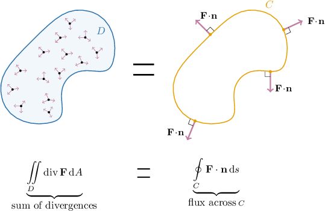
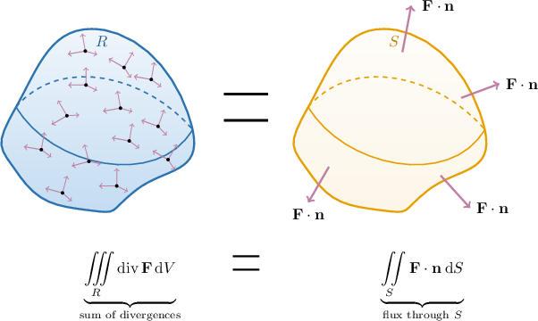
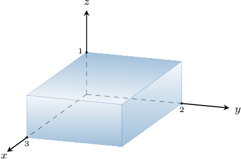

# The Divergence Theorem

Source: https://www.mathacademy.com/topics/2135?courseId=155
Topic ID: 2135

## Prerequisites

- [Volumes of Cylinders](../../../high-school/traditional/lessons/geometry/1144-volumes-of-cylinders.md)
- [Calculating Volumes of Solids Using Triple Integrals](./2053-calculating-volumes-of-solids-using-triple-integrals.md)
- [Green's Theorem in Flux Form](./3361-green-s-theorem-in-flux-form.md)
- [Flux Through Closed Surfaces](./4162-flux-through-closed-surfaces.md)

## Lesson

### Introduction

Consider a two-dimensional vector field $\mathbf{F}$ on $\mathbb R^2$ with component functions $P(x,y)$ and $Q(x,y)$ defined over a region $D.$

Recall that Green's theorem in flux form states that the sum of the microscopic "fluxes" (divergences) of $\mathbf{F}$ inside $D$ equals the macroscopic flux of $\mathbf{F}$ across the boundary of $D.$

We can express Green's theorem in flux form as a single picture, shown below.

We'll now state the higher-dimensional analog of Green's theorem in flux form. Please note that we will restrict our attention to so-called **simple regions** for the remainder of this lesson. Simple regions in $\mathbb R^3$ can be classified as type I, type II, *and* type III.

### The Divergence Theorem

The **divergence theorem** is a higher-dimensional analog of Green's theorem in flux form. It states the following:

*Let $R$ be a simple solid region bounded by a closed surface $S$ with positive (outward) orientation. If a vector field $\mathbf{F}$ has continuous partial derivatives for all its components in an open region in space that contains $R,$ then*

$$

\iiint\limits_R \text{div}\,\mathbf{F} \: \text{d}V = \iint\limits_{S} \mathbf{F}\cdot\mathrm{d}\mathbf{S} = \iint\limits_{S} \mathbf{F}\cdot\mathbf{n}\:\mathrm{d}S

$$

*where $\mathbf{n}$ is the outward-pointing unit normal to $S.$*

In other words, the sum of the microscopic "fluxes" (divergences) of $\mathbf{F}$ inside $R$ equals the macroscopic flux of $\mathbf{F}$ through the boundary of $R.$

The divergence theorem can be summarized in a single diagram.

The divergence theorem can be used to simplify flux calculations. Calculating the flux of $\mathbf F$ across a surface can be time-consuming because we often need to consider the flux of $\mathbf F$ across multiple faces that make up $S.$ The divergence theorem often allows us to reduce a complicated flux calculation to a single triple integral.

### Calculating the Flux Across a Surface

Consider the vector field

$$

\mathbf{F} = \langle 2x+1,\: 3z,\: xy \rangle

$$

and the surface $S$ defined by the bounding region of the rectangular solid shown below.

Let's find the flux of $\mathbf F$ through $S.$

To find the total flux directly, we would need to find the flux through each of the six surfaces of our rectangular solid and then add the results. However, using the divergence theorem

$$

\iint\limits_{S} \mathbf{F}\cdot\mathrm{d}\mathbf{S} = \iiint\limits_R \text{div}\,\mathbf{F} \: \text{d}V,

$$

we can reduce this computation to a single triple integral.

Computing the divergence of $\mathbf{F},$ we obtain

$$

\begin{aligned}div\,𝐅 & =\frac{𝜕}{𝜕𝑥}(2𝑥+1)+\frac{𝜕}{𝜕𝑦}(3𝑧)+\frac{𝜕}{𝜕𝑧}(𝑥𝑦) \\ & =2+0+0 \\ & =2.\end{aligned}

$$

Therefore, the flux through $S$ is

$$

\begin{aligned}\underset{𝑆}{∬}𝐅⋅d𝐒 & =\underset{𝑅}{∭}2\,d𝑉 \\ & =2\underset{𝑅}{∭}\,d𝑉 \\ & =2⋅Volume(𝑅) \\ & =2⋅(3⋅2⋅1) \\ & =12.\end{aligned}

$$

### Example: Writing the Flux Across a Closed Surface as a Triple Integral

#### Question

Let $S$ be the boundary of the finite solid region enclosed by the planes $x=-1,$ $x=1,$ $y=0,$ $y=1,$ and the surfaces $z=y$ and $z=1+x^2+y^2.$ Given that the surface $S$ is positively (outward) oriented and $\mathbf{F} = (x+z)\, \mathbf{i} + yz \, \mathbf{j} + x^2y \, \mathbf{k},$ express the flux of $\mathbf{F}$ across $S$ as a triple integral, and then as a repeated integral.

#### Explanation

Let $R$ be a simple solid region bounded by a closed surface $S$ with positive (outward) orientation. If a vector field $\mathbf{F}$ has continuous partial derivatives for all its components in an open region in space that contains $R,$ then the divergence theorem states that

$$

\iint\limits_{S} \mathbf{F}\cdot\mathrm{d}\mathbf{S} = \iiint\limits_R \text{div}\,\mathbf{F} \: \text{d}V.

$$

Computing the divergence of $\mathbf{F},$ we obtain

$$

\begin{aligned}div\,𝐅 & =\frac{𝜕}{𝜕𝑥}(𝑥+𝑧)+\frac{𝜕}{𝜕𝑦}(𝑦𝑧)+\frac{𝜕}{𝜕𝑧}(𝑥^{2}𝑦) \\ & =1+𝑧+0 \\ & =𝑧+1.\end{aligned}

$$

Therefore, using the divergence theorem, we have

$$

\iint\limits_{S} \mathbf{F}\cdot\mathrm{d}\mathbf{S} = \iiint\limits_R (z+1) \: \text{d}V,

$$

where $R$ is a type I solid region that can be written as

$$

R = \big\{ (x,y,z) \: : \:-1 \leq x \leq 1, \: 0 \leq y \leq 1, \: y \leq z \leq 1+x^2+y^2 \big\}.

$$

Expressing our triple integral as a repeated integral, we have

$$

\begin{aligned}\underset{𝑅}{∭}𝑧+1\,d𝑉 & =∫_{1−1}∫_{10}∫_{1+𝑥^{2}+𝑦^{2}𝑦}^{}\,𝑧+1\,d𝑧\,d𝑦\,d𝑥.\end{aligned}

$$

### Example: Calculating Flux Across the Surface of a Known Solid

#### Question

Consider the positively oriented surface $S$ given by $x^2 + y^2 + z^2 = 4$ and the vector field $\mathbf{F} = 2x \, \mathbf{i} + y \, \mathbf{j} + 4 \, \mathbf{k}.$ Use the divergence theorem to find the flux of $\mathbf{F}$ across $S.$

#### Explanation

Let $R$ be a simple solid region bounded by a closed surface $S$ with positive (outward) orientation. If a vector field $\mathbf{F}$ has continuous partial derivatives for all its components in an open region in space that contains $R,$ then the divergence theorem states that

$$

\iint\limits_{S} \mathbf{F}\cdot\mathrm{d}\mathbf{S} = \iiint\limits_R \text{div}\,\mathbf{F} \: \text{d}V.

$$

Computing the divergence of $\mathbf{F},$ we obtain

$$

\begin{aligned}div\,𝐅 & =\frac{𝜕}{𝜕𝑥}(2𝑥)+\frac{𝜕}{𝜕𝑦}(𝑦)+\frac{𝜕}{𝜕𝑧}(4) \\ & =2+1+0 \\ & =3.\end{aligned}

$$

Let $R$ be the solid sphere of radius $2$ enclosed by $S.$ Then, using the divergence theorem, we have

$$

\begin{aligned}\underset{𝑆}{∬}𝐅⋅d𝐒 & =\underset{𝑅}{∭}3\,d𝑉 \\ & =3\underset{𝑅}{∭}\,d𝑉 \\ & =3⋅Volume(𝑅) \\ & =3⋅\frac{4}{3}𝜋⋅2^{3} \\ & =32𝜋.\end{aligned}

$$

### Example: Calculating Flux Across a Closed Surface

#### Question

Let $S$ be the boundary of the rectangular prism enclosed by the planes $x=0,$ $x=1,$ $y=0,$ $y=2,$ $z=1,$ $z=2.$ Given that the surface $S$ is positively (outward) oriented and $\mathbf{F} =e^z \, \mathbf{i} + x^2y^2 \, \mathbf{j} + 4x^2yz \, \mathbf{k},$ find the flux of $\mathbf{F}$ across $S.$

#### Explanation

Let $R$ be a simple solid region bounded by a closed surface $S$ with positive (outward) orientation. If a vector field $\mathbf{F}$ has continuous partial derivatives for all its components in an open region in space that contains $R,$ then the divergence theorem states that

$$

\iint\limits_{S} \mathbf{F}\cdot\mathrm{d}\mathbf{S} = \iiint\limits_R \text{div}\,\mathbf{F} \: \text{d}V.

$$

Computing the divergence of $\mathbf{F},$ we obtain

$$

\begin{aligned}div\,𝐅 & =\frac{𝜕}{𝜕𝑥}(𝑒^{𝑧})+\frac{𝜕}{𝜕𝑦}(𝑥^{2}𝑦^{2})+\frac{𝜕}{𝜕𝑧}(4𝑥^{2}𝑦𝑧) \\ & =0+2𝑥^{2}𝑦+4𝑥^{2}𝑦 \\ & =6𝑥^{2}𝑦.\end{aligned}

$$

Let $R$ be the solid region enclosed by $S.$ Then, using the divergence theorem, we have

$$

\begin{aligned}\underset{𝑆}{∬}𝐅⋅d𝐒 & =\underset{𝑅}{∭}6𝑥^{2}𝑦\,d𝑉 \\ & =∫_{10}∫_{20}∫_{21}6𝑥^{2}𝑦\,d𝑧\,d𝑦\,d𝑥 \\ & =∫_{10}3𝑥^{2}\,d𝑥⋅∫_{20}2𝑦\,d𝑦⋅∫_{21}\,d𝑧 \\ & =[𝑥^{3}]_{𝑥=1𝑥=0}⋅[𝑦^{2}]_{𝑦=2𝑦=0}⋅(2−1) \\ & =(1−0)⋅(4−0)⋅1 \\ & =4.\end{aligned}

$$
