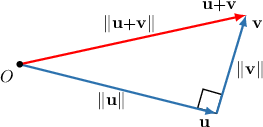
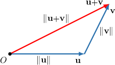

# The Pythagorean Theorem and the Triangle Inequality

Source: https://www.mathacademy.com/topics/2153?courseId=155
Topic ID: 2153

## Prerequisites

- [The Triangle Inequality](../../../middle-school/lessons/grade-8/766-the-triangle-inequality.md)
- [The Cauchy-Schwarz Inequality and the Angle Between Two Vectors](./2101-the-cauchy-schwarz-inequality-and-the-angle-between-two-vectors.md)

## Lesson

### Introduction

Remember that two vectors $\mathbf{u}$ and $\mathbf{v}$ in $\mathbb{R}^n$ are **orthogonal** if their dot product equals zero: $\mathbf{u}\cdot \mathbf{v}=0.$

The **Pythagorean Theorem** provides another way to determine whether two vectors are orthogonal. It states the following:

Two vectors $\mathbf{u}$ and $\mathbf{v}$ in $\mathbb{R}^n$ are orthogonal if and only if $\,\Vert \mathbf{u}+\mathbf{v}\Vert^2 = \Vert \mathbf{u} \Vert^2 + \Vert \mathbf{v}\Vert^2.$

For instance, consider the vectors $[\begin{aligned}8 \\ −2\end{aligned}]$ and $[\begin{aligned}1 \\ 4\end{aligned}]$ These vectors are orthogonal since

$$

[\begin{aligned}8 \\ −2\end{aligned}]

$$

Indeed, because $\mathbf{u}$ and $\mathbf{v}$ are orthogonal, the Pythagorean theorem holds true:

$$

\begin{aligned}‖𝐮+𝐯‖^{2} & =‖𝐮‖^{2}+‖𝐯‖^{2} \\ (8+1)^{2}+(−2+4)^{2} & =((8)^{2}+(−2)^{2})+((1)^{2}+(4)^{2}) \\ 9^{2}+2^{2} & =(64+4)+(1+16) \\ 81+4 & =68+17 \\ 85 & =85\,✓\end{aligned}

$$

The Pythagorean theorem for vectors is really just the same concept as the Pythagorean theorem from geometry. To understand how, notice that we can visualize $\mathbf{u}+\mathbf{v}$ as the hypotenuse of a right triangle whose legs are $\mathbf{u}$ and $\mathbf{v}\mathbin{:}$

**Important:** The Pythagorean theorem is true only if the vectors are *orthogonal*!

### Example: Calculating the Norm of a Vector Using the Pythagorean Theorem

#### Question

Let $\mathbf{u}$ and $\mathbf{v}$ be vectors such that $\Vert \mathbf{v} \Vert = 6$ and $\Vert \mathbf{u}+4\mathbf{v} \Vert = 25.$ If $\mathbf{u}$ is orthogonal to $\mathbf{v},$ find $\mathbf{u}\cdot\mathbf{u}.$

#### Explanation

Since $\mathbf{u}$ is orthogonal to $\mathbf{v},$ we also have that $\mathbf{u}$ is orthogonal to $4\mathbf{v}.$ So, the Pythagorean theorem states that

$$

\begin{aligned}‖𝐮+4𝐯‖^{2} & =‖𝐮‖^{2}+‖4𝐯‖^{2}.\end{aligned}

$$

Simplifying and substituting in the given information, we get

$$

\begin{aligned}‖𝐮+4𝐯‖^{2} & =‖𝐮‖^{2}+(4‖𝐯‖)^{2} \\ ‖𝐮+4𝐯‖^{2} & =‖𝐮‖^{2}+16‖𝐯‖^{2} \\ (25)^{2} & =‖𝐮‖^{2}+16(6)^{2} \\ 625 & =‖𝐮‖^{2}+576 \\ ‖𝐮‖^{2} & =625−576 \\ ‖𝐮‖^{2} & =49.\end{aligned}

$$

Therefore, $\mathbf{u}\cdot\mathbf{u}=\Vert\mathbf{u}\Vert^2=49.$

### The Triangle Inequality

Another inequality relating the norms of two vectors is the **triangle inequality**, which states the following:

Let $\mathbf{u}$ and $\mathbf{v}$ be vectors in $\mathbb{R}^n.$ Then $\Vert \mathbf{u} + \mathbf{v} \Vert \leq \Vert \mathbf{u} \Vert + \Vert \mathbf{v} \Vert.$

For instance, consider the vectors $[\begin{aligned}6 \\ 0\end{aligned}]$ and $[\begin{aligned}2 \\ 4\end{aligned}]$ Indeed, the triangle inequality holds true for these vectors:

$$

\begin{aligned}‖𝐮+𝐯‖ & ≤‖𝐮‖+‖𝐯‖ \\ \sqrt{√(6+2)^{2}+(0+4)^{2}} & ≤\sqrt{√6^{2}+0^{2}}+\sqrt{√2^{2}+4^{2}} \\ \sqrt{√64+16} & ≤\sqrt{√36}+\sqrt{√4+16} \\ \sqrt{√80} & ≤6+\sqrt{√20} \\ 4\sqrt{√5} & ≤6+2\sqrt{√5} \\ 8.9… & ≤10.4…\,✓\end{aligned}

$$

The triangle inequality for vectors is really just the same concept as the triangle inequality from geometry. To understand how, notice that we can visualize $\mathbf{u}+\mathbf{v}$ as the third side in a triangle whose other two sides are $\mathbf{u}$ and $\mathbf{v}\mathbin{:}$

Geometrically, the triangle inequality states that it is always quicker (or at least not longer) to travel directly along the vector $\mathbf{u}+\mathbf{v}$ than it is to travel first along the vector $\mathbf{u}$ and then along the vector $\mathbf{v}.$

### Example: Calculating a Minimum Value Using the Triangle Inequality

#### Question

Given that $\Vert \mathbf{u} +3\mathbf{v} \Vert=14$ and $\Vert \mathbf{v} \Vert=2,$ find the smallest possible value of $\Vert \mathbf{u}\Vert.$

#### Explanation

Using the triangle inequality, we have that

$$

\begin{aligned}‖𝐮+3𝐯‖ & ≤‖𝐮‖+‖3𝐯‖.\end{aligned}

$$

Simplifying and substituting in the given information, we get

$$

\begin{aligned}‖𝐮+3𝐯‖ & ≤‖𝐮‖+3‖𝐯‖ \\ 14 & ≤‖𝐮‖+3(2) \\ 14 & ≤‖𝐮‖+6 \\ 8 & ≤‖𝐮‖.\end{aligned}

$$

Therefore, the minimum possible value of $\Vert \mathbf{u} \Vert$ is $8.$

### Example: Combining the Pythagorean Theorem and the Cauchy-Schwarz and Triangle Inequalities

#### Question

Let the vectors $\mathbf{v}$ and $\mathbf{w}$ be orthogonal. If $|\mathbf{u}\cdot \mathbf{v}|^2+5\Vert\mathbf{v}+\mathbf{w}\Vert^2=29$ and $\| \mathbf{u} \| = \| \mathbf{w} \| = 2$, then what is the minimum possible value of $\Vert\mathbf{v}\Vert?$

#### Explanation

First, using the Cauchy-Schwarz inequality, simplifying, and substituting in the given information, we obtain

$$

\begin{aligned}29 & =|𝐮⋅𝐯|^{2}+5‖𝐯+𝐰‖^{2} \\ & ≤‖𝐮‖^{2}⋅‖𝐯‖^{2}+5‖𝐯+𝐰‖^{2} \\ & =2^{2}⋅‖𝐯‖^{2}+5‖𝐯+𝐰‖^{2} \\ & =4‖𝐯‖^{2}+5‖𝐯+𝐰‖^{2}.\end{aligned}

$$

Since $\mathbf{v} \perp \mathbf{w}$, using the Pythagorean theorem, simplifying, and substituting in the given information, we have

$$

\begin{aligned}4‖𝐯‖^{2}+5‖𝐯+𝐰‖^{2} & =4‖𝐯‖^{2}+5(‖𝐯‖^{2}+‖𝐰‖^{2}) \\ & ≤4‖𝐯‖^{2}+5(‖𝐯‖^{2}+2^{2}) \\ & =9‖𝐯‖^{2}+20.\end{aligned}

$$

Combining the two steps above, we get

$$

\begin{aligned}29 & ≤9‖𝐯‖^{2}+20 \\ 9 & ≤9‖𝐯‖^{2} \\ 1 & ≤‖𝐯‖^{2}.\end{aligned}

$$

Finally, $1 \leq \Vert\mathbf{v}\Vert^2$ implies that $1 \leq \Vert\mathbf{v}\Vert$. Notice that we disregard the negative solutions since the norm can't be negative.

Therefore, the minimum possible value of $\Vert\mathbf{v}\Vert$ is $1.$
