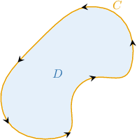
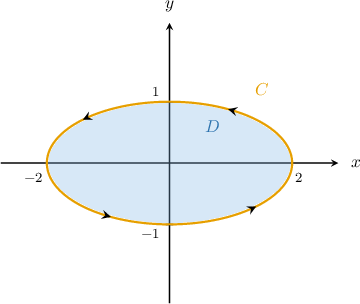
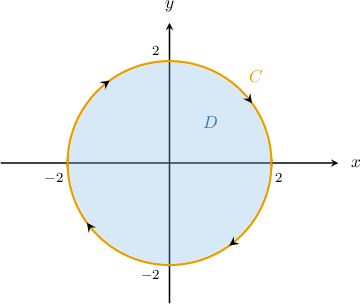
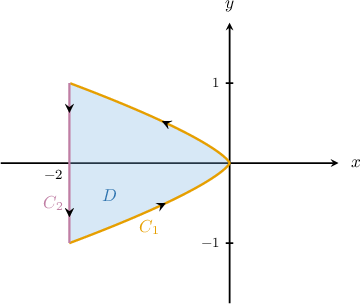

# Using Green's Theorem to Calculate Area

Source: https://www.mathacademy.com/topics/2198?courseId=155
Topic ID: 2198

## Prerequisites

- [Introduction to Green's Theorem](./2116-introduction-to-green-s-theorem.md)

## Lesson

### Introduction

Suppose that $\mathbf F =P\,\mathbf i + Q\,\mathbf j$ is a vector field on $\mathbb R^2,$ and a region $D$ is bounded by a simple, piecewise-smooth, closed, and positively oriented curve $C,$ as shown below.

Green's theorem states that

$$

\begin{aligned}\underset{𝐷}{∬}(\frac{𝜕𝑄}{𝜕𝑥}−\frac{𝜕𝑃}{𝜕𝑦})\,d𝐴=\underset{𝐶}{∮}𝑃\,d𝑥+𝑄\,d𝑦.\end{aligned}

$$

Let's now consider what happens when the scalar curl term on the left-hand side of the above equation equals unity everywhere on $D.$ In other words, let's consider what happens when

$$

\dfrac{\partial Q}{\partial x} - \dfrac{\partial P}{\partial y}=1.

$$

In this case, the double integral gives the area of $D,$ because

$$

\begin{aligned}\underset{𝐷}{∬}(\frac{𝜕𝑄}{𝜕𝑥}−\frac{𝜕𝑃}{𝜕𝑦})\,d𝐴=\underset{𝐷}{∬}\,d𝑥d𝑦=Area(𝐷).\end{aligned}

$$

Thus, we've just discovered a new method of computing the area of $D.$ We simply choose a vector field $\mathbf{F}(x,y)$ whose scalar curl equals unity everywhere on $D,$ and then compute its circulation over $C.$

There are infinitely many vector fields that we can use to compute the area of a region. Some of the most common for this purpose are as follows:

$$

\mathbf{F}(x,y)= \left\langle -y, \: 0 \right\rangle, \qquad \mathbf{G}(x,y)= \left\langle -\dfrac{y}{2}, \: \dfrac{x}{2} \right\rangle, \qquad \mathbf{H}(x,y)= \left\langle 0, \: x \right\rangle

$$

### A Concrete Example

As a concrete example, let $D$ be the region enclosed by the curve $C,$ parametrized as

$$

\mathbf{r}(t) = \langle 2\cos t, \: \sin t \rangle, \qquad t \in \left [0, 2\pi \right).

$$

The region $D$ and its positively oriented bounding curve $C$ are shown below.

To calculate the area of $D$ using Green's theorem, we need to find a vector field whose scalar curl equals unity everywhere on $D.$ So, let's choose

$$

P(x,y) = -y, \qquad Q(x,y) = 0.

$$

Indeed, we have

$$

\dfrac{\partial Q}{\partial x} - \dfrac{\partial P}{\partial y} = 0 - \left(-1\right) = 1. \qquad{\color{green}{\checkmark}}

$$

Therefore, since $C$ is a positively oriented path, the area of $D$ is given by

$$

\begin{aligned}Area(𝐷) & =\underset{𝐷}{∬}d𝐴 \\ & =\underset{𝐷}{∬}(\frac{𝜕𝑄}{𝜕𝑥}−\frac{𝜕𝑃}{𝜕𝑦})\,d𝐴 \\ & =\underset{𝐶}{∮}𝑃\,d𝑥+𝑄\,d𝑦.\end{aligned}

$$

Substituting our expressions for $P$ and $Q$ into the above, we get

$$

\oint\limits_C P \: \text{d}x + Q \: \text{d}y = -\oint\limits_C y \: \text{d}x.

$$

Let's now evaluate the integral using the usual methods. The derivative of $\mathbf{r}(t)$ is

$$

\mathbf{r'}(t) = \langle -2\sin t, \: \cos t \rangle.

$$

So we can calculate our line integral as follows:

$$

\begin{aligned}−\underset{𝐶}{∮}𝑦\,d𝑥 & =−∫_{2𝜋0}^{}sin⁡𝑡⋅(−2sin⁡𝑡)\,d𝑡 \\ & =∫_{2𝜋0}^{}2sin^{2}⁡𝑡\,d𝑡 \\ & =∫_{2𝜋0}^{}2(\frac{1−cos⁡2𝑡}{2})\,d𝑡 \\ & =∫_{2𝜋0}^{}1−cos⁡2𝑡\,d𝑡 \\ & =[𝑡−\frac{1}{2}sin⁡2𝑡]_{2𝜋0}^{} \\ & =2𝜋\end{aligned}

$$

Therefore, we conclude that

$$

\textrm{Area}(D) =2\pi.

$$

### Negatively Oriented Curves

We've established that if a region $D$ is bounded by a positively oriented curve $C,$ and we select a vector field $\mathbf F = P\,\mathbf i + Q\,\mathbf j$ such that

$$

\dfrac{\partial Q}{\partial x} - \dfrac{\partial P}{\partial y} = 1,

$$

then the area of $D$ is given by

$$

\textrm{Area}(D) = \oint\limits_C \mathbf F\cdot \textrm d \mathbf r = \oint\limits_C P \: \text{d}x + Q \: \text{d}y.

$$

Now, if $C$ is *negatively* oriented, then

$$

\textrm{Area}(D) = -\oint\limits_C \mathbf F\cdot \textrm d \mathbf r = -\oint\limits_C P \: \text{d}x + Q \: \text{d}y.

$$

### Example: Identifying Vector Fields That Satisfy the Unit Curl Property

#### Question

Let $C$ be a simple, piecewise-smooth, closed, and positively oriented curve. Given that the line integral

$$

\displaystyle \oint\limits_C \mathbf{F} \cdot \text{d}\mathbf{r}

$$

represents the area of the region $D$ enclosed by any such curve in $\mathbb{R}^2,$ which of the following could be the vector field $\mathbf{F}(x,y)?$

1. $\left\langle -y, \: y\right\rangle$

2. $\left\langle -2x, \: 2x\right\rangle$

3. $\left\langle 5y\sin x, \: x-5\cos x \right\rangle$

#### Explanation

According to Green's theorem, if $\mathbf{F}(x,y) = \left\langle P(x,y), \: Q(x,y) \right\rangle,$ where

$$

\dfrac{\partial Q}{\partial x} - \dfrac{\partial P}{\partial y} = 1,

$$

we can write the area of the region $D$ enclosed by the curve $C$ as follows:

$$

\begin{aligned}Area(𝐷) & =\underset{𝐷}{∬}d𝐴 \\ & =\underset{𝐷}{∬}(\frac{𝜕𝑄}{𝜕𝑥}−\frac{𝜕𝑃}{𝜕𝑦})\,d𝐴 \\ & =\underset{𝐶}{∮}𝑃\,d𝑥+𝑄\,d𝑦 \\ & =\underset{𝐶}{∮}𝐅⋅d𝐫\end{aligned}

$$

With that in mind, let's examine each pair in turn.

- Vector field I gives the required area. In this case, $\dfrac{\partial P}{\partial y} = -1$ and $\dfrac{\partial Q}{\partial x} = 0,$ which gives

- Vector field II does not give the required area. In this case, $\dfrac{\partial P}{\partial y} = 0$ and $\dfrac{\partial Q}{\partial x} = 2,$ which gives

- Vector field III gives the required area. Notice that $\dfrac{\partial P}{\partial y} = 5\sin x$ and $\dfrac{\partial Q}{\partial x} = 1+5\sin x,$ which gives

Therefore, the correct answer is "I and III only."

### Example: Expressing the Area Bounded by a Closed Curve Using Green’s Theorem

#### Question

Let $D$ be the region enclosed by the curve $C$ parametrized as $\mathbf{r}(t) = \langle 2\sin t, \: 2 \cos t \rangle$ for $t \in \left [0, 2\pi \right).$ The area of $D$ can be written as

$$

𝐴𝐴𝐴𝐴𝐴𝐴𝐴

$$

where $P(x,y) = -y$ and $Q(x,y) = 0.$ Determine the missing part of the equation.

**

#### Explanation

Our simple, smooth, closed path $C$ is negatively oriented, and

$$

\dfrac{\partial Q}{\partial x} - \dfrac{\partial P}{\partial y} = 0 - \left(-1\right) = 1.

$$

So, according to Green's theorem, we can write the area of the region $D$ enclosed by the curve $C$ as follows:

$$

\begin{aligned}Area(𝐷) & =\underset{𝐷}{∬}d𝐴 \\ & =\underset{𝐷}{∬}(\frac{𝜕𝑄}{𝜕𝑥}−\frac{𝜕𝑃}{𝜕𝑦})\,d𝐴 \\ & =−\underset{𝐶}{∮}𝑃\,d𝑥+𝑄\,d𝑦\end{aligned}

$$

Notice that we have to take the line integral with a minus sign since the path is negatively oriented.

Substituting $P(x,y) = -y$ and $Q(x,y) = 0,$ we get

$$

- \oint\limits_C P \: \text{d}x + Q \: \text{d}y = \oint\limits_C y \: \text{d}x.

$$

The derivative of $\mathbf r(t)$ is

$$

\mathbf{r}'(t) = \left\langle 2\cos t ,\: -2 \sin t \right\rangle.

$$

Therefore, we can write our line integral as

$$

\begin{aligned}\underset{𝐶}{∮}𝑦\,d𝑥 & =∫_{2𝜋0}^{}2cos⁡𝑡⋅2cos⁡𝑡\,d𝑡 \\ & =∫_{2𝜋0}^{}4cos^{2}⁡𝑡\,d𝑡.\end{aligned}

$$

So, the missing expression is $4\cos^2 t.$

### Example: Calculating an Area Using Green's Theorem

#### Question

Consider the region $D$ enclosed by the curve $C=C_1 \cup C_2,$ where

- $C_1$ is parametrized by $\mathbf{r}_1(t) =-2 t^4 \: \mathbf{i} + t^3 \: \mathbf{j}$ for $t \in \left[-1,1\right],$ and

- $C_2$ is parametrized by $\mathbf{r}_2(t) = -2\: \mathbf{i} -t \: \mathbf{j}$ for $t \in \left[-1,1\right].$

Use Green's theorem to find the area of the region.

#### Explanation

First, let $P(x,y)=-y$ and $Q(x,y)=0.$

Our simple, piecewise-smooth, closed path $C$ is positively oriented, and

$$

\dfrac{\partial Q}{\partial x} - \dfrac{\partial P}{\partial y} = 0 - \left(-1\right) = 1.

$$

So, according to Green's theorem, we can write the area of the region $D$ enclosed by the curve $C$ as follows:

$$

\begin{aligned}Area(𝐷) & =\underset{𝐷}{∬}d𝐴 \\ & =\underset{𝐷}{∬}(\frac{𝜕𝑄}{𝜕𝑥}−\frac{𝜕𝑃}{𝜕𝑦})\,d𝐴 \\ & =\underset{𝐶}{∮}𝑃\,d𝑥+𝑄\,d𝑦\end{aligned}

$$

Substituting $P(x,y) = -y$ and $Q(x,y) = 0,$ we get

$$

\oint\limits_C P \: \text{d}x + Q \: \text{d}y = -\oint\limits_C y \: \text{d}x.

$$

The derivatives of $\mathbf r_1(t)$ and $\mathbf r_2(t)$ are as follows:

$$

\begin{aligned}𝐶_{1}:\, & 𝐫_{′1}^{}(𝑡)=−8𝑡^{3}\,𝐢+3𝑡^{2}\,𝐣 \\ 𝐶_{2}:\, & 𝐫_{′2}^{}(𝑡)=−𝐣\end{aligned}

$$

Therefore, we can write our line integral as

$$

\begin{aligned}−\underset{𝐶}{∮}𝑦\,d𝑥 & =−\underset{𝐶_{1}∪𝐶_{2}}{∮}𝑦\,d𝑥 \\ & =−\underset{𝐶_{1}}{∮}𝑦\,d𝑥−\underset{𝐶_{2}}{∮}𝑦\,d𝑥 \\ & =−∫_{1−1}^{}𝑡^{3}⋅(−8𝑡^{3})\,d𝑡−∫_{1−1}^{}(−𝑡)⋅0\,d𝑡 \\ & =8∫_{1−1}^{}𝑡^{6}\,d𝑡+0 \\ & =8[\frac{𝑡^{7}}{7}]_{1−1}^{} \\ & =8⋅\frac{2}{7} \\ & =\frac{16}{7}.\end{aligned}

$$
