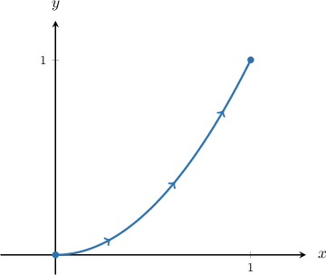

# Line Integrals of Scalar Functions Over Paths Expressed as Functions of X

Source: https://www.mathacademy.com/topics/2635?courseId=155
Topic ID: 2635

## Prerequisites

- [Line Integrals of Scalar Functions](./2107-line-integrals-of-scalar-functions.md)

## Lesson

### Introduction

To calculate the line integral of a function $f(x,y)$ along a curve $C,$ we use the formula

$$

\int\limits_C f(x, y) \, \text{d}s = \int\limits_a^b f(\mathbf r(t)) \, \| \mathbf r'(t) \| \, \text{d}t.

$$

The curve $C$ must be parametrized by the vector function $\mathbf r(t)$ to apply this formula.

Now suppose we want to evaluate the line integral

$$

\displaystyle \int \limits_{C} \dfrac{y}{x} \,\textrm ds,

$$

where $C$ is the section of the curve $y = x^2$ between the points $(0,0)$ and $(1,1).$

To reduce the calculation of the line integral to a parametric case, we must first parametrize the curve.

Notice that the curve $C$ is of the form $y = y(x).$ Therefore, by setting $x=t,$ we have $y = y(t) = t^2.$ This gives the following parametrization for $C\mathbin{:}$

$$

\mathbf{r}(t) = \left\langle t, t^2 \right\rangle, \qquad 0 \le t \le 1.

$$

Computing $\| \mathbf{r}'(t) \|,$ we get

$$

\begin{aligned}‖𝐫^{′}(𝑡)‖ & =\sqrt{(𝑥^{′}(𝑡))^{2}+(𝑦^{′}(𝑡))^{2}} \\ & =\sqrt{1^{2}+(2𝑡)^{2}} \\ & =\sqrt{1+4𝑡^{2}}.\end{aligned}

$$

Also, using $x=t$ and $y=t^2,$ we have

$$

\begin{aligned}𝑓(𝐫(𝑡))=\frac{𝑦}{𝑥}=\frac{𝑡^{2}}{𝑡}=𝑡.\end{aligned}

$$

Therefore, we can express the line integral in terms of $t$ as follows:

$$

\begin{aligned}\underset{𝐶}{∫}\frac{𝑦}{𝑥}\,d𝑠 & =∫_{𝑏𝑎}𝑓(𝐫(𝑡))\,‖𝐫^{′}(𝑡)‖\,d𝑡 \\ & =∫_{10}𝑡\,\sqrt{1+4𝑡^{2}}\,d𝑡\end{aligned}

$$

### Example: Reducing the Line Integral of a Scalar Function Along a Curve to a Definite Integral

#### Question

Consider the line integral

$$

\displaystyle \int \limits_{C} \dfrac{y^2}{x} \,\textrm ds,

$$

where $C$ is the section of the curve $y = \dfrac{x^3}3$ between the points $(0,0)$ and $(3,9).$ Write the line integral in the form

$$

\displaystyle\int\limits_a^b f(\mathbf r(t)) \, \| \mathbf r'(t) \| \, \text{d}t.

$$

#### Explanation

Notice that the given curve is of the form $y=y(x).$ Therefore, by setting $x=t,$ we have $y = y(t) = \dfrac{t^3}{3}.$ This gives the following parametrization of the curve:

$$

\mathbf{r}(t) = \left\langle t, \dfrac{t^3}3 \right\rangle, \qquad 0 \le t \le 3,

$$

Computing $\mathbf{r}'(t)$ and $\| \mathbf{r}'(t) \|,$ we get the following:

$$

\begin{aligned}𝐫^{′}(𝑡) & =\frac{d𝑥}{d𝑡}\,𝐢+\frac{d𝑦}{d𝑡}\,𝐣 \\ & =\frac{d}{d𝑡}(𝑡)𝐢+\frac{d}{d𝑡}(\frac{𝑡^{3}}{3})𝐣 \\ & =𝐢+𝑡^{2}\,𝐣 \\ ‖𝐫^{′}(𝑡)‖ & =\sqrt{(\frac{d𝑥}{d𝑡})^{2}+(\frac{d𝑦}{d𝑡})^{2}} \\ & =\sqrt{1^{2}+(𝑡^{2})^{2}} \\ & =\sqrt{1+𝑡^{4}}\end{aligned}

$$

Now, since $f(x,y) = \dfrac{y^2}{x},$ we obtain

$$

\begin{aligned}𝑓(𝐫(𝑡)) & =\frac{(\frac{𝑡^{3}}{3})^{2}}{3}=\frac{1}{9}𝑡^{5}.\end{aligned}

$$

Therefore, we can write the integral as

$$

\begin{aligned}\underset{𝐶}{∫}𝑓(𝑥,𝑦)\,d𝑠 & =∫_{30}𝑓(𝐫(𝑡))\,‖𝐫^{′}(𝑡)‖\,d𝑡 \\ & =∫_{30}\frac{1}{9}𝑡^{5}⋅\sqrt{1+𝑡^{4}}⋅d𝑡 \\ & =\frac{1}{9}∫_{30}𝑡^{5}\sqrt{1+𝑡^{4}}\,d𝑡.\end{aligned}

$$

### Example: Computing a Line Integral of a Scalar Function Along a Curve Given in Explicit Cartesian Form

#### Question

Evaluate the integral $\displaystyle \int\limits_{C} \dfrac{y^3}{x^2} \, \text{d}s,$ where the curve $C$ is given by $y = x$ for $\, 0 \le x \le 4.$

#### Explanation

Notice that the given curve is of the form $y=y(x).$ Therefore, by setting $x=t,$ we have $y = y(t) = t.$ This gives the following parametrization of the curve:

$$

\mathbf{r}(t) = \left\langle t, \: t \right\rangle, \qquad 0 \le t \le 4

$$

Computing $\mathbf{r}'(t)$ and $\| \mathbf{r}'(t) \|,$ we get the following:

$$

\begin{aligned}𝐫^{′}(𝑡) & =\frac{d𝑥}{d𝑡}\,𝐢+\frac{d𝑦}{d𝑡}\,𝐣 \\ & =\frac{d}{d𝑡}(𝑡)𝐢+\frac{d}{d𝑡}(𝑡)𝐣 \\ & =𝐢+𝐣 \\ ‖𝐫^{′}(𝑡)‖ & =\sqrt{(\frac{d𝑥}{d𝑡})^{2}+(\frac{d𝑦}{d𝑡})^{2}} \\ & =\sqrt{1^{2}+1^{2}} \\ & =\sqrt{2}\end{aligned}

$$

Now, since $f(x,y) = \dfrac{y^3}{x^2}$, we obtain

$$

\begin{aligned}𝑓(𝐫(𝑡)) & =\frac{𝑡^{3}}{𝑡^{2}}=𝑡.\end{aligned}

$$

Therefore, we can write the integral as

$$

\begin{aligned}\underset{𝐶}{∫}\frac{𝑦^{3}}{𝑥^{2}}\,d𝑠 & =∫_{40}𝑓(𝐫(𝑡))\,‖𝐫^{′}(𝑡)‖\,d𝑡 \\ & =∫_{40}𝑡⋅\sqrt{2}⋅d𝑡 \\ & =\sqrt{2}∫_{40}𝑡\,d𝑡 \\ & =\frac{\sqrt{2}}{2}𝑡^{2}_{40} \\ & =\frac{\sqrt{2}}{2}(4^{2}−0^{2}) \\ & =8\sqrt{2}.\end{aligned}

$$
