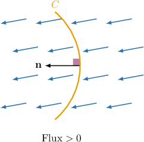
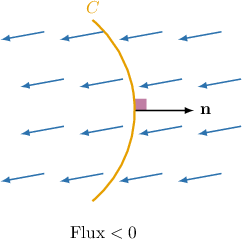
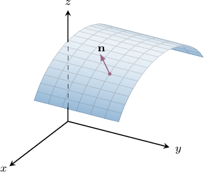
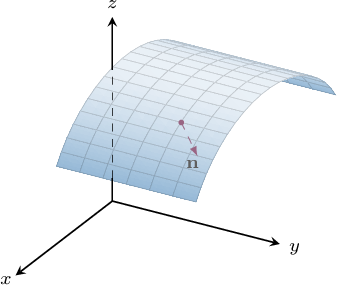
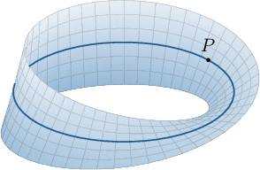
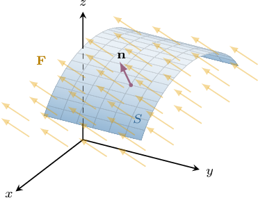

# Flux in Three-Dimensional Vector Fields

Source: https://www.mathacademy.com/topics/3178?courseId=155
Topic ID: 3178

## Prerequisites

- [Surface Integrals Over Cartesian Surfaces](./1264-surface-integrals-over-cartesian-surfaces.md)
- [Flux in Two-Dimensional Vector Fields](./3715-flux-in-two-dimensional-vector-fields.md)

## Lesson

### Introduction

Recall that the flux of a two-dimensional vector field $\mathbf F(x,y)$ across a curve $C$ with respect to a unit normal vector $\mathbf n(x,y)$ is given by the line integral

$$

\int\limits_C \mathbf F\cdot\mathbf n\,\textrm d s.

$$

The flux measures the total flow of $\mathbf F$ through $C,$ as depicted below.

Flux is always measured with respect to a preselected unit normal vector $\mathbf n,$ and we have two choices of orientation for this vector. If we measure the flux relative to the unit normal pointing in the *opposite* direction, our flux will have the *same* magnitude but *opposite* sign.

This lesson aims to extend the concept of flux to three-dimensional vector fields. But first, we need a brief discussion on surface orientations.

### Orientable vs. Non-Orientable Surfaces

A surface is **orientable** if it has two distinct sides. So, for example, the surface $S$ shown below is orientable.

If a unit vector $\mathbf n(x,y,z)$ to our orientable surface varies continuously over $S,$ we say that $S$ is **oriented** and the choice of $\mathbf n$ gives an **orientation** of $S.$

We can choose the opposite orientation for our surface by selecting a vector that points in the opposite direction, as shown below.

When dealing with two-sided (i.e., orientable) surfaces, we must always be clear about our chosen orientation.

Note that some surfaces are *not* orientable. This means they do not have two distinct sides. An example of a non-orientable surface is a Möbius strip, shown below.

A Möbius strip can be made by taking a long rectangular piece of paper, twisting one of its ends by $180^\circ$ and gluing the two ends together.

A Möbius strip does not have two distinct sides because if you were to start at a point $P$ on the strip and move along it (following the dark blue curve shown), you'd eventually end up at the same point but on the opposite side! Thus, a Möbius strip only has one distinct side.

In the work that follows, we will only consider orientable surfaces.

### Flux in Three-Dimensional Vector Fields

In three dimensions, flux measures the total flow of a vector field $\mathbf F(x,y,z)$ *through an orientable surface.*

Suppose that $\mathbf F(x,y,z)$ is a three-dimensional vector field, and $S$ is an orientable surface with the choice of orientation given by the unit normal vector $\mathbf n(x,y,z),$ as shown below.

The **flux of $\mathbf F$ across $\boldsymbol{S}$** with respect to $\mathbf n,$ which we write as

$$

\iint\limits_S \mathbf F \cdot \textrm d \mathbf S

$$

is given by the surface integral

$$

\iint\limits_S \mathbf F \cdot \mathbf n \,\textrm d S.

$$

It's worth taking a moment to compare this to the flux formula for two-dimensional vector fields:

- The quantity $\mathbf F \cdot \mathbf n$ evaluated at a point $P$ on $S$ measures the projection of $\mathbf F$ in the direction of $\mathbf n$ at $P.$

- By summing (integrating) the quantity $\mathbf F \cdot \mathbf n$ over the entire surface, we get the total flow of $\mathbf F$ through $S.$

Our flux depends on our choice of orientation. If we were to select the *opposite* orientation, we'd get a result with the same magnitude but opposite sign.

### A Worked Example

Consider the vector field $\mathbf F$ and the surface $S$ with unit normal vector $\mathbf n,$ where

$$

\mathbf{F}(x,y,z) = \left\langle xz + y,\: x^2,\: 2y-z^2 \right\rangle\!, \qquad \mathbf{n}(x,y,z) = \dfrac{1}{\sqrt5}\left\langle 2,\: 0,\: -1 \right\rangle\!.

$$

Let's construct a surface integral representing the flux of $\mathbf F$ across $S$ with respect to $\mathbf{n}.$

First, we recall that if $S$ is an oriented surface with unit normal vector $\mathbf n,$ and $\mathbf F$ is continuous vector field, then the flux of $\mathbf F$ across $S$ measured with respect to $\mathbf n$ is given by

$$

\iint\limits_S \mathbf{F} \cdot \textrm{d}\mathbf{S} = \iint\limits_S \mathbf{F} \cdot \mathbf{n} \,\textrm{d}S.

$$

Calculating the dot product, we have

$$

\begin{aligned}𝐅⋅𝐧 & =⟨𝑥𝑧+𝑦,\,𝑥^{2},\,2𝑦−𝑧^{2}⟩⋅\frac{1}{\sqrt{√5}}⟨2,\,0,\,−1⟩ \\ & =\frac{1}{\sqrt{√5}}⟨𝑥𝑧+𝑦,\,𝑥^{2},\,2𝑦−𝑧^{2}⟩⋅⟨2,\,0,\,−1⟩ \\ & =\frac{1}{\sqrt{√5}}((𝑥𝑧+𝑦)⋅2+𝑥^{2}⋅0+(2𝑦−𝑧^{2})⋅(−1)) \\ & =\frac{1}{\sqrt{√5}}(2𝑥𝑧+2𝑦−2𝑦+𝑧^{2}) \\ & =\frac{2𝑥𝑧+𝑧^{2}}{\sqrt{√5}}.\end{aligned}

$$

Therefore, the surface integral representing the flux of $\mathbf F$ across $S$ with respect to $\mathbf n$ can be written as follows:

$$

\begin{aligned}\underset{𝑆}{∬}𝐅⋅d𝐒 & =\underset{𝑆}{∬}𝐅⋅𝐧\,d𝑆 \\ & =\underset{𝑆}{∬}\frac{2𝑥𝑧+𝑧^{2}}{\sqrt{√5}}\,d𝑆 \\ & =\frac{1}{\sqrt{√5}}\underset{𝑆}{∬}2𝑥𝑧+𝑧^{2}\,d𝑆\end{aligned}

$$

We can then evaluate this integral using the usual methods.

### Example: Rewriting a Flux Integral as a Surface Integral

#### Question

Consider the vector field $\mathbf F$ and the surface $S$ with normal vector $\widetilde{\mathbf n},$ where

$$

\mathbf{F}(x,y,z) = \left\langle x,\: 2z,\: z-y \right\rangle\!, \quad \widetilde{\mathbf{n}}(x,y,z) = \left\langle z,\: -y,\: -x \right\rangle\!, \quad \mathbf n = \dfrac{\widetilde{\mathbf{n}}}{\Vert \widetilde{\mathbf{n}} \Vert}.

$$

If the flux of $\mathbf F$ across $S$ with respect to $\mathbf{n}$ is given by

$$

𝐴𝐴𝐴𝐴𝐴𝐴𝐴

$$

what is the missing expression?

#### Explanation

If $S$ is an oriented surface with unit normal vector $\mathbf n,$ and $\mathbf F$ is continuous vector field, then the flux of $\mathbf F$ across $S$ measured with respect to $\mathbf n$ is given by

$$

\iint\limits_S \mathbf{F} \cdot \textrm{d}\mathbf{S} = \iint\limits_S \mathbf{F} \cdot \mathbf{n} \,\textrm{d}S.

$$

To compute the above dot product, we must normalize the vector $\widetilde{\mathbf n}.$ By doing this, we get

$$

\begin{aligned}𝐧 & =\frac{\overset{𝐧}{˜}}{‖\overset{𝐧}{˜}‖} \\ & =\frac{⟨𝑧,\,−𝑦,\,−𝑥⟩}{\sqrt{√(𝑧)^{2}+(−𝑦)^{2}+(−𝑥)^{2}}} \\ & =\frac{⟨𝑧,\,−𝑦,\,−𝑥⟩}{\sqrt{√𝑧^{2}+𝑦^{2}+𝑥^{2}}} \\ & =\frac{⟨𝑧,\,−𝑦,\,−𝑥⟩}{\sqrt{√𝑥^{2}+𝑦^{2}+𝑧^{2}}}.\end{aligned}

$$

Calculating the dot product, we have

$$

\begin{aligned}𝐅⋅𝐧 & =⟨𝑥,\,2𝑧,\,𝑧−𝑦⟩⋅\frac{⟨𝑧,\,−𝑦,\,−𝑥⟩}{\sqrt{√𝑥^{2}+𝑦^{2}+𝑧^{2}}} \\ & =\frac{⟨𝑥,\,2𝑧,\,𝑧−𝑦⟩⋅⟨𝑧,\,−𝑦,\,−𝑥⟩}{\sqrt{√𝑥^{2}+𝑦^{2}+𝑧^{2}}} \\ & =\frac{𝑥𝑧−2𝑦𝑧−𝑥(𝑧−𝑦)}{\sqrt{√𝑥^{2}+𝑦^{2}+𝑧^{2}}} \\ & =\frac{𝑥𝑦−2𝑦𝑧}{\sqrt{√𝑥^{2}+𝑦^{2}+𝑧^{2}}}.\end{aligned}

$$

Therefore, the flux can be written as

$$

\begin{aligned}\underset{𝑆}{∬}𝐅⋅d𝐒 & =\underset{𝑆}{∬}𝐅⋅𝐧\,d𝑆 \\ & =\underset{𝑆}{∬}\,\frac{𝑥𝑦−2𝑦𝑧}{\sqrt{√𝑥^{2}+𝑦^{2}+𝑧^{2}}}\,d𝑆.\end{aligned}

$$

### The Fundamental Vector Product for a Horizontal Plane

Suppose we have the horizontal plane $z=k,$ where $k$ is a fixed parameter.

The magnitude of the fundamental vector product is given by

$$

\begin{aligned}||𝐫_{𝑥}×𝐫_{𝑦}|| & =\sqrt{√1+(\frac{𝜕𝑧}{𝜕𝑥})^{2}+(\frac{𝜕𝑧}{𝜕𝑦})^{2}} \\ & =\sqrt{√1+(\frac{𝜕𝑘}{𝜕𝑥})^{2}+(\frac{𝜕𝑘}{𝜕𝑦})^{2}} \\ & =\sqrt{√1+0^{2}+0^{2}} \\ & =\sqrt{√1} \\ & =1.\end{aligned}

$$

Therefore, in such cases, we can write

$$

\begin{aligned}\underset{𝑆}{∬}\,𝑓(𝑥,𝑦,𝑧)d𝑆\, & =\underset{𝐷}{∬}𝑓(𝑥,𝑦,𝑧)⋅||𝐫_{𝑥}×𝐫_{𝑦}||\,d𝐴 \\ & =\underset{𝐷}{∬}𝑓(𝑥,𝑦,𝑧)⋅1\,d𝐴 \\ & =\underset{𝐷}{∬}𝑓(𝑥,𝑦,𝑧)\,d𝐴.\end{aligned}

$$

Restating, we have

$$

\iint\limits_S f(x,y,z)\, \textrm d S = \iint\limits_D f(x,y,z) \,\textrm d A.

$$

We arrive at a similar result when considering vertical planes parallel to the $xz$- or $yz$-axes.

This observation can help provide a shortcut when calculating the flux of a vector field through a horizontal plane. Let's see an example.

### Example: Computing the Flux of a Vector Field Through a Horizontal Plane

#### Question

Consider the vector field $\mathbf F(x,y,z) = \langle z,\: z,\: 4xy\rangle$ and the surface $S$ defined in Cartesian coordinates as $z=1$ for $0\leq x\leq 1$ and $0\leq y\leq 1.$ Calculate the flux of $\mathbf F$ through $S$ with respect to the **-pointing unit normal vector $\mathbf n.$

#### Explanation

If $S$ is an oriented surface with unit normal vector $\mathbf n,$ and $\mathbf F$ is continuous vector field, then the flux of $\mathbf F$ across $S$ measured with respect to $\mathbf n$ is given by

$$

\iint\limits_S \mathbf{F} \cdot \textrm{d}\mathbf{S} = \iint\limits_S \mathbf{F} \cdot \mathbf{n} \,\textrm{d}S.

$$

For the surface $z=1$ for $0\leq x\leq 1$ and $0\leq y\leq 1,$ the downward-pointing unit normal vector is

$$

\mathbf n = \langle 0,\, 0,\, -1\rangle.

$$

Using the fact that $z=1$ on $S,$ we have

$$

\begin{aligned}𝐅⋅𝐧 & =⟨𝑧,\,𝑧,\,4𝑥𝑦⟩⋅⟨0,\,0,\,−1⟩ \\ & =⟨1,\,1,\,4𝑥𝑦⟩⋅⟨0,\,0,\,−1⟩ \\ & =−4𝑥𝑦.\end{aligned}

$$

Therefore, we can calculate the flux of $\mathbf F$ across $S$ as follows:

$$

\begin{aligned}\underset{𝑆}{∬}𝐅⋅d𝐒 & =\underset{𝑆}{∬}𝐅⋅𝐧\,d𝑆 \\ & =\underset{𝑆}{∬}(−4𝑥𝑦)\,d𝑆 \\ & =\underset{𝐷}{∬}(−4𝑥𝑦)\,d𝐴 \\ & =∫_{10}^{}∫_{10}^{}(−4𝑥𝑦)\,d𝑥\,d𝑦 \\ & =−∫_{10}^{}2𝑦\,d𝑦∫_{10}^{}2𝑥\,d𝑥 \\ & =−[𝑦^{2}]_{10}^{}⋅[𝑥^{2}]_{10}^{} \\ & =−1\end{aligned}

$$

### Computing the Flux of a Vector Field Through a Tilted Plane

If we wish to find the flux through a tilted plane, we should first calculate the unit normal vector to this plane.

For example, consider the vector field $\mathbf F(x,y,z) = \langle x,\: 1-x+y,\: 2y+8\rangle$ and a finite region $S$ of the plane $z=2x+2y-1$ such that $\textrm{Area}(S) = 2.$ Assume that we need to find the flux of $\mathbf F$ through $S$ with respect to the upward-pointing unit normal vector $\mathbf n.$

If $S$ is an oriented surface with unit normal vector $\mathbf n,$ and $\mathbf F$ is a continuous vector field, then the flux of $\mathbf F$ across $S$ measured with respect to $\mathbf n$ is given by

$$

\iint\limits_S \mathbf{F} \cdot \textrm{d}\mathbf{S} = \iint\limits_S \mathbf{F} \cdot \mathbf{n} \,\textrm{d}S.

$$

Notice that our surface $z = 2x+2y-1$ can be written using the dot product as

$$

\langle x,\: y,\: z\rangle \cdot \underbrace{\langle -2,\: -2, \: 1\rangle}_{\widetilde{\mathbf n}} = -1, \quad \textrm{or}\quad \langle x,\: y,\: z\rangle \cdot \underbrace{\langle 2,\: 2, \: -1\rangle}_{-\widetilde{\mathbf n}}= 1.

$$

Since we require an upward-pointing normal vector to our surface $S,$ we must select one where the $z$-component is positive. This gives us the normal vector

$$

\widetilde{\mathbf n} = \langle -2,\, -2,\, 1\rangle.

$$

Normalizing this vector, we get

$$

\begin{aligned}𝐧 & =\frac{\overset{𝐧}{˜}}{‖\overset{𝐧}{˜}‖} \\ & =\frac{⟨−2,\,−2,\,1⟩}{\sqrt{√(−2)^{2}+(−2)^{2}+1^{2}}} \\ & =\frac{1}{3}⟨−2,\,−2,\,1⟩.\end{aligned}

$$

Now, we have

$$

\begin{aligned}𝐅⋅𝐧 & =⟨𝑥,\,1−𝑥+𝑦,\,2𝑦+8⟩⋅\frac{1}{3}⟨−2,\,−2,\,1⟩ \\ & =\frac{1}{3}⟨𝑥,\,1−𝑥+𝑦,\,2𝑦+8⟩⋅⟨−2,\,−2,\,1⟩ \\ & =\frac{1}{3}(−2𝑥−2(1−𝑥+𝑦)+2𝑦+8) \\ & =\frac{1}{3}(−2𝑥−2+2𝑥−2𝑦+2𝑦+8) \\ & =\frac{6}{3} \\ & =2.\end{aligned}

$$

Therefore, we can calculate the flux of $\mathbf F$ across $S$ as follows:

$$

\begin{aligned}\underset{𝑆}{∬}𝐅⋅d𝐒 & =\underset{𝑆}{∬}𝐅⋅𝐧\,d𝑆 \\ & =\underset{𝑆}{∬}2\,d𝑆 \\ & =2\underset{𝑆}{∬}\,d𝑆 \\ & =2⋅Area(𝑆) \\ & =2⋅2 \\ & =4.\end{aligned}

$$

### Example: Computing the Flux of a Vector Field Through a Tilted Plane

#### Question

Consider the vector field $\mathbf F(x,y,z) = \langle y,\: 0,\: z\rangle$ and the surface $S$ defined in Cartesian coordinates as $z=2x+2y$ for $0\leq x\leq 2$ and $0\leq y\leq 1.$ Calculate the flux of $\mathbf F$ through $S$ with respect to the upward-pointing unit normal vector $\mathbf n.$

**

#### Explanation

If $S$ is an oriented surface with unit normal vector $\mathbf n,$ and $\mathbf F$ is continuous vector field, then the flux of $\mathbf F$ across $S$ measured with respect to $\mathbf n$ is given by

$$

\iint\limits_S \mathbf{F} \cdot \textrm{d}\mathbf{S} = \iint\limits_S \mathbf{F} \cdot \mathbf{n} \,\textrm{d}S.

$$

Notice that our surface $z = 2x+2y$ can be written using the dot product as

$$

\langle x,\: y,\: z\rangle \cdot \underbrace{\langle -2,\: -2, \: 1\rangle}_{\widetilde{\mathbf n}} = 0, \quad \textrm{or}\quad \langle x,\: y,\: z\rangle \cdot \underbrace{\langle 2,\: 2, \: -1\rangle}_{-\widetilde{\mathbf n}}= 0.

$$

Since we require an upward-pointing normal vector to our surface $S,$ we must select one where the $z$-component is positive. This gives us the normal vector

$$

\widetilde{\mathbf n} = \langle -2,\, -2,\, 1\rangle.

$$

Normalizing this vector, we get

$$

\begin{aligned}𝐧 & =\frac{\overset{𝐧}{˜}}{‖\overset{𝐧}{˜}‖} \\ & =\frac{⟨−2,\,−2,\,1⟩}{\sqrt{√(−2)^{2}+(−2)^{2}+1^{2}}} \\ & =\frac{1}{3}⟨−2,\,−2,\,1⟩.\end{aligned}

$$

Using the fact that $z=2x+2y$ on $S,$ we have

$$

\begin{aligned}𝐅⋅𝐧 & =⟨𝑦,\,0,\,𝑧⟩⋅\frac{1}{3}⟨−2,\,−2,\,1⟩ \\ & =\frac{1}{3}⟨𝑦,\,0,\,2𝑥+2𝑦⟩⋅⟨−2,\,−2,\,1⟩ \\ & =\frac{1}{3}(−2𝑦+0𝑥+2𝑥+2𝑦) \\ & =\frac{1}{3}(2𝑥) \\ & =\frac{2}{3}𝑥.\end{aligned}

$$

Therefore, we can calculate the flux of $\mathbf F$ across $S$ as follows:

$$

\begin{aligned}\underset{𝑆}{∬}𝐅⋅d𝐒 & =\underset{𝑆}{∬}𝐅⋅𝐧\,d𝑆 \\ & =\underset{𝑆}{∬}\frac{2}{3}𝑥\,d𝑆 \\ & =\underset{𝐷}{∬}\frac{2}{3}𝑥⋅||𝐫_{𝑥}×𝐫_{𝑦}||\,d𝐴 \\ & =\underset{𝐷}{∬}\frac{2}{3}𝑥⋅3\,d𝐴 \\ & =\underset{𝐷}{∬}\frac{2}{3}𝑥⋅3\,d𝐴 \\ & =\underset{𝐷}{∬}2𝑥\,d𝐴 \\ & =∫_{10}^{}∫_{20}^{}2𝑥\,d𝑥\,d𝑦 \\ & =∫_{10}^{}\,d𝑦⋅∫_{20}^{}2𝑥\,d𝑥 \\ & =[𝑦]_{10}^{}⋅[𝑥^{2}]_{20}^{} \\ & =1⋅4 \\ & =4\end{aligned}

$$
