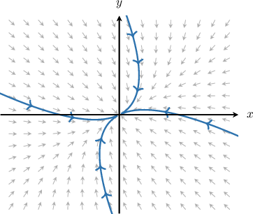
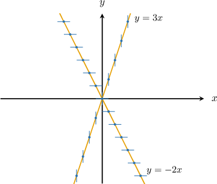
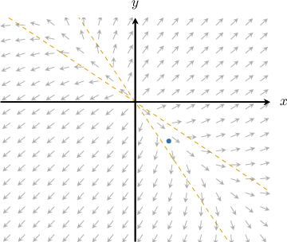
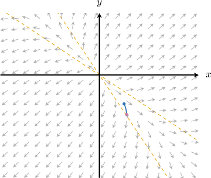
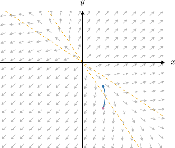
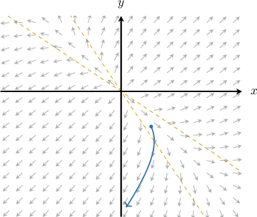

# Phase Planes and Phase Portraits

Source: https://www.mathacademy.com/topics/3188?courseId=155
Topic ID: 3188

## Prerequisites

- [Tangent Vectors and Tangent Lines to Curves](../mathematical-methods-for-the-physical-sciences-i/1792-tangent-vectors-and-tangent-lines-to-curves.md)
- [Solving Homogeneous Systems of ODEs With Distinct Eigenvalues and Initial Conditions](./2088-solving-homogeneous-systems-of-odes-with-distinct-eigenvalues-and-initial-conditions.md)
- [Visualizing Vector Fields](../mathematical-methods-for-the-physical-sciences-i/3344-visualizing-vector-fields.md)

## Lesson

### Introduction

Consider a system of two differential equations

$$

\mathbf{x}'(t) = \boldsymbol{f}(x(t),y(t))

$$

where $[\begin{aligned}𝑥(𝑡) \\ 𝑦(𝑡)\end{aligned}]$ and $[\begin{aligned}𝑓_{1}(𝑥(𝑡),𝑦(𝑡)) \\ 𝑓_{2}(𝑥(𝑡),𝑦(𝑡))\end{aligned}]$ is a vector-valued function of $x(t)$ and $y(t).$

In this context, the $xy$-coordinate plane is called the **phase plane** (or **phase space**) of the system. At each time $t,$ the solution has a position

$$

[\begin{aligned}𝑥(𝑡) \\ 𝑦(𝑡)\end{aligned}]

$$

which we view as a point $(x(t),y(t))$ in the phase plane. Now, as $t$ changes, the point $\mathbf{x}(t)$ moves and traces out a curve in the phase plane. This curve is called the **trajectory** (or **orbit**) of the solution.

For instance, consider the following (linear) system:

$$

\begin{aligned}𝑥^{′}=−4𝑥(𝑡)+2𝑦(𝑡) \\ 𝑦^{′}=𝑥(𝑡)−5𝑦(𝑡)\end{aligned}

$$

A few trajectories (particular solutions) of the system are shown below.

Notice that the derivative $\mathbf{x}'(t)$ can be interpreted as the *tangent vector* to the trajectory at the point $\mathbf{x}(t).$ In the diagram above, the (normalized) tangents to the trajectories are shown as small gray vectors.

At each point in the phase plane, the system assigns a unique tangent vector. Taken together, these tangent vectors form the system’s **vector field**.

In our example above, suppose a trajectory (solution) passes through the point $(x,y)=(1,-2).$ Then, substituting the coordinates of this point into the equations of our system, we obtain the following:

$$

\begin{aligned}𝑥^{′} & =−4𝑥+2𝑦 \\ & =−4(1)+2(−2) \\ & =−8 \\ 𝑦^{′} & =𝑥−5𝑦 \\ & =(1)−5(−2) \\ & =11\end{aligned}

$$

Therefore, the tangent vector to the trajectory at $(x,y)=(1,-2)$ is

$$

[\begin{aligned}𝑥^{′} \\ 𝑦^{′}\end{aligned}]

$$

Let's see some more examples.

### Example: Finding a Tangent to a Trajectory Given an Initial Value Problem

#### Question

$$

[\begin{aligned}2 & 1 \\ 1 & 2\end{aligned}]

$$

Consider the initial value problem and its solution given above. What is the tangent vector to the solution curve at the point corresponding to $t=\ln 2?$

#### Explanation

Recall that the $xy$-coordinate plane is called the ** of the system. A particular solution of an initial value problem is called a ** (or **).

First, we compute the point that corresponds to $t=\ln 2$ on the given trajectory:

$$

\begin{aligned}𝐱(ln⁡2) & =𝑒^{3(ln⁡2)}[\begin{aligned}1 \\ 1\end{aligned}]+2𝑒^{ln⁡2}[\begin{aligned}1 \\ −1\end{aligned}] \\ & =8[\begin{aligned}1 \\ 1\end{aligned}]+2⋅2[\begin{aligned}1 \\ −1\end{aligned}] \\ & =8[\begin{aligned}1 \\ 1\end{aligned}]+4[\begin{aligned}1 \\ −1\end{aligned}] \\ & =[\begin{aligned}8 \\ 8\end{aligned}]+[\begin{aligned}4 \\ −4\end{aligned}] \\ & =[\begin{aligned}12 \\ 4\end{aligned}]\end{aligned}

$$

Substituting this into the equation of our system, we obtain the tangent vector to the trajectory.

$$

\begin{aligned}𝐱^{′}(ln⁡2) & =[\begin{aligned}2 & 1 \\ 1 & 2\end{aligned}][\begin{aligned}12 \\ 4\end{aligned}] \\ & =[\begin{aligned}2(12)+1(4) \\ 1(12)+2(4)\end{aligned}] \\ & =[\begin{aligned}24+4 \\ 12+8\end{aligned}] \\ & =[\begin{aligned}28 \\ 20\end{aligned}]\end{aligned}

$$

### Nullclines

Again, consider an autonomous system

$$

\begin{aligned}𝑥^{′}(𝑡)=𝑓(𝑥(𝑡),𝑦(𝑡)) \\ 𝑦^{′}(𝑡)=𝑔(𝑥(𝑡),𝑦(𝑡))\end{aligned}

$$

for which at a point $(x,y)$ in the phase plane, the tangent vector is

$$

[\begin{aligned}𝑥^{′} \\ 𝑦^{′}\end{aligned}]

$$

We can now define two special sets of points in the phase space:

- The **$x$-nullcline** is the set of points where $x'=0,$ i.e. On the $x$-nullcline, the tangent vector has the form $[\begin{aligned}0 \\ 𝑦^{′}\end{aligned}]$ so the tangents to trajectories are *vertical*.

- The **$y$-nullcline** is the set of points where $y'=0,$ i.e. On the $y$-nullcline, the tangent vector has the form $[\begin{aligned}𝑥^{′} \\ 0\end{aligned}]$ so the tangents to trajectories are *horizontal*.

For example, in the linear case, if the system is given as

$$

\begin{aligned}𝑥^{′}=𝑎𝑥(𝑡)+𝑏𝑦(𝑡) \\ 𝑦^{′}=𝑐𝑥(𝑡)+𝑑𝑦(𝑡)\end{aligned}

$$

then the nullclines are the straight lines with equations

$$

ax+by=0 \qquad\text{and}\qquad cx+dy=0.

$$

Let's see some concrete examples.

### Example: Finding Nullclines of a System of Differential Equation

#### Question

$$

\begin{aligned}𝑥^{′}(𝑡)=3𝑥(𝑡)−𝑦(𝑡) \\ 𝑦^{′}(𝑡)=−2𝑥(𝑡)−𝑦(𝑡)\end{aligned}

$$

Consider the system of linear differential equations above. Find equations of the $x$- and $y$-nullclines for the corresponding phase space.

#### Explanation

Recall that:

- The $x$-nullcline is a line for which $x' = 0$ (i.e., the tangents to trajectories are vertical). So, to find it, we set the first equation of the system equal to $0{:}$

- The $y$-nullcline is a line for which $y' = 0$ (i.e., the tangents to trajectories are horizontal). So, to find it, we set the second equation of the system equal to $0{:}$

Plotting these in the phase space, we obtain the following:

### Sketching Trajectories

A **phase portrait** is a diagram that shows the trajectories of a system along with their tangent directions.

Phase portraits are usually generated with software. However, for simple linear systems, we can often sketch them by hand using the procedure below.

1. Start at a point $(x_0,y_0).$

2. Draw a short line segment in the direction indicated by the direction field at that point. To determine the direction, we can use the vector field (if given) or compute the tangent vector at $(x_0,y_0),$ as we did earlier.

3. Move a small step in the direction we just drew.

Repeat Steps 2 and 3, taking small steps and adjusting the direction each time to match the direction field at the new point.

As we sketch, we can use *nullclines* to help determine where the trajectories must turn:

- On the $x$-nullcline (where $x'=0$), the trajectory is vertical.

- On the $y$-nullcline (where $y'=0$), the trajectory is horizontal.

Finally, remember that trajectories do not form sharp corners: they bend smoothly as the tangent direction changes.

Let's see an example.

### Example: Identifying a Trajectory Given a Starting Point and the Vector Field

#### Question

A sketch of the phase space with nullclines and the corresponding direction field of tangents to the solutions of a system of differential equations is shown below (the tangents are not drawn to scale). Sketch the trajectory of the solution starting at the marked point.

#### Explanation

Let's sketch the trajectory.

- We start at the given point, moving along with the flow (downward and slightly to the right) until the trajectory intersects the $x$-nullcline, where the tangents are vertical.

- Next, the flow continues downward, but the trajectory starts to turn slightly to the left.

- After that, the trajectory continues to go downwards and slightly to the left to infinity.

