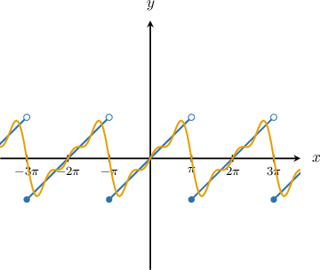
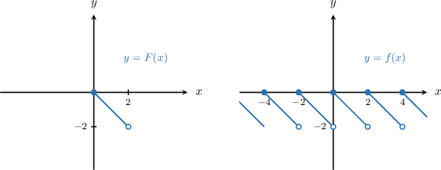
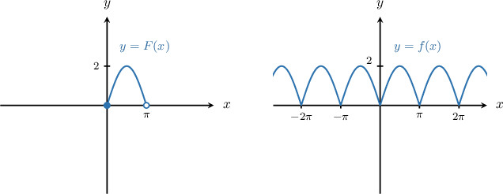

# Introduction to Fourier Series

Source: https://www.mathacademy.com/topics/3195?courseId=155
Topic ID: 3195

## Prerequisites

- [The Inner Product in Vector Spaces Over the Complex Numbers](./2097-the-inner-product-in-vector-spaces-over-the-complex-numbers.md)
- [Orthogonal Vectors in Inner Product Spaces](./2100-orthogonal-vectors-in-inner-product-spaces.md)
- [Projecting Vectors Onto Subspaces in Inner Product Spaces](./2126-projecting-vectors-onto-subspaces-in-inner-product-spaces.md)
- [Integrating Products of Trigonometric Functions](../calculus-ii/3224-integrating-products-of-trigonometric-functions.md)

## Lesson

### Introduction

In this lesson, we will represent a $2\pi$-periodic function $f(x)$ as an infinite sum of simple sine and cosine waves. This representation is called the **Fourier series** for $f(x)$:

$$

f(x)\sim \frac{a_0}{2}+\sum_{n=1}^{\infty}\big(a_n\cos(nx)+b_n\sin(nx)\big)

$$

The key idea is that we can "build" a complicated periodic graph by adding together basic waves. For example, below we have a discontinuous periodic function approximated by the first few terms of its Fourier series.

This gives us a powerful way to analyze periodic behavior by breaking it down into simple oscillations. Fourier series play a central role in modeling vibrations, signals, and other repeating patterns.

To work with Fourier series, we typically start with a function defined on a single base interval, such as $[-\pi,\pi),$ and then extend it to be periodic over all real numbers. This process creates what is called a **periodic extension**.

In the next slide, we will define this concept formally and look at some examples.

### Periodic Extensions

Recall that a function $f(x)$ is *$p$-periodic* if $f(x+p)=f(x)$ for all $x\in\mathbb{R}.$

Now, if $F(x)$ is defined on an interval $x \in [a,b)$ of length $p,$ then its **$p$-periodic extension** $f$ is defined by the two properties:

- $f(x+p)=f(x)$ for all $x \in \mathbb{R}$

- $f(x)=F(x)$ for all $x \in [a,b).$

For example, let $F(x) = -x$ be defined on $x\in [0,2).$ Now, suppose $f(x)$ is the $2$-periodic extension of $F(x)$ from $x\in [0,2)$ to $x \in \mathbb{R}.$ The graphs of $y=F(x)$ and $y=f(x)$ are shown below.

**Watch out!** We should always be aware of the difference between $F(x)$ and its extension $f(x).$ For instance, consider the function $F(x)=2\sin(x)$ defined on $x \in [0,\pi)$ and its $\pi$-periodic extension $f(x).$ The graphs of $y=F(x)$ and $y=f(x)$ are shown below.

Notice that $f(x)$ is not just $2\sin(x)!$ But it would coincide with $2\sin(x)$ if we were to consider the $2\pi$-periodic extension of $F(x)=2\sin(x)$ from, say, $x \in [0,2\pi]$ to $x \in \mathbb{R}.$

### Example: Understanding the Periodic Extension of a Function

#### Question

Let $F(x) = \cos(2x)$ for $x\in\mathbb R.$ Suppose $f(x)$ is the $\pi$-periodic extension of $F(x)$ from $x \in [0,\pi)$ to $x \in \mathbb{R}.$ Which of the following statements are true?

1. $f(x+\pi) = f(x)$ for all $x \in \mathbb{R}$

2. $f(x) = F(x)$ for all $x \in \mathbb{R}$

3. $f\left(x+\dfrac{\pi}{2}\right) = f(x)$ for all $x \in \mathbb{R}$

#### Explanation

Since $f$ is the $\pi$-periodic extension of $F,$ we have

- $f(x+\pi)=f(x)$ for all $x\in\mathbb{R},$ and

- $f(x)=F(x)$ for all $x\in[0,\pi).$

With that in mind, we examine each statement in turn.

- Statement I is true. This is exactly the definition of $\pi$-periodicity: for all $x\in\mathbb{R}.$

- Statement II is true. Notice that $F$ itself is $\pi$-periodic, because for any $x\in\mathbb{R},$ we have Since $F$ already satisfies the periodicity rule, the $\pi$-periodic extension agrees with $F$ everywhere, so $f(x)=F(x)$ for all $x\in\mathbb{R}.$

- Statement III is false. For example, take $x=0.$ Then,

$$

\begin{aligned}𝑓(𝑥+\frac{𝜋}{2})=𝑓(\frac{𝜋}{2})=𝐹(\frac{𝜋}{2})=cos⁡(𝜋)=−1,\end{aligned}

$$

while

$$

\begin{aligned}𝑓(𝑥)=𝑓(0)=𝐹(0)cos⁡(0)=1.\end{aligned}

$$

Hence, $f\left(x+\dfrac{\pi}{2}\right) \neq f(x)$ for $x=0.$

Therefore, the correct answer is "I and II only".

### Reminder: Orthogonal Functions

Recall that we can define an inner product on functions over $[-\pi,\pi)$ given by

$$

\langle f(x), g(x)\rangle=\int_{-\pi}^{\pi} f(x)g(x)\,\text{d}x.

$$

Also recall that functions $f$ and $g$ are called *orthogonal* (with respect to this inner product) if $\langle f(x), g(x)\rangle=0.$

The key fact we will use throughout this lesson is that the functions

$$

1,\ \cos(x),\ \sin(x),\ \cos(2x),\ \sin(2x),\ \ldots

$$

are orthogonal with respect to the inner product defined above.

More precisely, for integers $m,n\ge 1,$ we have the following orthogonality relations on $[-\pi,\pi)$:

- $\langle \cos(mx),\cos(nx)\rangle=0$ if $m\ne n,$

- $\langle \sin(mx),\sin(nx)\rangle=0$ if $m\ne n,$ and

- $\langle \sin(mx),\cos(nx)\rangle=0$ for all $m,n.$

Also, the constant function $1$ is orthogonal to every sine and cosine:

- $\langle 1,\cos(nx)\rangle=0,$ and

- $\langle 1,\sin(nx)\rangle=0$ for all $n\ge 1.$

Finally, we will also use the squared norms of these functions:

$$

\langle 1,1\rangle=2\pi, \quad \langle \cos(nx),\cos(nx)\rangle=\langle \sin(nx),\sin(nx)\rangle=\pi \quad \text{for all } n\ge 1.

$$

Let's see how this works in concrete examples.

**Note:** Both intervals $[-\pi,\pi)$ and $[0,2\pi)$ are considered standard in this context. We’ll use $[-\pi,\pi)$ in tutorials, but some exercises use $[0,2\pi).$

### Example: Checking Orthogonality of Sines and Cosines

#### Question

$$

\langle f(x),g(x) \rangle = \displaystyle\int_{0}^{2\pi} f(x) g(x) \, \text{d}x

$$

Given the inner product on the set of continuous functions over $x\in [0,2\pi)$ defined above, compute $\displaystyle \langle \sin(6x), \cos(4x) \rangle$ and determine if functions $f(x)=\sin(6x)$ and $g(x)=\cos(4x)$ are orthogonal with respect to the inner product.

#### Explanation

We begin by using the product-to-sum identity

$$

\sin(6x)\cos(4x) =\dfrac{1}{2}\big(\sin(10x)+\sin(2x)\big).

$$

Substituting this into the integral gives

$$

\begin{aligned}⟨sin⁡(6𝑥),cos⁡(4𝑥)⟩ & =∫_{2𝜋0}sin⁡(6𝑥)cos⁡(4𝑥)\,d𝑥 \\ & =∫_{2𝜋0}\frac{1}{2}sin⁡(10𝑥)+\frac{1}{2}sin⁡(2𝑥)\,d𝑥 \\ & =[−\frac{1}{20}cos⁡(10𝑥)−\frac{1}{4}cos⁡(2𝑥)]_{2𝜋0} \\ & =−\frac{1}{20}(cos⁡(20𝜋)−cos⁡(0))−\frac{1}{4}(cos⁡(4𝜋)−cos⁡(0)) \\ & =−\frac{1}{20}(1−1)−\frac{1}{4}(1−1) \\ & =0.\end{aligned}

$$

Therefore, $f(x)=\sin(6x)$ and $g(x)=\cos(4x)$ $\text{are orthogonal}$ with respect to the inner product.

### Fourier Series Form For 2pi-Periodic Functions

Recall that we are considering a $2\pi$-periodic function $f(x)$ that is piecewise continuous on $[-\pi,\pi).$ We can represent $f(x)$ by its Fourier series:

$$

f(x)\sim \dfrac{a_0}{2}+\sum_{n=1}^{\infty}\big(a_n\cos(nx)+b_n\sin(nx)\big).

$$

Our goal is to find the formulas for the coefficients $a_0, a_n,$ and $b_n.$

To do this, we'll use a powerful idea from linear algebra. We define an *inner product* for functions on the interval $[-\pi,\pi)$ as

$$

\langle f(x), g(x)\rangle=\int_{-\pi}^{\pi} f(x)g(x)\,\text{d}x.

$$

With this inner product, the set of functions $\{1, \cos(nx), \sin(nx)\}$ for $n\ge 1$ is an *orthogonal set*.

This means we can think of the Fourier coefficients as *projections* of the function $f(x)$ onto each of these orthogonal "directions". The coefficients $a_0,a_n,b_n$ simply tell us "how much" of $f(x)$ lies in each of these directions.

On the next slide, we will use this idea to derive the formula for the first coefficient, $a_0.$

### The Formula For the Constant Term

Let's derive the formula for the coefficient $a_0$ by taking the inner product of the entire Fourier series

$$

f(x)\sim \dfrac{a_0}{2}+\sum_{n=1}^{\infty}\big(a_n\cos(nx)+b_n\sin(nx)\big)

$$

with the constant function $1.$

- **Step 1.** Start with the Fourier series and take the inner product of both sides with $1{:}$

- **Step 2.** Use the linearity of the inner product to distribute it across the sum:

- **Step 3.** Apply the orthogonality property. For any $n\ge 1,$ we have $\langle \cos(nx),1\rangle=0$ and $\langle \sin(nx),1\rangle=0.$ This makes all the terms in the sums equal to zero:

- **Step 4.** Solve for $a_0.$ We just need to calculate $\langle 1,1\rangle=\displaystyle\int_{-\pi}^{\pi} 1\cdot 1\,\text{d}x=2\pi.$

We find the formulas for $a_n$ and $b_n$ (for $n\ge 1$) in a similar way.

- To find $a_n,$ we take the inner product of the Fourier series with $\cos(nx).$ By orthogonality, the only term that is not zero on the right-hand side is the one involving $\langle \cos(nx),\cos(nx)\rangle.$ Since $\langle \cos(nx),\cos(nx)\rangle = \displaystyle\int_{-\pi}^{\pi}\cos^2(nx)\,\text{d}x = \pi,$ we can solve for $a_n{:}$

- Similarly, to find $b_n,$ we take the inner product with $\sin(nx){:}$

**Note:** If $f$ is the $2\pi$-periodic extension of a function $F$ defined on $[-\pi,\pi),$ then we can replace $f(x)$ with $F(x)$ inside the integrals.

Now that we have the formulas for all the coefficients, let's work through a concrete example.

### Example: Determining Expressions For Fourier Coefficients

#### Question

Let $F(x) = 2x^2+5$ for $x\in\mathbb R,$ and let $f(x)$ be the $2\pi$-periodic extension of $F$ from $x\in [0,2\pi)$ to $x\in \mathbb R.$ The Fourier series of $f$ is given by

$$

f(x) \sim \dfrac{a_0}{2} + \sum_{n=1}^\infty \left(a_n \cos(nx) + b_n \sin(nx)\right).

$$

Determine the integral expression for the coefficient $a_4.$

#### Explanation

The usual inner product of functions $f$ and $g$ over $x\in [0,2\pi)$ is given by

$$

\langle f(x),g(x) \rangle = \int_{0}^{2\pi} f(x)g(x)\,\text{d}x.

$$

For a $2\pi$-periodic function $f(x)$ that is piecewise continuous over $x\in [0,2\pi),$ the Fourier series of $f$ is given by

$$

f(x) \sim \dfrac{a_0}{2}+\sum_{n=1}^{\infty}\left( a_n\cos(nx)+b_n\sin(nx)\right),

$$

where $a_0,$ $a_n,$ and $b_n$ are constants to be determined.

Now, we find the inner product of $f(x)$ with $\cos(4x){:}$

$$

\begin{aligned}⟨𝑓(𝑥),cos⁡(4𝑥)⟩ & = \\ ⟨\frac{𝑎_{0}}{2}+\underset{\underset{𝑛=1}{∑}}{\overset{}{∞}}(𝑎_{𝑛}cos⁡(𝑛𝑥)+𝑏_{𝑛}sin⁡(𝑛𝑥)),cos⁡(4𝑥)⟩ & = \\ ⟨\frac{𝑎_{0}}{2},cos⁡(4𝑥)⟩+\underset{\underset{𝑛=1}{∑}}{\overset{}{∞}}⟨𝑎_{𝑛}cos⁡(𝑛𝑥),cos⁡(4𝑥)⟩+\underset{\underset{𝑛=1}{∑}}{\overset{}{∞}}⟨𝑏_{𝑛}sin⁡(𝑛𝑥),cos⁡(4𝑥)⟩ & = \\ \frac{𝑎_{0}}{2}⟨1,cos⁡(4𝑥)⟩+\underset{\underset{𝑛=1}{∑}}{\overset{}{∞}}𝑎_{𝑛}⟨cos⁡(𝑛𝑥),cos⁡(4𝑥)⟩+\underset{\underset{𝑛=1}{∑}}{\overset{}{∞}}𝑏_{𝑛}⟨sin⁡(𝑛𝑥),cos⁡(4𝑥)⟩ & \end{aligned}

$$

Since the functions $1, \sin(x), \cos(x), \sin(2x), \cos(2x), \ldots$ are orthogonal with respect to the defined inner product, the only nonzero term in the final expression above is

$$

a_4 \left\langle \cos(4x), \cos(4x) \right\rangle.

$$

Computing the inner product, we have

$$

\begin{aligned}⟨cos⁡(4𝑥),cos⁡(4𝑥)⟩ & =∫_{2𝜋0}cos^{2}⁡(4𝑥)\,d𝑥 \\ & =∫_{2𝜋0}\frac{1}{2}+\frac{1}{2}cos⁡(8𝑥)\,d𝑥 \\ & =[\frac{1}{2}𝑥+\frac{1}{16}sin⁡(8𝑥)]_{2𝜋0} \\ & =\frac{1}{2}(2𝜋−0)−\frac{1}{16}(sin⁡(16𝜋)−sin⁡(0)) \\ & =𝜋.\end{aligned}

$$

Finally, we obtain that

$$

\begin{aligned}⟨𝑓(𝑥),cos⁡(4𝑥)⟩ & =𝑎_{4}⟨cos⁡(4𝑥),cos⁡(4𝑥)⟩ \\ 𝑎_{4} & =\frac{⟨𝑓(𝑥),cos⁡(4𝑥)⟩}{⟨cos⁡(4𝑥),cos⁡(4𝑥)⟩} \\ 𝑎_{4} & =\frac{1}{𝜋}∫_{2𝜋0}𝑓(𝑥)cos⁡(4𝑥)\,d𝑥 \\ & =\frac{1}{𝜋}⋅∫_{2𝜋0}(2𝑥^{2}+5)cos⁡(4𝑥)\,d𝑥.\end{aligned}

$$

### Deriving the Formulas For the Fourier Coefficients

Once again, recall that we are considering a $2\pi$-periodic function $f(x)$ that is piecewise continuous on $[-\pi,\pi).$ We represent $f$ by its Fourier series

$$

f(x)\sim \dfrac{a_0}{2}+\sum_{n=1}^{\infty}\big(a_n\cos(nx)+b_n\sin(nx)\big).

$$

To determine the coefficients, we use the inner product on $[-\pi,\pi)$:

$$

\langle f(x), g(x)\rangle=\int_{-\pi}^{\pi} f(x)g(x)\,\text{d}x.

$$

We have already seen the derivation for the coefficient $a_0$ early in the lesson.

Now, we derive the formula for $a_n$ for $n\ge 1{:}$

- First, we take the inner product of both sides with $\cos(nx){:}$

- Using linearity, we get

- By orthogonality, $\langle 1,\cos(nx)\rangle=0,$ $\langle \sin(kx),\cos(nx)\rangle=0$ for all $k,$ and $\langle \cos(kx),\cos(nx)\rangle=0$ whenever $k\ne n,$ so Since $\displaystyle \langle \cos(nx),\cos(nx)\rangle=\int_{-\pi}^{\pi} \cos^2(nx)\,\text{d}x=\pi,$ we obtain

Finally, we derive the formula for $b_n$ for $n\ge 1{:}$

- First, we take the inner product of both sides with $\sin(nx){:}$

- Using linearity, we get

- By orthogonality, $\langle 1,\sin(nx)\rangle=0,$ $\langle \cos(kx),\sin(nx)\rangle=0$ for all $k,$ and $\langle \sin(kx),\sin(nx)\rangle=0$ whenever $k\ne n,$ so Since $\displaystyle \langle \sin(nx),\sin(nx)\rangle=\int_{-\pi}^{\pi} \sin^2(nx)\,\text{d}x=\pi,$ we obtain

Putting these together, the Fourier coefficients are the following:

$$

\begin{aligned}𝑎_{0} & =\frac{1}{𝜋}∫_{𝜋−𝜋}𝑓(𝑥)\,d𝑥 \\ 𝑎_{𝑛} & =\frac{1}{𝜋}∫_{𝜋−𝜋}𝑓(𝑥)cos⁡(𝑛𝑥)\,d𝑥,\,𝑛≥1 \\ 𝑏_{𝑛} & =\frac{1}{𝜋}∫_{𝜋−𝜋}𝑓(𝑥)sin⁡(𝑛𝑥)\,d𝑥,\,𝑛≥1\end{aligned}

$$
