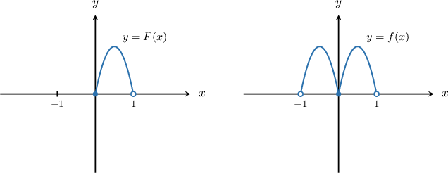

# Fourier Cosine Series

Source: https://www.mathacademy.com/topics/3197?courseId=155
Topic ID: 3197

## Prerequisites

- [Properties of Fourier Series](./6709-properties-of-fourier-series.md)

## Lesson

### Introduction

In the earlier topics, we saw that *symmetry* can force many Fourier coefficients to be zero automatically. In particular, if a $2\pi$-periodic function is *even*, then its Fourier series has *cosine terms only*.

A **Fourier cosine series** uses this idea when a function is initially given only on the half-interval $[0,\pi),$ but we want a full Fourier series on $[-\pi,\pi)$ (and then a $2\pi$-periodic extension to all real $x$).

To do this, we start with a function $F(x)$ on $[0,\pi)$ and define its **even extension** $f(x)$ to $(-\pi,\pi)$ by

$$

\begin{aligned}𝐹(𝑥), & 𝑥∈[0,𝜋), \\ 𝐹(−𝑥), & 𝑥∈(−𝜋,0).\end{aligned}

$$

For example, a function $F(x),$ defined on $x \in [0,1),$ and its even extension $f(x)$ to $x \in (-1,1)$ are shown below.

By construction, $f$ is an *even* function, meaning $f(-x)=f(x)$. Because $f$ is even, its Fourier series on $[-\pi,\pi)$ has *cosine terms only*:

$$

f(x)\sim \dfrac{a_0}{2}+\sum_{n=1}^{\infty} a_n\cos(nx)

$$

Since $f(x)$ is even and $\cos(nx)$ is even for any $n\ge 1,$ the product $f(x)\cos(nx)$ is even too. Therefore, the cosine coefficients can be computed using the *half-range formulas*:

$$

\begin{aligned}𝑎_{0} & =\frac{1}{𝜋}∫_{𝜋−𝜋}^{}𝑓(𝑥)\,d𝑥 \\ & =\frac{1}{𝜋}⋅2∫_{𝜋0}^{}𝑓(𝑥)\,d𝑥 \\ & =\frac{2}{𝜋}∫_{𝜋0}^{}𝑓(𝑥)\,d𝑥,\end{aligned}

$$

and for $n\ge 1,$

$$

\begin{aligned}𝑎_{𝑛} & =\frac{1}{𝜋}∫_{𝜋−𝜋}^{}𝑓(𝑥)cos⁡(𝑛𝑥)\,d𝑥 \\ & =\frac{1}{𝜋}⋅2∫_{𝜋0}^{}𝑓(𝑥)cos⁡(𝑛𝑥)\,d𝑥 \\ & =\frac{2}{𝜋}∫_{𝜋0}^{}𝑓(𝑥)cos⁡(𝑛𝑥)\,d𝑥.\end{aligned}

$$

So in practice, the workflow is the following:

1. Start with $F$ on $[0,\pi)$ and form the even extension $f$ on $(-\pi,\pi).$

2. Compute $a_0$ and $a_n$ from the half-range integrals on $[0,\pi).$

3. Write the Fourier cosine series of $f.$

Let's see some concrete examples.

### Example: Understanding the Even Extension of a Function

#### Question

Let $F(x)=x^3 - x + 5\cos x$ for $x\in[0,\pi),$ and let $f(x)$ be the **** extension of $F(x)$ to $x \in (-\pi,\pi).$ What is $f(x)$ for $x\in(-\pi,0)?$

#### Explanation

If $F(x)$ is defined on $x\in[0,\pi),$ the even extension of $F$ is the function $f$ such that

$$

\begin{aligned}𝐹(𝑥), & 𝑥∈[0,𝜋), \\ 𝐹(−𝑥), & 𝑥∈(−𝜋,0).\end{aligned}

$$

In our cases, for $x\in(-\pi,0),$ we get

$$

\begin{aligned}𝑓(𝑥) & =𝐹(−𝑥) \\ & =(−𝑥)^{3}−(−𝑥)+5cos⁡(−𝑥) \\ & =−𝑥^{3}+𝑥+5cos⁡𝑥.\end{aligned}

$$

### Example: Computing the Constant Term From the Half-Range Formula

#### Question

$$

f(x) \sim \dfrac{a_0}{2} + \sum_{n=1}^\infty a_n \cos(nx)

$$

Let $F(x)=\sin\left(\dfrac{3x}{4}\right)$ for $x\in[0,\pi).$ The Fourier cosine series of the **** $2\pi$-periodic extension $f(x)$ of $F(x)$ is shown above. Find the expression for $a_0.$

#### Explanation

For our Fourier cosine series, the constant term is given by

$$

a_0=\frac{2}{\pi}\int_0^\pi f(x)\,\text{d}x.

$$

In our case, $f(x)=\sin\left(\dfrac{3x}{4}\right)$ for $x \in (0,\pi).$ So, substituting into the formula, we get

$$

\begin{aligned}𝑎_{0} & =\frac{2}{𝜋}∫_{𝜋0}^{}sin⁡(\frac{3𝑥}{4})\,d𝑥 \\ & =\frac{2}{𝜋}[−\frac{4}{3}cos⁡(\frac{3𝑥}{4})]_{𝜋0}^{} \\ & =−\frac{8}{3𝜋}(cos⁡(\frac{3𝜋}{4})−cos⁡(0)) \\ & =−\frac{8}{3𝜋}(−\frac{\sqrt{√2}}{2}−1) \\ & =\frac{4}{3𝜋}(\sqrt{√2}+2).\end{aligned}

$$

### Example: Computing the Cosine Coefficients From the Half-Range Formula

#### Question

Let $F(x)=-6x-2$ for $x\in[0,\pi).$ Find the missing parts in the Fourier cosine series of the **** $2\pi$-periodic extension $f(x)$ of the function $F(x).$

$$

𝑋𝑋_{𝑋𝑋}^{}

$$

#### Explanation

For our Fourier cosine series, the coefficients are given by

$$

a_n=\frac{2}{\pi}\int_0^\pi f(x)\cos(nx)\,\text{d}x.

$$

In our case, $f(x)=-6x-2$ for $x \in (0,\pi).$ So, substituting into the formula, we get

$$

a_n = \dfrac{2}{\pi}\int_0^\pi (-6x-2) \cos(nx)\,\text{d}x.

$$

We use the integration by parts:

$$

\begin{aligned}𝑢=−6𝑥−2\, & ⇒\,𝑢^{′}=−6 \\ 𝑣^{′}=cos⁡(𝑛𝑥)\, & ⇒\,𝑣=\frac{1}{𝑛}sin⁡(𝑛𝑥)\end{aligned}

$$

Thus, we obtain

$$

\begin{aligned}𝑎_{𝑛} & =\frac{2}{𝜋}(𝑢𝑣\,_{𝜋0}^{}−∫_{𝜋0}^{}𝑣𝑢^{′}\,d𝑥) \\ & =\frac{2}{𝜋}(\frac{1}{𝑛}[(−6𝑥−2)sin⁡(𝑛𝑥)]_{𝜋0}^{}+\frac{6}{𝑛}∫_{𝜋0}^{}sin⁡(𝑛𝑥)\,d𝑥) \\ & =\frac{2}{𝑛𝜋}(((−6𝜋−2)sin⁡(𝑛𝜋)+2sin⁡(0))−\frac{6}{𝑛}[cos⁡(𝑛𝑥)]_{𝜋0}^{}) \\ & =\frac{2}{𝑛𝜋}(0−\frac{6}{𝑛}(cos⁡(𝑛𝜋)−cos⁡(0))) \\ & =\frac{12(1−cos⁡(𝑛𝜋))}{𝑛^{2}𝜋}.\end{aligned}

$$

Therefore, since $\cos(n\pi)=(-1)^n,$ we have

$$

a_n = \dfrac{12(1-(-1)^n)}{\pi n^2}.

$$

Finally, the Fourier cosine series is

$$

f(x) \sim (-2-3\pi) + \sum_{n=1}^\infty \boxed{\dfrac{12(1-(-1)^n)}{\pi n^2}} \cdot \boxed{\cos(nx)}.

$$
