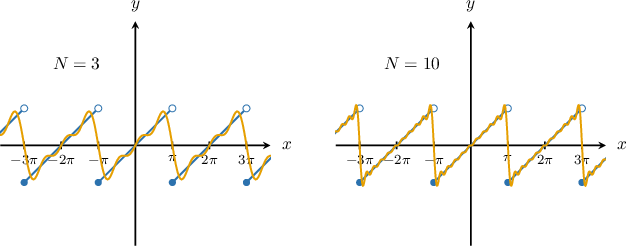
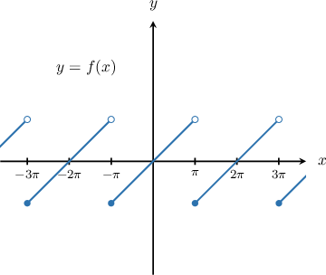
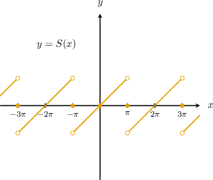
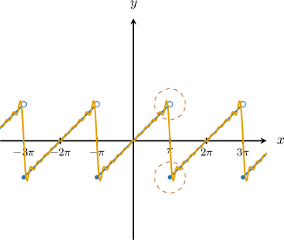

# Convergence of Fourier Series

Source: https://www.mathacademy.com/topics/3198?courseId=155
Topic ID: 3198

## Prerequisites

- [Selecting Procedures for Analyzing Infinite Series](../../../ap-courses/lessons/ap-calculus-bc/1172-selecting-procedures-for-analyzing-infinite-series.md)
- [Fourier Sine Series](./3196-fourier-sine-series.md)
- [Fourier Cosine Series](./3197-fourier-cosine-series.md)
- [Fourier Series of Arbitrary Period](./6382-fourier-series-of-arbitrary-period.md)
- [Piecewise Continuity and Piecewise Smoothness](./6669-piecewise-continuity-and-piecewise-smoothness.md)

## Lesson

### Introduction

The **Fourier convergence theorem** describes how a Fourier series behaves, especially at points where the original function is not continuous.

A Fourier series is built from smooth sine and cosine waves, so it cannot “jump” instantly the way a function with a jump discontinuity can. Instead, the series *converges* to an average value at these jumps.

More precisely, let $f(x)$ be a $2L$-periodic piecewise smooth function, and let its Fourier series be

$$

S(x)=\dfrac{a_0}{2}+\sum_{n=1}^{\infty}\left( a_n\cos\left(\dfrac{n\pi}{L}x\right)+b_n\sin\left(\dfrac{n\pi}{L}x\right) \right).

$$

Then the Fourier series converges for every $x\in\mathbb{R}$. The value it converges to depends on whether $f$ is continuous at $x$.

- If $f(x)$ is continuous at $x,$ the series converges to the function value:

- If $f(x)$ has a jump discontinuity at $x,$ the series converges to the midpoint of the one-sided limits: where $f^-(x)$ and $f^+(x)$ are the left- and right-sided limits of $f$ at $x,$ respectively.

Let's see a concrete example.

### An Example of Approximation

Consider the function $F(x)=x$ defined on $[-\pi,\pi).$ The Fourier series of its $2\pi$-periodic extension $f(x)$ is given by

$$

f(x) \sim S(x) = \sum_{n=1}^{\infty} \dfrac{2(-1)^{n+1}}{n}\sin\left(nx\right).

$$

The graph of the function $y=f(x)$ is shown below.

We can approximate the function $f(x)$ by summing a finite number of terms from its Fourier series. These approximations are called *partial sums*:

$$

S_N(x)=\sum_{n=1}^{N}\dfrac{2(-1)^{n+1}}{n}\sin\left(nx\right)

$$

As $N$ increases, the partial sums match the graph of $f(x)$ more closely.

### An Example of Convergence

As we saw, the partial sums $S_N(x)$ appear to converge to the function $f(x)$ as $N\to\infty$. The *Fourier convergence theorem* specifies the exact value to which the series converges.

- At any point $x_0$ where $f(x)$ is *continuous*, the Fourier series converges to the function value:

- At any point $x_0$ where $f(x)$ has a *jump discontinuity*, the Fourier series converges to the midpoint of the jump (the average of the one-sided limits):

For our sawtooth function above, the discontinuities occur at $x=(2k+1)\pi$. At $x=\pi$, for example, the series converges to:

$$

S(\pi)=\dfrac{f^-(\pi)+f^+(\pi)}{2} = \dfrac{\pi + (-\pi)}{2} = 0

$$

The graph of the limit function $S(x)$ is shown below.

**Note:** The limit function $S(x)$ is the same as $f(x)$ except at the jump discontinuities. If $f(x)$ were continuous everywhere, then its Fourier series would converge to $f(x)$ at every point, and we could write $f(x)=S(x)$ instead of $f(x)\sim S(x)$.

### Example: Identifying the Value to What a Fourier Series Converges

#### Question

$$

\begin{aligned}−1, & 𝑥∈[−\frac{𝜋}{2},0] \\ 2, & 𝑥∈(0,\frac{𝜋}{2})\end{aligned}

$$

Consider the function $F(x)$ shown above. Find the value to which the Fourier series of the $\pi$-periodic extension $f(x)$ of $F(x)$ converges when $x=\dfrac{\pi}{2}.$

#### Explanation

Suppose that $f(x)$ is a $2L$-periodic piecewise smooth function with the corresponding Fourier series

$$

S(x) = \dfrac{a_0}{2} + \sum_{n=1}^{\infty} a_n\cos\bigg(\dfrac{n\pi}{L}x\bigg)+b_n\sin\bigg(\dfrac{n\pi}{L}x\bigg).

$$

Then, the series converges for all $x \in \mathbb{R}.$

- If $f(x)$ is continuous at $x,$ then the series converges to the value of the function at this point:

- If $f(x)$ has a jump discontinuity at $x,$ then the series converges to the midpoint between the values of left- and right-sided limits of the function at this point: where $f^-(x)$ and $f^-(x)$ are the left- and right-sided limits of the function at this point, respectively.

Notice that the $\pi$-periodic extension $f(x)$ of our function $F(x)$ is not continuous at $x=\dfrac{\pi}{2}.$ The one-sided limits at this point are the following:

$$

\begin{aligned}𝑓^{−}(\frac{𝜋}{2}) & =\underset{𝑥→(𝜋/2)^{−}}{lim}𝑓(𝑥)=2 \\ 𝑓^{+}(\frac{𝜋}{2}) & =\underset{𝑥→(𝜋/2)^{+}}{lim}𝑓(𝑥)=−1\end{aligned}

$$

Therefore, the Fourier series of $f(x)$ converges to

$$

\dfrac{f^-\left(\dfrac{\pi}{2}\right)+f^+\left(\dfrac{\pi}{2}\right)}{2} = \dfrac{2+(-1)}{2} = \boxed{\dfrac{1}{2}}.

$$

### Using Fourier Series For Finding Infinite Sums

A powerful application of Fourier series is *evaluating infinite sums*. The strategy is to find a known Fourier series that contains the sum we want, and then choose a convenient value of $x$ to plug in.

For example, consider the function $F(x)=x^2$ defined on $x \in [-\pi,\pi).$ The Fourier series of the $2\pi$-periodic extension $f(x)$ of $F(x)$ is given by

$$

f(x) \sim \dfrac{\pi^2}{3} + 4\sum_{n=1}^\infty \dfrac{(-1)^n}{n^2} \cos(nx).

$$

Let's use this to find the value of the infinite sum $\displaystyle\sum_{n=1}^\infty \dfrac{(-1)^n}{n^2}.$

Now, notice that at $x=0,$ we have

$$

\cos\left(n\cdot0\right) = \cos\left(0\right) = 1.

$$

By the *pointwise convergence theorem*, since $f(x)$ is continuous at $x=0,$ the corresponding Fourier series converges to

$$

f\left(0\right) = 0.

$$

Hence, we have the following equation:

$$

\begin{aligned}𝑓(0) & =\frac{𝜋^{2}}{3}+4\underset{\underset{𝑛=1}{∑}}{\overset{}{∞}}\frac{(−1)^{𝑛}}{𝑛^{2}}⋅cos⁡(𝑛⋅0) \\ 0 & =\frac{𝜋^{2}}{3}+4\underset{\underset{𝑛=1}{∑}}{\overset{}{∞}}\frac{(−1)^{𝑛}}{𝑛^{2}}⋅1 \\ −\frac{𝜋^{2}}{3} & =4\underset{\underset{𝑛=1}{∑}}{\overset{}{∞}}\frac{(−1)^{𝑛}}{𝑛^{2}} \\ −\frac{𝜋^{2}}{12} & =\underset{\underset{𝑛=1}{∑}}{\overset{}{∞}}\frac{(−1)^{𝑛}}{𝑛^{2}}\end{aligned}

$$

Therefore, $\displaystyle\sum_{n=1}^\infty \dfrac{(-1)^n}{n^2} = -\dfrac{\pi^2}{12}.$

### Example: Finding the Value of an Infinite Sum Using Fourier Series

#### Question

$$

\begin{aligned}−1, & 𝑥∈[−𝜋,0] \\ 1, & 𝑥∈(0,𝜋)\end{aligned}

$$

Consider the function $F(x)$ shown above. The Fourier series of the $2\pi$-periodic extension $f(x)$ of $F(x)$ is given by

$$

f(x) \sim \sum_{n=1}^\infty \dfrac{4}{\pi(2n-1)} \sin((2n-1)x).

$$

Use this Fourier series to find the sum of the series

$$

\sum_{n=1}^\infty \dfrac{(-1)^{n+1}}{2n-1}.

$$

#### Explanation

First, we notice that at $x=\dfrac{\pi}{2},$ we have

$$

\sin\left((2n-1)\cdot\dfrac{\pi}{2}\right) = \sin\left(-\dfrac{\pi}{2}+n\pi\right) = (-1)^{n+1}.

$$

So, substituting $x=\dfrac{\pi}{2}$ into the given Fourier series gives

$$

f\left(\dfrac{\pi}{2}\right) \sim \sum_{n=1}^\infty \dfrac{4}{\pi(2n-1)} \sin\left((2n-1)\cdot\dfrac{\pi}{2}\right) = \sum_{n=1}^\infty \dfrac{4}{\pi(2n-1)}(-1)^{n+1}.

$$

Next, since $f(x)$ is continuous at $x=\dfrac{\pi}{2},$ the Fourier series converges to $f\left(\dfrac{\pi}{2}\right).$

Since $\dfrac{\pi}{2} \in [0,\pi),$ we have

$$

f\left(\dfrac{\pi}{2}\right) = 1.

$$

Therefore,

$$

\begin{aligned}1 & =\underset{\underset{𝑛=1}{∑}}{\overset{}{∞}}\frac{4}{𝜋(2𝑛−1)}(−1)^{𝑛+1} \\ \frac{𝜋}{4} & =\underset{\underset{𝑛=1}{∑}}{\overset{}{∞}}\frac{(−1)^{𝑛+1}}{2𝑛−1}.\end{aligned}

$$

So, we conclude that

$$

\sum_{n=1}^\infty \dfrac{(-1)^{n+1}}{2n-1} = \boxed{\dfrac{\pi}{4}}.

$$

### Gibbs Phenomenon

Even though the Fourier series converges to the correct value at each point (using the midpoint rule at jumps), the *graphs of the partial sums* can behave strangely near a jump discontinuity.

Suppose $f(x)$ has a jump discontinuity at $x=x_0$. Then:

- The Fourier series converges at the jump to the midpoint:

- However, for large $N$, the partial sum typically *overshoots* above the higher side of the jump and *undershoots* below the lower side.

As $N$ increases, the oscillations get squeezed into a smaller neighborhood around $x_0$, but the size of the overshoot does *not* go to $0$. This persistent overshoot near jump discontinuities is called the **Gibbs phenomenon**.

For example, for the Fourier series of the $2\pi$-periodic extension $f(x)$ of the function $F(x)=x,$ defined on $[-\pi,\pi),$ the phenomenon can be observed at each point of discontinuity on the graph below.

