# Phase Portraits for Decoupled Linear Systems

Source: https://www.mathacademy.com/topics/3242?courseId=155
Topic ID: 3242

## Prerequisites

- [Equilibrium Points and Stability for Systems of ODEs](./6377-equilibrium-points-and-stability-for-systems-of-odes.md)

## Lesson

### Introduction

Consider a *decoupled* linear system of ODEs

In this lesson, we consider only decoupled systems with nonzero eigenvalues and so the origin is the equilibrium point we will classify.

Recall that the eigenvalues for a diagonal matrix are its diagonal entries, and The corresponding eigenvectors are parallel to the coordinate axes:

So, the general solution of the system is given by

Notice that if a solution starts on one of the coordinate axes, it remains on that axis. These are called **straight-line solutions**:

- On the -axis ():

- On the -axis ():

The stability of these solutions as depends on the *signs* of the eigenvalues and We will explore the three main stability cases in the upcoming examples.

### One Positive and One Negative Eigenvalue

Suppose we have a decoupled system

$$

\begin{aligned}𝑥^{′}(𝑡)=𝜆_{1}𝑥(𝑡) \\ 𝑦^{′}(𝑡)=𝜆_{2}𝑦(𝑡)\end{aligned}

$$

where $\lambda_1>0$ and $\lambda_2<0$ (the opposite case, where $\lambda_1<0$ and $\lambda_2>0,$ is similar).

Let's now determine the behavior along the axes.

- The straight-line solutions on the $x$-axis have the form $[\begin{aligned}1 \\ 0\end{aligned}]$ Since $\lambda_1>0,$ we have that $e^{\lambda_1 t} \to \infty$ as $t \to \infty.$ Thus, the trajectories on the $x$-axis move *away* from the origin. This is called an **unstable axis**.

- The straight-line solutions on the $y$-axis have the form $[\begin{aligned}0 \\ 1\end{aligned}]$ Since $\lambda_2<0,$ we have that $e^{\lambda_2 t} \to 0$ as $t \to \infty.$ Thus, the trajectories on the $y$-axis move *toward* the origin. This is called a **stable axis**.

Because one axis is stable and the other is unstable, the origin (equilibrium point) is called a **saddle point**.

In the phase portrait, we draw

- arrows on the $x$-axis pointing *outward* (away from the origin), while

- arrows on the $y$-axis pointing *inward* (toward the origin).

A typical trajectory bends from the stable direction and then peels away along the unstable direction.

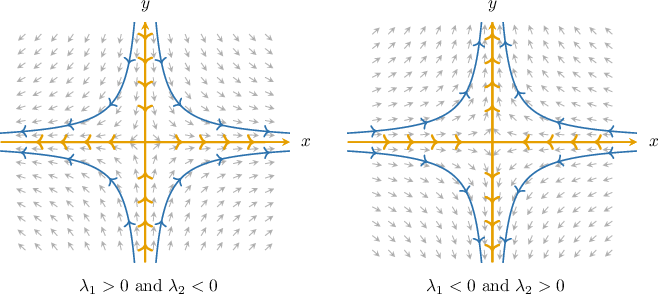

### Both Positive Eigenvalues

Suppose we have a decoupled system

$$

\begin{aligned}𝑥^{′}(𝑡)=𝜆_{1}𝑥(𝑡) \\ 𝑦^{′}(𝑡)=𝜆_{2}𝑦(𝑡)\end{aligned}

$$

where $\lambda_1,\lambda_2>0.$

Let's now determine the behavior along the axes.

- The straight-line solutions on the $x$-axis have the form $[\begin{aligned}1 \\ 0\end{aligned}]$ Since $\lambda_1>0,$ we have that $e^{\lambda_1 t} \to \infty$ as $t \to \infty.$ Thus, the trajectories on the $x$-axis move *away* from the origin (*unstable axis*).

- The straight-line solutions on the $y$-axis have the form $[\begin{aligned}0 \\ 1\end{aligned}]$ Since $\lambda_2>0,$ we have that $e^{\lambda_2 t} \to \infty$ as $t \to \infty.$ Thus, the trajectories on the $y$-axis move *away* from the origin (*unstable axis*).

Because both axes are *unstable*, the origin (equilibrium point) is called an **unstable node** or **source**.

In the phase portrait, we draw:

- arrows on the $x$-axis pointing *outward* (away from the origin), and

- arrows on the $y$-axis pointing *outward* (away from the origin).

A typical trajectory for an *unstable node* emanates from the origin toward infinity.

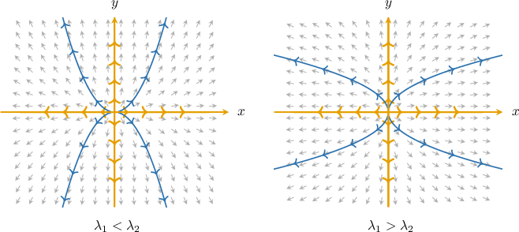

### Both Negative Eigenvalues

Suppose we have a decoupled system where

Let's now determine the behavior along the axes.

- The straight-line solutions on the -axis have the form Since we have that as Thus, the trajectories on the -axis move *toward* the origin (*stable axis*).

- The straight-line solutions on the -axis have the form Since we have that as Thus, the trajectories on the -axis move *toward* the origin (*stable axis*).

Because both axes are *stable*, the origin (equilibrium point) is called a **stable node** or **sink**.

In the phase portrait, we draw

- arrows on the -axis pointing *inward* (toward the origin), and

- arrows on the -axis pointing *inward* (toward the origin).

A typical trajectory flows into the origin.

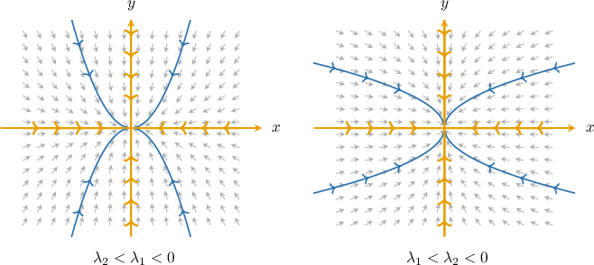

### Example: Identifying the Phase Portrait of a System

#### Question

$$

\begin{aligned}𝑥^{′}(𝑡)=4𝑥(𝑡) \\ 𝑦^{′}(𝑡)=−6𝑦(𝑡)\end{aligned}

$$

Which of the following could represent the phase portrait of the decoupled system above?

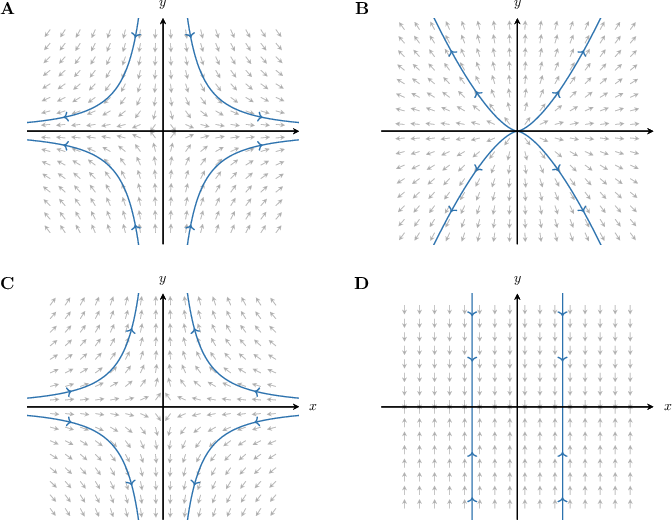

#### Explanation

Writing our system in matrix form, we have

$$

[\begin{aligned}4 & 0 \\ 0 & −6\end{aligned}]

$$

where $[\begin{aligned}𝑥(𝑡) \\ 𝑦(𝑡)\end{aligned}]$

Since our system is decoupled, its eigenvectors are the following:

- Eigenvalue $\lambda_1=4$ with the corresponding eigenvector $[\begin{aligned}1 \\ 0\end{aligned}]$

- Eigenvalue $\lambda_2=-6$ with the corresponding eigenvector $[\begin{aligned}0 \\ 1\end{aligned}]$

The general solution of the system is

$$

[\begin{aligned}1 \\ 0\end{aligned}]

$$

Now, notice that:

- The straight-line solutions of the form $[\begin{aligned}1 \\ 0\end{aligned}]$ lie on the $x$-axis. Since $e^{4t} \to \infty$ as $t \to \infty,$ these solutions approach infinity as $t \to \infty.$

- The straight-line solutions of the form $[\begin{aligned}0 \\ 1\end{aligned}]$ lie on the $y$-axis. Since $e^{-6t} \to 0$ as $t \to \infty,$ these solutions approach the origin as $t \to \infty.$

Among the given options, the only phase portrait satisfying these conditions is the following:

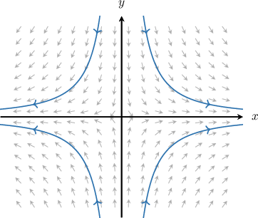

### Example: Identifying the System Given a Phase Portrait

#### Question

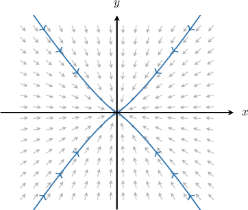

Consider the phase portrait for a decoupled system above. Which of the following systems could correspond to the given portrait?

1. $\begin{aligned}𝑥^{′}(𝑡)=−5𝑥(𝑡) \\ 𝑦^{′}(𝑡)=6𝑦(𝑡)\end{aligned}$

2. $\begin{aligned}𝑥^{′}(𝑡)=5𝑥(𝑡) \\ 𝑦^{′}(𝑡)=6𝑦(𝑡)\end{aligned}$

3. $\begin{aligned}𝑥^{′}(𝑡)=5𝑥(𝑡) \\ 𝑦^{′}(𝑡)=−6𝑦(𝑡)\end{aligned}$

4. $\begin{aligned}𝑥^{′}(𝑡)=−5𝑥(𝑡) \\ 𝑦^{′}(𝑡)=−6𝑦(𝑡)\end{aligned}$

#### Explanation

Writing a decoupled system in matrix form, we have

$$

[\begin{aligned}𝜆_{1} & 0 \\ 0 & 𝜆_{2}\end{aligned}]

$$

where $[\begin{aligned}𝑥(𝑡) \\ 𝑦(𝑡)\end{aligned}]$

Since our system is decoupled, its eigenvectors are parallel to the axes. These correspond to so-called straight-line solutions of the form

$$

[\begin{aligned}1 \\ 0\end{aligned}]

$$

Now, notice that:

- The tangents along the $x$-axis are pointing toward the origin, meaning that the solutions of the form $[\begin{aligned}1 \\ 0\end{aligned}]$ must approach the origin as $t \to \infty.$ So, we must have $\lambda_1 < 0.$

- The tangents along the $y$-axis are also pointing toward the origin, meaning that the solutions of the form $[\begin{aligned}0 \\ 1\end{aligned}]$ must also approach the origin as $t \to \infty.$ So, we must have $\lambda_2 < 0.$

Among the options, the only system that satisfies $\lambda_1 < 0$ and $\lambda_2 < 0$ is the following:

$$

\begin{aligned}𝑥^{′}(𝑡)=−5𝑥(𝑡) \\ 𝑦^{′}(𝑡)=−6𝑦(𝑡)\end{aligned}

$$

### Dominant Eigenvalue

For a decoupled system we know the *signs* of and tell us the type of the equilibrium (sink/source/saddle). But how can we determine the shape of trajectories in cases when the origin is a source () or a sink ()?

To do this, we can compare the rates of change of and by looking at the slope of the tangent line to the trajectory, Assuming we have:

As we can see, the long-term behavior of the slope as depends on the sign of the exponent,

This comparison is governed by which eigenvalue is larger. We call the larger eigenvalue (the one that is more positive, or less negative) the **dominant eigenvalue**.

In the next slides, we will analyze the source and sink cases separately.

### Unstable Node (Source)

Let's analyze the case where the origin is a source, with For a decoupled system with solutions and trajectories move away from the origin as

- If then is the *dominant eigenvalue* and In this case: as This means the tangents to the solution become more and more horizontal as the trajectories move away from the origin.

- If then is the *dominant eigenvalue* and In this case: as This means the tangents to the solution become more and more vertical as the trajectories move away from the origin.

Notice that in both cases, trajectories become parallel to the axis corresponding to the *dominant eigenvalue* as they move away from the origin (the -axis on the left, and the -axis on the right).

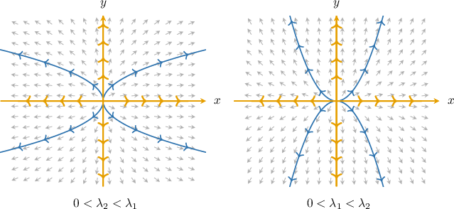

### Stable Node (Sink)

Now, let's analyze the case where the origin is a sink, with For a decoupled system with solutions and trajectories approach the origin as

- If then is the *dominant eigenvalue* and As This means the tangents to the solution become more and more horizontal as trajectories approach the origin.

- If then is the *dominant eigenvalue* and As This means the tangents to the solution become more and more vertical as trajectories approach the origin.

Notice that in both cases, trajectories become parallel to the axis corresponding to the *dominant eigenvalue* as they move toward the origin (the -axis on the left, and the -axis on the right).

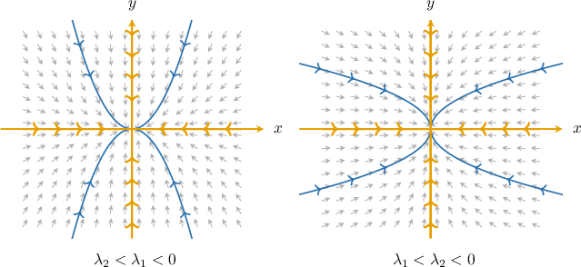

### Example: Identifying the Phase Portrait Given a System: Advanced Cases

#### Question

$$

\begin{aligned}𝑥^{′}(𝑡)=−𝑥(𝑡) \\ 𝑦^{′}(𝑡)=−4𝑦(𝑡)\end{aligned}

$$

Which of the following could represent the phase portrait of the decoupled system above?

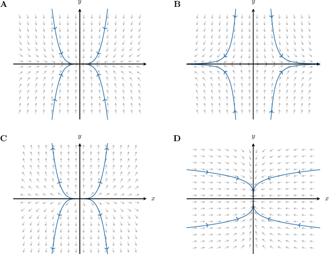

#### Explanation

Writing our system in matrix form, we have

$$

[\begin{aligned}−1 & 0 \\ 0 & −4\end{aligned}]

$$

where $[\begin{aligned}𝑥(𝑡) \\ 𝑦(𝑡)\end{aligned}]$

Since our system is decoupled, its eigenvectors are the following:

- Eigenvalue $\lambda_1=-1$ with the corresponding eigenvector $[\begin{aligned}1 \\ 0\end{aligned}]$

- Eigenvalue $\lambda_2=-4$ with the corresponding eigenvector $[\begin{aligned}0 \\ 1\end{aligned}]$

The general solution of the system is

$$

[\begin{aligned}1 \\ 0\end{aligned}]

$$

Now, notice that:

- The straight-line solutions of the form $[\begin{aligned}1 \\ 0\end{aligned}]$ lie on the $x$-axis. Since $e^{-t} \to 0$ as $t \to \infty,$ these solutions approach the origin as $t \to \infty.$

- The straight-line solutions of the form $[\begin{aligned}0 \\ 1\end{aligned}]$ lie on the $y$-axis. Since $e^{-4t} \to 0$ as $t \to \infty,$ these solutions also approach the origin as $t \to \infty.$

Among the given options, there are two phase portraits satisfying these conditions:

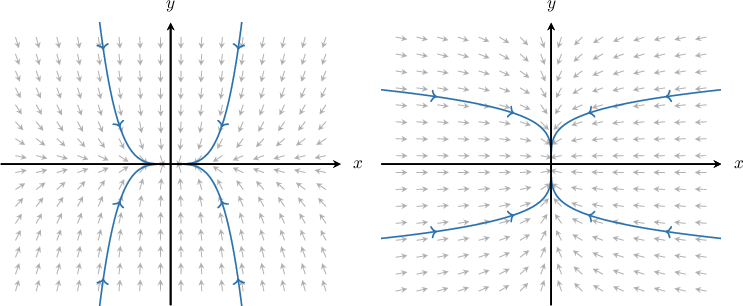

Let's consider the solutions $x(t) = c_1e^{-t}$ and $y(t)=c_2e^{-4t}$ provided that $c_1,c_2 \neq 0.$ Then,

$$

\begin{aligned}\frac{d𝑦}{d𝑥}=\frac{𝑦^{′}(𝑡)}{𝑥^{′}(𝑡)}=\frac{(𝑐_{2}𝑒^{−4𝑡})^{′}}{(𝑐_{1}𝑒^{−𝑡})^{′}}=\frac{−4𝑐_{2}𝑒^{−4𝑡}}{−𝑐_{1}𝑒^{−𝑡}}=\frac{4𝑐_{2}}{𝑐_{1}}𝑒^{−3𝑡}.\end{aligned}

$$

So, $\dfrac{\text{d}y}{\text{d}x} \to 0$ as $t \to \infty,$ meaning that the tangents to the solution become more and more horizontal as the trajectories approach the origin. This corresponds to the following phase portrait:

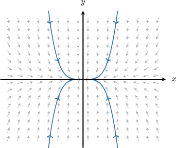

### Classification of Equilibria

Finally, let’s summarize what we’ve learned so far.

Again, we are considering a decoupled linear system

$$

\begin{aligned}𝑥^{′}(𝑡)=𝜆_{1}𝑥(𝑡) \\ 𝑦^{′}(𝑡)=𝜆_{2}𝑦(𝑡)\end{aligned}

$$

Recall that a homogeneous linear system has a single equilibrium point at the origin $(0,0).$ To classify this equilibrium, we look at the signs of $\lambda_1$ and $\lambda_2.$

First of all, the coordinate axes are straight-line solutions:

- On the $x$-axis, we have $y(t)= 0$ and $x(t)=c_1e^{\lambda_1 t}$. If $\lambda_1<0,$ the $x$-axis is a *stable* line. If $\lambda_1>0,$ the $x$-axis is an *unstable* line.

- On the $y$-axis, we have $x(t)=0$ and $y(t)=c_2e^{\lambda_2 t}.$ If $\lambda_2<0,$ the $y$-axis is a *stable* line. If $\lambda_2>0,$ the $y$-axis is an *unstable* line.

As for the classification of the equilibrium at the origin, we get the following:

- *Unstable node (source)* if $\lambda_1>0$ and $\lambda_2>0.$

- *Stable node (sink)* if $\lambda_1<0$ and $\lambda_2<0.$ In fact, it's asymptotically stable, as the trajectories converge to the origin.

- *Saddle point* if $\lambda_1\lambda_2<0$ (one positive, one negative).

Let's see some examples.

### Example: Classifying Decoupled Systems of Linear Differential Equations

#### Question

$$

\begin{aligned}𝑥^{′}(𝑡)=2𝑥(𝑡) \\ 𝑦^{′}(𝑡)=4𝑦(𝑡)\end{aligned}

$$

Interpret the stability of the $x$-axis, the $y$-axis, and the equilibrium point (the origin) for the given decoupled system of linear differential equations.

#### Explanation

Writing our system in matrix form, we have

$$

[\begin{aligned}2 & 0 \\ 0 & 4\end{aligned}]

$$

where $[\begin{aligned}𝑥(𝑡) \\ 𝑦(𝑡)\end{aligned}]$

Recall that a homogeneous system of linear differential equations has a single equilibrium (fixed point) at the origin.

Since our system is decoupled, its eigenvectors are the following:

- Eigenvalue $\lambda_1=2$ with the eigenvector $[\begin{aligned}1 \\ 0\end{aligned}]$ The corresponding straight-line solutions of the form $[\begin{aligned}1 \\ 0\end{aligned}]$ lie on the $x$-axis and move away from the origin as $t \to \infty.$ So, the $x$-axis is the $\boxed{\text{unstable}}$ line.

- Eigenvalue $\lambda_2=4$ with the eigenvector $[\begin{aligned}0 \\ 1\end{aligned}]$ The corresponding straight-line solutions of the form $[\begin{aligned}0 \\ 1\end{aligned}]$ lie on the $y$-axis and also move away from the origin as $t \to \infty.$ So, the $y$-axis is the $\boxed{\text{unstable}}$ line.

Therefore, the equilibrium point (origin) is $\boxed{\text{an unstable node (source)}}.$

**** The phase portrait of the system looks as follows:

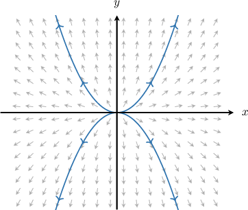
