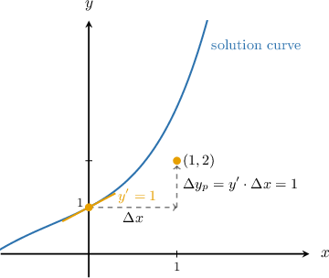
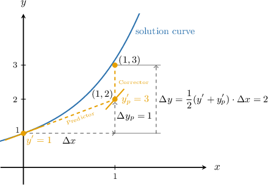

# The Modified Euler Method

Source: https://www.mathacademy.com/topics/3247?courseId=155
Topic ID: 3247

## Prerequisites

- [Euler's Method: Calculating Multiple Steps](./3668-euler-s-method-calculating-multiple-steps.md)

## Lesson

### Introduction

**Predictor-Corrector methods** are numerical methods for approximating solutions to differential equations that use two equations at each step:

- The **predictor** obtains an initial approximation (a *prediction*) for the change $\Delta y.$

- The **corrector** refines the predictor's estimate, adjusting for changes in the slope between successive $x$-values, to obtain a *corrected* approximation for $\Delta y.$

Some common predictor-corrector methods include:

- Modified Euler Method (Heun's Method)

- $2$-Step Adams-Bashforth-Moulton Method

- $4$-Step Adams-Bashforth-Moulton Method

- Milne's Method

In the next slide, we'll introduce the predictor of the simplest predictor-corrector method, the Modified Euler Method, and apply it to a specific numerical example.

### The Predictor Equation of the Modified Euler Method

The **Modified Euler Method** (**Heun's Method**) is a predictor-corrector numerical method that uses Euler's method for its predictor step:

$$

\text{Predictor}: \qquad \Delta y_p = y' \cdot \Delta x

$$

The initially predicted new $y$-value is then given by $y_p = y + \Delta y_p.$

Note the following:

- The step size $\Delta x$ represents the change in $x.$

- The quantity $y'$ represents the slope at the current point.

- The predicted $y$-increment is denoted $\Delta y_p$ for notational convenience. It represents the initial change in $y$ made by the predictor step when using the modified Euler method.

For example, consider the following initial value problem:

$$

y' = x^2 + y, \qquad y(0) = 1

$$

Let's begin the process of using the modified Euler method to approximate the value of $y(1).$

Since we know $y(0)$ and wish to estimate $y(1),$ we will use a step size of

$$

\Delta x = 1 - 0 = 1.

$$

We'll use a table when applying the modified Euler method. First, we add the initial condition data:

Next, we compute the value of $y'$ according to the given rule:

$$

\begin{aligned}𝑦^{′} & =𝑥^{2}+𝑦 \\ & =0^{2}+1 \\ & =1\end{aligned}

$$

So, we add this to our table.

Next, we compute $\Delta y_p$ using the predictor equation:

$$

\begin{aligned}Δ𝑦_{𝑝} & =𝑦^{′}⋅Δ𝑥 \\ & =1⋅1 \\ & =1\end{aligned}

$$

We add this value to our table.

Hence, according to the predictor equation, the initially predicted new $y$-value is

$$

\begin{aligned}𝑦_{𝑝} & =𝑦+Δ𝑦_{𝑝} \\ & =1+1 \\ & =2\end{aligned}

$$

Therefore, the completed table is as given below.

We can view this initial Euler-based approximation produced by the predictor equation in the coordinate plane as follows.

### Example: Completing a Table Using the Predictor Equation of the Modified Euler Method

#### Question

Consider the following initial value problem:

$$

y' = 2xy + y^2, \qquad y(0)=1

$$

We wish to approximate the solution using the modified Euler method. Given that the step size is $\Delta x = 1,$ fill the missing entries in the table below.

#### Explanation

For an initial value problem

$$

y' = f(x,y), \qquad y_0 = y(x_0),

$$

the predictor equation of the modified Euler method with step size $\Delta x$ is given by

$$

\begin{aligned}Δ𝑦_{𝑝}=𝑦^{′}⋅Δ𝑥.\end{aligned}

$$

The initially predicted new $y$-value is then given by $y_p = y + \Delta y_p.$

First, we compute the value of $y'$ according to the given rule:

$$

\begin{aligned}𝑦^{′} & =2𝑥𝑦+𝑦^{2} \\ & =2⋅0⋅1+1^{2} \\ & =1\end{aligned}

$$

So, we add this to our table.

Next, we compute $\Delta y_p$ using the predictor equation:

$$

\begin{aligned}Δ𝑦_{𝑝} & =𝑦^{′}⋅Δ𝑥 \\ & =1⋅1 \\ & =1\end{aligned}

$$

We add this value to our table.

Hence, according to the predictor equation, the initially predicted new $y$-value is

$$

\begin{aligned}𝑦_{𝑝} & =𝑦+Δ𝑦_{𝑝} \\ & =1+1 \\ & =2.\end{aligned}

$$

Therefore, the completed table is as given below.

### The Modified Euler Method

The modified Euler method uses Euler's method for the predictor step. We saw that the predictor's approximating line segment has left endpoint $(x,y)$ and right endpoint

$$

(x_\text{new}, y_p) = (x + \Delta x, y + \Delta y_p).

$$

Now, we apply the corrector step. In general, the corrector takes the predictor's initial approximation and "corrects" for some errors, moving it closer to the true solution.

For an initial value problem

$$

y' = f(x,y), \qquad y_0 = y(x_0),

$$

the **Modified Euler Method** with step size $\Delta x$ is given by

$$

\begin{aligned}Predictor: & \,Δ𝑦_{𝑝}=𝑦^{′}⋅Δ𝑥, \\ Corrector: & \,Δ𝑦=\frac{1}{2}(𝑦^{′}+𝑦_{′𝑝}^{})⋅Δ𝑥,\end{aligned}

$$

where $y'_p = f(x_\text{new},y_p)$ is the initially predicted slope at the right endpoint $(x_\text{new}, y_p) = (x + \Delta x, y + \Delta y_p).$

In other words, the corrector of the modified Euler method uses the average slope over the interval $[x,x_\text{new}],$ based on the slopes at the current point $(x,y)$ and at the initially predicted new point $(x_\text{new}, y_p).$

Let's demonstrate how to apply the corrector equation in our previous example.

### A Worked Example

Let's return to the following initial value problem:

$$

y' = x^2 + y, \qquad y(0)=1

$$

We will now complete our approximation of the value of $y(1)$ using the modified Euler method.

First, recall that we previously completed the predictor step, resulting in the following values:

The initially predicted new point produced by the predictor equation is

$$

(x_\text{new}, y_p) = (0+1,2) =(1,2).

$$

So, the predicted slope at this point is

$$

\begin{aligned}𝑦_{′𝑝}^{} & =𝑥_{2new}^{}+𝑦_{𝑝} \\ & =1^{2}+2 \\ & =3.\end{aligned}

$$

We can add this to our table.

Finally, we compute $\Delta y$ using the corrector equation:

$$

\begin{aligned}Δ𝑦 & =\frac{1}{2}(𝑦^{′}+𝑦_{′𝑝}^{})⋅Δ𝑥 \\ & =\frac{1}{2}(1+3)⋅1 \\ & =\frac{1}{2}⋅4 \\ & =2.\end{aligned}

$$

We add this to our table.

The value of $x$ in the next row is $x_\text{new} = 1.$ To get the value of $y$ in the next row, we add $\Delta y$ to $y{:}$

$$

y_\text{new} = y + \Delta y = 1 + 2 = 3.

$$

Adding these results to our table gives the following:

Therefore, we conclude that $y(1) \approx 3.$

We can view our approximation made by the modified Euler method in the coordinate plane as follows:

Notice how the correction made by the corrector significantly improves the initial approximation produced by the predictor, at the cost of additional computation.

### Example: Calculating the Corrector Term

#### Question

Consider the following initial value problem:

$$

y' = xy^2 - x^2, \qquad y(0)=2

$$

We wish to approximate the solution using the modified Euler method. Complete the first row of the table below, given that the step size is $\Delta x = \dfrac12.$

#### Explanation

For an initial value problem

$$

y' = f(x,y), \qquad y_0 = y(x_0),

$$

the modified Euler method with step size $\Delta x$ is given by

$$

\begin{aligned}Predictor & : & Δ𝑦_{𝑝} & =𝑦^{′}⋅Δ𝑥, \\ Corrector & : & Δ𝑦 & =\frac{1}{2}(𝑦^{′}+𝑦_{′𝑝}^{})⋅Δ𝑥,\end{aligned}

$$

where $y'_p = f(x_\text{new},y_p)$ is the initially predicted slope at the predicted new point $(x_\text{new}, y_p) = (x + \Delta x, y + \Delta y_p).$

We compute $\Delta y$ using the corrector equation:

$$

\begin{aligned}Δ𝑦 & =\frac{1}{2}(𝑦^{′}+𝑦_{′𝑝}^{})Δ𝑥 \\ & =\frac{1}{2}(0+\frac{7}{4})⋅\frac{1}{2} \\ & =\frac{1}{4}(\frac{7}{4}) \\ & =\frac{7}{16}\end{aligned}

$$

Therefore, the completed first row is as given below.

### Example: Completing the First Row of a Table Using the Modified Euler Method

#### Question

Consider the following initial value problem:

$$

y' = xy - y^2 + 2, \qquad y(0)=1

$$

We wish to approximate the solution using the modified Euler method. Complete the first row of the table below, given that the step size is $\Delta x = 1.$

#### Explanation

For an initial value problem

$$

y' = f(x,y), \qquad y_0 = y(x_0),

$$

the modified Euler method with step size $\Delta x$ is given by

$$

\begin{aligned}Predictor & : & Δ𝑦_{𝑝} & =𝑦^{′}⋅Δ𝑥, \\ Corrector & : & Δ𝑦 & =\frac{1}{2}(𝑦^{′}+𝑦_{′𝑝}^{})⋅Δ𝑥,\end{aligned}

$$

where $y'_p = f(x_\text{new},y_p)$ is the initially predicted slope at the predicted new point $(x_\text{new}, y_p) = (x + \Delta x, y + \Delta y_p).$

First, we compute the value of $y'$ according to the given rule:

$$

\begin{aligned}𝑦^{′} & =𝑥𝑦−𝑦^{2}+2 \\ & =0⋅1−1^{2}+2 \\ & =1\end{aligned}

$$

So, we add this to our table.

Next, we compute $\Delta y_p$ using the predictor equation:

$$

\begin{aligned}Δ𝑦_{𝑝} & =𝑦^{′}⋅Δ𝑥 \\ & =1⋅1 \\ & =1\end{aligned}

$$

We add this value to our table.

The coordinates of the initially predicted new point given by the predictor equation are

$$

\begin{aligned}𝑥_{new} & =𝑥+Δ𝑥=0+1=1, \\ 𝑦_{𝑝} & =𝑦+Δ𝑦_{𝑝}=1+1=2.\end{aligned}

$$

Let's add the second value to the table.

So, the predicted slope at this point is

$$

\begin{aligned}𝑦_{′𝑝}^{} & =𝑓(𝑥_{new},𝑦_{𝑝}) \\ & =𝑥_{new}𝑦_{𝑝}−𝑦_{2𝑝}^{}+2 \\ & =(1)(2)−(2)^{2}+2 \\ & =0\end{aligned}

$$

We can add this to our table.

Finally, we compute $\Delta y$ using the corrector equation:

$$

\begin{aligned}Δ𝑦 & =\frac{1}{2}(𝑦^{′}+𝑦_{′𝑝}^{})⋅Δ𝑥 \\ & =\frac{1}{2}(1+0)⋅1 \\ & =\frac{1}{2}\end{aligned}

$$

Therefore, the completed first row is as given below.

### Example: Approximating the Solution to an Initial Value Problem Using The Modified Euler Method With One Step

#### Question

Consider the following initial value problem:

$$

y' = x^2y^2+xy^2, \qquad y(1)=1

$$

Use the modified Euler method with one step to approximate $y(2).$

#### Explanation

For an initial value problem

$$

y' = f(x,y), \qquad y_0 = y(x_0),

$$

the modified Euler method with step size $\Delta x$ is given by

$$

\begin{aligned}Predictor & : & Δ𝑦_{𝑝} & =𝑦^{′}⋅Δ𝑥, \\ Corrector & : & Δ𝑦 & =\frac{1}{2}(𝑦^{′}+𝑦_{′𝑝}^{})⋅Δ𝑥,\end{aligned}

$$

where $y'_p = f(x_\text{new},y_p)$ is the initially predicted slope at the predicted new point $(x_\text{new}, y_p) = (x + \Delta x, y + \Delta y_p).$

Since we want to find the value of $y$ at $x=2,$ we will use a step size of

$$

\Delta x = 2 - 1 = 1.

$$

First, we add the initial condition data to a table.

Now, we compute the value of $y'$ according to the given rule:

$$

\begin{aligned}𝑦^{′} & =𝑥^{2}𝑦^{2}+𝑥𝑦^{2} \\ & =1^{2}⋅1^{2}+1⋅1^{2} \\ & =2\end{aligned}

$$

So, we add this to our table.

Next, we compute $\Delta y_p$ using the predictor equation:

$$

\begin{aligned}Δ𝑦_{𝑝} & =𝑦^{′}⋅Δ𝑥 \\ & =2⋅1 \\ & =2\end{aligned}

$$

We add this to our table.

The coordinates of the initially predicted new point given by the predictor equation are

$$

\begin{aligned}𝑥_{new} & =𝑥+Δ𝑥=1+1=2, \\ 𝑦_{𝑝} & =𝑦+Δ𝑦_{𝑝}=1+2=3.\end{aligned}

$$

Let's add the second value to the table.

So, the predicted slope at this point is

$$

\begin{aligned}𝑦_{′𝑝}^{} & =𝑥_{2new}^{}𝑦_{2𝑝}^{}+𝑥_{new}𝑦_{2𝑝}^{} \\ & =2^{2}⋅3^{2}+2⋅3^{2} \\ & =54.\end{aligned}

$$

We can add this to our table.

Finally, we compute $\Delta y$ using the corrector equation:

$$

\begin{aligned}Δ𝑦 & =\frac{1}{2}(𝑦^{′}+𝑦_{′𝑝}^{})⋅Δ𝑥 \\ & =\frac{1}{2}(2+54)⋅1 \\ & =\frac{1}{2}⋅56 \\ & =28\end{aligned}

$$

We add this to our table.

The value of $x$ in the next row is $x_\text{new} = 2.$ To get the value of $y$ in the next row, we add $\Delta y$ to $y{:}$

$$

y_\text{new} = y + \Delta y = 1 + 28 = 29

$$

Adding these results to our table gives the following:

Therefore, we conclude that $y(2) \approx \boxed{29}.$
