# Surfaces in Cylindrical Polar Coordinates

Source: https://www.mathacademy.com/topics/3569?courseId=155
Topic ID: 3569

## Prerequisites

- [Cylindrical Polar Coordinates](./1981-cylindrical-polar-coordinates.md)
- [Identifying Three-Dimensional Shapes](../../../high-school/traditional/lessons/geometry/2467-identifying-three-dimensional-shapes.md)

## Lesson

### Introduction

In a rectangular (or Cartesian) system of coordinates, we can think of a point as the vertex of a rectangular solid. For instance, the point $P(1,\sqrt3,3)$ can be represented as follows:

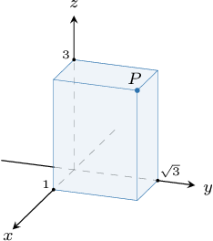

When we consider the corresponding cylindrical coordinates of $P,$ given by $\left(2, \dfrac{\pi}3, 3\right)$ in this case, we can think of $P$ as a point that lies on the edge of a cylinder, as shown below.

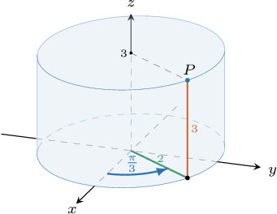

### Describing Simple Surfaces in Cylindrical Polar Coordinates

Recall that for a point $(r,\theta,z)$ in cylindrical polar coordinates,

- $r\geq 0$ and $\theta\in [0,2\pi)$ are the usual plane polar coordinates, and

- $z\in (-\infty, \infty)$ is the usual Cartesian $z$-coordinate.

When we fix one of these coordinates and allow the others to vary, we obtain some simple surfaces.

- The equation where $c\geq 0$ requires that the distance from any point on the surface to the $z$-axis is fixed while $\theta$ and $z$ can vary arbitrarily in their respective domains. So, we obtain a circular cylinder.

- The equation where $c\in [0,2\pi)$ requires that if we project the vector $\overrightarrow{OP}$ onto the $xy$-plane for every point $P$ on our surface, the resulting vector makes an angle of $c$ radians with the positive $x$-axis. This constructs a **half-plane** that passes through the $z$-axis.

- Finally, the equation where $z\in (-\infty, \infty)$ requires that the $z$-coordinate of any point on our surface is fixed while $\theta$ and $z$ can vary arbitrarily in their respective domains. Therefore, this surface is a plane parallel to the $xy$-plane.

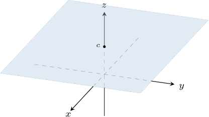

### Example: Identifying the Polar Equation of a Given Surface

#### Question

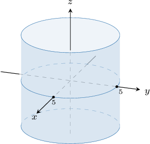

What is the equation of the surface shown above in cylindrical polar coordinates?

#### Explanation

The position of a point in cylindrical polar coordinates is written as $(r,\theta,z),$ where

- $r\geq 0$ and $\theta\in [0,2\pi)$ are the usual plane polar coordinates, and

- $z\in (-\infty, \infty)$ is the usual Cartesian $z$-coordinate.

The picture shows a circular cylinder of radius $5$ whose axis of symmetry is the $z$-axis.

We note the following:

- Since the distance from any point on our surface to the $z$-axis equals $5,$ we must have $r=5$ for every point on the surface.

- On the other hand, $\theta$ and $z$ can vary arbitrarily in their respective domains.

Therefore, the equation of the surface in cylindrical polar coordinates is $r = 5.$

### Example: Identifying a Surface by Its Polar Equation

#### Question

What surface is defined by the equation $\theta=3$ in cylindrical polar coordinates?

#### Explanation

The position of a point in cylindrical polar coordinates is written as $(r,\theta,z),$ where

- $r\geq 0$ and $\theta\in [0,2\pi)$ are the usual plane polar coordinates, and

- $z\in (-\infty, \infty)$ is the usual Cartesian $z$-coordinate.

With that in mind, let's examine our equation:

$$

\theta=3

$$

This equation requires that if we project the vector $\overrightarrow{OP}$ onto the $xy$-plane for every point $P$ on our surface, the resulting vector makes an angle of $3$ radians with the positive $x$-axis. So, we must have $\theta=3$ for every point on the surface. On the other hand, $r$ and $z$ can vary arbitrarily in their respective domains.

Therefore, our surface is a half-plane that passes through the $z$-axis, shown below.

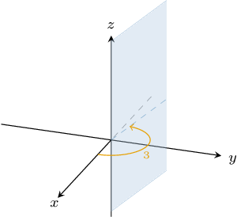

### Cones in Cylindrical Polar Coordinates

What surface is defined by the equation $z^2=r^2$ in cylindrical polar coordinates?

Again, recall that for a point $(r,\theta,z)$ in cylindrical polar coordinates,

- $r\geq 0$ and $\theta\in [0,2\pi)$ are the usual plane polar coordinates, and

- $z\in (-\infty, \infty)$ is the usual Cartesian $z$-coordinate.

With that in mind, let's examine our equation:

$$

z^2=r^2

$$

This equation requires that the square of the distance from any point on the surface to the $xy$-plane equals the square of the distance from that point to the $z$-axis. In other words, the tangent of the angle between any position vector on the surface and the $z$-axis, which is given by $\dfrac{r}{z}$, must be equal to

$$

\dfrac{r}{z} =\pm \sqrt{\dfrac{r^2}{z^2}} = \pm\sqrt{\dfrac{r^2}{r^2}} = \pm1.

$$

On the other hand, $\theta$ can vary arbitrarily in its domain.

- For $\dfrac{r}{z} = 1,$ the angle between the position vector of any point on the surface and the $z$-axis must be equal $\dfrac{\pi}{4}.$ This corresponds to a *half-cone* for positive $z{:}$

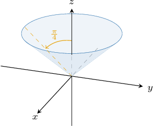

- On the other hand, for $\dfrac{r}{z} = -1,$ the angle between the position vector of any point on the surface and the $z$-axis must be equal $\dfrac{3\pi}{4}.$ This corresponds to a *half-cone* for negative $z{:}$

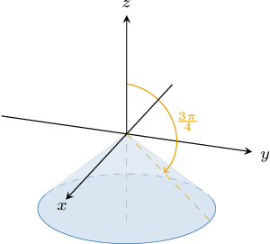

Therefore, combining the two half cones, the equation $z^2 = r^2$ defines the *cone* shown below.

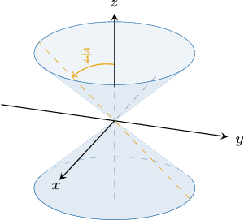

### Example: Identifying Cones and Half-Cones

#### Question

What surface is defined by the equation $z=4r$ in cylindrical polar coordinates?

#### Explanation

The position of a point in cylindrical polar coordinates is written as $(r,\theta,z),$ where

- $r\geq 0$ and $\theta\in [0,2\pi)$ are the usual plane polar coordinates, and

- $z\in (-\infty, \infty)$ is the usual Cartesian $z$-coordinate.

With that in mind, let's examine our equation:

$$

z=4r

$$

This equation requires that the distance from any point on the surface to the $xy$-plane equals $4$ times the distance from that point to the $z$-axis. In other words, the tangent of the angle between any position vector on the surface and the $z$-axis must be equal to

$$

\dfrac{r}{z} = \dfrac{r}{4r} = \dfrac14.

$$

On the other hand, $\theta$ can vary arbitrarily in its domain.

Therefore, our surface is the half-cone shown below.

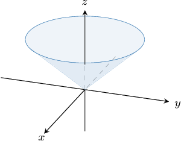

### Relaxing Variable Constraints

So far, we have kept the domains of the plane polar coordinates restricted to $r\geq 0$ and $\theta\in [0,2\pi).$ What happens if we lift these restrictions?

Consider the equation $r=\theta$ with the domain restrictions $r\geq 0$ and $\theta\in [0,2\pi)$ which defines the surface shown below.

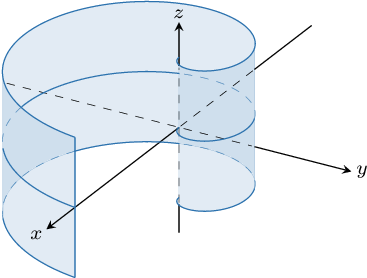

Suppose we remove the restriction $\theta\in[0,2\pi)$ so that it can be any number. What would the surface look like then?

If we remove the restriction on $\theta,$ we obtain more spirals. For example, the diagram below shows $r=\theta$ for $\theta \in [0, 4\pi).$

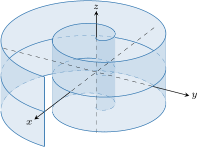

We can also lift the restriction $r \geq 0$ so $r$ can take negative values. Typically, allowing negative values of $r$ adds $\pi$ to the parameter $\theta.$ So, we have

$$

\begin{aligned}(|𝑟|,𝜃),\, & 𝑟≥0, \\ (|𝑟|,𝜃+𝜋),\, & 𝑟<0.\end{aligned}

$$
