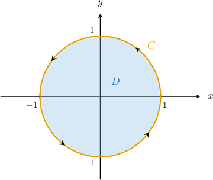
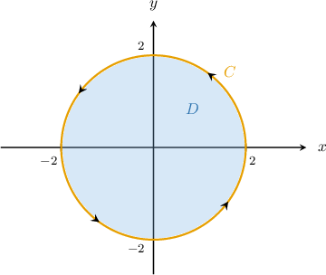
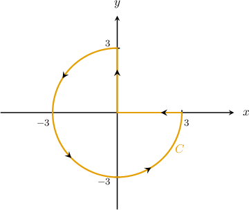
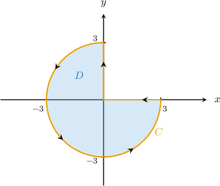
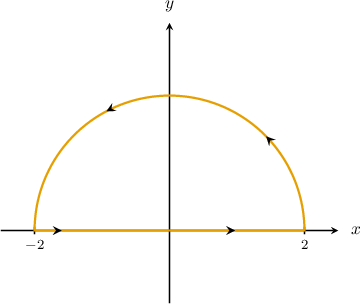
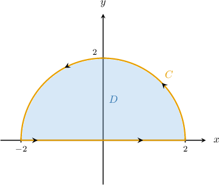

# Green's Theorem in Polar Coordinates

Source: https://www.mathacademy.com/topics/3627?courseId=155
Topic ID: 3627

## Prerequisites

- [Double Integrals in Plane Polar Coordinates](../mathematical-methods-for-the-physical-sciences-i/2030-double-integrals-in-plane-polar-coordinates.md)
- [Introduction to Green's Theorem](./2116-introduction-to-green-s-theorem.md)

## Lesson

### Introduction

Suppose we want to evaluate the line integral

$$

\oint\limits_{C}\left( e^{-x^2}- x^2y \right) \: \mathrm{d}x + \left(y+xy^2\right) \mathrm{d}y,

$$

where $C$ is the unit circle $x^2 + y^2 = 1,$ oriented counterclockwise.

Direct evaluation of this integral is likely to be a difficult task. However, we can make light work of this tricky integral using Green's theorem.

Recall that Green's theorem states the following:

$$

\oint\limits_{C} P\,\mathrm{d}x + Q\,\mathrm{d}y = \iint\limits_D \left(\frac{\partial Q}{\partial x} - \frac{\partial P}{\partial y}\right)\,\textrm d A

$$

In our case, the region $D$ and its boundary $C$ (shown below) satisfy the conditions of Green's theorem.

Now, since

$$

P(x,y) = e^{-x^2}- x^2y, \qquad Q(x,y) = y+xy^2,

$$

we obtain the partial derivatives

$$

\begin{aligned}\frac{𝜕𝑃}{𝜕𝑦}=−𝑥^{2},\,\frac{𝜕𝑄}{𝜕𝑥}=𝑦^{2}.\end{aligned}

$$

Applying Green's theorem, we get

$$

\begin{aligned}\underset{𝐶}{∮}(𝑒^{−𝑥^{2}}−𝑥^{2}𝑦)\,d𝑥+(𝑦+𝑥𝑦^{2})\,d𝑦 & =\underset{𝐷}{∬}(\frac{𝜕𝑄}{𝜕𝑥}−\frac{𝜕𝑃}{𝜕𝑦})d𝐴 \\ & =\underset{𝐷}{∬}𝑦^{2}−(−𝑥^{2})\,d𝐴 \\ & =\underset{𝐷}{∬}𝑥^{2}+𝑦^{2}\,d𝐴.\end{aligned}

$$

This double integral will be easier to evaluate if we switch to plane polar coordinates.

The region $D$ in $xy$-coordinates can be represented as the region $\Delta$ in polar coordinates, given by

$$

\Delta = \big\{ (r,\theta) \: : \: 0 \leq r \leq 1, \: 0 \leq \theta \leq 2\pi \big\}.

$$

The change of variables formula for plane polar coordinates states that

$$

\iint\limits_{D} f(x,y) \ \mathrm d A = \iint\limits_{\Delta} \ f(r \cos\theta, r\sin\theta) \: r \ \mathrm d r \mathrm d \theta.

$$

Finally, we can calculate our double integral by applying the change of variables, as follows:

$$

\begin{aligned}\underset{𝐷}{∬}𝑥^{2}+𝑦^{2}\,d𝐴 & =\underset{Δ}{∬}(𝑟^{2}cos^{2}⁡𝜃+𝑟^{2}sin^{2}⁡𝜃)\,𝑟\,d𝑟d𝜃 \\ & =∫_{2𝜋0}^{}∫_{10}^{}𝑟^{3}(cos^{2}⁡𝜃+sin^{2}⁡𝜃)\,d𝑟\,d𝜃 \\ & =∫_{2𝜋0}^{}∫_{10}^{}𝑟^{3}\,d𝑟\,d𝜃 \\ & =∫_{2𝜋0}^{}[\frac{𝑟^{4}}{4}]_{10}^{}\,d𝜃 \\ & =∫_{2𝜋0}^{}\frac{1}{4}\,d𝜃 \\ & =2𝜋⋅\frac{1}{4} \\ & =\frac{𝜋}{2}\end{aligned}

$$

### Example: Expressing a Line Integral Along a Circular Path as a Double Integral Using Green's Theorem

#### Question

Given that

$$

𝐴𝐴𝐴𝐴𝐴𝐴𝐴𝐴

$$

where $\mathbf{F}(x,y) = \left\langle y^2+\sin x, \: 3xy-\cos y \right\rangle$ and $C$ is the circle $x^2+y^2=4$ oriented counterclockwise, what is the missing part of the equation?

#### Explanation

First, notice that we can rewrite our integral as

$$

\displaystyle{\oint\limits_{C}\mathbf{F}\cdot\mathrm{d}\mathbf{r}} = \oint\limits_{C} (y^2+\sin x) \: \mathrm{d}x + (3xy-\cos y) \: \mathrm{d}y.

$$

Green's theorem states that

$$

\oint\limits_{C} P\,\mathrm{d}x + Q\,\mathrm{d}y = \iint\limits_D \left(\frac{\partial Q}{\partial x} - \frac{\partial P}{\partial y}\right)\,\textrm d A.

$$

In our case, the region $D$ and its boundary $C$ satisfy the conditions of Green's theorem:

Since $P(x,y)= y^2+\sin x$ and $Q(x,y)= 3xy-\cos y,$ we obtain

$$

\begin{aligned}\frac{𝜕𝑃}{𝜕𝑦}=2𝑦,\,\frac{𝜕𝑄}{𝜕𝑥}=3𝑦.\end{aligned}

$$

Applying Green's theorem, we get

$$

\begin{aligned}\underset{𝐶}{∮}(𝑦^{2}+sin⁡𝑥)\,d𝑥+(𝑥𝑦−cos⁡𝑦)\,d𝑦 & =\underset{𝐷}{∬}(\frac{𝜕𝑄}{𝜕𝑥}−\frac{𝜕𝑃}{𝜕𝑦})d𝐴 \\ & =\underset{𝐷}{∬}(3𝑦−2𝑦)\,d𝐴 \\ & =\underset{𝐷}{∬}𝑦\,d𝐴.\end{aligned}

$$

Now, notice that the region $D$ can be represented in polar coordinates as

$$

\Delta = \big\{ (r,\theta) \: : \: 0\leq r \leq 2,\: 0 \leq \theta \leq 2\pi \big\}.

$$

The change of variables formula for plane polar coordinates states that

$$

\iint\limits_{D} f(x,y) \ \mathrm d A = \iint\limits_{\Delta} \ f(r \cos\theta, r\sin\theta) \: r \ \mathrm d r \mathrm d \theta.

$$

Therefore, we can write our double integral as

$$

\begin{aligned}\underset{𝐷}{∬}𝑦\,d𝐴 & =\underset{Δ}{∬}𝑟sin⁡𝜃\,𝑟\,d𝑟d𝜃 \\ & =∫_{2𝜋0}^{}\,∫_{20}^{}𝑟^{2}sin⁡𝜃\,d𝑟\,d𝜃.\end{aligned}

$$

So, the missing expression is $r^2\sin\theta.$

### Example: Expressing a Line Integral Along a Path as a Double Integral Using Green's Theorem

#### Question

Consider the path $C$ shown above and the vector field $\mathbf{F}(x,y) = \left\langle 2y + \ln{(\sqrt{x+5})}, \: e^{y/3} + 3x \right\rangle.$ Find a repeated integral in plane polar coordinates that's equivalent to $\displaystyle \oint\limits_{C} \mathbf{F} \cdot \mathrm{d}\mathbf{r} \,.$

#### Explanation

First, notice that we can rewrite our integral as

$$

\displaystyle{\oint\limits_{C}\mathbf{F}\cdot\mathrm{d}\mathbf{r}} = \oint\limits_{C} (2y + \ln{(\sqrt{x+5})}) \: \mathrm{d}x + \left( e^{y/3} + 3x \right) \: \mathrm{d}y.

$$

Green's theorem states that

$$

\oint\limits_{C} P\,\mathrm{d}x + Q\,\mathrm{d}y = \iint\limits_D \left(\frac{\partial Q}{\partial x} - \frac{\partial P}{\partial y}\right)\,\textrm d A.

$$

In our case, the region $D$ and its boundary $C$ satisfy the conditions of Green's theorem:

Since $P(x,y)= 2y + \ln{(\sqrt{x+5})}$ and $Q(x,y)=e^{y/3} + 3x,$ we obtain

$$

\begin{aligned}\frac{𝜕𝑃}{𝜕𝑦}=2,\,\frac{𝜕𝑄}{𝜕𝑥}=3.\end{aligned}

$$

Applying Green's theorem, we get

$$

\begin{aligned}\underset{𝐶}{∮}(2𝑦+ln⁡(\sqrt{√𝑥+5}))\,d𝑥+(𝑒^{𝑦/3}+3𝑥)\,d𝑦 & =\underset{𝐷}{∬}(\frac{𝜕𝑄}{𝜕𝑥}−\frac{𝜕𝑃}{𝜕𝑦})d𝐴 \\ & =\underset{𝐷}{∬}(3−2)\,d𝐴 \\ & =\underset{𝐷}{∬}\,d𝐴.\end{aligned}

$$

Now, notice that the region $D$ can be represented in polar coordinates as

$$

\Delta = \left\{ (r,\theta) \: : \: 0 \leq r \leq 3, \: \dfrac{\pi}{2} \leq \theta \leq 2\pi \right\}.

$$

The change of variables formula for plane polar coordinates states that

$$

\iint\limits_{D} f(x,y) \ \mathrm d A = \iint\limits_{\Delta} \ f(r \cos\theta, r\sin\theta) \: r \ \mathrm d r \mathrm d \theta.

$$

Therefore, we can write our double integral as

$$

\begin{aligned}\underset{𝐷}{∬}\,d𝐴 & =\underset{Δ}{∬}\,𝑟\,d𝑟d𝜃 \\ & =∫_{2𝜋𝜋/2}^{}\,∫_{30}^{}𝑟\,d𝑟\,d𝜃.\end{aligned}

$$

### Example: Evaluating a Line Integral Using Green's Theorem

#### Question

Evaluate where the path is shown above.

#### Explanation

Green's theorem states that

In our case, the region and its boundary satisfy the conditions of Green's theorem.

Now, since we obtain

Applying Green's theorem, we get

Now, notice that the region can be represented in polar coordinates as

The change of variables formula for plane polar coordinates states that

Finally, we can calculate our double integral, as follows:
