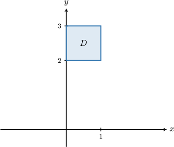
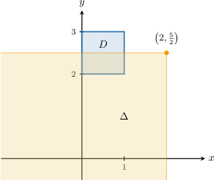
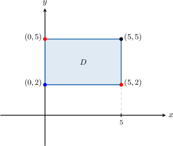
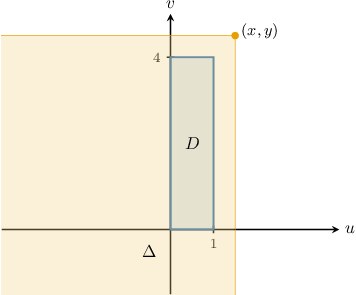
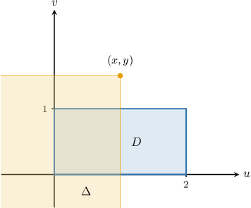

# The Joint CDF of Two Continuous Random Variables

Source: https://www.mathacademy.com/topics/3640?courseId=155
Topic ID: 3640

## Prerequisites

- [The Joint CDF of Two Discrete Random Variables](../mathematical-methods-for-the-physical-sciences-i/3004-the-joint-cdf-of-two-discrete-random-variables.md)
- [Independence of Continuous Random Variables](./3863-independence-of-continuous-random-variables.md)

## Lesson

### Introduction

The **joint cumulative distribution function** (or joint CDF) of two continuous random variables $X$ and $Y$ is defined as

$$

F(x,y)=P(X \leq x,Y \leq y).

$$

The joint CDF gives the probability that the pair $(X,Y)$ will lie inside the infinite rectangular region $\Delta$ that has its top-right corner at $(x,y)$ and whose sides are parallel to the coordinate axes.

The joint CDF satisfies the following properties:

- $0\leq F(x,y)\leq 1$

- The **marginal CDF** of $X$ is given by $F_X(x)=F(x,\infty).$

- The **marginal CDF** of $Y$ is given by $F_Y(y)=F(\infty,y).$

- $F(\infty, \infty)=1$

- $F(-\infty,y)=F(x,-\infty)=0$

- If $X$ and $Y$ are independent random variables, then $F(x,y)=F_X(x)\cdot F_Y(y).$

If $X$ and $Y$ are continuous random variables with joint probability density function $f(x, y)$, we have the following relationship between the joint PDF and joint CDF:

$$

F(x,y)=\int^y_{-\infty}\int^x_{-\infty} f(u,v)\; \textrm{d}u\textrm{d}v.

$$

Consequently, if $X$ and $Y$ are continuous random variables that are nonzero only over the rectangle $[a, b] \times [c, d]$, then the joint CDF is

$$

F(x,y)=\int^d_{c}\int^b_{a} f(u,v)\; \textrm{d}u\textrm{d}v.

$$

### Example: Computing the Value of the Joint CDF at a Point

#### Question

Let $X$ and $Y$ be continuous random variables with the joint probability density function

$$

\begin{aligned}\frac{3}{5}\sqrt{√𝑥}𝑦, & (𝑥,𝑦)∈𝐷, \\ 0, & otherwise.\end{aligned}

$$

If $F(x,y)$ is the joint CDF of $X$ and $Y,$ find $F\left(2, \dfrac{5}{2}\right).$

#### Explanation

If $X$ and $Y$ are continuous random variables with the joint probability density function $f(x,y),$ then the corresponding CDF is given by

$$

F(x,y) = P(X \leq x, Y \leq y) = \int_{-\infty}^y \int_{-\infty}^x f(u,v)\; \textrm{d}u \, \textrm{d}v.

$$

Let's draw the point $\left(2, \dfrac{5}{2}\right)$ on our diagram. Let's also consider the region $\Delta$ that lies below and to the left of this point.

Using the definition of the joint CDF, we have

$$

F\left(2, \dfrac{5}{2}\right) = P\left(X< 2, Y< \dfrac{5}{2}\right) = \int_{-\infty}^{5/2} \int_{-\infty}^{2} f(u,v)\; \textrm{d}u \, \textrm{d}v.

$$

For the purposes of computation, we're only interested in the region inside $\Delta$ where $f(x,y)$ is nonzero. This is given by

$$

D \cap \Delta =\left\{ (x,y) \: : \: 0 \leq x \leq 1, \: 2 \leq y \leq \dfrac{5}{2} \right\}.

$$

Therefore, we obtain

$$

\begin{aligned}∫_{5/2−∞}^{}∫_{2−∞}^{}𝑓(𝑢,𝑣)\,d𝑢\,d𝑣 & =∫_{5/22}^{}∫_{10}^{}\frac{3}{5}\sqrt{√𝑢}𝑣\,d𝑢\,d𝑣 \\ & =∫_{5/22}^{}∫_{10}^{}\frac{3}{5}𝑢^{1/2}𝑣\,d𝑢\,d𝑣 \\ & =∫_{5/22}^{}[\frac{3}{5}⋅\frac{2}{3}𝑢^{3/2}𝑣]_{𝑢=1𝑢=0}^{}\,d𝑣 \\ & =∫_{5/22}^{}[\frac{2}{5}𝑢^{3/2}𝑣]_{𝑢=1𝑢=0}^{}\,d𝑣 \\ & =∫_{5/22}^{}\frac{2}{5}𝑣\,d𝑣 \\ & =[\frac{𝑣^{2}}{5}]_{5/22}^{} \\ & =\frac{5}{4}−\frac{4}{5} \\ & =\frac{9}{20}.\end{aligned}

$$

### Example: Finding a Probability Geometrically Using a CDF

#### Question

Let the joint CDF of $X$ and $Y$ be $F(x, y),$ where

$$

F(5,5) = 0.9, \quad F(5,2) = 0.3, \quad F(0,5) = 0.45, \quad F(0,2) = 0.15.

$$

Find $P(0 \leq X \leq 5, 2 \leq Y \leq 5).$

#### Explanation

Recall that $F(x,y) = P(X \leq x, Y \leq y)$ is the probability that the pair $(X,Y)$ will lie inside the infinite rectangular region that has its top-right corner at $(x,y)$ and whose sides are parallel to the coordinate axes.

Let's sketch the region corresponding to the probability we wish to find.

Geometrically, this region can be obtained as follows:

1. Take the infinite rectangle that has its top-right corner at $(5,5).$

2. Subtract the infinite rectangles that have their top-right corners at $\color{red}(5,2)$ and ${\color{red}{(0,5)}}.$

3. Finally, we need to ** the infinite rectangle that has its top-right corner at ${\color{blue}{(0,2)}}.$ This is because we subtracted this region twice in step 2.

Therefore, we have

$$

\begin{aligned}𝑃(0≤𝑋≤5,2≤𝑌≤5) & =\overset{\overset{𝑃(𝑋≤5,𝑌≤5)}{}}{top-right corner at (5,5)} \\ & =\,−\overset{\overset{𝑃(𝑋≤5,𝑌≤2)}{}}{top-right corner at (5,2)}−\overset{\overset{𝑃(𝑋≤0,𝑌≤5)}{}}{top-right corner at (0,5)} \\ & =\,+\overset{\overset{𝑃(𝑋≤0,𝑌≤2)}{}}{top-right corner at (0,2)} \\ & =𝐹(5,5)−𝐹(5,2)−𝐹(0,5)+𝐹(0,2) \\ & =0.9−0.3−0.45+0.15 \\ & =0.3.\end{aligned}

$$

### Example: Finding Part of a Joint CDF from a Joint PDF: Simple Cases

#### Question

Let $X$ and $Y$ be continuous random variables with the joint probability density function

$$

\begin{aligned}\frac{1}{4}𝑥𝑦, & 0≤𝑥≤1,\,0≤𝑦≤4, \\ 0, & otherwise.\end{aligned}

$$

Find the expression for the corresponding joint CDF when $x > 1,\; y > 4.$

#### Explanation

If $X$ and $Y$ are continuous random variables with the joint probability density function $f(x,y),$ then the corresponding joint CDF is given by

$$

F(x,y) = P(X \leq x, Y \leq y) = \int_{-\infty}^y \int_{-\infty}^x f(u,v)\; \textrm{d}u \, \textrm{d}v.

$$

Let's draw the region $D$ in the $uv$-plane where the function $f(u,v)$ is nonzero. Let's also consider a point $(x,y)$ where $x > 1,\; y >4,$ and a region $\Delta$ that lies below and to the left of this point.

For the purposes of computation, we're only interested in the region inside $\Delta$ where $f(x,y)$ is nonzero. This is given by

$$

D \cap \Delta = D.

$$

So our region $\Delta$ covers the entire region where $f(x,y)$ is nonzero. Therefore, we obtain

$$

\begin{aligned}∫_{𝑦−∞}^{}∫_{𝑥−∞}^{}𝑓(𝑢,𝑣)\,d𝑢\,d𝑣 & =∬_{𝐷}𝑓(𝑢,𝑣)\,d𝑢\,d𝑣=1.\end{aligned}

$$

### Example: Finding Part of a Joint CDF from a Joint PDF

#### Question

Let $X$ and $Y$ be continuous random variables with the joint probability density function

$$

\begin{aligned}\frac{1}{3}(𝑥+𝑦), & 0≤𝑥≤2,\,0≤𝑦≤1 \\ 0, & otherwise\end{aligned}

$$

Find the expression for the corresponding joint CDF when $0 \leq x \leq 2$ and $y\gt 1.$

#### Explanation

If $X$ and $Y$ are continuous random variables with the joint probability density function $f(x,y),$ then the corresponding joint CDF is given by

$$

F(x,y) = P(X \leq x, Y \leq y) = \int_{-\infty}^y \int_{-\infty}^x f(u,v)\; \textrm{d}u \, \textrm{d}v.

$$

Let's draw the region $D$ in the $uv$-plane where the function $f(u,v)$ is nonzero. Let's also consider a point $(x,y)$ where $0 \leq x \leq 2,\; y \gt 1$ and a region $\Delta$ that lies below and to the left of this point.

For the purposes of computation, we're only interested in the region inside $\Delta$ where $f(x,y)$ is nonzero. This is given by

$$

D \cap \Delta =\left\{ (u,v) \: : \: 0 \leq u \leq x, \: 0 \leq v \leq 1 \right\}.

$$

Therefore, we obtain

$$

\begin{aligned}∫_{𝑦−∞}^{}∫_{𝑥−∞}^{}𝑓(𝑢,𝑣)\,d𝑢\,d𝑣 & =∫_{10}^{}∫_{𝑥0}^{}\frac{1}{3}(𝑢+𝑣)\,d𝑢\,d𝑣 \\ & =\frac{1}{3}∫_{10}^{}[\frac{𝑢^{2}}{2}+𝑢𝑣]_{𝑢=𝑥𝑢=0}^{}\,d𝑣 \\ & =\frac{1}{3}∫_{10}^{}[\frac{𝑥^{2}}{2}+𝑥𝑣]d𝑣 \\ & =\frac{1}{3}[\frac{𝑥^{2}𝑣}{2}+\frac{𝑥𝑣^{2}}{2}]_{𝑣=1𝑣=0}^{} \\ & =\frac{1}{3}[\frac{𝑥^{2}}{2}+\frac{𝑥}{2}−0] \\ & =\frac{1}{6}(𝑥^{2}+𝑥).\end{aligned}

$$
