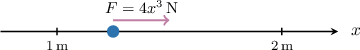

# The Work-Energy Principle

Source: https://www.mathacademy.com/topics/3687?courseId=155
Topic ID: 3687

## Prerequisites

- [Newton's Second Law](./2722-newton-s-second-law.md)
- [Velocity and Acceleration as Functions of Displacement](./3235-velocity-and-acceleration-as-functions-of-displacement.md)

## Lesson

### Introduction

In this lesson, we'll discuss the concepts of **work** and **kinetic energy** and describe how these concepts are related.

The **work done by the force** $F=F(x)$ in moving a particle from the position $x=x_1$ to the position $x=x_2$ along the $x$-axis is defined as

$$

W = \int_{x_1}^{x_2} F(x) \,\text{d}x.

$$

When the force and distance are measured in Newtons ($\text{N}$) and meters ($\text{m}$), respectively, the work done by the force is measured in Joules ($\rm{J}$).

For example, suppose a particle $P$ is moving along the $x$-axis under the action of a force of magnitude $4x^3\,\text{N},$ acting in the direction of increasing $x,$ as shown below. Distances along the $x$-axis are measured in meters.

Let's calculate the work done by the force in moving the particle from $x=1$ to $x=2.$

Substituting the given values into our formula, we obtain

$$

\begin{aligned}𝑊 & =∫_{21}4𝑥^{3}\,d𝑥 \\ & =𝑥^{4}\,_{21} \\ & =16−1 \\ & =15\,J.\end{aligned}

$$

Therefore, the work done by $F$ in moving $P$ from $x_1=1\,\textrm m$ to $x_2=2\,\textrm m$ equals $15\,\textrm J.$

We can use the concept of work in conjunction with Newton's second law. Let's see an example.

### Example: Calculating the Work Done by a Force

#### Question

A particle $P$ of mass $3\,\rm{kg}$ moves along the $x$-axis with an acceleration of magnitude $(1 + 2x^2)\,\rm{m/s}^2$ acting in the direction $OP.$ Given that $x$ is measured in meters, calculate the work done by the force in moving the particle from $x=0$ to $x=2.$

#### Explanation

The work done by a force $F=F(x)$ in moving a particle from $x=x_1$ to $x=x_2$ is given by

$$

W = \int_{x_1}^{x_2} F(x) \,\text{d}x.

$$

When the force and distance are measured in Newtons and meters, respectively, the work done by the force is measured in Joules ($\rm{J}$).

Using Newton's second law of motion, the force required to accelerate a particle of mass $3\,\rm{kg}$ at a rate of $(1 + 2x^2)\,\rm{m/s}^2$ is

$$

F = ma = 3 \cdot (1 + 2x^2) = (3 + 6x^2) \,\rm{N}.

$$

Now, substituting the known values into our integral, we obtain

$$

\begin{aligned}𝑊 & =∫_{20}(3+6𝑥^{2})\,d𝑥 \\ & =[3𝑥+2𝑥^{3}]_{20} \\ & =3(2)+2(2^{3})−(3(0)+2(0^{3})) \\ & =6+16−0 \\ & =22\,J.\end{aligned}

$$

### Kinetic Energy

The **kinetic energy** of a particle with mass $m$ and velocity $v$ is given by

$$

\text{KE} = \dfrac12mv^2.

$$

When the mass and velocity are measured in kilograms ($\rm{kg}$) and meters per second ($\rm{m/s}$), respectively, the particle's kinetic energy is measured in Joules ($\rm{J}$).

For example, suppose a particle $P$ of mass $5\,\rm{kg}$ is moving along the $x$-axis from rest at the origin with an acceleration of $3t^2\,\rm{m/s}^2,$ where $t \geq 0$ is the time in seconds. Let's calculate the particle's kinetic energy at time $t=2\,\rm{s}.$

First, we find $v(t)$ by integrating the acceleration with respect to time:

$$

\begin{aligned}𝑣(𝑡) & =∫𝑎(𝑡)\,d𝑡 \\ 𝑣(𝑡) & =∫3𝑡^{2}\,d𝑡 \\ 𝑣(𝑡) & =𝑡^{3}+𝐶\end{aligned}

$$

To determine $C,$ we use the fact that $v(0)=0.$ Substituting this into the above gives

$$

0 = 0^3 + C \qquad\Longrightarrow\qquad C = 0.

$$

Hence, the velocity of the particle at time $t$ is $v(t) = t^3.$ In particular, its velocity at time $t=2\,\rm{s}$ is

$$

v=v(2) = 2^3 = 8\,\rm{m/s}.

$$

Therefore, the kinetic energy of the particle at $t=2$ is

$$

\begin{aligned}KE & =\frac{1}{2}𝑚𝑣^{2} \\ & =\frac{1}{2}⋅5⋅8^{2} \\ & =160\,J.\end{aligned}

$$

Note the following:

- Kinetic energy is a *scalar* quantity.

- You probably noticed that kinetic energy and work have the same units. This is not a coincidence! We'll learn more about that shortly.

- In practical applications, it's often more important to calculate a *change* in the kinetic energy of a particle between two points in time. The **change in kinetic energy** of a particle with mass $m,$ **initial velocity** $v_0,$ and **final velocity** $v_1$ is given by

### Example: Calculating the Kinetic Energy of a Particle

#### Question

A particle $P$ of mass $2\,\rm{kg}$ moves along the $x$-axis from rest at the origin with an acceleration of magnitude $(4t+1)\,\rm{m/s}^2,$ where the acceleration acts in the direction of increasing $x,$ and $t \geq 0$ is the time in seconds. Calculate the change in kinetic energy of the particle between the times $t = 1\,\rm{s}$ and $t = 2\,\rm{s}.$

#### Explanation

The change in kinetic energy of a particle with mass $m,$ initial velocity $v_0,$ and final velocity $v_1$ is given by

$$

\Delta \, \text{KE} = \dfrac{1}{2}mv_{1}^{2} - \dfrac{1}{2}mv_{0}^{2}.

$$

When the mass and velocity are measured in kilograms and meters per second, respectively, the particle's kinetic energy is measured in Joules ($\rm{J}$).

First, we find $v(t)$ by integrating the acceleration with respect to time:

$$

\begin{aligned}𝑣(𝑡) & =∫𝑎(𝑡)\,d𝑡 \\ 𝑣(𝑡) & =∫(4𝑡+1)\,d𝑡 \\ 𝑣(𝑡) & =2𝑡^{2}+𝑡+𝐶\end{aligned}

$$

To determine $C,$ we use the fact that $v(0) = 0.$ Substituting this into the above gives

$$

0 = 2(0^2) + 0 + C \qquad\Longrightarrow\qquad C = 0.

$$

Hence, the velocity of the particle at time $t$ is $v(t) = 2t^2 + t.$ In particular, its inital velocity at time $t = 1\,\rm{s}$ and final velocity at time $t = 2\,\rm{s}$ are

$$

\begin{aligned}𝑣_{0} & =𝑣(1)=2(1^{2})+1=3\,m/s, \\ 𝑣_{1} & =𝑣(2)=2(2^{2})+2=10\,m/s.\end{aligned}

$$

Therefore, the change in kinetic energy of the particle between these times is

$$

\begin{aligned}Δ\,KE & =\frac{1}{2}𝑚𝑣_{21}−\frac{1}{2}𝑚𝑣_{20} \\ & =\frac{1}{2}⋅2⋅10^{2}−\frac{1}{2}⋅2⋅3^{2} \\ & =100−9 \\ & =91\,J.\end{aligned}

$$

### The Work-Energy Principle

The **work-energy principle** states that the work done by a resultant force on a particle equals the change in the particle's kinetic energy. That is,

$$

W = \Delta\, \text{KE}

$$

where the change in kinetic energy of a particle is given by

$$

\Delta\, \text{KE} = \dfrac12 m v_1^2 - \dfrac12 m v_0^2

$$

and $m$ is the particle's mass, $v_0$ is its initial velocity, and $v_1$ is its final velocity.

### Example: Applying the Work-Energy Principle To Find the Work Done by a Force

#### Question

A particle $P$ of mass $1\,\rm{kg}$ moves along the $x$-axis under the action of a resultant force. The displacement of the particle is given by $(t^2-2t+3)\,\rm{m},$ where $t \geq 0$ is the time in seconds. Calculate the work done by the force between the times $t=1\,\rm{s}$ and $t=3\,\rm{s}.$

#### Explanation

The work-energy principle states that the work done by a resultant force on a particle equals the change in the particle's kinetic energy. That is,

$$

W = \Delta\, \text{KE}

$$

where the change in kinetic energy of a particle is given by

$$

\Delta\, \text{KE} = \dfrac12 m v_1^2 - \dfrac12 m v_0^2

$$

and $m$ is the particle's mass, $v_0$ is its initial velocity, and $v_1$ is its final velocity.

The displacement of the particle is given by $x(t)=t^2-2t+3,$ where $t$ is time in seconds. We find the velocity $v(t)$ of the particle by differentiating the displacement with respect to time:

$$

\begin{aligned}𝑣(𝑡) & =\frac{d𝑥}{d𝑡} \\ & =\frac{d}{d𝑡}(𝑡^{2}−2𝑡+3) \\ & =2𝑡−2\end{aligned}

$$

So, the particle's initial velocity, at $t=1$, is

$$

v_0 = v(1) = 2(1) -2 = 0\,\rm{m/s},

$$

and its final velocity, at $t=3$, is

$$

v_1 = v(3) = 2(3) -2= 4\,\rm{m/s}.

$$

Therefore, by the work-energy principle, the work done by the force between these times is

$$

\begin{aligned}𝑊 & =Δ\,KE \\ & =\frac{1}{2}⋅1⋅(4)^{2}−\frac{1}{2}⋅1⋅0^{2} \\ & =8−0 \\ & =8\,J.\end{aligned}

$$

### Example: Applying the Work-Energy Principle to Find a Particle's Velocity

#### Question

A particle $P$ of mass $2\,\rm{kg}$ moves along the $x$-axis under the action of a force of magnitude $(x+3)\,\rm{N}$ acting in the direction of increasing $x.$ Given that $x$ is measured in meters, and the particle has velocity $v=2\,\rm{m/s}$ at $x=2,$ calculate the velocity of the particle at $x=4.$

#### Explanation

The work-energy principle states that the work done by a resultant force on a particle equals the change in the particle's kinetic energy. That is,

$$

W = \Delta\, \text{KE}

$$

where the change in kinetic energy of a particle is given by

$$

\Delta\, \text{KE} = \dfrac12 m v_1^2 - \dfrac12 m v_0^2

$$

and $m$ is the particle's mass, $v_0$ is its initial velocity, and $v_1$ is its final velocity.

First, we calculate the work done by the force in moving the particle from $x=2$ to $x=4{:}$

$$

\begin{aligned}𝑊 & =∫_{𝑥_{2}𝑥_{1}}^{}𝐹(𝑥)\,d𝑥 \\ & =∫_{42}(𝑥+3)\,d𝑥 \\ & =[\frac{𝑥^{2}}{2}+3𝑥]_{42} \\ & =(8+12)−(2+6) \\ & =12\,J\end{aligned}

$$

The particle has velocity $v=2\,\rm{m/s}$ at $x=2.$ So, we can find the velocity $v_1$ at $x=4$ using the work-energy principle:

$$

\begin{aligned}𝑊 & =\frac{1}{2}𝑚𝑣_{21}−\frac{1}{2}𝑚𝑣_{20} \\ 12 & =\frac{1}{2}⋅2⋅𝑣_{21}−\frac{1}{2}⋅2⋅2^{2} \\ 12 & =𝑣_{21}−4 \\ 𝑣_{21} & =16 \\ 𝑣_{1} & =±4.\end{aligned}

$$

We can disregard the negative solution since the velocity and acceleration of the particle are positive in the regions under consideration.

Therefore, the velocity of the particle at $x=4$ is $4\,\rm{m/s}.$
