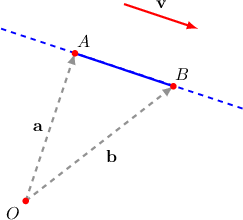

# Line Integrals of Scalar Functions Over Line Segments

Source: https://www.mathacademy.com/topics/3699?courseId=155
Topic ID: 3699

## Prerequisites

- [The Vector Equation of a Line](../linear-algebra/1376-the-vector-equation-of-a-line.md)
- [Properties of Line Integrals of Scalar Functions](./3145-properties-of-line-integrals-of-scalar-functions.md)

## Lesson

### Introduction

Recall that the line integral with respect to arc length of a function $f(x,y)$ along a curve $C$ is given by

$$

\int\limits_C f(x, y) \, \text{d}s = \int\limits_{t_a}^{t_b} f(\mathbf r(t)) \, \| \mathbf r'(t) \| \, \text{d}t,

$$

where $\mathbf r(t)$ for $t_a \leq t \leq t_b$ is a parametrization of the curve $C.$

In this lesson, we will consider the case when the curve $C$ is a line segment. To calculate a line integral along a segment, we first need to parameterize the segment.

For example, suppose we wish to parameterize the segment between the points $A$ and $B$ with position vectors $\mathbf a$ and $\mathbf b$ respectively, as shown below.

The vector equation of the line that is parallel to $\mathbf{v}$ and passes through $A$ is given by

$$

\begin{aligned}𝐫=𝐚+𝑡𝐯,\end{aligned}

$$

where $\mathbf v$ is parallel to the line.

We can express $\mathbf v$ as

$$

\mathbf v = \mathbf b - \mathbf a,

$$

which gives the equation of the line as

$$

\mathbf{r} = \mathbf{a} + t (\mathbf b - \mathbf a).

$$

Since we only want to parameterize the part of the line that lies between $A$ and $B,$ we set the restriction $0\leq t \leq 1.$ Therefore, the complete parametrization of the line segment is

$$

\mathbf{r} = \mathbf{a} + t (\mathbf b - \mathbf a), \qquad 0\leq t\leq 1.

$$

Note the following:

- You can check that $t=0$ corresponds to the point $A,$ and $t=1$ corresponds to the point $B.$

- It's important to realize that this parametrization traverses the segment *from* the point $A$ *to* the point $B.$ The orientation of our segment does not affect line integrals with respect to arc length, but it is important for other line integrals that we'll meet later.

### Example: Constructing a Line Integral Along a Segment in the Cartesian Plane

#### Question

Find a definite integral that is equivalent to the line integral of the function $f(x,y) = x+\sin{y},$ traversed along the line segment from $(1,0)$ to $(1,1).$

#### Explanation

We will use the formula

$$

\int\limits_C f(x, y) \, \text{d}s = \int\limits_{t_a}^{t_b} f(\mathbf r(t)) \, \| \mathbf r'(t) \| \, \text{d}t,

$$

where $C$ is the line segment from $(1,0)$ to $(1,1).$

The position vectors of the endpoints of our line segment are $\mathbf{a}=\mathbf{i}$ and $\mathbf{b}=\mathbf{i}+\mathbf{j}.$ So, the parametrization of the line segment is given by

$$

\begin{aligned}𝐫(𝑡) & =𝐚+𝑡\,(𝐛−𝐚) \\ & =𝐢+𝑡[(𝐢+𝐣)−𝐢] \\ & =𝐢+𝑡\,𝐣\end{aligned}

$$

where $0 \le t \le 1.$ Thus, we have that $x=1$ and $y=t$ along the segment.

Computing $\mathbf{r}'(t)$ and $\| \mathbf{r}'(t) \|,$ we get the following:

$$

\begin{aligned}𝐫^{′}(𝑡) & =\frac{d𝑥}{d𝑡}\,𝐢+\frac{d𝑦}{d𝑡}\,𝐣 \\ & =\frac{d}{d𝑡}(1)𝐢+\frac{d}{d𝑡}(𝑡)𝐣 \\ & =0\,𝐢+𝐣 \\ & =𝐣 \\ ‖𝐫^{′}(𝑡)‖ & =\sqrt{(\frac{d𝑥}{d𝑡})^{2}+(\frac{d𝑦}{d𝑡})^{2}} \\ & =\sqrt{0^{2}+1^{2}} \\ & =1\end{aligned}

$$

Now, since $f(x,y) = x+\sin{y}$, we obtain

$$

\begin{aligned}𝑓(𝐫(𝑡)) & =1+sin⁡𝑡.\end{aligned}

$$

Therefore, we can write the integral as

$$

\begin{aligned}\underset{𝐶}{∫}𝑓(𝑥,𝑦)\,d𝑠 & =∫_{10}𝑓(𝐫(𝑡))\,‖𝐫^{′}(𝑡)‖\,d𝑡 \\ & =∫_{10}(1+sin⁡𝑡)⋅1⋅d𝑡 \\ & =∫_{10}(1+sin⁡𝑡)d𝑡.\end{aligned}

$$

### Example: Calculating a Line Integral Along a Segment in the Cartesian Plane

#### Question

Evaluate the integral of the function $f(x,y) = e^{x+y}$ along the line segment from $(0,3)$ to $(2,3).$

#### Explanation

We will use the formula

$$

\int\limits_C f(x, y) \, \text{d}s = \int\limits_{t_a}^{t_b} f(\mathbf r(t)) \, \| \mathbf r'(t) \| \, \text{d}t,

$$

where $C$ is the line segment from $(0,3)$ to $(2,3).$

The position vectors of the endpoints of our line segment are $\mathbf{a}=3\,\mathbf{j}$ and $\mathbf{b}=2\,\mathbf{i}+3\,\mathbf{j}.$ So, the parametrization of the line segment is given by

$$

\begin{aligned}𝐫(𝑡) & =𝐚+𝑡\,(𝐛−𝐚) \\ & =3\,𝐣+𝑡[(2\,𝐢+3\,𝐣)−3\,𝐣] \\ & =3\,𝐣+𝑡(2\,𝐢) \\ & =2𝑡\,𝐢+3\,𝐣\end{aligned}

$$

where $0 \le t \le 1.$ Thus, we have that $x=2t$ and $y=3$ along the segment.

Computing $\mathbf{r}'(t)$ and $\| \mathbf{r}'(t) \|,$ we get the following:

$$

\begin{aligned}𝐫^{′}(𝑡) & =\frac{d𝑥}{d𝑡}\,𝐢+\frac{d𝑦}{d𝑡}\,𝐣 \\ & =\frac{d}{d𝑡}(2𝑡)𝐢+\frac{d}{d𝑡}(3)𝐣 \\ & =2\,𝐢 \\ ‖𝐫^{′}(𝑡)‖ & =\sqrt{(\frac{d𝑥}{d𝑡})^{2}+(\frac{d𝑦}{d𝑡})^{2}} \\ & =\sqrt{2^{2}+0^{2}} \\ & =2\end{aligned}

$$

Now, since $f(x,y) = e^{x+y},$ we obtain

$$

\begin{aligned}𝑓(𝐫(𝑡)) & =𝑒^{2𝑡+3}.\end{aligned}

$$

Therefore, we can write the integral as

$$

\begin{aligned}\underset{𝐶}{∫}𝑒^{𝑥+𝑦}\,d𝑠 & =∫_{10}𝑓(𝐫(𝑡))\,‖𝐫^{′}(𝑡)‖\,d𝑡 \\ & =∫_{10}𝑒^{2𝑡+3}⋅2⋅d𝑡 \\ & =2∫_{10}𝑒^{2𝑡+3}\,d𝑡.\end{aligned}

$$

We can solve this using the substitution $u=2t+3,$ $\textrm d u=2\,\textrm d t$ as follows:

$$

\begin{aligned}2∫_{10}𝑒^{2𝑡+3}\,d𝑡 & =∫_{53}𝑒^{𝑢}\,d𝑢 \\ & =𝑒^{𝑢}\,_{53} \\ & =𝑒^{5}−𝑒^{3} \\ & =𝑒^{3}(𝑒^{2}−1)\end{aligned}

$$

### Example: Line Integrals Along Segments in Three Dimensions

#### Question

Find the line integral of the function $f(x,y,z) = x^2+y-z,$ traversed along the line segment from $(0,1,-3)$ to $(-1,2,-2)?$

#### Explanation

We will use the formula

$$

\int\limits_C f(x,y,z) \, \text{d}s = \int\limits_{t_a}^{t_b} f(\mathbf r(t)) \, \| \mathbf r'(t) \| \, \text{d}t,

$$

where $C$ is the line segment from $(0,1,-3)$ to $(-1,2,-2).$

The position vectors of the endpoints of our line segment are $\mathbf{a}=\mathbf{j}-3\mathbf{k}$ and $\mathbf{b}=-\,\mathbf{i}+2\,\mathbf{j}-2\,\mathbf{k}.$ So, the parametrization of the line segment is given by

$$

\begin{aligned}𝐫(𝑡) & =𝐚+𝑡\,(𝐛−𝐚) \\ & =(𝐣−3𝐤)+𝑡[(−\,𝐢+2\,𝐣−2\,𝐤)−(𝐣−3𝐤)] \\ & =(𝐣−3𝐤)+𝑡(−𝐢+\,𝐣+𝐤) \\ & =−𝑡\,𝐢+(𝑡+1)\,𝐣+(𝑡−3)\,𝐤\end{aligned}

$$

where $0 \le t \le 1.$ Thus, we have that $x=-t, y=t+1,$ and $z=t-3$ along the segment.

Computing $\mathbf{r}'(t)$ and $\| \mathbf{r}'(t) \|,$ we get the following:

$$

\begin{aligned}𝐫^{′}(𝑡) & =\frac{d𝑥}{d𝑡}\,𝐢+\frac{d𝑦}{d𝑡}\,𝐣+\frac{d𝑧}{d𝑡}\,𝐤 \\ & =\frac{d}{d𝑡}(−𝑡)𝐢+\frac{d}{d𝑡}(𝑡+1)𝐣+\frac{d}{d𝑡}(𝑡−3)𝐤 \\ & =−𝐢+𝐣+𝐤 \\ ‖𝐫^{′}(𝑡)‖ & =\sqrt{(\frac{d𝑥}{d𝑡})^{2}+(\frac{d𝑦}{d𝑡})^{2}+(\frac{d𝑧}{d𝑡})^{2}} \\ & =\sqrt{(−1)^{2}+1^{2}+1^{2}} \\ & =\sqrt{3}\end{aligned}

$$

Now, since $f(x,y) = x^2+y-z$, we obtain

$$

\begin{aligned}𝑓(𝐫(𝑡)) & =(−𝑡)^{2}+(𝑡+1)−(𝑡−3) \\ & =𝑡^{2}+4.\end{aligned}

$$

Therefore, we can write the integral as

$$

\begin{aligned}\underset{𝐶}{∫}𝑓(𝑥,𝑦)\,d𝑠 & =∫_{10}𝑓(𝐫(𝑡))\,‖𝐫^{′}(𝑡)‖\,d𝑡 \\ & =∫_{10}(𝑡^{2}+4)⋅\sqrt{3}⋅d𝑡 \\ & =\sqrt{3}∫_{10}(𝑡^{2}+4)\,d𝑡.\end{aligned}

$$
