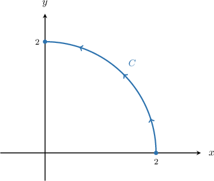

# Sums of Line Integrals With Respect to X and Y

Source: https://www.mathacademy.com/topics/3703?courseId=155
Topic ID: 3703

## Prerequisites

- [Line Integrals of Scalar Functions Over Paths Expressed as Functions of Y](./3689-line-integrals-of-scalar-functions-over-paths-expressed-as-functions-of-y.md)
- [Sums of Line Integrals With Respect to X and Y Over Parametric Curves](./3705-sums-of-line-integrals-with-respect-to-x-and-y-over-parametric-curves.md)

## Lesson

### Introduction

Let $f(x,y)$ be a function of two variables and $C$ be a path in the $xy$-plane. Recall that the line integral

$$

\int\limits_C f(x,y) \, \textrm dx + f(x,y)\,\textrm d y

$$

can be evaluated by parameterizing $C$ using the parameter $t\in [a,b]$ and then applying a change of variables, as follows:

$$

\begin{aligned}\underset{𝐶}{∫}𝑓(𝑥,𝑦)\,d𝑥+𝑓(𝑥,𝑦)\,d𝑦 & =∫_{𝑏𝑎}^{}𝑓(𝑥,𝑦)\frac{d𝑥}{d𝑡}\,d𝑡+𝑓(𝑥,𝑦)\frac{d𝑦}{d𝑡}\,d𝑡 \\ & =∫_{𝑏𝑎}^{}(𝑓(𝑥,𝑦)\frac{d𝑥}{d𝑡}+𝑓(𝑥,𝑦)\frac{d𝑦}{d𝑡})\,d𝑡\end{aligned}

$$

The hardest part is often finding a suitable parameterization for curve $C.$ We'll discuss a number of different cases in this lesson.

### Example: Evaluating Line Integrals With Respect to X and Y Over Segments

#### Question

If the path $C$ is the line segment $\overline{AB}$ traversed from the point $A(0,0)$ to the point $B(1, 1),$ calculate the line integral

$$

\displaystyle \int\limits_C x^2y\,\mathrm{d}x + xy\,\mathrm{d}y.

$$

#### Explanation

The position vectors of the endpoints of our line segment are $\mathbf{a} = 0\,\mathbf{i} + 0\,\mathbf{j}$ and $\mathbf{b} = 1\,\mathbf{i} + 1\,\mathbf{j}.$ So, the parametrization of the line segment is given by

$$

\begin{aligned}𝐫(𝑡) & =𝐚+𝑡\,(𝐛−𝐚) \\ & =𝑡\,𝐢+𝑡\,𝐣,\end{aligned}

$$

where $0 \le t \le 1.$ So, we have that $x(t) = t$ and $y(t) = t$ along the segment.

The derivative of $\mathbf r(t)$ is given by

$$

\begin{aligned}𝐫^{′}(𝑡) & =\frac{d𝑥}{d𝑡}\,𝐢+\frac{d𝑦}{d𝑡}\,𝐣=𝐢+𝐣.\end{aligned}

$$

We can now evaluate the line integral:

$$

\begin{aligned}\underset{𝐶}{∫}𝑥^{2}𝑦\,d𝑥+𝑥𝑦\,d𝑦 & =∫_{10}^{}𝑥^{2}𝑦\,\frac{d𝑥}{d𝑡}\,d𝑡+𝑥𝑦\,\frac{d𝑦}{d𝑡}\,d𝑡 \\ & =∫_{10}^{}(𝑥^{2}𝑦\,\frac{d𝑥}{d𝑡}+𝑥𝑦\,\frac{d𝑦}{d𝑡})d𝑡 \\ & =∫_{10}^{}𝑡^{2}⋅𝑡⋅1+𝑡⋅𝑡⋅1\,d𝑡 \\ & =∫_{10}^{}𝑡^{3}+𝑡^{2}\,d𝑡 \\ & =[\frac{𝑡^{4}}{4}+\frac{𝑡^{3}}{3}]_{10}^{} \\ & =\frac{1}{4}+\frac{1}{3} \\ & =\frac{7}{12}\end{aligned}

$$

### Example: Evaluating Line Integrals With Respect to X and Y Along Cartesian Curves

#### Question

If the path $C$ is a part of the parabola $y=x^2$ traversed from the point $A(0,0)$ to the point $B(1,1),$ evaluate the line integral

$$

\displaystyle \int\limits_C (x+y)\,\mathrm{d}x + (x-y)\,\mathrm{d}y.

$$

#### Explanation

Notice that our curve is given by the explicit Cartesian equation $y = x^2.$ As a result, we obtain the following parametrization of the curve:

$$

\begin{aligned}𝐫(𝑡)=𝑥(𝑡)\,𝐢+𝑦(𝑡)\,𝐣=𝑡\,𝐢+𝑡^{2}\,𝐣,\,𝑡∈[0,1]\end{aligned}

$$

The derivative of $\mathbf r(t)$ is given by

$$

\begin{aligned}𝐫^{′}(𝑡) & =\frac{d𝑥}{d𝑡}\,𝐢+\frac{d𝑦}{d𝑡}\,𝐣=𝐢+2𝑡\,𝐣.\end{aligned}

$$

We can now evaluate the line integral:

$$

\begin{aligned}\underset{𝐶}{∫}(𝑥+𝑦)\,d𝑥+(𝑥−𝑦)\,d𝑦 & =∫_{10}^{}(𝑥+𝑦)\,\frac{d𝑥}{d𝑡}\,d𝑡+(𝑥−𝑦)\,\frac{d𝑦}{d𝑡}\,d𝑡 \\ & =∫_{10}^{}((𝑥+𝑦)\,\frac{d𝑥}{d𝑡}+(𝑥−𝑦)\,\frac{d𝑦}{d𝑡})d𝑡 \\ & =∫_{10}^{}(𝑡+𝑡^{2})⋅1+(𝑡−𝑡^{2})⋅2𝑡\,d𝑡 \\ & =∫_{10}^{}𝑡+3𝑡^{2}−2𝑡^{3}\,d𝑡 \\ & =[\frac{𝑡^{2}}{2}+𝑡^{3}−\frac{𝑡^{4}}{2}]_{10}^{} \\ & =[\frac{1}{2}+1−\frac{1}{2}]−[0] \\ & =1\end{aligned}

$$

### Example: Computing Line Integrals With Respect to X and Y Along Circles and Ellipses

#### Question

Evaluate $\displaystyle \int\limits_C \dfrac{y\,\mathrm{d}x - x\,\mathrm{d}y}{x^2+y^2},$ where $C$ is a part of the circle $x^2+y^2=4$ traversed in the counterclockwise direction from the point $(2,0)$ to the point $\left(0,2\right).$

#### Explanation

First, notice that a parametrization for the given path is

$$

\begin{aligned}𝐫(𝑡) & =𝑥(𝑡)\,𝐢+𝑦(𝑡)\,𝐣=2cos⁡𝑡\,𝐢+2sin⁡𝑡\,𝐣,\,𝑡∈[0,\frac{𝜋}{2}].\end{aligned}

$$

The derivative of $\mathbf r(t)$ is

$$

\begin{aligned}𝐫^{′}(𝑡) & =𝑥^{′}(𝑡)\,𝐢+𝑦^{′}(𝑡)\,𝐣=−2sin⁡𝑡\,𝐢+2cos⁡𝑡\,𝐣.\end{aligned}

$$

Therefore, we can calculate the line integral as follows:

$$

\begin{aligned}\underset{𝐶}{∫}\frac{𝑦\,d𝑥−𝑥\,d𝑦}{𝑥^{2}+𝑦^{2}} & =∫_{𝜋/20}^{}\frac{𝑦⋅𝑥^{′}−𝑥⋅𝑦^{′}}{𝑥^{2}+𝑦^{2}}\,d𝑡 \\ & =∫_{𝜋/20}^{}\frac{(2sin⁡𝑡)(−2sin⁡𝑡)−(2cos⁡𝑡)(2cos⁡𝑡)}{(2cos⁡𝑡)^{2}+(2sin⁡𝑡)^{2}},d𝑡 \\ & =∫_{𝜋/20}^{}\frac{−4sin^{2}⁡𝑡−4cos^{2}⁡𝑡}{4(cos^{2}⁡𝑡+sin^{2}⁡𝑡)}\,d𝑡 \\ & =∫_{𝜋/20}^{}\frac{−4(sin^{2}⁡𝑡+cos^{2}⁡𝑡)}{4(cos^{2}⁡𝑡+sin^{2}⁡𝑡)}\,d𝑡 \\ & =−∫_{𝜋/20}^{}\,d𝑡 \\ & =−\frac{𝜋}{2}\end{aligned}

$$
