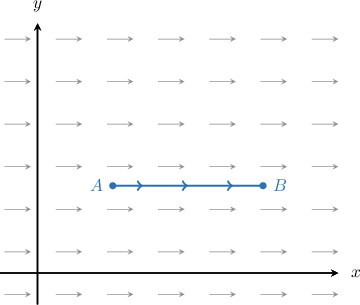
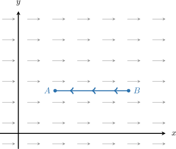
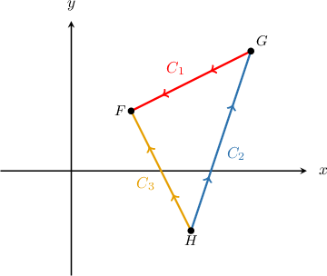
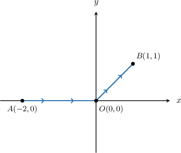

# Properties of Line Integrals of Vector-Valued Functions

Source: https://www.mathacademy.com/topics/3704?courseId=155
Topic ID: 3704

## Prerequisites

- [Interpreting Line Integrals of Vector-Valued Functions](./3694-interpreting-line-integrals-of-vector-valued-functions.md)
- [Sums of Line Integrals With Respect to X and Y Over Parametric Curves](./3705-sums-of-line-integrals-with-respect-to-x-and-y-over-parametric-curves.md)
- [Properties of Line Integrals With Respect to X and Y](./3708-properties-of-line-integrals-with-respect-to-x-and-y.md)
- [Line Integrals of Vector-Valued Functions Over General Curves](./3711-line-integrals-of-vector-valued-functions-over-general-curves.md)

## Lesson

### Introduction

Line integrals of vector-valued functions share a fundamental connection with line integrals with respect to $x$ and $y.$

Consider a vector field $\mathbf F$ on $\mathbb R^2$ with components $P$ and $Q\mathbin{:}$

$$

\mathbf F(x,y) = P(x,y)\,\mathbf i + Q(x,y)\,\mathbf j

$$

Now suppose that $C$ is a smooth curve on $\mathbb R^2,$ given by

$$

\mathbf r (t) = x(t)\,\mathbf i + y(t)\,\mathbf j, \qquad t\in [a,b].

$$

Then, we can write the line integral of $\mathbf F$ along $C$ as

$$

\begin{aligned}\underset{𝐶}{∫}𝐅⋅d𝐫 & =∫_{𝑏𝑎}𝐅(𝐫(𝑡))⋅𝐫^{′}(𝑡)\,d𝑡 \\ & =∫_{𝑏𝑎}(𝑃(𝑥(𝑡),𝑦(𝑡))\,𝐢+𝑄(𝑥(𝑡),𝑦(𝑡))\,𝐣)⋅(\frac{d𝑥}{d𝑡}\,𝐢+\frac{d𝑦}{d𝑡}\,𝐣)d𝑡 \\ & =∫_{𝑏𝑎}(𝑃(𝑥(𝑡),𝑦(𝑡))\frac{d𝑥}{d𝑡}+𝑄(𝑥(𝑡),𝑦(𝑡))\frac{d𝑦}{d𝑡})\,d𝑡 \\ & =∫_{𝑏𝑎}𝑃(𝑥(𝑡),𝑦(𝑡))\frac{d𝑥}{d𝑡}\,d𝑡+𝑄(𝑥(𝑡),𝑦(𝑡))\frac{d𝑦}{d𝑡}\,d𝑡 \\ & =\underset{𝐶}{∫}𝑃(𝑥,𝑦)\,d𝑥+𝑄(𝑥,𝑦)\,d𝑦.\end{aligned}

$$

So, we have the following formula:

$$

\int\limits_C \mathbf F\cdot\textrm d \mathbf r = \int\limits_C P(x,y)\,\textrm d x + Q(x,y) \,\textrm d y

$$

An analogous result holds for vector fields on $\mathbb R^3.$ That is,

$$

\int\limits_C \mathbf F\cdot\textrm d \mathbf r = \int\limits_C P(x,y,z)\,\textrm d x + Q(x,y,z) \,\textrm d y + R(x,y,z) \,\textrm d z

$$

where $\mathbf F(x,y,z) = P(x,y,z)\,\mathbf i + Q(x,y,z)\,\mathbf j + R(x,y,z)\,\mathbf k.$

### Example: Establishing the Connection With Line Integrals of Scalar Fields

#### Question

Let $\mathbf{F}(x,y) = (3x+2) \: \mathbf{i} - y^3 \: \mathbf{j}$ and let $C$ be a path in $\mathbb R^2.$ Write $\displaystyle \int\limits_C \mathbf{F} \cdot \text{d}\mathbf{r}$ in the form $\displaystyle\int_C P(x,y)\,\textrm d x + Q(x,y)\,\textrm d y.$

#### Explanation

Given a piecewise-smooth path $C$ and a vector field

$$

\mathbf{F}(x,y) = P(x,y) \: \mathbf{i} + Q(x,y) \: \mathbf{j}

$$

defined on $C,$ we have

$$

\int\limits_C \mathbf{F} \cdot \text{d}\mathbf{r} = \int\limits_C P(x,y) \: \text{d}x + Q(x,y) \: \text{d}y.

$$

In our case, $P = 3x+2$ and $Q = -y^3.$ Therefore, we obtain

$$

\begin{aligned}\underset{𝐶}{∫}𝐅⋅d𝐫 & =\underset{𝐶}{∫}(3𝑥+2)\,d𝑥−𝑦^{3}\,d𝑦.\end{aligned}

$$

### Reversing the Orientation of a Curve and Sums Over Unions of Paths

Since there is a fundamental link between line integrals of vector-valued functions and line integrals with respect to $x$ and $y,$ it should be unsurprising that they share similar properties. We list two of them below:

- If $-C$ denotes the path obtained by reversing the orientation of $C,$ then

- If $C = C_1\cup C_2$ is the union of two paths $C_1$ and $C_2$, then

The first property has an intuitive meaning if we think about it in terms of the work done by a force on a particle. To see this, consider the vector field $\mathbf F$ and the line segment $\overline{AB},$ shown below. Let $C$ be the path defined by traversing the line segment from $A$ to $B.$

Let $W(C)$ be the work done in moving the particle along $C.$ Since our particle moves in the same direction as the vector field, we have

$$

W(C) = \int\limits_{C} \mathbf F \cdot \mathrm d \mathbf r > 0.

$$

However, if we move the particle from $B$ to $A,$ we expect the line integral to be negative. This is because the particle is now moving against $\mathbf F.$

Therefore,

$$

W(-C) = \int\limits_{-C} \mathbf F \cdot \mathrm d \mathbf r < 0.

$$

We can show that the work done in moving the particle along $-C$ is the same as the work done in moving it along $C$ but with the opposite sign. That is

$$

W(-C) = -W(C).

$$

Therefore, we have

$$

\int\limits_{-C} \mathbf F \cdot \mathrm d \mathbf r = -\int\limits_{C} \mathbf F \cdot \mathrm d \mathbf r.

$$

### Example: Using the Properties of Line Integrals of Vector-Valued Functions

#### Question

Consider the integral $\displaystyle \int\limits_{C} \mathbf{F} \cdot \text{d}\mathbf{r},$ where $C$ is the closed polygonal path $FGHF$ shown above, traversed in the **** direction. Express this integral as a sum of line integrals along $C_1, C_2,$ and $C_3.$

#### Explanation

First, notice that we can represent $C,$ which is traversed in clockwise, as the union of $3$ paths:

$$

C = \{-C_1\} \cup \{-C_2\} \cup C_3,

$$

where $-C_1$ and $-C_2$ are the same paths as $C_1$ and $C_2$ but traversed in the opposite direction.

Therefore, we obtain

$$

\begin{aligned}\underset{𝐶}{∫}𝐅⋅d𝐫 & =\underset{−𝐶_{1}}{∫}𝐅⋅d𝐫+\underset{−𝐶_{2}}{∫}𝐅⋅d𝐫+\underset{𝐶_{3}}{∫}𝐅⋅d𝐫 \\ & =−\underset{𝐶_{1}}{∫}𝐅⋅d𝐫−\underset{𝐶_{2}}{∫}𝐅⋅d𝐫+\underset{𝐶_{3}}{∫}𝐅⋅d𝐫.\end{aligned}

$$

### Example: Calculating the Line Integral of a Vector-Valued Function Along a Union of Curves

#### Question

The path $C_1$ consists of a line segment from the point $A(-2,0)$ to the point $O(0,0),$ and the path $C_2$ consists of a line segment from the point $O(0,0)$ to the point $B(1,1).$

Given that $\displaystyle \int\limits_{C_1} \mathbf{F} \cdot \text{d}\mathbf{r} = -4,$ evaluate $\displaystyle \int\limits_{C} \mathbf{F} \cdot \text{d}\mathbf{r},$ where $\mathbf{F}(x, y) = (2x-3y) \,\mathbf{i} + (2y-5x)\,\mathbf {j}$ and $C = C_1\cup C_2.$

#### Explanation

We will use the fact that

$$

\int\limits_{C} \mathbf{F} \cdot \text{d}\mathbf{r} = \int\limits_{C_1} \mathbf{F} \cdot \text{d}\mathbf{r} + \int\limits_{C_2} \mathbf{F} \cdot \text{d}\mathbf{r}.

$$

We're given the value of the first integral, so we only need to work out the second.

The path $C_2$ is the line segment from $O$ to $B.$ It can be parametrized as

$$

\begin{aligned}𝐫_{2}(𝑡) & =𝐛+𝑡(𝐜−𝐛) \\ & =⟨0,0⟩+𝑡(⟨1,1⟩−⟨0,0⟩) \\ & =⟨𝑡,𝑡⟩ \\ & =𝑡\,𝐢+𝑡\,𝐣,\end{aligned}

$$

where $0 \lt t \lt 1.$ Along this segment, we have $x = t$ and $y = t.$ Therefore,

$$

\begin{aligned}𝐅(𝐫_{2}(𝑡)) & =(2𝑥−3𝑦)\,𝐢+(2𝑦−5𝑥)\,𝐣 \\ & =(2𝑡−3𝑡)\,𝐢+(2𝑡−5𝑡)\,𝐣 \\ & =−𝑡\,𝐢−3𝑡\,𝐣.\end{aligned}

$$

Computing the derivative, we get the following:

$$

\begin{aligned}𝐫_{′2}(𝑡) & =\frac{d}{d𝑡}(𝑡)𝐢+\frac{d}{d𝑡}(𝑡)𝐣 \\ & =𝐢+𝐣\end{aligned}

$$

We can now compute the dot product:

$$

\begin{aligned}𝐅(𝐫_{2}(𝑡))⋅𝐫_{′2}(𝑡) & =(−𝑡\,𝐢−3𝑡\,𝐣)⋅(𝐢+𝐣) \\ & =−𝑡⋅1+(−3𝑡)⋅1 \\ & =−4𝑡\end{aligned}

$$

Finally, we can evaluate the integral, as follows:

$$

\begin{aligned}\underset{𝐶}{∫}𝐅⋅d𝐫 & =\underset{𝐶_{1}}{∫}𝐅⋅d𝐫+\underset{𝐶_{2}}{∫}𝐅⋅d𝐫 \\ & =−4+∫_{10}𝐅(𝐫_{𝟐}(𝑡))⋅𝐫_{′2}(𝑡)\,d𝑡 \\ & =−4+∫_{10}(−4𝑡)\,d𝑡 \\ & =−4+[−2𝑡^{2}]_{10} \\ & =−4+[−2+0] \\ & =−6\end{aligned}

$$
