# Flux in Two-Dimensional Vector Fields

Source: https://www.mathacademy.com/topics/3715?courseId=155
Topic ID: 3715

## Prerequisites

- [Calculating a Scalar Projection](../../../high-school/integrated-math-honors/lessons/integrated-math-iii-honors/1285-calculating-a-scalar-projection.md)
- [Outward-Pointing Unit Normal Vectors in 2D](./1401-outward-pointing-unit-normal-vectors-in-2d.md)
- [Line Integrals of Scalar Functions Over Line Segments](./3699-line-integrals-of-scalar-functions-over-line-segments.md)

## Lesson

### Introduction

Let $\mathbf F$ be a vector field on $\mathbb R^2$ and $C$ be a *closed* curve in the $xy$-plane. Imagine that $\mathbf F$ represents the velocity field of a stream of flowing water, and $C$ is a curve that allows water to flow through it (like a fishing net).

The **flux of $\mathbf F$ across $\boldsymbol C$** is a scalar number that tells us how much water is escaping the region bounded by $C.$

We have three possible scenarios:

- If more water flows out through $C$ than in through $C$ (i.e., there is a net flow *out* through $C$), the flux is *positive*.

- If more water flows in through $C$ than out through $C$ (i.e., there is a net flow *in* through $C$), the flux is *negative*.

- If the net flow through $C$ is zero, the flux equals zero. The following vector field has zero flux across $C$ because the amount of water flowing in through $C$ equals the amount of water flowing out through $C.$ The following two vector fields also have a zero flux across $C$ because the water flow is tangential to $C$ at every point along $C.$

### Constructing an Integral Formula for the Flux

If $\mathbf{F}(x,y)$ is a vector field on $\mathbb{R}^2$ and $C$ is a piecewise-smooth, simple, closed curve, then the flux of $\mathbf F$ across $C$ is given by the line integral

$$

\oint\limits_C \mathbf F \cdot \mathbf{n} \: \text{d}s,

$$

where $\mathbf{n}$ denotes the outward-pointing unit normal vector to $C.$ The symbol $\oint\limits$ means integration over the closed curve.

It's helpful to spend some time understanding where this definition comes from, so let's derive it using the closed curve $C$ below.

First, we pick a point $P$ on $C.$ At this point, we draw the vector field $\mathbf F$ and the outward-pointing normal vector $\mathbf n$ to $C.$

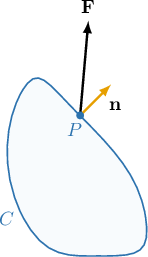

We wish to calculate the flow of $\mathbf F$ through $C$ at $P.$ Now, $\mathbf F$ is made up of two components:

- a component parallel to $\mathbf n,$ which contributes to the flow of $\mathbf F$ through $C,$ and

- a component perpendicular to $\mathbf n,$ which does *not* contribute to the flow of $\mathbf F$ through $C.$

We're only interested in the contribution made to the flow of $\mathbf F$ through $C.$ This is given by the scalar projection of $\mathbf F$ in the direction of $\mathbf n.$

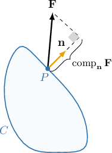

Therefore, the flow of $\mathbf F$ through $C$ at $P$ is given by

$$

\begin{aligned}comp_{𝐧}𝐅 & =\frac{𝐅⋅𝐧}{||𝐧||}=𝐅⋅𝐧.\end{aligned}

$$

The expression above represents the flow of $\mathbf F$ through $C$ at a single point only. Therefore, to calculate the total net flow of $\mathbf F$ through $C,$ we sum (integrate) this expression over the entire curve. This gives

$$

\oint\limits_C \mathbf F \cdot \mathbf{n} \: \text{d}s.

$$

### Orientation-Independence

Consider the circle $S$ and vector field $\mathbf F$ below. Let $C$ be any path where $S$ is traversed once in the counterclockwise direction.

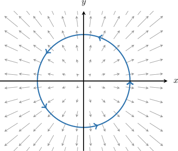

By drawing an outward-pointing unit normal vector, it's clear that there is a net flow *out* through $C.$

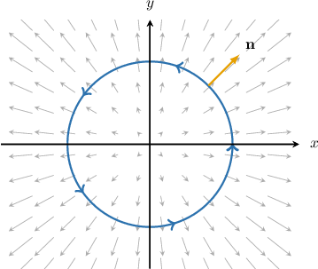

Therefore, the flux of $\mathbf F$ across $C$ is positive, and we have

$$

\oint\limits_C \mathbf F \cdot \mathbf{n} \: \text{d}s > 0.

$$

When measuring flux through a closed curve, the curve's orientation does not matter because the outward-pointing unit normal vector is the same in either case.

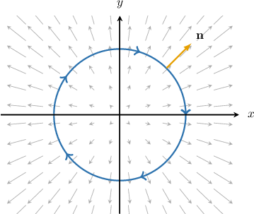

So, the flux of $\mathbf F$ across $-C$ is also positive, and we have

$$

\oint\limits_{-C} \mathbf F \cdot \mathbf{n} \: \text{d}s > 0.

$$

### Example: Determining a Flux's Sign From a Diagram

#### Question

Consider the circle $S$ and vector field $\mathbf F$ shown below. Let $C$ be any path where $S$ is traversed once in the counterclockwise direction.

Which of the following statements are true?

1. The flux of $\mathbf F$ across $C$ is negative

2. The flux of $\mathbf F$ across $C$ is zero

3. The flux of $\mathbf F$ across $-C$ is positive

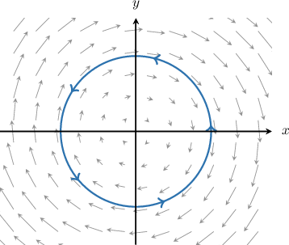

#### Explanation

If $\mathbf{F}$ is a vector field and $C$ is a piecewise-smooth, simple, closed curve, then the flux of $\mathbf F$ across $C$ is given by

$$

\oint\limits_C \mathbf F \cdot \mathbf{n} \: \text{d}s,

$$

where $\mathbf{n}$ denotes the outward-pointing unit normal vector to $C.$

To understand the flux intuitively, we imagine that $\mathbf F$ represents a stream of flowing water. The flux of $\mathbf F$ across $C$ represents the net flow of water escaping the region bounded by $C\mathbin:$

- If more water flows out through $C$ than in through $C$ (i.e., there is a net flow ** through $C$), the flux is **.

- If more water flows in through $C$ than out through $C$ (i.e., there is a net flow ** through $C$), the flux is **.

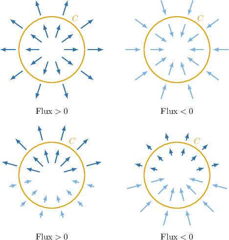

- If the net flow through $C$ is zero, the flux equals zero.

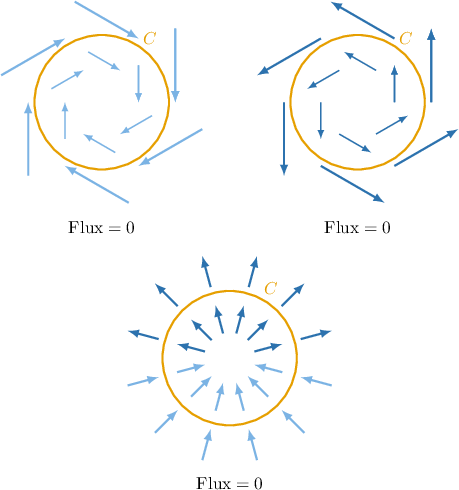

The outward-pointing unit normal vector tells us which direction is "out."

With that in mind, let's check each statement.

- Statement I is false, while statement II is true. From the diagram below we see that $\mathbf F$ acts perpendicular to $\mathbf n$ at every point on $C.$ Therefore, there is no net flow of $\mathbf F$ through $C.$ So, the flux of $\mathbf F$ across $C$ is zero, and we must have

- Statement III is false. When measuring flux through a closed curve, the orientation of the curve does not matter because the outward-pointing unit normal vector is the same at each point on $C$ in either case. So, the flux of $\mathbf F$ across $-C$ is zero, and we must have

Therefore, the correct answer is "II only."

### Calculating Flux

To calculate the flux of a vector field over a smooth, closed curve, we can use the formula

$$

\oint\limits_C \mathbf F \cdot \mathbf{n} \: \text{d}s.

$$

If $C=C_1\cup C_2 \cup \cdots \cup C_n$ is piecewise smooth, we have to calculate the flux of $\mathbf F$ over each smooth face. That is,

$$

\oint\limits_C \mathbf F \cdot \mathbf{n} \: \text{d}s = \int\limits_{C_1} \mathbf F \cdot \mathbf{n} \: \text{d}s + \int\limits_{C_2} \mathbf F \cdot \mathbf{n} \: \text{d}s + \cdots + \int\limits_{C_n} \mathbf F \cdot \mathbf{n} \: \text{d}s,

$$

where $\mathbf{n}$ denotes the outward-pointing unit normal vector to $C$ on $C_i.$

As an example, let's consider the vector field $\mathbf F(x,y) = xy\,\mathbf i + (y-x)^3\,\mathbf j$ and the rectangle $C$ shown below.

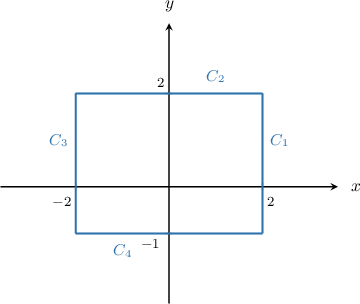

To calculate the flux of $\mathbf F$ over $C,$ we sum the fluxes of $\mathbf F$ over each side:

$$

\oint\limits_{C} \mathbf F \cdot \mathbf{n} \: \text{d}s = \int\limits_{C_1} \mathbf F \cdot \mathbf{n} \: \text{d}s + \int\limits_{C_2} \mathbf F \cdot \mathbf{n} \: \text{d}s + \int\limits_{C_3} \mathbf F \cdot \mathbf{n} \: \text{d}s + \int\limits_{C_4} \mathbf F \cdot \mathbf{n} \: \text{d}s

$$

To demonstrate how to compute these integrals, let's construct the flux integral across the side $C_4,$ given by

$$

\int\limits_{C_4} \mathbf F \cdot \mathbf{n} \: \text{d}s.

$$

The side $C_4$ and its outward-pointing unit normal are shown below.

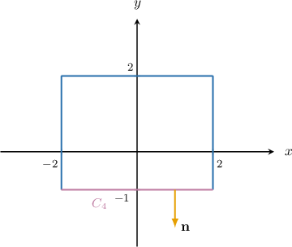

Since this side is perpendicular to the $y$-axis and we require an outward-pointing unit normal vector, we must have

$$

\mathbf n = -\mathbf j.

$$

Therefore,

$$

\begin{aligned}\underset{𝐶_{4}}{∫}𝐅⋅𝐧\,d𝑠 & =\underset{𝐶_{4}}{∫}(𝑥𝑦\,𝐢+(𝑦−𝑥)^{3}\,𝐣)⋅(−𝐣)\,d𝑠 \\ & =\underset{𝐶_{4}}{∫}(𝑥𝑦\,𝐢)⋅(−𝐣)+((𝑦−𝑥)^{3}\,𝐣))⋅(−𝐣)\,d𝑠 \\ & =\underset{𝐶_{4}}{∫}0−(𝑦−𝑥)^{3}\,d𝑠 \\ & =\underset{𝐶_{4}}{∫}(𝑥−𝑦)^{3}\,d𝑠.\end{aligned}

$$

Following a similar procedure for the other sides, we can construct the full expression for the flux of $\mathbf F$ over $C.$

### Example: Finding an Integral Expression for Flux

#### Question

Consider the vector field $\mathbf F(x,y) = 8y\,\mathbf i + 4x\,\mathbf j$ and the circle $C$ given by $x^2+y^2 = 4.$ If the flux of $\mathbf F$ across $C$ is given by

$$

𝐴𝐴𝐴𝐴𝐴𝐴𝐴

$$

what is the missing expression?

**

#### Explanation

If $\mathbf{F}$ is a vector field and $C$ is a piecewise-smooth, simple, closed curve, then the flux of $\mathbf F$ across $C$ is given by

$$

\oint\limits_C \mathbf F \cdot \mathbf{n} \: \text{d}s,

$$

where $\mathbf{n}$ denotes the outward-pointing unit normal vector to $C.$

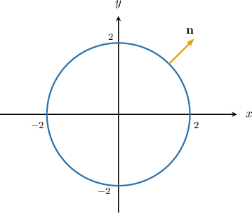

In our case, we have

$$

\begin{aligned}\underset{𝐶}{∮}𝐅⋅𝐧\,d𝑠 & =\underset{𝐶}{∮}(8𝑦\,𝐢+4𝑥\,𝐣)⋅(\frac{𝑥}{2}𝐢+\frac{𝑦}{2}\,𝐣)d𝑠 \\ & =\underset{𝐶}{∮}4𝑥𝑦+2𝑥𝑦\,d𝑠 \\ & =\underset{𝐶}{∮}6𝑥𝑦\,d𝑠.\end{aligned}

$$

Therefore, the missing expression is $6xy.$

### Using Symmetry to Simplify Flux Calculations

Calculating the flux of a vector field across a rectangle or square requires computing four flux integrals. However, we can often simplify our calculations if the vector field displays symmetry.

To demonstrate, consider the vector field $\mathbf F = -5\,\mathbf i$ and a square $C$ with side length $6$ centered at $O,$ as shown below. Let's calculate the flux of $\mathbf F$ across $C.$

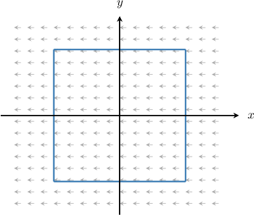

If $\mathbf{F}$ is a vector field and $C$ is a piecewise-smooth, simple, closed curve, then the flux of $\mathbf F$ across $C$ is given by

$$

\oint\limits_C \mathbf F \cdot \mathbf{n} \: \text{d}s,

$$

where $\mathbf{n}$ denotes the outward-pointing unit normal vector to $C.$ In this case, we have

$$

\oint\limits_C \mathbf F \cdot \mathbf{n} \: \text{d}s = \int\limits_{C_1} \mathbf F \cdot \mathbf{n}_1 \: \text{d}s + \int\limits_{C_2} \mathbf F \cdot \mathbf{n}_2 \: \text{d}s + \int\limits_{C_3} \mathbf F \cdot \mathbf{n}_3 \: \text{d}s + \int\limits_{C_4} \mathbf F \cdot \mathbf{n}_4 \: \text{d}s,

$$

where the sides $C_i$ and unit vectors $\mathbf n_i$ are shown below.

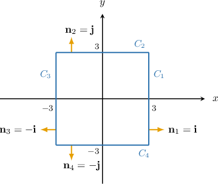

Since the vector field $\mathbf F = -5\,\mathbf i$ is parallel to $C_2$ and $C_4,$ there is zero net flow through these two sides. Therefore,

$$

\int\limits_{C_2} \mathbf F \cdot \mathbf{n}_2 \: \text{d}s = \int\limits_{C_4} \mathbf F \cdot \mathbf{n}_4 \: \text{d}s = 0.

$$

This is easy to verify, since,

$$

\begin{aligned}\underset{𝐶_{2}}{∫}𝐅⋅𝐧_{2}\,d𝑠 & =\underset{𝐶_{2}}{∫}−5\,𝐢⋅𝐣\,d𝑠 \\ & =\underset{𝐶_{2}}{∫}0\,d𝑠 \\ & =0\end{aligned}

$$

and similarly for the integral along $C_4.$

So, our expression for the flux reduces to

$$

\oint\limits_C \mathbf F \cdot \mathbf{n} \: \text{d}s = \int\limits_{C_1} \mathbf F \cdot \mathbf{n}_1 \: \text{d}s + \int\limits_{C_3} \mathbf F \cdot \mathbf{n}_3 \: \text{d}s.

$$

Since the vector field is uniform, the net inflow through $C_1$ will cancel with the net outflow through $C_3.$ That is

$$

\int\limits_{C_1} \mathbf F \cdot \mathbf{n}_1 \: \text{d}s = -\int\limits_{C_3} \mathbf F \cdot \mathbf{n}_3 \: \text{d}s \quad\Longrightarrow\quad \int\limits_{C_1} \mathbf F \cdot \mathbf{n}_1 \: \text{d}s +\int\limits_{C_3} \mathbf F \cdot \mathbf{n}_3 \: \text{d}s =0.

$$

Therefore, we conclude that

$$

\oint\limits_C \mathbf F \cdot \mathbf{n} \: \text{d}s = 0.

$$

### Example: Calculating Flux Across a Square Using Symmetry

#### Question

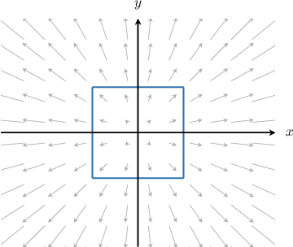

Consider the vector field $\mathbf F = 2x\,\mathbf i + 2y\,\mathbf j$ and a square $C$ with side length $2$ centered at $O,$ as shown below. Calculate the flux of $\mathbf F$ across $C.$

**

#### Explanation

If $\mathbf{F}$ is a vector field and $C$ is a piecewise-smooth, simple, closed curve, then the flux of $\mathbf F$ across $C$ is given by

$$

\oint\limits_C \mathbf F \cdot \mathbf{n} \: \text{d}s,

$$

where $\mathbf{n}$ denotes the outward-pointing unit normal vector to $C.$ In this case, we have

$$

\oint\limits_C \mathbf F \cdot \mathbf{n} \: \text{d}s = \int\limits_{C_1} \mathbf F \cdot \mathbf{n}_1 \: \text{d}s + \int\limits_{C_2} \mathbf F \cdot \mathbf{n}_2 \: \text{d}s + \int\limits_{C_3} \mathbf F \cdot \mathbf{n}_3 \: \text{d}s + \int\limits_{C_4} \mathbf F \cdot \mathbf{n}_4 \: \text{d}s,

$$

where the sides $C_i$ and unit vectors $\mathbf n_i$ are shown below.

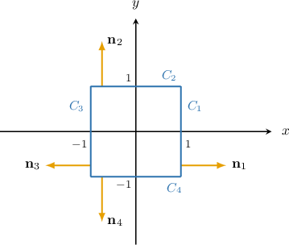

First, consider the side $C_1.$ We have that $\mathbf n_1 = \mathbf i,$ and therefore,

$$

\begin{aligned}∫_{𝐶_{1}}𝐅⋅𝐧_{1}\,d𝑠 & =∫_{𝐶_{1}}(2𝑥\,𝐢+2𝑦\,𝐣)⋅𝐢\,d𝑠 \\ & =2∫_{𝐶_{1}}𝑥\,d𝑠.\end{aligned}

$$

This is a line integral with respect to arc length, which we can evaluate in the usual way. Parameterizing the side $C_1,$ we have

$$

\mathbf r(t) = \mathbf i + t\,\mathbf j, \quad \Rightarrow\quad \mathbf r'(t) = \mathbf j, \qquad t\in [-1,1].

$$

Therefore,

$$

\begin{aligned}2∫_{𝐶_{1}}𝑥\,d𝑠 & =2∫_{1−1}1⋅||𝐫^{′}(𝑡)||\,d𝑡 \\ & =2∫_{1−1}d𝑡 \\ & =2(1−(−1)) \\ & =2⋅2 \\ & =4.\end{aligned}

$$

By symmetry, the flux integrals over the sides $C_2, C_3,$ and $C_4$ must be the same. Therefore,

$$

\oint\limits_C \mathbf F \cdot \mathbf{n} \: \text{d}s = 4\cdot 4 = 16.

$$

### Example: Calculating Flux Across a Rectangle Using Two Symmetry Properties

#### Question

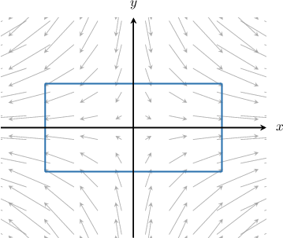

**

#### Explanation

If $\mathbf{F}$ is a vector field and $C$ is a piecewise-smooth, simple, closed curve, then the flux of $\mathbf F$ across $C$ is given by

$$

\oint\limits_C \mathbf F \cdot \mathbf{n} \: \text{d}s,

$$

where $\mathbf{n}$ denotes the outward-pointing unit normal vector to $C.$ In this case, we have

$$

\oint\limits_C \mathbf F \cdot \mathbf{n} \: \text{d}s = \int\limits_{C_1} \mathbf F \cdot \mathbf{n}_1 \: \text{d}s + \int\limits_{C_2} \mathbf F \cdot \mathbf{n}_2 \: \text{d}s + \int\limits_{C_3} \mathbf F \cdot \mathbf{n}_3 \: \text{d}s + \int\limits_{C_4} \mathbf F \cdot \mathbf{n}_4 \: \text{d}s,

$$

where the sides $C_i$ and unit vectors $\mathbf n_i$ are shown below.

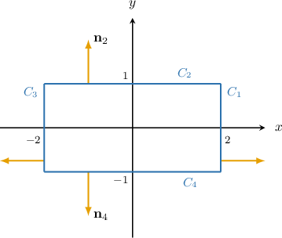

We compute this integral in two stages.

- First, consider the side $C_1.$ We have that $\mathbf n_1 = \mathbf i,$ and therefore, This is a line integral with respect to arc length, which we can evaluate in the usual way. Parameterizing the side $C_1,$ we have Therefore, By symmetry, the flux integral across the side $C_3$ must be the same. Therefore,

- Next, we consider the side $C_2.$ We have that $\mathbf n_2 = \mathbf j,$ and therefore, This is a line integral with respect to arc length, which we can evaluate in the usual way. Parameterizing the side $C_2,$ we have Therefore, By symmetry, the flux integral across the side $C_4$ must be the same. Therefore,

Finally, then

$$

\oint\limits_{C}\mathbf F\cdot\mathbf n\,\textrm d s= 2 \cdot 20 + 2 \cdot (-12) = 16.

$$
