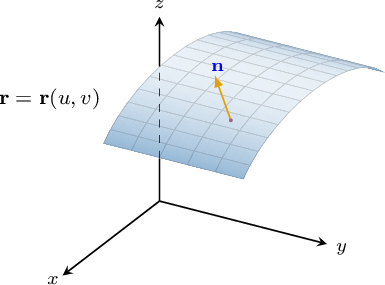

# Calculating Flux Through Parametric Surfaces

Source: https://www.mathacademy.com/topics/4145?courseId=155
Topic ID: 4145

## Prerequisites

- [Flux in Three-Dimensional Vector Fields](./3178-flux-in-three-dimensional-vector-fields.md)

## Lesson

### Introduction

Recall that the flux of the vector field $\mathbf F$ across a smooth, orientable surface $S$ with respect to the unit normal vector $\mathbf{n}$ is given by

$$

\iint\limits_S \mathbf F \cdot \text{d} \mathbf{S} = \iint\limits_S \mathbf F \cdot {\color{blue}\mathbf{n}} \,\text{d}S,

$$

where ${\color{blue}\mathbf{n}}$ is a unit normal vector that defines the orientation of the surface.

If $S$ is given by a parametric equation of the form

$$

\mathbf{r}=\mathbf{r}(u,v), \qquad (u,v)\in D\subseteq \mathbb{R}^2,

$$

we can determine the unit normal vector using the fundamental product as follows:

$$

{\color{blue}\mathbf{n}} = \dfrac{\mathbf{r}'_u \times \mathbf{r}'_v}{\| \mathbf{r}'_u \times \mathbf{r}'_v \|}

$$

Substituting this into the formula for the flux, we obtain

$$

\begin{aligned}\underset{𝑆}{∬}𝐅⋅d𝐒 & =\underset{𝑆}{∬}𝐅⋅𝐧\,d𝑆 \\ & =\underset{𝑆}{∬}𝐅⋅\frac{𝐫_{′𝑢}×𝐫_{′𝑣}}{‖𝐫_{′𝑢}×𝐫_{′𝑣}‖}\,d𝑆 \\ & =\underset{𝐷}{∬}𝐅(𝐫(𝑢,𝑣))⋅\frac{𝐫_{′𝑢}×𝐫_{′𝑣}}{‖𝐫_{′𝑢}×𝐫_{′𝑣}‖}\,‖𝐫_{′𝑢}×𝐫_{′𝑣}‖\,d𝐴 \\ & =\underset{𝐷}{∬}𝐅(𝐫(𝑢,𝑣))⋅(𝐫_{′𝑢}×𝐫_{′𝑣})\,d𝐴.\end{aligned}

$$

Therefore, if $S$ is a smooth, orientable surface given in parametric form by $\mathbf{r}=\mathbf{r}(u,v)$ for $(u,v)\in D \subseteq \mathbb{R}^2,$ then the flux of the vector field $\mathbf{F}$ across $S$ is given by

$$

\iint\limits_S \mathbf F \cdot \text{d} \mathbf{S} = \iint\limits_D \mathbf F(\mathbf{r}(u,v)) \cdot (\mathbf{r}'_u \times \mathbf{r}'_v) \: \text{d}A.

$$

Let's see some examples.

### Example: Expressing Flux Through a Surface as a Double Integral

#### Question

Consider the vector field $\mathbf F$ and the surface $S$ with parametrization $\mathbf r(u,v),$ where

$$

\mathbf{F}(x,y,z) =\left\langle x+y,\: x-y,\: xyz \right\rangle, \quad \mathbf{r}(u,v) = \left\langle u^2,\: v^2 ,\: 1 \right\rangle, \quad (u,v)\in D\subset \mathbb{R}^2.

$$

If the flux of $\mathbf F$ across $S$ with respect to $\mathbf{n}$ is given by

$$

𝐴𝐴𝐴𝐴𝐴𝐴𝐴

$$

what is the missing expression?

#### Explanation

For a surface $S$ with parametrization $\mathbf{r}(u,v)$ for $(u,v) \in D,$ the flux of a vector field $\mathbf{F}$ over $S$ is given by

$$

\iint\limits_S \mathbf{F} \cdot \text{d}\mathbf{S} = \iint\limits_S \mathbf{F} \cdot \mathbf{n} \,\text{d}S = \iint\limits_D \mathbf{F}(\mathbf{r}(u,v)) \cdot (\mathbf{r}'_u \times \mathbf{r}'_v) \,\text{d}A.

$$

We first compute the tangent vectors to the grid curves:

$$

\begin{aligned}𝐫_{′𝑢} & =⟨\frac{𝜕𝑥}{𝜕𝑢},\,\frac{𝜕𝑦}{𝜕𝑢},\,\frac{𝜕𝑧}{𝜕𝑢}⟩ \\ & =⟨\frac{𝜕}{𝜕𝑢}(𝑢^{2}),\,\frac{𝜕}{𝜕𝑢}(𝑣^{2}),\,\frac{𝜕}{𝜕𝑢}(1)⟩ \\ & =⟨2𝑢,\,0,\,0⟩ \\ 𝐫_{′𝑣} & =⟨\frac{𝜕𝑥}{𝜕𝑣},\,\frac{𝜕𝑦}{𝜕𝑣},\,\frac{𝜕𝑧}{𝜕𝑣}⟩ \\ & =⟨\frac{𝜕}{𝜕𝑣}(𝑢^{2}),\,\frac{𝜕}{𝜕𝑣}(𝑣^{2}),\,\frac{𝜕}{𝜕𝑣}(1)⟩ \\ & =⟨0,\,2𝑣,\,0⟩\end{aligned}

$$

Now, the fundamental vector product is

$$

\begin{aligned}𝐫_{′𝑢}×𝐫_{′𝑣} & =\begin{matrix}𝐢 & 𝐣 & 𝐤 \\ 2𝑢 & 0 & 0 \\ 0 & 2𝑣 & 0\end{matrix} \\ & =⟨\begin{matrix}0 & 0 \\ 2𝑣 & 0\end{matrix},\,−\begin{matrix}2𝑢 & 0 \\ 0 & 0\end{matrix},\,\begin{matrix}2𝑢 & 0 \\ 0 & 2𝑣\end{matrix}⟩ \\ & =⟨0,\,0,\,4𝑢𝑣⟩.\end{aligned}

$$

Next, we substitute the coordinate expressions of $\mathbf{r}(u,v)$ into $\mathbf{F}(x,y,z){:}$

$$

\begin{aligned}𝐅(𝐫(𝑢,𝑣)) & =⟨𝑥+𝑦,\,𝑥−𝑦,\,𝑥𝑦𝑧⟩_{𝑥=𝑢^{2}\,𝑦=𝑣^{2}\,𝑧=1} \\ & =⟨𝑢^{2}+𝑣^{2},\,𝑢^{2}−𝑣^{2},\,𝑢^{2}𝑣^{2}⟩\end{aligned}

$$

Finally, we calculate the dot product of $\mathbf{F}$ and $\mathbf{r}'_u \times \mathbf{r}'_v{:}$

$$

\begin{aligned}𝐅(𝐫(𝑢,𝑣))⋅(𝐫_{′𝑢}×𝐫_{′𝑣}) & =⟨𝑢^{2}+𝑣^{2},\,𝑢^{2}−𝑣^{2},\,𝑢^{2}𝑣^{2}⟩⋅⟨0,\,0,\,4𝑢𝑣⟩ \\ & =(𝑢^{2}+𝑣^{2})⋅0+(𝑢^{2}−𝑣^{2})⋅0+𝑢^{2}𝑣^{2}⋅4𝑢𝑣 \\ & =4𝑢^{3}𝑣^{3}\end{aligned}

$$

Therefore, the surface integral can be written as

$$

\begin{aligned}\underset{𝑆}{∬}𝐅⋅d𝐒 & =\underset{𝐷}{∬}𝐅(𝐫(𝑢,𝑣))⋅(𝐫_{′𝑢}×𝐫_{′𝑣})\,d𝐴 \\ & =\underset{𝐷}{∬}\,4𝑢^{3}𝑣^{3}\,d𝐴.\end{aligned}

$$

### Example: Evaluating Flux Through a Surface

#### Question

Evaluate the surface integral

$$

\iint\limits_S \left\langle z, \: x, \: y \right\rangle \cdot \text{d}\mathbf{S}

$$

where the parametric surface $S$ is defined by the equations

$$

\mathbf{r}(u,v) = \left\langle 1+2u+v, \: u+v, \: u-v \right\rangle

$$

for $0 \leq u \leq 2$ and $0 \leq v \leq 1.$

#### Explanation

For a surface $S$ with parametrization $\mathbf{r}(u,v)$ for $(u,v) \in D,$ the flux of a vector field $\mathbf{F}$ over $S$ is given by

$$

\iint\limits_S \mathbf{F} \cdot \text{d}\mathbf{S} = \iint\limits_S \mathbf{F} \cdot \mathbf{n} \,\text{d}S = \iint\limits_D \mathbf{F}(\mathbf{r}(u,v)) \cdot (\mathbf{r}'_u \times \mathbf{r}'_v) \,\text{d}A.

$$

We first compute the tangent vectors to the grid curves:

$$

\begin{aligned}𝐫_{′𝑢} & =⟨\frac{𝜕𝑥}{𝜕𝑢},\,\frac{𝜕𝑦}{𝜕𝑢},\,\frac{𝜕𝑧}{𝜕𝑢}⟩ \\ & =⟨\frac{𝜕}{𝜕𝑢}(1+2𝑢+𝑣),\,\frac{𝜕}{𝜕𝑢}(𝑢+𝑣),\,\frac{𝜕}{𝜕𝑢}(𝑢−𝑣)⟩ \\ & =⟨2,\,1,\,1⟩ \\ 𝐫_{′𝑣} & =⟨\frac{𝜕𝑥}{𝜕𝑣},\,\frac{𝜕𝑦}{𝜕𝑣},\,\frac{𝜕𝑧}{𝜕𝑣}⟩ \\ & =⟨\frac{𝜕}{𝜕𝑣}(1+2𝑢+𝑣),\,\frac{𝜕}{𝜕𝑣}(𝑢+𝑣),\,\frac{𝜕}{𝜕𝑣}(𝑢−𝑣)⟩ \\ & =⟨1,\,1,\,−1⟩\end{aligned}

$$

Now, the fundamental vector product is

$$

\begin{aligned}𝐫_{′𝑢}×𝐫_{′𝑣} & =\begin{matrix}𝐢 & 𝐣 & 𝐤 \\ 2 & 1 & 1 \\ 1 & 1 & −1\end{matrix} \\ & =⟨\begin{matrix}1 & 1 \\ 1 & −1\end{matrix},−\begin{matrix}2 & 1 \\ 1 & −1\end{matrix},\begin{matrix}2 & 1 \\ 1 & 1\end{matrix}⟩ \\ & =⟨−2,\,3,\,1⟩.\end{aligned}

$$

Next, we substitute the coordinate expressions of $\mathbf{r}(u,v)$ into $\mathbf{F}(x,y,z){:}$

$$

\begin{aligned}𝐅(𝐫(𝑢,𝑣)) & =⟨𝑧,\,𝑥,\,𝑦⟩|_{𝑥=1+2𝑢+𝑣\,𝑦=𝑢+𝑣\,𝑧=𝑢−𝑣} \\ & =⟨𝑢−𝑣,\,1+2𝑢+𝑣,\,𝑢+𝑣⟩\end{aligned}

$$

Then, we calculate the dot product of $\mathbf{F}$ and $\mathbf{r}'_u \times \mathbf{r}'_v{:}$

$$

\begin{aligned}𝐅(𝐫(𝑢,𝑣))⋅(𝐫_{′𝑢}×𝐫_{′𝑣}) & =⟨𝑢−𝑣,\,1+2𝑢+𝑣,\,𝑢+𝑣⟩⋅⟨−2,\,3,\,1⟩ \\ & =(𝑢−𝑣)⋅(−2)+(1+2𝑢+𝑣)⋅3+(𝑢+𝑣)⋅1 \\ & =−2𝑢+2𝑣+3+6𝑢+3𝑣+𝑢+𝑣 \\ & =5𝑢+6𝑣+3\end{aligned}

$$

Therefore, the surface integral evaluates to

$$

\begin{aligned}\underset{𝑆}{∬}⟨𝑧,\,𝑥,\,𝑦⟩⋅d𝐒 & =\underset{𝐷}{∬}𝐅(𝐫(𝑢,𝑣))⋅(𝐫_{′𝑢}×𝐫_{′𝑣})\,d𝐴 \\ & =\underset{𝐷}{∬}(5𝑢+6𝑣+3)\,d𝐴 \\ & =∫_{20}∫_{10}(5𝑢+6𝑣+3)\,d𝑣\,d𝑢 \\ & =∫_{20}[5𝑢𝑣+3𝑣^{2}+3𝑣]_{𝑣=1𝑣=0}\,d𝑢 \\ & =∫_{20}(5𝑢+6)\,d𝑢 \\ & =[\frac{5}{2}𝑢^{2}+6𝑢]_{20} \\ & =10+12 \\ & =22.\end{aligned}

$$
