# Changing the Order of Integration in Triple Integrals: Changing Region

Source: https://www.mathacademy.com/topics/4158?courseId=155
Topic ID: 4158

## Prerequisites

- [Changing the Order of Integration in Triple Integrals: Changing Projection](./2056-changing-the-order-of-integration-in-triple-integrals-changing-projection.md)

## Lesson

### Introduction

Consider the following repeated integral:

$$

\displaystyle \int_0^1 \int_0^{1-x} \int_0^{1-x-y} f(x,y,z) \:\text{d}z\:\text{d}y\:\text{d}x

$$

For this repeated integral, the integration domain is the type I region

$$

R = \left\{ (x,y,z) \: : \: 0 \leq x \leq 1, \:\: 0 \leq y \leq 1-x, \:\: 0 \leq z \leq 1-x-y \right\}

$$

as shown below.

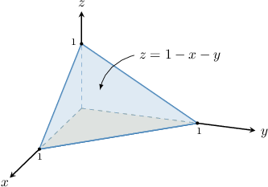

Suppose we wish to change the order of integration so that we integrate first with respect to $y,$ then over a region $D$ in the $xz$-plane. In other words, we wish to express our repeated integral in the form

$$

\int_0^1 \int_0^{1-x} \int_0^{1-x-y} f(x,y,z) \:\text{d}z\:\text{d}y\:\text{d}x = \iint\limits_D \left[ \int_{u_1(x,z)}^{u_2(x,z)} f(x,y,z) \:\text{d}y \right] \text{d}A.

$$

To change the order of integration from $\text{d}z\:\text{d}y\:\text{d}x$ to $\text{d}y\:\text{d}A,$ we write $R$ as a type III region.

To visualize $R$ as a type III region, imagine firing an arrow through the region parallel to the $y$-axis and in the direction of increasing $y,$ as shown below.

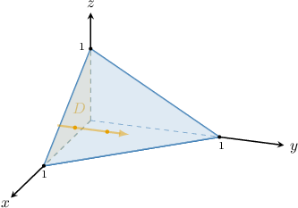

The arrow enters the region through the back boundary and leaves through the front boundary:

- The front boundary of the region is and writing this in the form $y = u_2(x,z),$ we have

- The back boundary of the region is $y = 0.$

Therefore, the type III representation of $R$ is

$$

R = \left\{ (x,y,z) \: : \: (x,z) \in D, \:\: 0 \leq y \leq 1-x-z \right\},

$$

as shown in the diagram below.

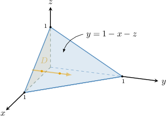

Therefore, by swapping the order of integration so that it is integrated first with respect to $y$ and then over $D,$ we obtain

$$

\begin{aligned}∫_{10}∫_{1−𝑥0}∫_{1−𝑥−𝑦0}𝑓(𝑥,𝑦,𝑧)\,d𝑧\,d𝑦\,d𝑥 & =\underset{𝐷}{∬}[∫_{1−𝑥−𝑧0}𝑓(𝑥,𝑦,𝑧)\,d𝑦]d𝐴.\end{aligned}

$$

### Example: Rewriting a Repeated Integral as a Mixed Integral

#### Question

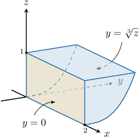

Change the order of integration in the integral

$$

\displaystyle \int_0^1 \int_0^{2} \int_0^{\sqrt[3]{z}} f(x,y,z) \:\text{d}y\:\text{d}x\:\text{d}z

$$

so that it is integrated first with respect to $z,$ then over a region $D$ in the $xy$-plane. The integration region $R$ is shown above.

#### Explanation

We wish to find the limits of integration $u_1(x,y)$ and $u_2(x,y)$ such that

$$

\int_0^1 \int_0^{2} \int_0^{\sqrt[3]{z}} f(x,y,z) \:\text{d}y\:\text{d}x\:\text{d}z = \iint\limits_D \left[ \int_{u_1(x,y)}^{u_2(x,y)} f(x,y,z) \:\text{d}z\right] \text{d}A.

$$

From the repeated integral, we see that the region of integration $R$ can be written as a type III region as follows:

$$

R = \big\{ (x,y,z) \:\: {:} \:\: 0 \leq x \leq 2, \:\: 0 \leq z \leq 1, \:\: 0 \leq y \leq \sqrt[3]{z} \big\}

$$

To change the order of integration from $\text{d}y\:\text{d}x\:\text{d}z$ to $\text{d}z\:\text{d}A,$ we write $R$ as a type I region.

To visualize this, imagine firing an arrow through the region parallel to the $z$-axis and in the direction of increasing $z,$ as shown below.

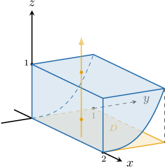

The arrow enters the region through the bottom boundary and leaves through the top boundary:

- The bottom boundary of the region, written in the form $z=z(x,y),$ is

- The top boundary of the region is $z = 1.$

Therefore, the type I representation of $R$ is

$$

R = \big\{ (x,y,z) \:\: {:} \:\: (x,y) \in D, \:\: y^3\leq z \leq 1 \big\},

$$

as shown in the diagram below.

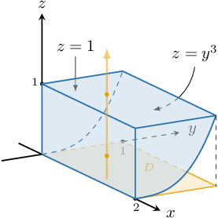

Therefore, by swapping the order of integration so that it is integrated first with respect to $z$ and then over $D,$ we obtain

$$

\int_0^1 \int_0^{2} \int_0^{\sqrt[3]{z}} f(x,y,z) \:\text{d}y\:\text{d}x\:\text{d}z = \iint\limits_D \left[\int_{y^3}^{1} f(x,y,z) \:\text{d}z\right] \text{d}A.

$$

### Example: Swapping the Order of Integration in a Triple Integral

#### Question

Change the order of integration in the integral

$$

\displaystyle \int_0^{1} \int_0^{1} \int_0^{1-z^2} f(x,y,z) \:\text{d}y\:\text{d}z\:\text{d}x.

$$

so that it is integrated first with respect to $z,$ then $y,$ and then $x.$

#### Explanation

We wish to find limits of integration $u_1(x,y),$ $u_2(x,y),$ $v_1(x),$ $v_2(x),$ $a,$ and $b$ such that

$$

\int_0^{1} \int_0^{1} \int_0^{1-z^2} f(x,y,z) \:\text{d}y\:\text{d}z\:\text{d}x = \int_a^b \int_{v_1(x)}^{v_2(x)} \int_{u_1(x,y)}^{u_2(x,y)} f(x,y,z) \:\text{d}z\:\text{d}y\:\text{d}x.

$$

From the repeated integral, we see that the region of integration $R$ can be written as a type III region as follows:

$$

R = \left\{ (x,y,z) \: : \: 0 \leq x \leq 1, \:\: 0 \leq z \leq 1, \:\: 0 \leq y \leq 1-z^2 \right\}

$$

Now, let's sketch the region. Since it is a type III region, we first draw the projection onto the $xz$-plane, given by

$$

E = \left\{ (x,z) \: : \: 0 \leq x \leq 1, \:\: 0 \leq z \leq 1 \right\}

$$

as shown below.

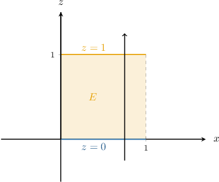

Then, the region $R$ is shown in the diagram below, where $0 \leq y \leq 1-z^2.$

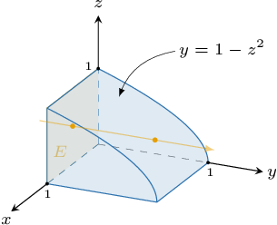

To change the order of integration from $\text{d}y\:\text{d}z\:\text{d}x$ to $\text{d}z\:\text{d}y\:\text{d}x,$ we write $R$ as a type I region and its projection $D$ onto the $xy$-plane as a type I ** region.

To visualize this, imagine firing an arrow through the region parallel to the $z$-axis and in the direction of increasing $z,$ as shown below.

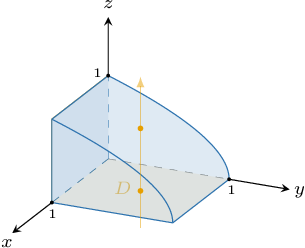

The arrow enters the region through the bottom boundary and leaves through the top boundary:

- The top boundary of the region, written in the form $z=z(x,y),$ is

- The bottom boundary of the region is $z=0.$

Therefore, the type I representation of $R$ is

$$

R = \big\{ (x,y,z) \: : \: (x,y) \in D, \:\: 0 \leq z \leq \sqrt{1-y} \big\},

$$

as shown in the diagram below.

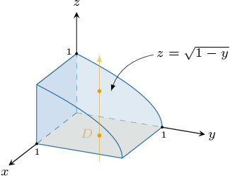

Now, we consider the projection $D$ as a type I plane region in the $xy$-plane with the top curve given by $y=1.$

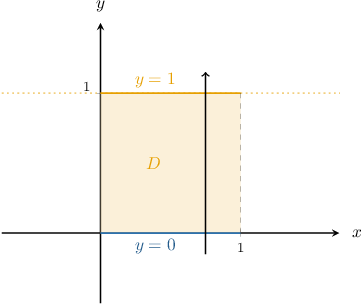

Hence, we have that

$$

D = \left\{ (x,y) \: : \: 0 \leq x \leq 1, \:\: 0 \leq y \leq 1 \right\}.

$$

Therefore, by swapping the order of integration so that it is integrated first with respect to $z,$ then $y,$ then $x,$ we obtain

$$

\int_0^{1} \int_0^{1} \int_0^{1-z^2} f(x,y,z) \:\text{d}y\:\text{d}z\:\text{d}x = \int_0^{1} \int_0^{\boxed{1}} \int_{\boxed{0}}^{\boxed{\sqrt{1-y}}} f(x,y,z) \:\text{d}z\:\text{d}y\:\text{d}x.

$$

### Example: Evaluating a Triple Integral by Swapping the Order of Integration

#### Question

Evaluate $\displaystyle \int_{0}^{1} \int_{0}^{2} \int_{z}^{2} e^{x^2} \, \mathrm{d}x \: \mathrm{d}z \: \mathrm{d}y.$

**

#### Explanation

We cannot integrate the given integral because we cannot find a simple antiderivative of the integrand. So, we change the order of integration.

We wish to find the limits of integration $u_1(x,y),$ $u_2(x,y),$ $v_1(y),$ $v_2(y),$ $a,$ and $b$ such that

$$

\int_{0}^{1} \int_{0}^{2} \int_{z}^{2} e^{x^2} \, \mathrm{d}x \: \mathrm{d}z \: \mathrm{d}y = \int_{a}^{b} \int_{v_1(y)}^{v_2(y)} \int_{u_1(x,y)}^{u_2(x,y)} e^{x^2} \, \text{d}z \: \text{d}x \: \text{d}y.

$$

From the repeated integral, we see that the region of integration $R$ can be written as a type II region as follows:

$$

R = \left\{ (x,y,z) \: : \: 0 \leq y \leq 1, \:\: 0 \leq z \leq 2, \:\: z \leq x \leq 2 \right\}

$$

Now, let's sketch the region. Since it is a type II region, we first sketch the projection onto the $yz$-plane, given by

$$

E = \left\{ (y,z) \: : \: 0 \leq y \leq 1, \:\: 0 \leq z \leq 2 \right\}

$$

as shown below.

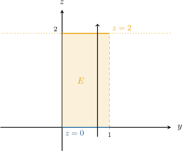

Then, the region $R$ is shown in the diagram below, where $z \leq x \leq 2.$

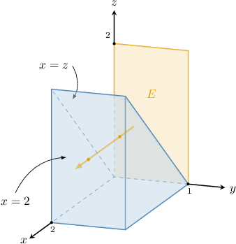

To change the order of integration from $\mathrm{d}x \: \mathrm{d}z \: \mathrm{d}y$ to $\text{d}z\:\text{d}x\:\text{d}y,$ we write $R$ as a type I region and its projection $D$ onto the $xy$-plane as a type II ** region.

To visualize this, imagine firing an arrow through the region parallel to the $z$-axis and in the direction of increasing $z,$ as shown below.

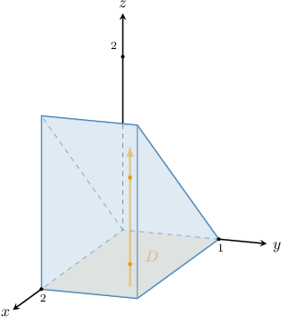

The arrow enters the region through the bottom boundary and leaves through the top boundary:

- The bottom boundary of the region is

- The top boundary of the region, written in the form $z = z(x,y),$ is

Therefore, the type I representation of $R$ is

$$

R = \left\{ (x,y,z) \: : \: (x,y) \in D, \:\: 0 \leq z \leq x \right\},

$$

as shown in the diagram below.

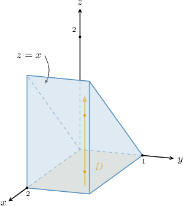

Now, we consider the projection $D$ as a type II plane region in the $xy$-plane with the left curve given by $x = 0.$

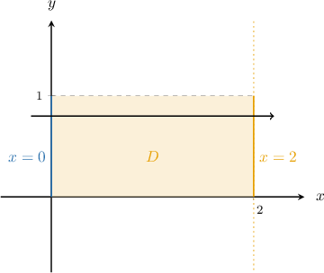

Hence,

$$

D = \left\{ (x,y) \: : \: 0 \leq x \leq 2, \:\: 0 \leq y \leq 1 \right\}.

$$

Therefore, by swapping the order of integration, we obtain

$$

\begin{aligned}∫_{10}∫_{20}∫_{2𝑧}𝑒^{𝑥^{2}}\,d𝑥\,d𝑧\,d𝑦 & =∫_{10}∫_{20}∫_{𝑥0}𝑒^{𝑥^{2}}\,d𝑧\,d𝑥\,d𝑦 \\ & =∫_{10}∫_{20}𝑒^{𝑥^{2}}[∫_{𝑥0}d𝑧]d𝑥\,d𝑦 \\ & =∫_{10}∫_{20}𝑒^{𝑥^{2}}[𝑧]_{𝑥0}\,d𝑥\,d𝑦 \\ & =∫_{10}∫_{20}𝑥𝑒^{𝑥^{2}}\,d𝑥\,d𝑦 \\ & =∫_{10}[∫_{20}𝑥𝑒^{𝑥^{2}}\,d𝑥]d𝑦 \\ & =∫_{10}[\frac{1}{2}𝑒^{𝑥^{2}}]_{20}\,d𝑦 \\ & =\frac{1}{2}∫_{10}(𝑒^{4}−1)\,d𝑦 \\ & =\frac{1}{2}(𝑒^{4}−1)⋅[𝑦]_{10} \\ & =\frac{1}{2}(𝑒^{4}−1).\end{aligned}

$$
