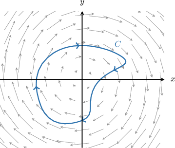
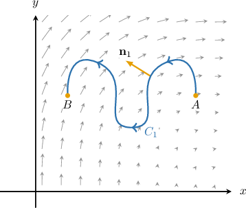
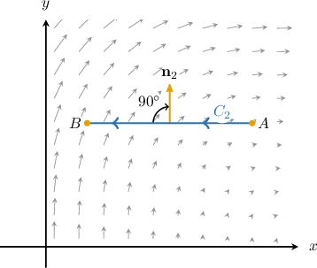

# Source-Free Vector Fields

Source: https://www.mathacademy.com/topics/4160?courseId=155
Topic ID: 4160

## Prerequisites

- [Path Independence of Line Integrals](./3360-path-independence-of-line-integrals.md)
- [Calculating Flux in Two-Dimensional Vector Fields](./3716-calculating-flux-in-two-dimensional-vector-fields.md)
- [Stream Functions](../mathematical-methods-for-the-physical-sciences-i/3717-stream-functions.md)

## Lesson

### Introduction

Consider the vector field $\mathbf F,$ given by

$$

\mathbf F(x,y)= P(x,y)\,\mathbf{i} + Q(x,y)\,\mathbf{j}

$$

which is defined on an open set $D\subseteq \mathbb R^2.$ Recall that a function $\psi(x,y)$ is said to be a **stream function** of $\mathbf F$ if it satisfies

$$

P = \dfrac{\partial \psi}{\partial y}, \qquad Q = -\dfrac{\partial \psi}{\partial x}.

$$

If a vector field $\mathbf{F}(x,y)$ has a stream function $\psi(x,y),$ then $\mathbf{F}$ is called a **source-free vector field**.

Source-free vector fields have some interesting properties, summarized below:

- *The divergence of $\mathbf{F}$ at any point of $D$ is zero:*

- *The*flux*of $\mathbf{F}$ along any closed curve $C \in D$ is zero:*

- *Flux is path-independent. That is, given any two curves $C_1, C_2 \in D$ with the same start and endpoints, we have that*

Stream functions for source-free vector fields play a similar role to potential functions for conservative vector fields. So it's worth comparing them side-by-side.

### A Worked Example

Let's use what we know about source-free vector fields to calculate the flux of

$$

\mathbf{F}(x,y)=2y\,\mathbf{i}-2x\,\mathbf{j}

$$

across the curve $C,$ shown below.

First, notice that this is a source-free vector field, since

$$

\begin{aligned}\frac{𝜕𝑃}{𝜕𝑥}+\frac{𝜕𝑄}{𝜕𝑦} & =\frac{𝜕}{𝜕𝑥}(2𝑦)+\frac{𝜕}{𝜕𝑦}(−2𝑥) \\ & =0+0 \\ & =0.\end{aligned}

$$

Therefore, since $\mathbf{F}$ is source-free, the flux of $\mathbf{F}$ across any closed curve is zero. Hence,

$$

\oint\limits_{C} \mathbf{F} \cdot \mathbf{n} \,\text{d}s = 0.

$$

### Example: Identifying True Statements Regarding Source-Free Vector Fields

#### Question

Given the vector field $\mathbf{F}(x,y) = 4y(x^2+y^2)\,\mathbf{i} - 4x(x^2+y^2)\,\mathbf{j},$ which of the following statements must be true?

1. $\nabla \cdot \mathbf F= 0$

2. $\mathbf{F}$ is a source-free vector field

3. For two arbitrary curves $C_1$ and $C_2,$ we have $\displaystyle\int\limits_{C_1} \mathbf{F} \cdot \mathbf{n} \,\text{d}s \neq \int\limits_{C_2} \mathbf{F} \cdot \mathbf{n} \,\text{d}s.$

#### Explanation

If $\mathbf{F} = P\,\mathbf{i} + Q\,\mathbf{j}$ is a vector field with simply connected domain $D \subseteq \mathbb{R}^2,$ then the following are equivalent:

- $\mathbf{F}$ is a source-free vector field.

- $\nabla \cdot \mathbf F = \dfrac{\partial P}{\partial x} + \dfrac{\partial Q}{\partial y} = 0.$

- The flux $\displaystyle{\oint\limits_C \mathbf{F} \cdot \mathbf{n} \,\text{d}s}$ along any closed curve $C \in D$ is zero.

- Flux is path-independent. That is, given any two curves $C_1,C_2 \in D$ with the same start and endpoints, we have that

- There exists a stream function $\psi(x,y)$ for $\mathbf{F}.$

Note that $\mathbf{F}(x,y)$ is a vector field with the simply connected domain $D=\mathbb{R}^2,$ where

$$

P(x,y) = 4y(x^2+y^2),\qquad Q(x,y) = - 4x(x^2+y^2).

$$

Computing the partial derivatives, we have

$$

\begin{aligned}\frac{𝜕𝑃}{𝜕𝑥}=8𝑥𝑦,\,\frac{𝜕𝑄}{𝜕𝑦} & =−8𝑥𝑦.\end{aligned}

$$

With that in mind, let's consider each statement.

- Statement I is true. Indeed, we have that

- Statement II is true. This follows from statement I.

- Statement III is false. Since $\mathbf F$ is source-free, we have that $\displaystyle\int\limits_{C_1} \mathbf{F} \cdot \mathbf{n} \,\text{d}s = \int\limits_{C_2} \mathbf{F} \cdot \mathbf{n} \,\text{d}s$ for all curves **.

Therefore, the correct answer is "I and II only."

### Example: Calculating Flux in a Source-Free Vector Field

#### Question

The curve $C_1$ has endpoints $A(5,3)$ and $B(1,3).$ Calculate the flux of the vector field

$$

\mathbf{F}(x,y)=\sqrt{y^3}\,\mathbf{i}+\sqrt{(5-x)^3}\,\mathbf{j}

$$

through $C_1$ measured with respect to the unit normal vector $\mathbf{n}_1,$ as shown above.

**

#### Explanation

If $\mathbf{F} = P\,\mathbf{i} + Q\,\mathbf{j}$ is a vector field with simply connected domain $D \subseteq \mathbb{R}^2,$ then the following are equivalent:

- $\mathbf{F}$ is a source-free vector field.

- $\nabla \cdot \mathbf F = \dfrac{\partial P}{\partial x} + \dfrac{\partial Q}{\partial y} = 0.$

- The flux $\displaystyle{\oint\limits_C \mathbf{F} \cdot \mathbf{n} \,\text{d}s}$ along any closed curve $C \in D$ is zero.

- Flux is path-independent. That is, given any two curves $C_1, C_2 \in D$ with the same start and endpoints, we have that

- There exists a stream function $\psi(x,y)$ for $\mathbf{F}.$

First, notice that

$$

\dfrac{\partial P}{\partial x} + \dfrac{\partial Q}{\partial y} = \dfrac{\partial}{\partial x}\left(\sqrt{y^3}\right) + \dfrac{\partial}{\partial y}\left(\sqrt{(5-x)^3}\right) = 0+0 = 0,

$$

which shows that $\mathbf{F}$ is a source-free vector field.

Since $\mathbf{F}$ is source-free, we know the flux of $\mathbf{F}$ is independent of the path. In particular,

$$

\int\limits_{C_1} \mathbf{F} \cdot \mathbf{n}_1 \,\text{d}s = \int\limits_{C_2} \mathbf{F} \cdot \mathbf{n}_2 \,\text{d}s,

$$

where $C_2$ is the straight line from $A(5,3)$ to $B(1,3)$ and $\mathbf{n}_2$ is its unit normal, shown in the diagram below.

Notice that both $\mathbf n_1$ and $\mathbf n_2$ are $90^\circ$ clockwise rotations of their respective unit tangent vectors.

To calculate the flux of $\mathbf F$ across $C_2,$ we will use the formula

$$

\int\limits_{C_2} \mathbf{F} \cdot \mathbf{n}_2 \,\text{d}s = \int\limits_{C_2} P\,\text{d}y - Q\,\text{d}x.

$$

To apply the formula,

- the curve should be parametrized as $\mathbf{r}(t)$ for $t \in [a,b],$ and

- the unit normal vector $\mathbf{n}_2$ ** be a $90^\circ$ clockwise rotation of the unit normal tangent vector $\mathbf{T}(t).$

Parametrizing $C_2,$ we have

$$

\begin{aligned}𝐫(𝑡) & =5\,𝐢+3\,𝐣+𝑡⋅[(𝐢+3\,𝐣)−(5\,𝐢+3\,𝐣)] \\ & =(5−4𝑡)\,𝐢+3\,𝐣\end{aligned}

$$

where $t\in [0,1].$ Therefore,

$$

\begin{aligned}𝑃(𝑥,𝑦) & =\sqrt{𝑦^{3}}=\sqrt{(3)^{3}}=3\sqrt{3}, \\ 𝑄(𝑥,𝑦) & =\sqrt{(5−𝑥)^{3}}=\sqrt{(5−(5−4𝑡))^{3}}=8\sqrt{𝑡^{3}}.\end{aligned}

$$

Computing the derivatives of $x(t)$ and $y(t)$ along the curve, we get

$$

\begin{aligned}\frac{d𝑥}{d𝑡} & =\frac{d}{d𝑡}(5−4𝑡)=−4, \\ \frac{d𝑦}{d𝑡} & =\frac{d}{d𝑡}(3)=0.\end{aligned}

$$

We evaluate the flux integral as follows:

$$

\begin{aligned}\underset{𝐶_{2}}{∫}𝐅⋅𝐧_{2}\,d𝑠 & =\underset{𝐶_{2}}{∫}𝑃\,d𝑦−𝑄\,d𝑥 \\ & =∫_{10}(𝑃⋅\frac{d𝑦}{d𝑡}−𝑄⋅\frac{d𝑥}{d𝑡})d𝑡 \\ & =∫_{10}(3\sqrt{3})⋅(0)−(8\sqrt{𝑡^{3}})⋅(−4)\,d𝑡 \\ & =∫_{10}32𝑡^{3/2}\,d𝑡 \\ & =[\frac{64𝑡^{5/2}}{5}]_{10} \\ & =(\frac{64(1)^{5/2}}{5})−(\frac{(64(0)^{5/2}}{5}) \\ & =\frac{64}{5}.\end{aligned}

$$

Finally, we conclude that

$$

\int\limits_{C_1} \mathbf{F} \cdot \mathbf{n}_1\, \text{d}s = \dfrac{64}{5}.

$$
