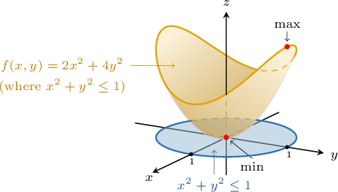

# Optimizing Multivariable Functions Using Lagrange Multipliers

Source: https://www.mathacademy.com/topics/4164?courseId=155
Topic ID: 4164

## Prerequisites

- [The Candidates Test](../../../ap-courses/lessons/ap-calculus-ab/364-the-candidates-test.md)
- [Lagrange Multipliers With One Constraint](./1948-lagrange-multipliers-with-one-constraint.md)

## Lesson

### Introduction

Suppose we want to find the minimum and maximum values of the function

$$

f(x,y) = 2x^2+4y^2

$$

subject to constraint $g(x,y) = x^2+y^2 \leq 1.$ In other words, we wish to find the global extrema of $f(x,y)$ defined on the disc of radius $1$ centered at the origin, as shown below.

To find the extrema, we proceed as follows:

- First, we find the critical points of $f$ inside the domain $x^2+y^2 < 1.$

- Then, we find the extreme values of $f$ subject to the constraint $x^2+y^2=1$ using the method of Lagrange multipliers.

- Finally, we determine the maximum and minimum values by evaluating $f$ at the candidate points.

Recall that the critical points of a function $f(x,y)$ are the solutions to $\boldsymbol f'(x,y) = \mathbf 0^T.$ Now, since the derivative of $f$ is the transpose of its gradient $\nabla f,$ the critical points are also given by the solutions to $\nabla f = \mathbf 0.$

So, we can find the critical points by solving $\nabla f = \mathbf 0,$ as follows:

$$

\begin{aligned}⟨𝑓_{𝑥}(𝑥,𝑦),𝑓_{𝑦}(𝑥,𝑦)⟩ & =⟨0,0⟩ \\ ⟨4𝑥,8𝑦⟩ & =⟨0,0⟩\end{aligned}

$$

The above equation has the solution $(x,y)=(0,0).$ Note that this point belongs to our domain.

Next, we need to find the maximum value of $f(x,y)$ subject to the constraint $g(x,y)= x^2 + y^2 = 1.$ Therefore, by the method of Lagrange multipliers, we must solve the following system:

$$

\begin{aligned}∇𝑓(𝑥,𝑦) & =𝜆∇𝑔(𝑥,𝑦) \\ ⟨𝑓_{𝑥}(𝑥,𝑦),𝑓_{𝑦}(𝑥,𝑦)⟩ & =𝜆⟨𝑔_{𝑥}(𝑥,𝑦),𝑔_{𝑦}(𝑥,𝑦)⟩ \\ ⟨4𝑥,8𝑦⟩ & =𝜆⟨2𝑥,2𝑦⟩\end{aligned}

$$

Therefore, we have the following system of equations:

$$

\begin{aligned}\begin{aligned}4𝑥=2𝜆𝑥 \\ 8𝑦=2𝜆𝑦\end{aligned}\,⇒\,\begin{aligned}𝑥(2−𝜆)=0 \\ 𝑦(4−𝜆)=0\end{aligned}\end{aligned}

$$

To solve this system, we break it up into several cases:

- Assuming $x=0$ in the first equation, the constraint condition $x^2+y^2=1$ implies This gives the critical points $\left(0,\pm 1 \right).$

- Assuming $\lambda =2$ in the first equation, the second equation of the system implies Then, the constraint condition $x^2+y^2=1$ implies This gives the critical point $\left(\pm 1, 0 \right).$

Therefore, $f$ has possible extreme values at the points

$$

(\pm 1, 0), \qquad (0, \pm1), \qquad (0,0).

$$

Note that we add the critical point $(0,0)$ to the list of the candidates above.

Finally, we evaluate $f$ at these points:

Therefore, the function reaches a minimum of $0$ at the point $(0, 0)$ and a maximum of $4$ at the points $(0, \pm 1).$

### Example: Finding Extreme Values: Cases With No Inner Critical Points

#### Question

Use the method of Lagrange multipliers to find the maximum value of the function $f(x,y) = x^2 + y$ given that $2x^2 + 3y^2 \leq 1.$

#### Explanation

First, we need to find the critical values of the function in the region's interior. We compute the critical points by solving $\nabla f = \mathbf 0,$ as follows:

$$

\begin{aligned}⟨𝑓_{𝑥}(𝑥,𝑦),𝑓_{𝑦}(𝑥,𝑦)⟩ & =⟨0,0⟩ \\ ⟨2𝑥,1⟩ & =⟨0,0⟩\end{aligned}

$$

Since the above equation has no solutions, we conclude that the function does not have critical values in the region's interior.

Next, we need to find the maximum value of $f(x,y)$ subject to the constraint $g(x,y)= 2x^2 + 3y^2 = 1.$

Since $f(x,y)$ is continuous and the constraint is closed and bounded, $f(x,y)$ reaches a global maximum and a global minimum on the constraint.

Therefore, by the method of Lagrange multipliers, we must solve the following system:

$$

\nabla f(x,y) = \lambda \nabla g(x,y), \qquad g(x,y)=1

$$

We start by solving the first equation:

$$

\begin{aligned}∇𝑓(𝑥,𝑦) & =𝜆∇𝑔(𝑥,𝑦) \\ ⟨𝑓_{𝑥}(𝑥,𝑦),𝑓_{𝑦}(𝑥,𝑦)⟩ & =𝜆⟨𝑔_{𝑥}(𝑥,𝑦),𝑔_{𝑦}(𝑥,𝑦)⟩ \\ ⟨2𝑥,1⟩ & =𝜆⟨4𝑥,6𝑦⟩\end{aligned}

$$

Therefore, we have the following:

$$

\begin{aligned}\begin{aligned}2𝑥=4𝜆𝑥 \\ 1=6𝜆𝑦\end{aligned}\,⇒\,\begin{aligned}𝑥(1−2𝜆)=0 \\ 𝜆𝑦=\frac{1}{6}\end{aligned}\end{aligned}

$$

To solve this system, we break it up into several cases:

- Assuming $x=0$ in the first equation of the system, the constraint condition $g(x,y) = 1$ implies This gives the critical points $\left(0,\pm \dfrac{1}{\sqrt3} \right).$

- Assuming $\lambda = \dfrac12$ in the first equation of the system, the second equation of the system gives Then, the constraint condition $g(x,y) =1$ implies This gives the critical points $\left(\pm \dfrac{1}{\sqrt{3}}, \dfrac13 \right).$

Therefore, $f$ has possible extreme values at the points

$$

\left(0,\pm \dfrac{1}{\sqrt3} \right), \qquad \left(\pm \dfrac{1}{\sqrt{3}}, \dfrac13 \right).

$$

We evaluate $f$ at each of these points. These are given in the following table:

Therefore, the function reaches a maximum value at $\left(\pm \dfrac{1}{\sqrt{3}}, \dfrac13 \right),$ and its maximum value is $\dfrac23.$

### Example: Finding Extreme Values: Cases With Inner Critical Points

#### Question

Use the method of Lagrange multipliers to find the minimum value of the function $f(x,y) = 3x^2 - y^2$ given that $3x^2 + 2y^2\leq 16.$

#### Explanation

First, we need to find the critical values of the function in the region's interior. We compute the critical points by solving $\nabla f = \mathbf 0,$ as follows:

$$

\begin{aligned}⟨𝑓_{𝑥}(𝑥,𝑦),𝑓_{𝑦}(𝑥,𝑦)⟩ & =⟨0,0⟩ \\ ⟨6𝑥,−2𝑦⟩ & =⟨0,0⟩\end{aligned}

$$

The above equation has the solution $(x,y)=\left(0, 0 \right).$ This point belongs to our region.

Next, we need to find the minimum value of $f(x,y)$ subject to the constraint $g(x,y)= 3x^2 + 2y^2 = 16.$

Since $f(x,y)$ is continuous and the constraint is closed and bounded, $f(x,y)$ reaches a global maximum and a global minimum on the constraint.

Therefore, by the method of Lagrange multipliers, we must solve the following system:

$$

\nabla f(x,y) = \lambda \nabla g(x,y), \qquad g(x,y)=16

$$

We start by solving the first equation:

$$

\begin{aligned}∇𝑓(𝑥,𝑦) & =𝜆∇𝑔(𝑥,𝑦,) \\ ⟨𝑓_{𝑥}(𝑥,𝑦),𝑓_{𝑦}(𝑥,𝑦)⟩ & =𝜆⟨𝑔_{𝑥}(𝑥,𝑦),𝑔_{𝑦}(𝑥,𝑦)⟩ \\ ⟨6𝑥,−2𝑦⟩ & =𝜆⟨6𝑥,4𝑦⟩\end{aligned}

$$

Therefore, we have the following:

$$

\begin{aligned}\begin{aligned}6𝑥=6𝜆𝑥 \\ −2𝑦=4𝜆𝑦\end{aligned}\,⇒\,\begin{aligned}𝑥(1−𝜆)=0 \\ 𝑦(2𝜆+1)=0\end{aligned}\end{aligned}

$$

To solve this system, we break it up into several cases:

- Assuming $x=0$ in the first equation of the system, the constraint condition $g(x,y) =16$ implies This gives the critical points $\left(0, \pm 2\sqrt 2 \right).$

- Assuming $y=0$ in the second equation of the system, the constraint condition $g(x,y) =16$ implies This gives the critical points $\left(\pm \dfrac{4\sqrt 3}{3}, 0 \right).$

- Note that assuming $\lambda = 1$ from the first equation leads to $y=0,$ which we already have a solution for, and $\lambda = -\dfrac12$ from the second equation leads to $x=0,$ which we also have a solution for. So, we have found all the candidates on the boundary.

Therefore, $f$ has possible extreme values at the points

$$

\left( 0,0 \right), \qquad \left( 0, \pm 2\sqrt 2 \right), \qquad \left(\pm \dfrac{4\sqrt 3}{3}, 0\right).

$$

We evaluate $f$ at each of these points. These are given in the following table:

Therefore, the function reaches a minimum value at $\left(0, \pm 2\sqrt 2 \right),$ and its minimum value is $-8.$

### Example: Solving Optimization Problems in Context

#### Question

Using the method of Lagrange multipliers, find the maximum value of the sum of cosines of the angle measures of a triangle, given that all three angles are acute.

#### Explanation

Let $x,$ $y,$ and $z$ be the measures of the angles. We wish to maximize the function

$$

f(x,y,z) = \cos{x}+\cos{y}+\cos{z},

$$

subject to the constraint

$$

x+y+z=\pi.

$$

Since the angles are acute, we also have the constraints $0 \lt x,y,z \lt \dfrac\pi 2.$

Let $g(x,y,z) = x+y+z.$ Therefore, by the method of Lagrange multipliers, we must solve the following system:

$$

\nabla f(x,y,z) = \lambda \nabla g(x,y,z), \qquad g(x,y,z) = \pi

$$

We start by solving the first equation:

$$

\begin{aligned}∇𝑓(𝑥,𝑦,𝑧) & =𝜆∇𝑔(𝑥,𝑦,𝑧) \\ ⟨𝑓_{𝑥}(𝑥,𝑦,𝑧),𝑓_{𝑦}(𝑥,𝑦,𝑧),𝑓_{𝑧}(𝑥,𝑦,𝑧)⟩ & =𝜆⟨𝑔_{𝑥}(𝑥,𝑦,𝑧),𝑔_{𝑦}(𝑥,𝑦,𝑧),𝑔_{𝑧}(𝑥,𝑦,𝑧)⟩ \\ ⟨−sin⁡𝑥,−sin⁡𝑦,−sin⁡𝑧⟩ & =𝜆⟨1,1,1⟩\end{aligned}

$$

Therefore, we have the following system of equations:

$$

\begin{aligned}−sin⁡𝑥=𝜆 \\ −sin⁡𝑦=𝜆 \\ −sin⁡𝑧=𝜆\end{aligned}

$$

From the first and second equations above, we have

$$

\begin{aligned}sin⁡𝑥 & =sin⁡𝑦.\end{aligned}

$$

Since the sine function is one-to-one on the interval $\left(0, \dfrac \pi 2\right),$ we can conclude that $x = y.$

Similarly, from the second and third equations, we get that $z=y =x.$ So, using the constraint equation, we get

$$

\begin{aligned}𝑥+𝑦+𝑧 & =𝜋 \\ 𝑥+𝑥+𝑥 & =𝜋 \\ 3𝑥 & =𝜋 \\ 𝑥 & =\frac{𝜋}{3}.\end{aligned}

$$

Therefore, the maximum value of $f$ is reached at the point $\left(\dfrac{\pi}{3},\dfrac{\pi}{3},\dfrac{\pi}{3}\right),$ and the maximum value is

$$

\begin{aligned}𝑓(\frac{𝜋}{3},\frac{𝜋}{3},\frac{𝜋}{3}) & =cos⁡(\frac{𝜋}{3})+cos⁡(\frac{𝜋}{3})+cos⁡(\frac{𝜋}{3}) \\ & =\frac{3}{2}.\end{aligned}

$$

It's easy to show that this point is indeed the maximum and not the minimum. To do that, we can compare the value of the function at this point with the value of the function at any other (arbitrary) point belonging to the domain. For example,

$$

\begin{aligned}𝑓(\frac{𝜋}{3},\frac{𝜋}{4},\frac{5𝜋}{12}) & =cos⁡(\frac{𝜋}{3})+cos⁡(\frac{𝜋}{4})+cos⁡(\frac{5𝜋}{12}) \\ & ≈1.47 \\ & <𝑓(\frac{𝜋}{3},\frac{𝜋}{3},\frac{𝜋}{3}).\end{aligned}

$$
