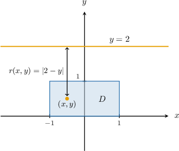
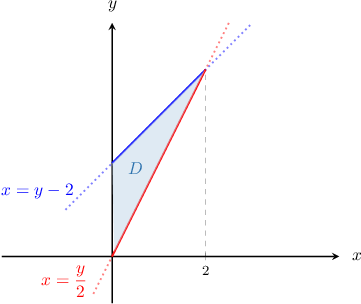
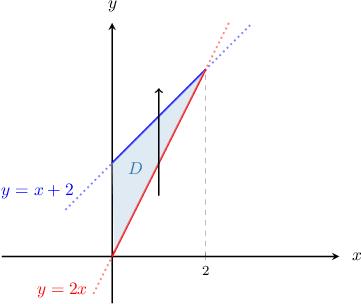
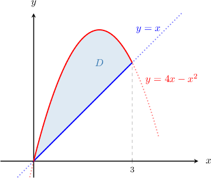
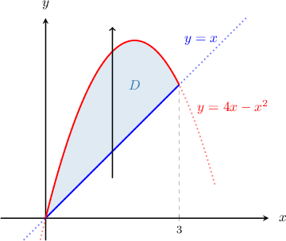
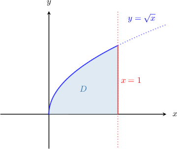
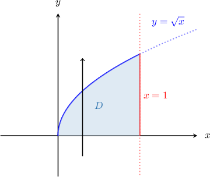

# Moments of Inertia of Laminas About Other Axes

Source: https://www.mathacademy.com/topics/4173?courseId=155
Topic ID: 4173

## Prerequisites

- [Moments of Inertia of Laminas About the Coordinate Axes](./2027-moments-of-inertia-of-laminas-about-the-coordinate-axes.md)

## Lesson

### Introduction

Recall that the moments of inertia $I_x$ and $I_y$ of a thin plate $D$ about the $x$- and $y$- axes are given by

$$

I_x = \iint\limits_D y^2\,\lambda(x,y) \:\textrm dA \qquad\textrm{and}\qquad I_y = \iint\limits_D x^2\,\lambda(x,y) \:\textrm dA,

$$

where the factors $y^2$ and $x^2$ represent the squared distances from a point on the plate to the $x$- and $y$-axes, respectively.

In general, the **moment of inertia about an axis $l$** of a plane lamina occupying the region $D$ with mass density function $\lambda(x,y)$ is given by

$$

I_l = \iint\limits_D \lambda(x,y) [r(x,y)]^2 \:\textrm{d}A,

$$

where $r(x,y)$ is the distance from the point $(x,y)$ to the axis $l.$

For example, consider the thin plate that occupies the region

$$

D = \big\{ (x,y) \: : \: -1 \leq x \leq 1, \:\: 0 \leq y \leq 1 \big\}

$$

with mass density function $\lambda(x,y) = 3x+6.$ Let's find its moment of inertia about the line $y=2.$

The distance between a point $(x,y)$ on $D$ and the line $y=2$ is given by

$$

r(x,y) = |2 - y|.

$$

Therefore, the moment of inertia about the line $y=2$ is

$$

\begin{aligned}𝐼_{𝑙} & =\underset{𝐷}{∬}𝜆(𝑥,𝑦)[𝑟(𝑥,𝑦)]^{2}\,d𝐴 \\ & =∫_{10}^{}∫_{1−1}^{}(3𝑥+6)\,|2−𝑦|^{2}\,d𝑥\,d𝑦 \\ & =∫_{10}^{}∫_{1−1}^{}3(𝑥+2)(𝑦−2)^{2}\,d𝑥\,d𝑦 \\ & =∫_{1−1}^{}(𝑥+2)\,d𝑥⋅∫_{10}^{}3(𝑦−2)^{2}\,d𝑦 \\ & =[\frac{(𝑥+2)^{2}}{2}]_{1−1}^{}⋅[(𝑦−2)^{3}]_{10}^{} \\ & =(\frac{9}{2}−\frac{1}{2})⋅(−1+8) \\ & =4⋅7 \\ & =28.\end{aligned}

$$

### Example: Calculating the Moment of Inertia of a Lamina Given a Mass Density Function

#### Question

A plate occupies the region $D$ enclosed by the $y$-axis and the lines $x=\dfrac{y}2$ and $x=y-2$, as shown above. The mass density function of the plate is $\lambda(x,y) =\dfrac y8.$ Find the moment of inertia of the plate about the line $x=2.$

#### Explanation

The moment of inertia of a plane lamina in the shape of a region $D$ about an axis of rotation $l$ is given by

$$

I_l = \iint\limits_D \lambda (x,y) [r(x,y)]^2 \:\textrm{d}A,

$$

where $\lambda(x,y)$ is the mass density function of the lamina, and $r(x,y)$ is the distance from the line $l$ to the point $(x,y)$ on $D.$

First, notice that $D$ is a type I region with representation

$$

D = \left\{ (x,y) \: : \: 0 \leq x \leq 2, \:\: 2x \leq y \leq x+2 \right\},

$$

as shown below.

The distance between a point on $D$ and the line $x=2$ is given by

$$

r(x,y) = |x - 2|.

$$

Therefore, the moment of inertia about the line $x=2$ is

$$

\begin{aligned}𝐼 & =\underset{𝐷}{∬}𝜆(𝑥,𝑦)[𝑟(𝑥,𝑦)]^{2}\,d𝐴 \\ & =∫_{20}^{}∫_{𝑥+22𝑥}^{}(\frac{𝑦}{8})|𝑥−2|^{2}\,d𝑦\,d𝑥 \\ & =∫_{20}^{}∫_{𝑥+22𝑥}^{}(\frac{𝑦}{8})(𝑥−2)^{2}\,d𝑦\,d𝑥 \\ & =∫_{20}^{}(𝑥−2)^{2}∫_{𝑥+22𝑥}^{}\frac{𝑦}{8}\,d𝑦\,d𝑥 \\ & =∫_{20}^{}(𝑥−2)^{2}[\frac{𝑦^{2}}{16}]_{𝑥+22𝑥}^{}\,d𝑥 \\ & =\frac{1}{16}∫_{20}^{}(𝑥−2)^{2}((𝑥+2)^{2}−(2𝑥)^{2})d𝑥 \\ & =\frac{1}{16}∫_{20}^{}(𝑥^{2}−4𝑥+4)(4+4𝑥−3𝑥^{2})d𝑥 \\ & =\frac{1}{16}∫_{20}^{}(16−24𝑥^{2}+16𝑥^{3}−3𝑥^{4})d𝑥 \\ & =\frac{1}{16}[16𝑥−8𝑥^{3}+4𝑥^{4}−\frac{3𝑥^{5}}{5}]_{20}^{} \\ & =\frac{1}{16}(32−64+64−\frac{96}{5})−0 \\ & =\frac{1}{16}(\frac{64}{5}) \\ & =\frac{4}{5}.\end{aligned}

$$

### Example: Calculating the Moment of Inertia of a Lamina With Uniform Mass Density

#### Question

A plate with mass $M$ and uniform mass density occupies the region $D$ enclosed between the curves $y=x$ and $y=4x-x^2$, as shown above. Given that the region has an area of $\dfrac92$ square units, find the moment of inertia of the plate about the line $x=3.$

#### Explanation

The moment of inertia of a plane lamina in the shape of a region $D$ about an axis of rotation $l$ is given by

$$

I_l = \iint\limits_D \lambda (x,y) [r(x,y)]^2 \:\textrm{d}A,

$$

where $\lambda(x,y)$ is the mass density function of the lamina, and $r(x,y)$ is the distance from the line $l$ to the point $(x,y)$ on $D.$

First, notice that $D$ is a type I region with representation

$$

D = \left\{ (x,y) \: : \: 0 \leq x \leq 3, \:\: x \leq y \leq 4x-x^2 \right\},

$$

as shown below.

The distance between a point on $D$ and the line $x=3$ is given by

$$

r(x,y) = |x - 3|.

$$

Since the plate has uniform density, the mass density function is given by

$$

\lambda(x,y) = \dfrac{M}{\mathcal{A}} = \dfrac{2M}{9}.

$$

Therefore, the moment of inertia about the line $x=3$ is

$$

\begin{aligned}𝐼 & =\underset{𝐷}{∬}𝜆(𝑥,𝑦)[𝑟(𝑥,𝑦)]^{2}\,d𝐴 \\ & =\frac{2𝑀}{9}∫_{30}^{}∫_{4𝑥−𝑥^{2}𝑥}^{}|𝑥−3|^{2}\,d𝑦\,d𝑥 \\ & =\frac{2𝑀}{9}∫_{30}^{}∫_{4𝑥−𝑥^{2}𝑥}^{}(𝑥−3)^{2}\,d𝑦\,d𝑥 \\ & =\frac{2𝑀}{9}∫_{30}^{}(𝑥−3)^{2}[𝑦]_{𝑦=4𝑥−𝑥^{2}𝑦=𝑥}^{}\,d𝑥 \\ & =\frac{2𝑀}{9}∫_{30}^{}(𝑥^{2}−6𝑥+9)(3𝑥−𝑥^{2})\,d𝑥 \\ & =\frac{2𝑀}{9}∫_{30}^{}−𝑥^{4}+9𝑥^{3}−27𝑥^{2}+27𝑥\,d𝑥 \\ & =\frac{2𝑀}{9}[−\frac{𝑥^{5}}{5}+\frac{9𝑥^{4}}{4}−9𝑥^{3}+\frac{27𝑥^{2}}{2}]_{30}^{} \\ & =\frac{2𝑀}{3^{2}}(−\frac{3^{5}}{5}+\frac{3^{6}}{4}−3^{5}+\frac{3^{5}}{2}) \\ & =2⋅3^{3}𝑀(−\frac{1}{5}+\frac{3}{4}−1+\frac{1}{2}) \\ & =\frac{27𝑀}{10}.\end{aligned}

$$

### Example: Calculating the Moment of Inertia Given a Description of a Mass Density Function

#### Question

A plate with mass $M$ occupies the region $D$ in the first quadrant enclosed between the curve $y=\sqrt x$ and the line $x=1,$ as shown above. The mass density at each point is proportional to its distance from the $x$-axis. Find the moment of inertia of the plate about the line $x=-1.$

#### Explanation

The moment of inertia of a plane lamina in the shape of a region $D$ about an axis of rotation $l$ is given by

$$

I_l = \iint\limits_D \lambda (x,y) [r(x,y)]^2 \:\textrm{d}A,

$$

where $\lambda(x,y)$ is the mass density function of the lamina, and $r(x,y)$ is the distance from the line $l$ to the point $(x,y)$ on $D.$

First, notice that $D$ is a type I region with representation

$$

D = \left\{ (x,y) \: : \: 0 \leq x \leq 1, \:\: 0 \leq y \leq \sqrt x \right\},

$$

as shown below.

Also, the distance between a point and the line $x=-1$ is given by

$$

r(x,y) = |x-(-1)| = |x+1|.

$$

Next, the mass density can be written as $\lambda(x,y) = k |y| = ky,$ where $k$ is a constant of proportionality. We can find the value of $k$ by integrating the mass density function over the plate.

$$

\begin{aligned}𝑀 & =\underset{𝐷}{∬}𝜆(𝑥,𝑦)\,d𝐴 \\ & =∫_{10}^{}∫_{\sqrt{√𝑥}0}^{}𝑘𝑦\,d𝑦\,d𝑥 \\ & =𝑘∫_{10}^{}[\frac{1}{2}𝑦^{2}]_{\sqrt{√𝑥}0}^{}\,d𝑥 \\ & =\frac{𝑘}{2}∫_{10}^{}(𝑥−0)\,d𝑥 \\ & =\frac{𝑘}{2}∫_{10}^{}𝑥\,d𝑥 \\ & =\frac{𝑘}{2}⋅[\frac{1}{2}𝑥^{2}]_{10}^{} \\ & =\frac{𝑘}{4}\end{aligned}

$$

Hence,

$$

\lambda(x,y) = k y = 4M y.

$$

Therefore, the moment of inertia about the line $x=-1$ is

$$

\begin{aligned}𝐼_{𝑙} & =\underset{𝐷}{∬}𝜆(𝑥,𝑦)[𝑟(𝑥,𝑦)]^{2}\,d𝐴 \\ & =∫_{10}^{}∫_{\sqrt{√𝑥}0}^{}4𝑀𝑦\,|𝑥+1|^{2}\,d𝑦\,d𝑥 \\ & =∫_{10}^{}∫_{\sqrt{√𝑥}0}^{}4𝑀𝑦(𝑥+1)^{2}\,d𝑦\,d𝑥 \\ & =4𝑀∫_{10}^{}(𝑥+1)^{2}∫_{\sqrt{√𝑥}0}^{}𝑦\,d𝑦\,d𝑥 \\ & =4𝑀∫_{10}^{}(𝑥+1)^{2}[\frac{1}{2}𝑦^{2}]_{\sqrt{√𝑥}0}^{}\,d𝑥 \\ & =2𝑀∫_{10}^{}(𝑥+1)^{2}(𝑥−0)\,d𝑥 \\ & =2𝑀∫_{10}^{}(𝑥^{3}+2𝑥^{2}+𝑥)\,d𝑥 \\ & =2𝑀[\frac{1}{4}𝑥^{4}+\frac{2}{3}𝑥^{3}+\frac{1}{2}𝑥^{2}]_{10}^{} \\ & =2𝑀(\frac{1}{4}+\frac{2}{3}+\frac{1}{2}) \\ & =2𝑀⋅\frac{17}{12} \\ & =\frac{17𝑀}{6}.\end{aligned}

$$
