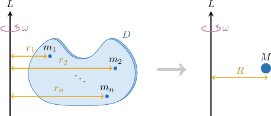

# Calculating the Radius of Gyration of a Plane Lamina

Source: https://www.mathacademy.com/topics/4174?courseId=155
Topic ID: 4174

## Prerequisites

- [Moments of Inertia of Laminas About the Coordinate Axes](./2027-moments-of-inertia-of-laminas-about-the-coordinate-axes.md)

## Lesson

### Introduction

In this lesson, we discuss a concept analogous to *center of mass* that applies to rotating bodies.

Recall that the *center of mass* of a plane lamina is defined as the point $(\bar{x},\bar{y})$ in the coordinate plane where the entire mass of the lamina could be concentrated to produce the same *total moment* about the coordinate axes as the original laminar.

Analogously, the **radius of gyration** of a plane lamina is the distance $R$ from an axis of rotation $L$ that the entire mass $M$ of the lamina would need to be concentrated to produce the same *moment of inertia* as the original lamina.

To derive an explicit formula for the radius of gyration, recall that the moment of inertia of a particle $P$ of mass $m$ at a distance of $r$ from an axis of rotation equals

$$

mr^2.

$$

So, for a particle of mass $M$ at a distance of $R$ from the axis of rotation $L,$ the moment of inertia about $L$ is given by

$$

MR^2.

$$

The radius of gyration is defined as the distance $R$ that a particle of mass $M$ must be placed to give the same moment of inertia as the original lamina. Therefore, it is the solution to the equation

$$

I = MR^2,

$$

where $I$ is the moment of inertia of the lamina about $L.$

Rearranging this equation, we find that the radius of gyration is given by

$$

R = \sqrt{\dfrac{I}{M}}.

$$

### A Summary of Key Results

In this lesson, we'll limit the axis of rotation to the $x$-axis, the $y$-axis, and the origin. We summarize the key results below:

- The radius of gyration $R_x$ of a lamina about the $x$-axis is given by $R_x = \sqrt{\dfrac{I_x}{M}},$ where $I_x$ is the moment of inertia of the lamina about the $x$-axis.

- The radius of gyration $R_y$ of a lamina about the $y$-axis is given by $R_y = \sqrt{\dfrac{I_y}{M}},$ where $I_y$ is the moment of inertia of the lamina about the $y$-axis.

- The radius of gyration $R_0$ of a lamina about the origin is given by $R_0 = \sqrt{\dfrac{I_0}{M}},$ where $I_0$ is the moment of inertia of the lamina about the origin.

### Example: Calculating the Radius of Gyration of a Uniform Rectangular Laminar

#### Question

A rectangular plate of mass $M$ and uniform mass density occupies the region $D = \big\{(x,y) \:: \: 0 \leq x \leq 3, \:\: 1 \leq y \leq 2 \big\}.$ Find the radius of gyration of the plate about the $y$-axis.

#### Explanation

For a plane lamina in the shape of a region $D$ with mass $M$ and mass density function $\lambda(x,y),$ we have the following definitions:

- The radius of gyration $R_x$ about the $x$-axis is given by $R_x = \sqrt{\dfrac{I_x}{M}},$ where $I_x$ is the moment of inertia about the $x$-axis.

- The radius of gyration $R_y$ about the $y$-axis is given by $R_y = \sqrt{\dfrac{I_y}{M}},$ where $I_y$ is the moment of inertia about the $y$-axis.

- The radius of gyration $R_0$ about the origin is given by $R_0 = \sqrt{\dfrac{I_0}{M}},$ where $I_0$ is the moment of inertia about the origin.

The moment of inertia about the $y$-axis is defined as

$$

I_y = \iint\limits_D x^2\lambda(x,y) \:\text{d}A,

$$

where $\lambda(x,y)$ is the mass density function.

The area of the rectangular plate $D$ is $\mathcal{A} = 3\cdot 1 = 3.$ Since the plate has uniform density, the mass density function is given by

$$

\lambda(x,y) = \dfrac{M}{\mathcal{A}} = \dfrac{M}{3}.

$$

Therefore, the moment of inertia about the $y$-axis is

$$

\begin{aligned}𝐼_{𝑦} & =\underset{𝐷}{∬}𝑥^{2}𝜆(𝑥,𝑦)\,d𝐴 \\ & =\frac{𝑀}{3}∫_{21}∫_{30}𝑥^{2}\,d𝑥\,d𝑦 \\ & =\frac{𝑀}{3}∫_{21}[\frac{1}{3}𝑥^{3}]_{30}\,d𝑦 \\ & =\frac{𝑀}{3}∫_{21}9\,d𝑦 \\ & =3𝑀∫_{21}\,d𝑦 \\ & =3𝑀[𝑦]_{21} \\ & =3𝑀(2−1) \\ & =3𝑀.\end{aligned}

$$

Finally,

$$

R_y^2 =\dfrac{3M}{M} = 3\quad \Rightarrow\quad R_y = \sqrt{3}.

$$

### Example: Calculating the Radius of Gyration of a Non-Uniform, Non-Rectangular Laminar

#### Question

A plate of mass $M$ occupies the region $D$ bounded by the lines $y = x,$ $x = 1,$ and the $x$-axis. Its mass density at any point on the plate is given by $\lambda(x,y) = 3Mx.$ Find the radius of gyration of the plate about the origin.

#### Explanation

For a plane lamina in the shape of a region $D$ with mass $M$ and mass density function $\lambda(x,y),$ we have the following definitions:

- The radius of gyration $R_x$ about the $x$-axis is given by $R_x = \sqrt{\dfrac{I_x}{M}},$ where $I_x$ is the moment of inertia about the $x$-axis.

- The radius of gyration $R_y$ about the $y$-axis is given by $R_y = \sqrt{\dfrac{I_y}{M}},$ where $I_y$ is the moment of inertia about the $y$-axis.

- The radius of gyration $R_0$ about the origin is given by $R_0 = \sqrt{\dfrac{I_0}{M}},$ where $I_0$ is the moment of inertia about the origin.

The moment of inertia about the origin is defined as

$$

I_0 = \iint\limits_D (x^2 + y^2) \lambda(x,y) \: \text{d}A,

$$

where $\lambda(x,y)$ is the mass density function. The region $D$ is a type I region with representation

$$

D = \left\{(x,y) \: : \: 0 \leq x \leq 1, \:\: 0 \leq y \leq x \right\}.

$$

Hence, the moment of inertia about the origin is

$$

\begin{aligned}𝐼_{0} & =\underset{𝐷}{∬}(𝑥^{2}+𝑦^{2})𝜆(𝑥,𝑦)\,d𝐴 \\ & =∫_{10}∫_{𝑥0}(𝑥^{2}+𝑦^{2})⋅3𝑀𝑥\,d𝑦\,d𝑥 \\ & =3𝑀∫_{10}∫_{𝑥0}𝑥^{3}+𝑥𝑦^{2}\,d𝑦\,d𝑥 \\ & =3𝑀∫_{10}[𝑥^{3}𝑦+\frac{1}{3}𝑥𝑦^{3}]_{𝑦=𝑥𝑦=0}\,d𝑥 \\ & =3𝑀∫_{10}𝑥^{4}+\frac{1}{3}𝑥^{4}\,d𝑥 \\ & =3𝑀∫_{10}\frac{4}{3}𝑥^{4}\,d𝑥 \\ & =3𝑀[\frac{4}{15}𝑥^{5}]_{10} \\ & =3𝑀⋅\frac{4}{15} \\ & =\frac{4𝑀}{5}.\end{aligned}

$$

Therefore, the radius of gyration about the origin is

$$

\begin{aligned}𝑅_{0} & =\sqrt{\frac{𝐼_{0}}{𝑀}} \\ & =\sqrt{\frac{4𝑀}{5}⋅\frac{1}{𝑀}} \\ & =\sqrt{\frac{4}{5}} \\ & =\frac{2}{\sqrt{5}} \\ & =\frac{2\sqrt{5}}{5}.\end{aligned}

$$

### Example: Calculating Radii of Gyration Using Polar Coordinates

#### Question

A plate of mass $M$ occupies one-half of the circle $x^2+y^2\leq 1$ for $y\geq 0.$ Its mass density at any point is given by $\lambda(x,y)=\dfrac{3}{2}My.$ Find the radius of gyration of the plate about the origin.

#### Explanation

For a plane lamina in the shape of a region $D$ with mass $M$ and mass density function $\lambda(x,y),$ we have the following definitions:

- The radius of gyration $R_x$ about the $x$-axis is given by $R_x = \sqrt{\dfrac{I_x}{M}},$ where $I_x$ is the moment of inertia about the $x$-axis.

- The radius of gyration $R_y$ about the $y$-axis is given by $R_y = \sqrt{\dfrac{I_y}{M}},$ where $I_y$ is the moment of inertia about the $y$-axis.

- The radius of gyration $R_0$ about the origin is given by $R_0 = \sqrt{\dfrac{I_0}{M}},$ where $I_0$ is the moment of inertia about the origin.

In polar coordinates, the region occupied by the plate is given by

$$

D = \left\{ (r,\theta) \: : \: 0 \leq r \leq 1, \:\: 0 \leq \theta \leq \pi \right\}.

$$

The moment of inertia about the origin, in polar coordinates, is defined as

$$

I_0 = \iint\limits_D \lambda(r,\theta) r^3 \:\text{d}r\:\text{d}\theta,

$$

where $\lambda(r,\theta)$ is the mass density function.

Also, the mass density in terms of polar coordinates is $\lambda(r,\theta)=\dfrac{3}{2}Mr\sin\theta.$ Therefore, the moment of inertia about the origin is

$$

\begin{aligned}𝐼_{0} & =\underset{𝐷}{∬}𝜆(𝑟,𝜃)𝑟^{3}\,d𝑟\,d𝜃 \\ & =\frac{3}{2}𝑀∫_{𝜋0}∫_{10}𝑟^{4}sin⁡𝜃\,d𝑟\,d𝜃 \\ & =\frac{3}{2}𝑀(∫_{10}𝑟^{4}\,d𝑟)(∫_{𝜋0}sin⁡𝜃\,d𝜃) \\ & =\frac{3}{2}𝑀⋅\frac{1}{5}𝑟^{5}_{10}⋅(−cos⁡𝜃)_{𝜋0} \\ & =\frac{3}{2}𝑀⋅\frac{1}{5}⋅2 \\ & =\frac{3𝑀}{5}.\end{aligned}

$$

Therefore, the radius of gyration about the origin is

$$

\begin{aligned}𝑅_{0} & =\sqrt{\frac{𝐼_{0}}{𝑀}} \\ & =\sqrt{\frac{3𝑀}{5}⋅\frac{1}{𝑀}} \\ & =\sqrt{\frac{3}{5}}.\end{aligned}

$$
