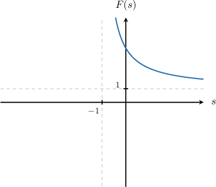

# The First Shifting Theorem of Laplace Transforms

Source: https://www.mathacademy.com/topics/6369?courseId=155
Topic ID: 6369

## Prerequisites

- [The Smoothness Property of Laplace Transforms](./6402-the-smoothness-property-of-laplace-transforms.md)

## Lesson

### Introduction

In a previous lesson, we learned how to compute Laplace transforms. We now examine how the Laplace transform changes when a function is multiplied by an exponential.

Suppose

$$

\mathcal{L}\{f(t)\}=F(s)

$$

exists for $s>s_0.$ We want to compute the Laplace transform of $e^{at}f(t).$

Starting from the definition of the Laplace transform,

$$

\begin{aligned}L{𝑒^{𝑎𝑡}𝑓(𝑡)} & =∫_{∞0}𝑒^{−𝑠𝑡}\,𝑒^{𝑎𝑡}\,𝑓(𝑡)\,d𝑡 \\ & =∫_{∞0}𝑒^{−(𝑠−𝑎)𝑡}\,𝑓(𝑡)\,d𝑡.\end{aligned}

$$

Now recall that

$$

F(s)=\int_0^{\infty} e^{-st}\,f(t)\,\text{d}t, \qquad s>s_0.

$$

Comparing the two integrals, we see that

$$

\int_0^{\infty} e^{-(s-a)t}\,f(t)\,\text{d}t =F(s-a).

$$

For this to make sense, we need $s-a>s_0,$ which is equivalent to

$$

s>s_0+a.

$$

This result is known as the **First Shifting Theorem**:

$$

\mathcal{L}\{e^{at}f(t)\} = F(s-a).

$$

In the next slide, we will apply this result to a concrete example.

### Using the First Shifting Theorem

The **First shifting Theorem** states that if

$$

\mathcal L\{f(t)\}=F(s)

$$

for $s>s_0$, then

$$

\mathcal L\{e^{at}f(t)\}=F(s-a), \qquad s>s_0+a.

$$

So, when you multiply a function by $e^{at}$, you do two things:

- *Replace* $s$ with $s-a$ in the known transform $F(s)$.

- *Shift the domain* from $s>s_0$ to $s>s_0+a$.

To see this in action, consider the following example.

We are given that

$$

\mathcal{L}\{\sin(\omega t)\}=\frac{\omega}{s^2+\omega^2}, \qquad s>0.

$$

Suppose we want to compute

$$

\mathcal{L}\{e^{2t}\sin(3t)\}.

$$

First, we identify the base transform:

$$

\mathcal{L}\{\sin(3t)\}=\frac{3}{s^2+3^2}

$$

Next, we apply the first shifting theorem with $a=2$, which means we replace $s$ by $s-2$:

$$

\begin{aligned}L{𝑒^{2𝑡}sin⁡(3𝑡)} & =\frac{3}{(𝑠−2)^{2}+3^{2}} \\ & =\frac{3}{(𝑠−2)^{2}+9}.\end{aligned}

$$

Since the original transform is valid for $s>0$, the shifted transform is valid for

$$

s>2.

$$

This example illustrates the general pattern: multiplying by $e^{at}$ leads to a simple substitution $s:= s-a$, along with a corresponding shift in the domain.

### Example: Applying the First Shifting Theorem

#### Question

Given that $\mathcal{L} \left\{t\sin(\omega t) \right\}=\dfrac{2\omega s}{(s^2+\omega^2)^2},$ find the Laplace transform $\mathcal{L}\left\{e^{-5t}\cdot t\sin(2t)\right\}.$

#### Explanation

The first shifting theorem states that if $\mathcal{L}\left\{f(t)\right\} = F(s),$ then $\mathcal{L}\left\{e^{at}f(t)\right\} = F(s-a).$

Using the given result, we have

$$

\mathcal{L}\left\{t\sin(2t) \right\} = \frac{2(2)s}{(s^{2}+2^2)^{2}}.

$$

Therefore, applying the first shifting theorem, we get

$$

\begin{aligned}L{𝑒^{−5𝑡}⋅𝑡sin⁡(2𝑡)} & =\frac{2(2)(𝑠+5)}{((𝑠+5)^{2}+2^{2})^{2}} \\ & =\frac{4(𝑠+5)}{((𝑠+5)^{2}+4)^{2}}.\end{aligned}

$$

### Example: Applying the First Shifting Theorem and Linearity

#### Question

Given that

$$

\begin{aligned}L{𝑡^{𝑛}} & =\frac{𝑛!}{𝑠^{𝑛+1}}, & & 𝑠>0,\end{aligned}

$$

use linearity of Laplace transforms and the first shifting theorem to find the Laplace transform of $g(t) = 2t^2 + 5te^{4t}$ for $s > 4.$

#### Explanation

First, we apply the linearity properties of Laplace transforms:

$$

\begin{aligned}L{𝑔(𝑡)} & =L{2𝑡^{2}+5𝑡𝑒^{4𝑡}} \\ & =L{2𝑡^{2}}+L{5𝑡𝑒^{4𝑡}} \\ & =2L{𝑡^{2}}+5L{𝑡𝑒^{4𝑡}}\end{aligned}

$$

We are given that, for $s > 0,$

$$

\begin{aligned}L{𝑡^{𝑛}} & =\frac{𝑛!}{𝑠^{𝑛+1}}.\end{aligned}

$$

Therefore, we have the following:

$$

\begin{aligned}L{𝑡} & =\frac{1}{𝑠^{2}} \\ L{𝑡^{2}} & =\frac{2}{𝑠^{3}}\end{aligned}

$$

The first shifting theorem states that if $\mathcal{L}\left\{f(t)\right\} = F(s),$ then $\mathcal{L}\left\{e^{at}f(t)\right\} = F(s-a).$ Therefore,

$$

\mathcal{L}\left\{ te^{4t} \right\} = \dfrac{1}{(s-4)^2}.

$$

Therefore, the Laplace transform of $g(t)$ is

$$

\begin{aligned}L{𝑔(𝑡)} & =2L{𝑡^{2}}+5L{𝑡𝑒^{4𝑡}} \\ & =2⋅\frac{2}{𝑠^{3}}+5⋅\frac{1}{(𝑠−4)^{2}} \\ & =\frac{4}{𝑠^{3}}+\frac{5}{(𝑠−4)^{2}}.\end{aligned}

$$

This transform is valid for $s>4.$

### Graph Shifting

Recall that the first shifting theorem states that if

$$

\mathcal{L}\left\{f(t)\right\} = F(s),

$$

then

$$

\mathcal{L}\left\{e^{at}f(t)\right\} = F(s-a).

$$

This means the new Laplace transform is the original graph of $F$ evaluated at $s-a$.

So, the graph shift is:

- If $a>0$, then $F(s-a)$ is the graph of $F(s)$ **shifted to the right** by $a$ units.

- If $a<0$, then $F(s-a)$ is the graph of $F(s)$ **shifted to the left** by $|a|$ units.

For example, suppose $F(s)$ has the following graph:

Then the Laplace transform of $e^{-3t} f(t)$ is $F(s+3).$ Here, $a=-3$, so this corresponds to shifting the graph of $F(s)$ three units to the left:

A useful self-check is that any horizontal features move the same way:

- vertical asymptotes shift left/right by the same amount,

- intercepts and key points shift left/right by the same amount.

### Example: Identifying Graph Shifts From the First Shifting Theorem

#### Question

Consider a function $f(t)$ for which the Laplace transform is $\mathcal{L}\{f(t)\} = F(s).$ How can we obtain the graph of $\mathcal{L}\{e^{-6t} f(t)\}$ from the graph of $F(s)?$

#### Explanation

The first shifting theorem states that if $\mathcal{L}\left\{f(t)\right\} = F(s),$ then $\mathcal{L}\left\{e^{at}f(t)\right\} = F(s-a).$

This implies that multiplying a function $f(t)$ by $e^{at}$ shifts the corresponding Laplace transform horizontally along the $s$-axis.

- If $a > 0,$ the graph of $F(s)$ shifts to the right.

- If $a < 0,$ the graph of $F(s)$ shifts to the left.

In our case, to get the graph of $\mathcal{L}\{e^{-6t} f(t)\},$ we must shift the graph of $F(s)$ by $6$ units to the left.

### Example: Proving the First Shifting Theorem

#### Question

Consider a function $f(t)$ such that its Laplace transform is $\mathcal{L}\{f(t)\} = F(s)$ for $s>s_0.$ Suppose we wish to find $\mathcal{L}\{e^{-7t} f(t)\}.$ Show the steps to compute this transform.

#### Explanation

Starting from the definition of the Laplace transform, we have

$$

\begin{aligned}L{𝑒^{−7𝑡}𝑓(𝑡)} & =∫_{∞0}𝑒^{−𝑠𝑡}⋅𝑒^{−7𝑡}\,𝑓(𝑡)\,d𝑡 \\ & =∫_{∞0}𝑒^{−(𝑠+7)𝑡}\,𝑓(𝑡)\,d𝑡\end{aligned}

$$

Now, recall that $\displaystyle F(s) = \int_0^{\infty} e^{-st} \, f(t)\, \text{d}t,$ where $s > s_0.$ Therefore,

$$

\int_0^{\infty} e^{-(s+7)t} \, f(t)\, \text{d}t = F(s+7),

$$

where

$$

s + 7 > s_0 \qquad\Rightarrow\qquad s > s_0 - 7.

$$

### A Laplace Transforms Comparison Table

Using the first shifting theorem, we can obtain new Laplace transforms from old ones without performing any additional integration.

If

$$

\mathcal L\{f(t)\}=F(s)

$$

for $s>s_0$, then

$$

\mathcal L\{e^{at}f(t)\}=F(s-a), \qquad s>s_0+a.

$$

The table below shows some general results we can obtain using the first shifting theorem.

So, each new entry in our table is obtained by taking a known transform and replacing $s$ with $s-a$, and then shifting the domain accordingly.
