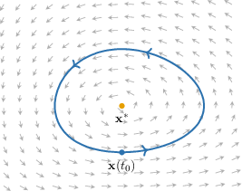
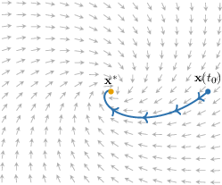
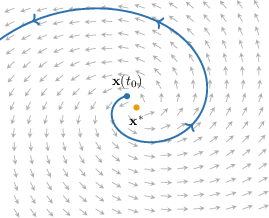

# Equilibrium Points and Stability for Systems of ODEs

Source: https://www.mathacademy.com/topics/6377?courseId=155
Topic ID: 6377

## Prerequisites

- [Classifying Equilibrium Solutions of First-Order ODEs](../differential-equations/2533-classifying-equilibrium-solutions-of-first-order-odes.md)
- [Phase Planes and Phase Portraits](./3188-phase-planes-and-phase-portraits.md)

## Lesson

### Introduction

Recall that for $x'(t) = f(x),$ a point $x^\ast$ is an *equilibrium* if $f(x^\ast) = 0.$ Solutions starting at $x^\ast$ remain constant for all $t.$

Now, consider a system in the plane with variables $x(t)$ and $y(t){:}$

$$

[\begin{aligned}𝑓_{1}(𝑥,𝑦) \\ 𝑓_{2}(𝑥,𝑦)\end{aligned}]

$$

A point $\mathbf{x}^\ast = (x^\ast, y^\ast)$ is an **equilibrium point** if $\mathbf{f}(\mathbf{x}^\ast) = \mathbf{0}.$ Both components must be zero:

$$

\begin{aligned}𝑓_{1}(𝑥^{∗},𝑦^{∗})=0 \\ 𝑓_{2}(𝑥^{∗},𝑦^{∗})=0\end{aligned}

$$

If $\mathbf{x}(t_0) = \mathbf{x}^\ast,$ then $\mathbf{x}(t) = \mathbf{x}^\ast$ for all $t.$ The state does not change.

**Note:** In the phase plane, $\mathbf{f}(x,y)$ represents velocity. At an equilibrium $\mathbf{x}^\ast,$ the velocity is $\mathbf{0},$ so trajectories starting there stay there forever.

For example, let's find the equilibrium points of the following system:

$$

\begin{aligned}𝑥^{′}=𝑥−𝑦 \\ 𝑦^{′}=𝑥+𝑦−2\end{aligned}

$$

- **Step 1:** Set the right-hand sides equal to zero.

- **Step 2:** Solve the system. From the first equation, $y = x.$ Substitute into the second: Thus, $y = 1.$

Therefore, the system has a single equilibrium point $[\begin{aligned}1 \\ 1\end{aligned}]$

### Example: Finding Equilibrium Points of a System

#### Question

$$

\begin{aligned}𝑥^{′}(𝑡)=𝑥(𝑡)−2𝑦(𝑡) \\ 𝑦^{′}(𝑡)=𝑦^{2}(𝑡)−𝑥(𝑡)\end{aligned}

$$

Find all equilibrium points of the system of differential equations above.

#### Explanation

The equilibrium (fixed) points of a system $\mathbf{x}'(t) = \mathbf{f}(x,y)$ are the points for which $\mathbf{f}(x,y)=\mathbf{0}.$ So, we get the following system of equations:

$$

\begin{aligned}𝑥−2𝑦=0 \\ 𝑦^{2}−𝑥=0\end{aligned}

$$

Now, we solve the first equation for $y{:}$

$$

\begin{aligned}𝑥−2𝑦=0\,⇒\,𝑦=\frac{𝑥}{2}\end{aligned}

$$

Next, we substitute $y$ into the second equation

$$

\begin{aligned}𝑦^{2}−𝑥 & =0 \\ (\frac{𝑥}{2})^{2}−𝑥 & =0 \\ \frac{𝑥^{2}}{4}−𝑥 & =0 \\ 𝑥^{2}−4𝑥 & =0 \\ 𝑥(𝑥−4) & =0 \\ 𝑥 & =0, 4.\end{aligned}

$$

Now, we compute $y{:}$

- For $x=0,$ we get $y = \dfrac{0}{2} = 0.$

- For $x=4,$ we get $y = \dfrac{4}{2} = 2.$

Therefore, the equilibrium points are

$$

[\begin{aligned}0 \\ 0\end{aligned}]

$$

### Stability, Asymptotic Stability, and Instability

So far, we have learned how to find equilibrium points of a system

$$

\mathbf{x}'(t) = \mathbf{f}(x,y).

$$

However, just knowing where equilibrium points are is not enough: we also want to understand *how nearby solutions behave* when we start close to an equilibrium point.

Roughly speaking, there are three qualitatively different behaviors.

- An equilibrium point $\mathbf{x}^\ast$ is called **stable** if for any neighborhood $O$ of $\mathbf{x}^\ast$ there exists a neighborhood $O_1 \subseteq O$ such that every orbit that begins inside $O_1$ at some time $t = t_0$ remains inside $O$ for all $t > t_0.$ In plain words, this means that solutions which start sufficiently close to the equilibrium remain close to it for all later times, although they need not converge to it.

- An equilibrium point $\mathbf{x}^\ast$ is called **asymptotically stable** if it is stable *and* there exists a neighborhood $O$ of $\mathbf{x}^\ast$ such that every orbit that begins inside $O$ approaches $\mathbf{x}^\ast$ as $t \to \infty.$ In plain words, this means that solutions which start sufficiently close to the equilibrium remain close to it *and* converge to it as $t \to \infty.$ Note that asymptotic stability is a stronger condition than stability: it adds the requirement that nearby solutions actually reach $\mathbf{x}^\ast$ in the limit.

- An equilibrium point $\mathbf{x}^\ast$ is called **unstable** if it is not stable. In plain words, this means there is some neighborhood $O$ of $\mathbf{x}^\ast$ from which trajectories can escape, even when started arbitrarily close to $\mathbf{x}^\ast.$ Note that this does not require trajectories to stay outside $O$ forever; it only requires them to leave $O$ at some moment, even if they return later.

**Watch out!** These descriptions are *local*: they describe what happens when the initial condition is sufficiently close to the equilibrium. They do not require that all trajectories in the entire plane behave the same way.

Next, let's see some examples.

### Example: Understanding Definitions of Stability Types

#### Question

Which statement correctly describes an **** equilibrium point?

1. Some solutions starting arbitrarily close to the equilibrium eventually move away from it.

2. Solutions that start sufficiently close to the equilibrium remain close and converge to the equilibrium as $t \to \infty.$

3. Solutions that start sufficiently close to the equilibrium remain close but do not necessarily converge to the equilibrium.

4. Solutions that start sufficiently close to the equilibrium remain close and sometimes converge to the equilibrium as $t \to \infty.$

#### Explanation

Let's recall the definitions of stability:

- An equilibrium point $\mathbf{x}^\ast$ is called ** if for any neighborhood $O$ of $\mathbf{x}^\ast,$ there exists a neighborhood $O_1 \subseteq O$ such that every orbit that begins inside $O_1$ at some point in time $t=t_0$ remains inside $O$ for all $t > t_0.$ In plain words, this means that solutions that start sufficiently close to the equilibrium remain close, but may not converge to the equilibrium.

- An equilibrium point $\mathbf{x}^\ast$ is called ** if it is stable and there exists a neighborhood $O$ of $\mathbf{x}^\ast$ such that every orbit that begins inside $O$ approaches $\mathbf{x}^\ast$ as $t \to \infty.$ In plain words, this means that solutions that start sufficiently close to the equilibrium remain close and converge to the equilibrium as $t \to \infty.$

- An equilibrium point $\mathbf{x}^\ast$ is called ** if it is not stable. In plain words, this means that solutions eventually move away from the equilibrium for some initial conditions arbitrarily close to it.

Therefore, the correct answer is II only:

Solutions that start sufficiently close to the equilibrium remain close and converge to the equilibrium as $t \to \infty.$
