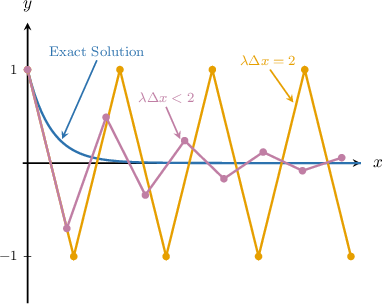
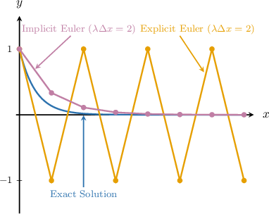

# Stability of Numerical Methods

Source: https://www.mathacademy.com/topics/6685?courseId=155
Topic ID: 6685

## Prerequisites

- [Convergence of Geometric Sequences](../../../ap-courses/lessons/ap-calculus-bc/1088-convergence-of-geometric-sequences.md)
- [Error in Numerical Methods](./3246-error-in-numerical-methods.md)
- [The Modified Euler Method](./3247-the-modified-euler-method.md)
- [The RK4 Method](./3248-the-rk4-method.md)
- [The Trapezoidal Method](./6373-the-trapezoidal-method.md)

## Lesson

### Introduction

When solving ODEs numerically:

- The solution is advanced in many steps.

- Each step introduces a small error (LTE).

- These errors propagate forward (contributing to GTE).

Stability describes how a numerical method responds to these small perturbations.

A method is **stable** if small errors remain controlled as the computation proceeds. A method is **unstable** if small errors can grow rapidly, even when the true solution stays well-behaved.

Stability determines how local errors turn into global errors: a method may be accurate in a single step, but if it is unstable, the global error can grow without bound.

One way to study stability is to test a numerical method on the following **test equation**:

$$

y' = -\lambda y, \qquad y(0)=1, \quad x \geq 0, \quad \lambda > 0

$$

The exact solution of the test equation is $y(x) = e^{-\lambda x},$ which satisfies $y(x) \to 0$ as $x \to \infty.$

We say that a numerical method with update formula

$$

y_{n+1} = y_n + \Delta y

$$

is **stable** for a given step size $\Delta x$ if, when applied to the test equation, the numerical solution also satisfies

$$

y_n \to 0 \:\text{ as }\: n \to \infty.

$$

To see how this works in practice, let's analyze the stability of Euler's method.

### Stability of Euler's Method

We will now check the stability of Euler's method by applying it to the test equation

$$

y' = -\lambda y, \qquad y(0)=1, \quad x \geq 0, \quad \lambda > 0.

$$

First, recall that, for an initial value problem $y' = f(x,y), y(x_0) = y_0,$ Euler's method is given by the update formula

$$

y_{n+1} = y_n + f(x_n, y_n) \cdot \Delta x.

$$

Applying Euler's method to the test equation, we get the following:

$$

\begin{aligned}𝑦_{𝑛+1} & =𝑦_{𝑛}+(−𝜆𝑦_{𝑛})⋅Δ𝑥 \\ & =𝑦_{𝑛}−𝜆𝑦_{𝑛}⋅Δ𝑥 \\ & =(1−𝜆Δ𝑥)𝑦_{𝑛}\end{aligned}

$$

Now, for stability, we require $y_n \to 0$ as $n \to \infty.$ Here, since $y_0=1,$ we have

$$

\begin{aligned}𝑦_{𝑛} & =(1−𝜆Δ𝑥)𝑦_{𝑛−1} \\ & =(1−𝜆Δ𝑥)((1−𝜆Δ𝑥)𝑦_{𝑛−2}) \\ & =(1−𝜆Δ𝑥)^{2}𝑦_{𝑛−2} \\ & \,\,⋮\,\,⋮ \\ & =(1−𝜆Δ𝑥)^{𝑛}𝑦_{0} \\ & =(1−𝜆Δ𝑥)^{𝑛}.\end{aligned}

$$

Let's define $R(\lambda\Delta x) = 1 - \lambda\Delta x.$ Then, $y_n$ converges to $0$ as $n \to \infty$ if and only if $|R(\lambda\Delta x)| < 1.$ The function $R(\lambda\Delta x)$ is called the **stability function** of Euler's method.

Expanding this inequality, we get

$$

\begin{aligned}|𝑅(𝜆Δ𝑥)| & <1 \\ |1−𝜆Δ𝑥| & <1 \\ −1<1−𝜆Δ𝑥 & <1 \\ −2<−𝜆Δ𝑥 & <0 \\ 0<𝜆Δ𝑥 & <2.\end{aligned}

$$

This means that Euler's method is stable when applied to the test equation for values in the region $0 < \lambda\Delta x < 2.$

The diagram below shows the exact solution curve with the numerical steps of Euler's method for the cases $\lambda\Delta x < 2$ and $\lambda\Delta x = 2,$ with $\lambda > 0$ fixed.

Notice that, for $\lambda\Delta x < 2,$ the numerical values converge to $0$ (stable), whereas for $\lambda\Delta x = 2,$ the values oscillate between $-1$ and $1$ and do not converge to $0$ (unstable).

For values $\lambda\Delta x > 2,$ the numerical solution would grow in magnitude at each step, leading to rapidly diverging values.

### Example: Identifying True Statements About the Stability of Euler's Method

#### Question

Which of the following statements are true when testing the stability of Euler's method on the test equation $y' = -\lambda y$ with $y = y(x), \, y(0) = 8, \ x \geq 0, \, \lambda = 6,$ and step size $\Delta x?$

1. The update formula can be written as $y_{n+1} = \left(1 - 6\Delta x\right)^n y_n.$

2. The method is stable for $|1 - 6\Delta x| < 1.$

3. The method is stable for step size $\Delta x = 0.1.$

4. The method is **** for step size $\Delta x = 0.2.$

#### Explanation

A numerical method $y_{n+1} = y_n + \Delta y_n$ is stable for a given step size $\Delta x$ if, when applied to the test equation

$$

y' = -\lambda y, \qquad y(0) = 8, \quad x \geq 0, \quad \lambda > 0,

$$

the numerical solution satisfies $y_n \to 0$ as $n \to \infty,$ just like the exact solution.

Now, let's check the stability of Euler's Method by applying it to the test equation

$$

y' = -6y, \qquad y(0) = 8.

$$

First, for an initial value problem $y' = f(x,y), y(x_0) = y_0,$ Euler's method is given by the update formula

$$

y_{n+1} = y_n + f(x_n,y_n) \cdot \Delta x.

$$

Now, let's check our statements:

- Applying Euler's method to the test equation, we get the following: Hence, statement I is false.

- For stability, we require $y_n \to 0$ as $n \to \infty.$ Here, we have Therefore, $y_n$ converges to $0$ as $n \to \infty$ if and only if $\left|1 - 6\Delta x\right| < 1,$ as stated. Hence, statement II is true.

- Expanding the inequality $\left|1 - 6\Delta x\right| < 1,$ we get Finally, we determine stability for the given step sizes: Since $\Delta x = 0.1$ satisfies the above inequality, Euler's method is stable for this value. Hence, statement III is true. Since $\Delta x = 0.2$ also satisfies the above inequality, Euler's method is stable for this value. Hence, statement IV is false.

In conclusion, the correct answer is "II and III only".

### Example: Determining Stability in Euler's Method

#### Question

For which of the following step sizes is Euler's Method stable, given that $\lambda = 1$ is the parameter of the test equation $y' = -\lambda y$ with $y = y(x), y(0) = 1, x \geq 0,$ and step size $\Delta x?$

1. $\Delta x = 0.5$

2. $\Delta x = 0.9$

3. $\Delta x = 1.2$

4. $\Delta x = 1.8$

** $R(\lambda\Delta x) = 1 - \lambda \Delta x.$

#### Explanation

A numerical method $y_{n+1} = y_n + \Delta y_n$is stable for a given step size $\Delta x$ if, when applied to the test equation

$$

y' = -\lambda y, \qquad y(0) = 1, \quad x \geq 0, \quad \lambda > 0,

$$

the numerical solution satisfies $y_n \to 0$ as $n \to \infty,$ just like the exact solution.

For stability, we require that the following condition holds:

$$

\begin{aligned}|𝑅(𝜆Δ𝑥)| & <1 \\ |1−𝜆Δ𝑥| & <1\end{aligned}

$$

Solving this gives

$$

0 < \lambda \Delta x < 2.

$$

This means that Euler's method is stable when applied to the test equation for values in the region $0 < \lambda\Delta x < 2.$

In our case, where $\lambda=1,$ this region simplifies to

$$

\begin{aligned}0 & <Δ𝑥<2.\end{aligned}

$$

Now, of the given step sizes:

- $\Delta x = 0.5$ satisfies the inequality,

- $\Delta x = 0.9$ satisfies the inequality,

- $\Delta x = 1.2$ satisfies the inequality, and

- $\Delta x = 1.8$ satisfies the inequality.

Therefore, Euler's method is stable for all given step sizes.

Thus, the correct answer is "I, II, III, and IV".

### Stability Functions, Stability Regions, and Absolute Stability

In general, when a numerical method $y_{n+1} = y_n + \Delta y_n$ is applied to the test equation

$$

y' = -\lambda y, \qquad y(0) = 1, \quad x \geq 0, \quad \lambda > 0,

$$

we can write the update in the form

$$

y_{n+1} = R(\lambda\Delta x)y_n,

$$

where $R(\lambda\Delta x)$ is the **stability function** of the method.

For stability, we require $y_n \to 0$ as $n \to \infty.$ Here, since $y_0=1,$

$$

\begin{aligned}𝑦_{𝑛} & =𝑅(𝜆Δ𝑥)𝑦_{𝑛−1} \\ & =(𝑅(𝜆Δ𝑥))^{2}𝑦_{𝑛−2} \\ & \,\,⋮\,\,⋮ \\ & =(𝑅(𝜆Δ𝑥))^{𝑛}𝑦_{0} \\ & =(𝑅(𝜆Δ𝑥))^{𝑛}.\end{aligned}

$$

As a geometric sequence, this decays to $0$ as $n\to\infty$ if and only if $|R(\lambda\Delta x)| < 1.$

The set of values for which the method is stable, given by $|R(\lambda\Delta x)| < 1,$ is called the **stability region** of the method.

A method that is stable for all possible values $\lambda\Delta x > 0$ is called **absolutely stable**.

We've seen that Euler's method is *not* absolutely stable, since its stability region is $0 < \lambda\Delta x < 2.$ But what about the implicit Euler method? Let's find out.

### A Worked Example

Now, let's check the stability of the implicit Euler method by applying it to the test equation

$$

y' = -\lambda y, \qquad y(0) = 1, \quad x \geq 0, \quad \lambda > 0.

$$

First, recall that, for an initial value problem $y' = f(x,y), y(x_0) = y_0,$ the implicit Euler method is given by the update formula

$$

y_{n+1} = y_n + f(x_{n+1},y_{n+1}) \cdot \Delta x.

$$

Applying the implicit Euler method to the test equation, we get the following:

$$

\begin{aligned}𝑦_{𝑛+1} & =𝑦_{𝑛}+(−𝜆𝑦_{𝑛+1})⋅Δ𝑥 \\ 𝑦_{𝑛+1}+𝜆𝑦_{𝑛+1}⋅Δ𝑥 & =𝑦_{𝑛} \\ 𝑦_{𝑛+1}(1+𝜆Δ𝑥) & =𝑦_{𝑛} \\ 𝑦_{𝑛+1} & =\frac{1}{1+𝜆Δ𝑥}⋅𝑦_{𝑛}\end{aligned}

$$

So, the stability function is

$$

R(\lambda\Delta x) = \dfrac{1}{1 + \lambda\Delta x}.

$$

The method is stable when

$$

\begin{aligned}|𝑅(𝜆Δ𝑥)| & <1 \\ \frac{1}{1+𝜆Δ𝑥} & <1.\end{aligned}

$$

Therefore, $y_n$ converges to $0$ as $n \to \infty$ if and only if $\left|\dfrac{1}{1 + \lambda\Delta x}\right| < 1.$

Since $1 + \lambda\Delta x > 1$ for any positive step size $\Delta x,$ we have

$$

\left|\dfrac{1}{1 + \lambda\Delta x}\right| < 1

$$

for all $\Delta x > 0.$ So, the implicit Euler method is absolutely stable!

The diagram below shows the exact solution curve with the numerical steps of both the explicit and the implicit Euler methods for the value $\lambda\Delta x = 2.$ We saw before that the explicit method oscillates between the values $-1$ and $1$ and does not converge to $0.$

Conversely, the numerical steps of the implicit Euler method converge to $0$ quite quickly for the same step size!

Implicit methods tend to be more numerically stable than explicit methods.

### Example: Identifying True Statements About the Stability of Other Methods

#### Question

For the initial value problem $y' = f(x,y), y(x_0) = y_0,$ the modified Euler method can be expressed as the update formula

$$

\begin{aligned}Δ𝑦_{(𝑝)𝑛} & =𝑓(𝑥_{𝑛},𝑦_{𝑛})⋅Δ𝑥, \\ 𝑦_{𝑛+1} & =𝑦_{𝑛}+\frac{1}{2}(𝑓(𝑥_{𝑛},𝑦_{𝑛})+𝑓(𝑥_{𝑛+1},𝑦_{𝑛}+Δ𝑦_{(𝑝)𝑛}))⋅Δ𝑥.\end{aligned}

$$

Which of the following statements are true when testing the stability of the modified Euler method on the test equation $y'=-\lambda y$ with $y = y(x), y(0) = 1, x \geq 0, \lambda = 12,$ and step size $\Delta x?$

1. The stability function is $R(12\Delta x) = 1 - 12\Delta x + 72(\Delta x)^2.$

2. The stability region is $\left|72\left(\Delta x - \dfrac16\right)^2\right| < 1.$

3. The method is absolutely stable.

4. The method is stable for step size $\Delta x = 0.15.$

** The stability function $R$ is given by $y_{n+1} = R(\lambda\Delta x)y_n.$

#### Explanation

A numerical method $y_{n+1} = y_n + \Delta y_n$ is stable for a given step size $\Delta x$ if, when applied to the test equation

$$

y' = -\lambda y, \qquad y(0) = 1, \quad x \geq 0, \quad \lambda > 0,

$$

the numerical solution satisfies $y_n \to 0$ as $n \to \infty,$ just like the exact solution.

When a method is applied to the test equation, the update takes the form

$$

y_{n+1} = R(\lambda\Delta x)y_n,

$$

where $R(\lambda\Delta x)$ is the stability function of the method. The set of values for which the method is stable, given by $|R(\lambda\Delta x)| < 1,$ is called the stability region of the method.

A method that is stable for all possible values $\lambda\Delta x > 0$ is called absolutely stable.

Now, let's check the stability of the modified Euler Method by applying it to the test equation

$$

y' = -12y, \qquad y(0) = 1.

$$

We now examine our statements:

- Applying the modified Euler method to this test equation, we get the following: Thus, So, the stability function is $R(12\Delta x) = 1 - 12\Delta x + 72(\Delta x)^2.$ Hence, statement I is true.

- The method is stable when Therefore, $y_n$ converges to $0$ as $n \to \infty$ if and only if Hence, statement II is false.

- Now, since the argument of the absolute value is always non-negative, we can remove the absolute value. So, we have Thus, the modified Euler method is not absolutely stable, and statement III is false.

- Finally, since it satisfies this inequality, the modified Euler method is stable for step size $\Delta x = 0.15,$ and hence statement IV is true.

In conclusion, the correct answer is "I and IV only".

### Table of Results

A table of some numerical methods, their stability functions, and stability regions is shown below. These results assume the test equation $y' = -\lambda y$ (where $\lambda > 0$) with step size $\Delta x$.

### Example: Determining Stability in Other Methods

#### Question

For which of the following values is the Runge–Kutta Method (RK4) stable, given that $\lambda$ is the parameter of the test equation?

1. $\lambda\Delta x = 0.6$

2. $\lambda\Delta x = 1.4$

3. $\lambda\Delta x = 2.8$

4. $\lambda\Delta x = 3.3$

**

$$

R(\lambda\Delta x) = 1 - \lambda\Delta x + \dfrac{(\lambda\Delta x)^2}{2} - \dfrac{(\lambda\Delta x)^3}{6} + \dfrac{(\lambda\Delta x)^4}{24}.

$$

#### Explanation

A numerical method $y_{n+1} = y_n + \Delta y_n$ is stable for a given step size $\Delta x$ if, when applied to the test equation

$$

y' = -\lambda y, \qquad y(0) = 1, \quad x \geq 0, \quad \lambda > 0,

$$

the numerical solution satisfies $y_n \to 0$ as $n \to \infty,$ just like the exact solution.

When a method is applied to the test equation, the update takes the form

$$

y_{n+1} = R(\lambda\Delta x)y_n,

$$

where $R(\lambda\Delta x)$ is referred to as the stability function of the method. The set of values for which the method is stable, given by $|R(\lambda\Delta x)| < 1,$ is called the stability region of the method.

The stability function of the RK4 Method is

$$

R(\lambda\Delta x) = 1 - \lambda\Delta x + \dfrac{(\lambda\Delta x)^2}{2} - \dfrac{(\lambda\Delta x)^3}{6} + \dfrac{(\lambda\Delta x)^4}{24}.

$$

Let's check the stability of the RK4 Method for each of the given values in turn.

- For $\lambda\Delta x = 0.6,$ we have Since this value falls ** the stability region, the RK4 Method is stable.

- For $\lambda\Delta x = 1.4,$ we have Since this value falls ** the stability region, the RK4 Method is stable.

- For $\lambda\Delta x = 2.8,$ we have Since this value falls ** the stability region, the RK4 Method is unstable.

- For $\lambda\Delta x = 3.3,$ we have Since this value falls ** the stability region, the RK4 Method is unstable.

Therefore, the correct answer is "I and II only".

Note that the stability region of the RK4 Method is $0 < \lambda\Delta x < 2.785\ldots,$ so it is not absolutely stable.
