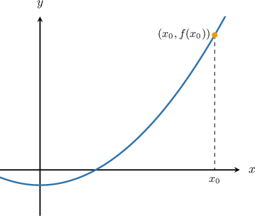
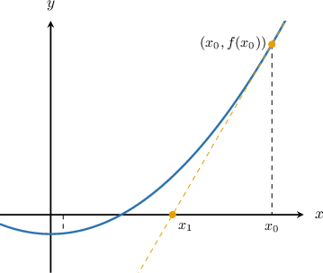
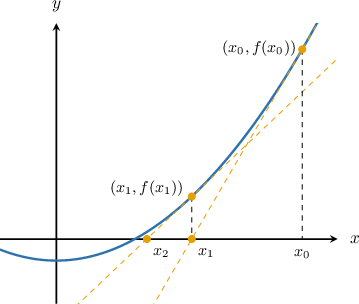
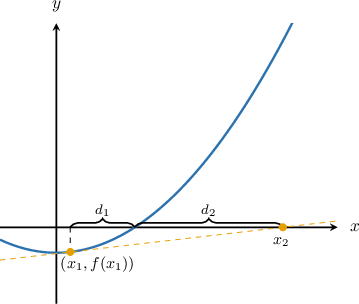

# Newton's Method

Source: https://www.mathacademy.com/topics/912?courseId=155
Topic ID: 912

## Prerequisites

- [Approximating Functions Using Local Linearity and Linearization](../../../ap-courses/lessons/ap-calculus-ab/621-approximating-functions-using-local-linearity-and-linearization.md)
- [Recursive Sequences](../../../high-school/traditional/lessons/algebra-i/1226-recursive-sequences.md)

## Lesson

### Introduction

In many problems, we are interested in finding the **roots** of functions, that is, solving equations of the form

$$

f(x) = 0.

$$

Sometimes, this can be done **analytically**. For example, to find the roots of $f(x) = x^2 - 1$, we solve the equation

$$

x^2 - 1 = 0,

$$

which gives the exact solutions $x = \pm 1.$

However, in many cases, finding the roots analytically is either too difficult or simply not possible. For example, the roots of the function

$$

f(x) = x^2 + x \sin{x} - 1

$$

cannot be found using standard algebraic techniques. When that happens, we turn to methods that provide good approximations rather than exact answers.

In the next slide, we will look at an example of how to apply such a method to this function.

### Newton's Method

In this lesson, we’ll learn how **Newton’s method** (also known as the **Newton–Raphson method**) constructs such an approximation step by step. Our focus will be on the single-variable case, where the goal is to find a real number $x$ such that $f(x) = 0$.

To apply Newton’s method, we begin by choosing an initial guess for the root, which we’ll denote by $x_0$. This guess might come from intuition or a rough sketch of the graph.

Below, we see the graph of $f(x)$ along with the initial guess $x_0$.

The idea is to simplify the problem by replacing the curve with a straight line near our guess. Recall that the equation of the tangent line $y = F(x)$ to the curve $y = f(x)$ at the point $x = x_0$ is

$$

F(x) = f(x_0) + f'(x_0)(x - x_0).

$$

Since $F(x)$ closely approximates $f(x)$ near $x_0$, we solve the simpler linear equation $F(x) = 0$ instead of the original nonlinear equation $f(x) = 0$. This gives us a new estimate for the root that is easier to compute.

To find where this tangent intersects the $x$-axis, we set $F(x) = 0{:}$

$$

0 = f(x_0) + f'(x_0)(x - x_0)

$$

Next, we isolate the term $x,$ as follows:

$$

\begin{aligned}𝑓^{′}(𝑥_{0})(𝑥−𝑥_{0}) & =−𝑓(𝑥_{0}) \\ 𝑥−𝑥_{0} & =−\frac{𝑓(𝑥_{0})}{𝑓^{′}(𝑥_{0})} \\ 𝑥 & =𝑥_{0}−\frac{𝑓(𝑥_{0})}{𝑓^{′}(𝑥_{0})}\end{aligned}

$$

This new value becomes our next guess, which we call $x_1$. So, we write

$$

x_1 = x_0 - \frac{f(x_0)}{f'(x_0)}.

$$

In the figure below, the dashed line is the tangent at $x_0$. We follow it down to the $x$-axis to find our next guess, $x_1$.

To keep improving our estimate, we now repeat the same process, this time starting from $x_1$ instead of $x_0$. Applying the same idea gives the next guess

$$

x_2 = x_1 - \frac{f(x_1)}{f'(x_1)}

$$

as shown below.

Continuing this process, we generate a sequence of values

$$

x_0, \quad x_1, \quad x_2, \quad x_3, \dots

$$

that, under suitable conditions, converges to a root of $f(x)$. At each step, the next approximation is computed using the update rule

$$

x_{n+1} = x_n - \frac{f(x_n)}{f'(x_n)}.

$$

In practice, we stop iterating when the change between consecutive guesses is very small, meaning we’re close enough to the actual root for our purposes.

### A Worked Example

Suppose we know that the function

$$

f(x) = 0.1 x^2 - 3

$$

has a root somewhere in the interval $[5, 6]$, and we want to use Newton’s method to estimate that root.

While the root of $f(x)$ can be found analytically, we’ll apply Newton’s method to see how well it approximates the root after a few steps.

The formula for the Newton-Raphson method is

$$

x_{n+1} = x_n - \dfrac{f(x_n)}{f'(x_n)}

$$

where $f'(x_n)$ is the derivative of $f(x)$ evaluated at $x_n.$

In our case, we have

$$

f'(x) = (0.1 x^2-3)' = 0.2 x

$$

Therefore, our Newton-Raphson formula is

$$

\begin{aligned}𝑥_{𝑛+1} & =𝑥_{𝑛}−\frac{0.1𝑥_{2𝑛}−3}{0.2𝑥_{𝑛}} \\ & =\frac{𝑥_{𝑛}(0.2𝑥_{𝑛})−(0.1𝑥_{2𝑛}−3)}{0.2𝑥_{𝑛}} \\ & =\frac{0.1𝑥_{2𝑛}+3}{0.2𝑥_{𝑛}} \\ & =\frac{𝑥_{2𝑛}+30}{2𝑥_{𝑛}}.\end{aligned}

$$

We take $x_0 = 5$ as our initial guess, since it falls within the interval where the root is located:

$$

\begin{aligned}𝑥_{1} & =\frac{𝑥_{20}+30}{2𝑥_{0}} \\ & =\frac{5^{2}+30}{2⋅5} \\ & =5.5.\end{aligned}

$$

Similarly, we have the following updates:

$$

\begin{aligned}𝑥_{2} & =\frac{𝑥_{21}+30}{2𝑥_{1}} \\ & =\frac{(5.5)^{2}+30}{2(5.5)} \\ & =5.477\,272… \\ 𝑥_{3} & =\frac{𝑥_{22}+30}{2𝑥_{2}} \\ & =\frac{(5.477\,272…)^{2}+30}{2(5.477\,272…)} \\ & =5.477\,225…\end{aligned}

$$

Notice that the last two approximations $x_2 \approx 5.477$ and $x_3 \approx 5.477$ are the same when rounded to three decimal places.

Therefore, we can take for the root of the function the value $x \approx 5.477,$ rounded to three decimal places. The actual root is $x = \sqrt{30} = 5.477\,225 \ldots,$ which is pretty close to our result just after $3$ iterations.

### Example: Computing One Newton-Raphson Iteration

#### Question

Suppose we wish to find a root of the function $f(x)=5^{2x}-20$ in the interval $[0,2].$ Calculate one iteration of the Newton-Raphson process starting from the point $x_0 = 1.$ Round your answer to three decimal places.

#### Explanation

The formula for the Newton-Raphson method is

$$

x_{n+1} = x_n - \dfrac{f(x_n)}{f'(x_n)}

$$

where $f'(x_n)$ is the derivative of $f(x)$ evaluated at $x_n.$

In our case, we have

$$

f'(x) = (5^{2x}-20)' = 2\ln (5)\cdot 5^{2x}.

$$

Therefore, our Newton-Raphson formula is

$$

\begin{aligned}𝑥_{𝑛+1} & =𝑥_{𝑛}−\frac{5^{2𝑥_{𝑛}}−20}{2ln⁡(5)⋅5^{2𝑥_{𝑛}}}.\end{aligned}

$$

Starting with $x_0 = 1,$ we have

$$

\begin{aligned}𝑥_{1} & =𝑥_{0}−\frac{5^{2𝑥_{0}}−20}{2ln⁡(5)⋅5^{2𝑥_{0}}}. \\ & =1−\frac{5^{2}−20}{2ln⁡(5)⋅5^{2}}. \\ & ≈0.938,\end{aligned}

$$

rounded to three decimal places.

### Example: Computing Two Newton-Raphson Iterations

#### Question

Suppose we wish to find a root of the function $f(x)=e^x-x^3-3$ in the interval $[4,6].$ Calculate the second iteration of the Newton-Raphson process starting from the point $x_0 = 5.$ Round your answer to three decimal places.

#### Explanation

The formula for the Newton-Raphson method is

$$

x_{n+1} = x_n - \dfrac{f(x_n)}{f'(x_n)}

$$

where $f'(x_n)$ is the derivative of $f(x)$ evaluated at $x_n.$

In our case, we have

$$

f'(x) = (e^x-x^3-3)' = e^x-3x^2.

$$

Therefore, our Newton-Raphson formula is

$$

\begin{aligned}𝑥_{𝑛+1} & =𝑥_{𝑛}−\frac{𝑒^{𝑥_{𝑛}}−𝑥_{3𝑛}−3}{𝑒^{𝑥_{𝑛}}−3𝑥_{2𝑛}}\end{aligned}

$$

Starting with $x_0 = 5,$ we have

$$

\begin{aligned}𝑥_{1} & =𝑥_{0}−\frac{𝑒^{𝑥_{0}}−𝑥_{30}−3}{𝑒^{𝑥_{0}}−3𝑥_{20}} \\ & =5−\frac{𝑒^{5}−5^{3}−3}{𝑒^{5}−3(5)^{2}} \\ & =4.721\,941…\end{aligned}

$$

For the second iteration, we have

$$

\begin{aligned}𝑥_{2} & =𝑥_{1}−\frac{𝑒^{𝑥_{1}}−𝑥_{31}−3}{𝑒^{𝑥_{1}}−3𝑥_{21}} \\ & =(4.721\,941…)−\frac{𝑒^{4.721\,941…}−(4.721\,941…)^{3}−3}{𝑒^{4.721\,941…}−3(4.721\,941…)^{2}} \\ & ≈4.632,\end{aligned}

$$

rounded to three decimal places.

### Example: Finding a Function's Root Using the Newton-Raphson Method

#### Question

Given that the function $f(x)=x^5-2$ has a root in the interval $[0,2],$ use the Newton-Raphson process starting from $x_0=1$ to estimate the root. Round your final answer to two decimal places.

#### Explanation

The formula for the Newton-Raphson method is

$$

x_{n+1} = x_n - \dfrac{f(x_n)}{f'(x_n)}

$$

where $f'(x_n)$ is the derivative of $f(x)$ evaluated at $x_n.$

In our case, we have

$$

f'(x) = (x^5-2)' = 5x^4.

$$

Therefore, our Newton-Raphson formula is

$$

\begin{aligned}𝑥_{𝑛+1} & =𝑥_{𝑛}−\frac{𝑥_{5𝑛}−2}{5𝑥_{4𝑛}} \\ & =\frac{𝑥_{𝑛}(5𝑥_{4𝑛})−(𝑥_{5𝑛}−2)}{5𝑥_{4𝑛}} \\ & =\frac{4𝑥_{5𝑛}+2}{5𝑥_{4𝑛}}.\end{aligned}

$$

Starting with $x_0 = 1,$ we have

$$

\begin{aligned}𝑥_{1} & =\frac{4𝑥_{50}+2}{5𝑥_{40}} \\ & =\frac{4(1)^{5}+2}{5(1)^{4}} \\ & =\frac{6}{5} \\ & =1.2.\end{aligned}

$$

Similarly, we have

$$

\begin{aligned}𝑥_{2} & =\frac{4𝑥_{51}+2}{5𝑥_{41}} \\ & =\frac{4(1.2)^{5}+2}{5(1.2)^{4}} \\ & =1.152… \\ 𝑥_{3} & =\frac{4𝑥_{52}+2}{5𝑥_{42}} \\ & =\frac{4(1.152…)^{5}+2}{5(1.152…)^{4}} \\ & =1.148….\end{aligned}

$$

Notice that the last two approximations $x_2 \approx 1.15$ and $x_3 \approx 1.15$ are the same when rounded to two decimal places.

Therefore, the root of the function is $x \approx 1.15,$ rounded to two decimal places.

### Limitations of Newton’s Method

Now that we’ve seen how Newton’s method works in practice, it’s important to understand the conditions under which it actually succeeds. While the method can converge very quickly, it doesn’t always work as expected.

For Newton’s method to work reliably, a few key conditions need to be met:

- The derivative $f'(x_n)$ must not be zero or close to zero. If the slope is flat, the tangent line becomes nearly horizontal, and the update step can either move very little or jump far in the wrong direction. In the figure below, we can see this effect in action. Our initial guess $x_1$ happens to lie in a region where the slope of the function is close to zero. If we follow the tangent line from that point to where it intersects the $x$-axis, the resulting guess $x_2$ ends up farther from the actual root than where we started ($d_1 < d_2$). This illustrates how a poor initial guess can lead Newton’s method in the wrong direction.

- The initial guess must be reasonably close to the root. Newton’s method relies on local linear approximation. If the guess is too far from the root, the tangent might not reflect the behavior of the function in the right region.

- The function must be smooth near the root. Sharp corners, discontinuities, or erratic changes in slope can break the assumptions behind the method. In such cases, the tangent might not be a good approximation even near the root.

If any of these conditions fail, Newton’s method can behave unpredictably. It may diverge entirely, bounce back and forth between values without settling down, converge to the wrong root, or get stuck in a region where the derivative is nearly zero and the update steps become ineffective.
