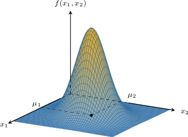
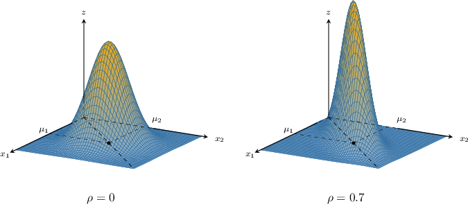
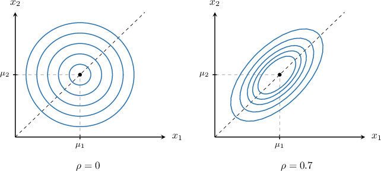

# The Bivariate Normal Distribution

Source: https://www.mathacademy.com/topics/918?courseId=155
Topic ID: 918

## Prerequisites

- [Level Curves](../mathematical-methods-for-the-physical-sciences-i/1900-level-curves.md)
- [Combining Multiple Normally Distributed Random Variables](./3638-combining-multiple-normally-distributed-random-variables.md)
- [The Covariance Matrix](./3939-the-covariance-matrix.md)
- [Variance of Sums of Random Variables](./3940-variance-of-sums-of-random-variables.md)

## Lesson

### Introduction

Let $\mathbf{X} = [X_1, X_2]^T$ be two (dependent) random variables. We say that $\mathbf{X}$ is a **bivariate normal vector** with mean vector $\boldsymbol{\mu}$ and covariance matrix $\Sigma$ if the joint probability density function of $\mathbf{X}$ is given by

$$

f(x_1, x_2) = \dfrac{1}{2\pi\sqrt{|\Sigma|}} \mathrm{exp}\left( -\dfrac 12(\mathbf X - \boldsymbol \mu)^T \,\Sigma^{-1} \,(\mathbf X - \boldsymbol \mu)\right)

$$

where

$$

\begin{aligned}𝝁=[\begin{matrix}𝜇_{1} \\ 𝜇_{2}\end{matrix}],\,Σ=[\begin{matrix}𝜎_{21} & 𝜎_{12} \\ 𝜎_{21} & 𝜎_{22}\end{matrix}]=[\begin{matrix}𝜎_{21} & 𝜌𝜎_{1}𝜎_{2} \\ 𝜌𝜎_{1}𝜎_{2} & 𝜎_{22}\end{matrix}],\end{aligned}

$$

Here,

- $\sigma^2_1 = \text{Var}[X_1]$ and $\sigma^2_2 = \text{Var}[X_2]$ are the variances of $X_1$ and $X_2,$

- $\sigma_{12} = \sigma_{21} = \text{Cov}[X_1,X_2]$ is the covariance of $X_1$ and $X_2$,

- $\rho$ is the linear correlation coefficient of $X_1$ and $X_2,$ and

- $|\Sigma|$ denotes the determinant of $\Sigma,$ the covariance matrix.

A graph of a typical density function of a bivariate normal vector is depicted below.

This surface is often referred to as having a "bell shape."

### Normal Distribution vs. Bivariate Normal Distribution

Recall that a normally distributed random variable $X\sim N(\mu,\sigma^2)$ has the probability density function

$$

f(x) = \dfrac{1}{\sigma \sqrt{2\pi}} e^{-\frac{1}{2} \left( \frac{x-\mu}{\sigma} \right)^2}.

$$

This probability density function can be written as

$$

f(x) = (2\pi)^{-{\color{red}1}/2 } ({\color{blue}\sigma^2})^{-1/2} \: \mathrm{exp}\left( -\frac{1}{2} (x-\mu) ({\color{blue}\sigma^2})^{-1} (x-\mu) \right).

$$

Let's compare this to the density function of a bivariate normal vector. First, we rewrite the joint density $f(x_1,x_2)$ of the bivariate normal distribution as follows:

$$

\begin{aligned}𝑓(𝑥_{1},𝑥_{2}) & =\frac{1}{2𝜋\sqrt{|Σ|}}\,exp(−\frac{1}{2}(𝐗−𝝁)^{𝑇}\,Σ^{−1}\,(𝐗−𝝁)) \\ & =(2𝜋)^{−1}|Σ|^{−1/2}\,exp(−\frac{1}{2}(𝐗−𝝁)^{𝑇}\,Σ^{−1}\,(𝐗−𝝁)) \\ & =(2𝜋)^{−2/2}|Σ|^{−1/2}\,exp(−\frac{1}{2}(𝐗−𝝁)^{𝑇}\,Σ^{−1}\,(𝐗−𝝁))\end{aligned}

$$

By comparing the expressions for $f(x)$ and $f(x_1,x_2),$ we see that the *bivariate* normal distribution can be considered as a generalization of the *normal distribution* from the ${\color{red}1}$-dimensional case (when we have only one variable, $x$) to the ${\color{red}2}$-dimensional case (when we have two variables, $x_1$ and $x_2$).

This analogy will be particularly helpful when extending the bivariate normal distribution to more than two random variables.

### Interpretation of Parameters in a Bivariate Normal Distribution

Let's consider a bivariate normal vector $\mathbf{X} = [X_1, X_2]^T$ with the joint probability density function

$$

f(x_1, x_2) = \dfrac{1}{2\pi\sqrt{|\Sigma|}} \mathrm{exp}\left( -\dfrac 12(\mathbf X - \boldsymbol \mu)^T \,\Sigma^{-1} \,(\mathbf X - \boldsymbol \mu)\right),

$$

where the mean vector $\boldsymbol{\mu}$ and covariance matrix $\Sigma$ are given by

$$

\begin{aligned}𝜇=[\begin{matrix}𝜇_{1} \\ 𝜇_{2}\end{matrix}],\,Σ=[\begin{matrix}𝜎_{21} & 𝜎_{12} \\ 𝜎_{21} & 𝜎_{22}\end{matrix}]=[\begin{matrix}𝜎_{21} & 𝜌𝜎_{1}𝜎_{2} \\ 𝜌𝜎_{1}𝜎_{2} & 𝜎_{22}\end{matrix}].\end{aligned}

$$

Most of the parameters of the distribution can be interpreted geometrically on a corresponding graph of the probability density function:

- The mean vector $\boldsymbol{\mu}$ gives the $xy$-coordinates of the peak.

- The correlation coefficient $\rho$ defines how much the bell is squeezed towards the plane $y=x{:}$ when $\rho \to 0,$ the horizontal cross-sections are almost circular, while when $\rho \to 1,$ the shape becomes more and more squeezed towards the plane $y=x.$

- The variances $\sigma_1^2$ and $\sigma_2^2$ represent how much the curve is spread out along the principal axes $x_1=\mu_1$ and $x_2=\mu_2{:}$ when $\sigma_1^2$ and $\sigma_2^2$ are small, the bell shape is more "pointy," while for larger $\sigma_1^2$ and $\sigma_2^2,$ the bell shape is more "flat."

The level curves of the surface have equations of the form

$$

(\mathbf X - \boldsymbol \mu)^T \,\Sigma^{-1} \,(\mathbf X - \boldsymbol \mu) = \text{const},

$$

which represent ellipses centered at $(\mu_1,\mu_2).$

### Example: The Joint PDF of a Bivariate Normal Random Variable

#### Question

Let $\mathbf{X} = [X_1, X_2]^T$ be a bivariate normal random vector. The variances of $X_1$ and $X_2$ and their correlation coefficient are given by

$$

\sigma_1^2=9,\qquad \sigma_2^2 = 1, \qquad \rho = \dfrac1{3}.

$$

Given that the joint probability density function of $\mathbf X$ is

$$

f(\mathbf x) = \dfrac1k\,\mathrm{exp}\left( -\dfrac 12(\mathbf x - \boldsymbol \mu)^T \,\Sigma^{-1} \,(\mathbf x - \boldsymbol \mu)\right),

$$

where $\boldsymbol{\mu}$ is the mean vector and $\Sigma$ is the corresponding covariance matrix, find the value of $k.$

#### Explanation

Recall that if $\mathbf{X} = [X_1, X_2]^T$ is a bivariate normal vector with mean vector $\boldsymbol{\mu}$ and covariance matrix $\Sigma,$ given by

$$

\begin{aligned}𝜇=(\begin{matrix}𝜇_{1} \\ 𝜇_{2}\end{matrix}),\,Σ=[\begin{matrix}𝜎_{21} & 𝜎_{12} \\ 𝜎_{21} & 𝜎_{22}\end{matrix}]=[\begin{matrix}𝜎_{21} & 𝜌𝜎_{1}𝜎_{2} \\ 𝜌𝜎_{1}𝜎_{2} & 𝜎_{22}\end{matrix}]\end{aligned}

$$

where $\sigma^2_i = \text{Var}[X_i],$ $\sigma_{12} = \text{Cov}[X_1,X_2],$ and $\rho$ is the correlation, then the joint probability density function of $\mathbf X$ is

$$

f(\mathbf x) = \dfrac{1}{2\pi\sqrt{|\Sigma|}} \mathrm{exp}\left( -\dfrac 12(\mathbf x - \boldsymbol \mu)^T \,\Sigma^{-1} \,(\mathbf x - \boldsymbol \mu)\right)

$$

and $|\Sigma|$ denotes the determinant of $\Sigma.$

Using the given values of $\sigma^2_1, \sigma^2_2$, and $\rho,$ our covariance matrix is

$$

[\begin{aligned}9 & \frac{1}{3}⋅\sqrt{9}⋅\sqrt{1} \\ \frac{1}{3}⋅\sqrt{9}⋅\sqrt{1} & 1\end{aligned}]

$$

Therefore,

$$

|\Sigma| = 9\cdot 1 - 1\cdot 1 = 8.

$$

Substituting this value into our expression for the joint PDF, we obtain

$$

\begin{aligned}𝑓(𝐱) & =\frac{1}{2𝜋\sqrt{8}}exp(−\frac{1}{2}(𝐱−𝝁)^{𝑇}\,Σ^{−1}\,(𝐱−𝝁)) \\ & =\frac{1}{4𝜋\sqrt{2}}exp(−\frac{1}{2}(𝐱−𝝁)^{𝑇}\,Σ^{−1}\,(𝐱−𝝁)).\end{aligned}

$$

Finally, $k=4\pi\sqrt 2.$

### Linear Combinations of Normal Random Variables From Bivariate Distributions

A linear combination of coordinates of a bivariate normal random vector generates a (one-dimensional) normal distribution:

*If $\mathbf{X} = [X_1, X_2]^T$ is a bivariate normal random vector with mean vector $\boldsymbol{\mu}$ and covariance matrix $\Sigma,$ given by*

$$

\begin{aligned}𝝁=[\begin{matrix}𝜇_{1} \\ 𝜇_{2}\end{matrix}],\,Σ=[\begin{matrix}𝜎_{21} & 𝜎_{12} \\ 𝜎_{21} & 𝜎_{22}\end{matrix}],\end{aligned}

$$

*then the random variable $Y,$ defined as*

$$

Y= aX_1 + bX_2

$$

*is a normally distributed random variable for all values of $a$ and $b.$ Furthermore, we have that*

$$

\begin{aligned}E[𝑌] & =𝑎𝜇_{1}+𝑏𝜇_{2}, \\ Var[𝑌] & =𝑎^{2}𝜎_{21}+𝑏^{2}𝜎_{22}+2𝑎𝑏𝜎_{12}.\end{aligned}

$$

### Example: Linear Combinations of Elements From a Bivariate Normal Random Variable

#### Question

Let $\mathbf{X} = [X_1,X_2]^T$ be a bivariate normal random vector with mean vector $\boldsymbol{\mu}$ and covariance matrix $\Sigma$ given by

$$

\begin{aligned}𝝁=[\begin{matrix}2 \\ −1\end{matrix}],\,Σ=[\begin{matrix}4 & −3 \\ −3 & 7\end{matrix}].\end{aligned}

$$

Find the distribution of $Y = 3X_1 + X_2.$

#### Explanation

Recall that if $\mathbf{X} = [X_1, X_2]^T$ is a bivariate normal random vector with mean vector $\boldsymbol{\mu}$ and covariance matrix $\Sigma,$ given by

$$

\begin{aligned}𝝁=[\begin{matrix}𝜇_{1} \\ 𝜇_{2}\end{matrix}],\,Σ=[\begin{matrix}𝜎_{21} & 𝜎_{12} \\ 𝜎_{21} & 𝜎_{22}\end{matrix}],\end{aligned}

$$

then the random variable $Y,$ defined as

$$

Y= aX_1 + bX_2

$$

is a normally distributed random variable for all values of $a$ and $b,$ where

$$

\begin{aligned}E[𝑌] & =𝑎𝜇_{1}+𝑏𝜇_{2}, \\ Var[𝑌] & =𝑎^{2}𝜎_{21}+𝑏^{2}𝜎_{22}+2𝑎𝑏𝜎_{12}.\end{aligned}

$$

In our case, we have $\mu_1 = 2$ and $\mu_2 = -1.$ Therefore,

$$

\begin{aligned}E[𝑌] & =E[3𝑋_{1}+𝑋_{2}] \\ & =3E[𝑋_{1}]+E[𝑋_{2}] \\ & =3⋅𝜇_{1}+𝜇_{2} \\ & =3⋅2+(−1) \\ & =5.\end{aligned}

$$

Also, we have $\sigma_1^2 = 4, \sigma_2^2 = 7,$ and $\sigma_{12} = \sigma_{21} = -3.$ Therefore,

$$

\begin{aligned}Var[𝑌] & =Var[3𝑋_{1}+𝑋_{2}] \\ & =3^{2}⋅4+1^{2}⋅7+2⋅3⋅1⋅(−3) \\ & =36+7−18 \\ & =25.\end{aligned}

$$

Therefore, we conclude that

$$

Y \sim N(5,25).

$$

### The Multivariate Normal Distribution

Earlier, we compared the PDF of $X\sim N(\mu,\sigma^2),$ given by

$$

f(x) = (2\pi)^{-{\color{red}1}/2 } ({\color{blue}\sigma^2})^{-1/2} \: \mathrm{exp}\left( -\frac{1}{2} (x-\mu) ({\color{blue}\sigma^2})^{-1} (x-\mu) \right).

$$

and the joint PDF of a bivariate normal distribution $\mathbf X = [X_1,X_2]^T$ with mean vector $\boldsymbol\mu$ and covariance matrix $\Sigma,$ given by

$$

f(x_1, x_2) = (2\pi)^{-{\color{red}2}/2} {\color{blue}|\Sigma|}^{-1/2} \: \mathrm{exp}\left( -\dfrac 12(\mathbf X - \boldsymbol \mu)^T \,{\color{blue}\Sigma}^{-1} \,(\mathbf X - \boldsymbol \mu)\right).

$$

We can generalize this for an arbitrary number of variables ${\color{red}p},$ as follows:

$$

f(x_1, x_2, \ldots, x_p) = (2\pi)^{-{\color{red}p}/2} {\color{blue}|\Sigma|}^{-1/2} \: \mathrm{exp}\left( -\dfrac 12(\mathbf X - \boldsymbol \mu)^T \,{\color{blue}\Sigma}^{-1} \,(\mathbf X - \boldsymbol \mu)\right)

$$

The function $f(x_1, x_2, \ldots, x_p)$ is called the **multivariate normal** density function. A random vector $\mathbf X = [X_1,X_2,\ldots,X_p]^T$ with this joint density function is said to follow a **multivariate normal distribution**.

Similar to the bivariate case, we can consider linear combinations of coordinates of multivariate normal random vectors:

*If $\mathbf{X} = [X_1, X_2, \ldots, X_k]^T$ is a multivariate normal random vector with mean vector $\boldsymbol{\mu}$ and covariance matrix $\Sigma,$ then the random variable $Y,$ defined as is a normally distributed random variable, where $\mathbf c$ is any $k\times 1$ column vector, and*

$$

\begin{aligned}E[𝑌] & =𝐜^{𝑇}𝝁, \\ Var[𝑌] & =𝐜^{𝑇}Σ𝐜.\end{aligned}

$$

Notice that the expression for the variance is a quadratic form.

### Example: Linear Combinations of Elements From a Multivariate Normal Random Variable

#### Question

Let $\mathbf{X} = [X_1, X_2,X_3]^T$ be a multivariate normal random vector with mean vector $\boldsymbol{\mu}$ and covariance matrix $\Sigma$ given by

$$

\begin{aligned}𝝁=\begin{matrix}1 \\ 2 \\ 1\end{matrix},\,Σ=\begin{matrix}6 & 1 & 2 \\ 1 & 3 & 2 \\ 2 & 2 & 4\end{matrix}.\end{aligned}

$$

Find the distribution of $Y = X_1 -2X_2 +4 X_3.$

#### Explanation

Recall that if $\mathbf{X} = [X_1, X_2, \ldots, X_k]^T$ is a multivariate normal random vector with mean vector $\boldsymbol{\mu}$ and covariance matrix $\Sigma,$ then the random variable $Y,$ defined as

$$

Y= \mathbf c^T \mathbf X = \sum_{i=1}^k c_i X_i

$$

is a normally distributed random variable, where $\mathbf c$ is any $k\times 1$ column vector, and

$$

\begin{aligned}E[𝑌] & =𝐜^{𝑇}𝝁, \\ Var[𝑌] & =𝐜^{𝑇}Σ𝐜.\end{aligned}

$$

In our case, since we wish to know the distribution of $Y = X_1 -2X_2 +4 X_3,$ we have

$$

\begin{aligned}1 \\ −2 \\ 4\end{aligned}

$$

Therefore, for the mean of $Y,$ we have

$$

\begin{aligned}E[𝑌] & =𝐜^{𝑇}𝝁 \\ & =[\begin{matrix}1 & −2 & 4\end{matrix}]\begin{matrix}1 \\ 2 \\ 1\end{matrix} \\ & =1−4+4 \\ & =1,\end{aligned}

$$

and for the variance of $Y,$ we have

$$

\begin{aligned}Var[𝑌] & =𝐜^{𝑇}Σ𝐜 \\ & =[\begin{matrix}1 & −2 & 4\end{matrix}]\begin{matrix}6 & 1 & 2 \\ 1 & 3 & 2 \\ 2 & 2 & 4\end{matrix}\begin{matrix}1 \\ −2 \\ 4\end{matrix} \\ & =[\begin{matrix}1 & −2 & 4\end{matrix}]\begin{matrix}12 \\ 3 \\ 14\end{matrix} \\ & =12−6+56 \\ & =62.\end{aligned}

$$

Therefore, we conclude that

$$

Y\sim N(1,62).

$$
