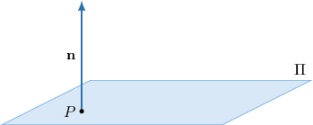
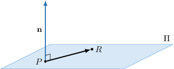

# The Vector Equation of a Plane

Source: https://www.mathacademy.com/topics/1805?courseId=145
Topic ID: 1805

## Prerequisites

- [Calculating the Dot Product Using Components](../../../high-school/integrated-math-honors/lessons/integrated-math-iii-honors/177-calculating-the-dot-product-using-components.md)
- [The Cartesian Equation of a Line](./1799-the-cartesian-equation-of-a-line.md)

## Lesson

### Introduction

Suppose we know that a plane $\Pi$ passes through the point $P(1,1,2)$ and that the vector $\mathbf{n}=\langle 0,0,3 \rangle$ is perpendicular to the plane. Let's write down an equation of this plane using the dot product.

We start by considering an arbitrary point $R(x,y,z)$ that lies on the plane. The position vectors of the points $R$ and $P$ are $\mathbf{r}=\langle x,y,z \rangle$ and $\mathbf{p}=\langle 1,1,2 \rangle$ respectively. So, the vector

$$

\begin{aligned}\overset{𝑃𝑅}{} & =𝐫−𝐩 \\ & =𝐫−⟨1,1,2⟩\end{aligned}

$$

is parallel to the plane. Therefore, $\overrightarrow{PR} \perp \mathbf{n},$ as shown below.

Now, recall that if two nonzero vectors are perpendicular, then their dot product is zero:

$$

\overrightarrow{PR}\perp \mathbf{n} \quad \Leftrightarrow \quad \overrightarrow{PR}\cdot \mathbf{n} = 0

$$

So, we get the equation

$$

\begin{aligned}(𝐫−𝐩)⋅𝐧 & =0.\end{aligned}

$$

This equation is called the **vector equation of the plane** that passes through the point $P(x_0,y_0,z_0)$ and is perpendicular to the vector $\mathbf{n}.$ In our case, we obtain

$$

(\mathbf{r} - \langle 1,1,2 \rangle) \cdot \langle 0,0,3 \rangle = 0.

$$

**Note:** Using the properties of the dot product, we can arrive at an alternative vector equation given by

$$

\begin{aligned}(𝐫−𝐩)⋅𝐧 & =0 \\ 𝐫⋅𝐧−𝐩⋅𝐧 & =0 \\ 𝐫⋅𝐧 & =𝐩⋅𝐧 \\ 𝐫⋅𝐧 & =𝑐\end{aligned}

$$

where $c = \mathbf{p} \cdot \mathbf{n}$ is a (scalar) constant.

### Example: Finding the Vector Equation of the Plane Perpendicular to a Given Vector

#### Question

Find an equation of the plane that contains the point $P(-3,2,1)$ and is perpendicular to the vector $\mathbf{n}= \langle 0, 2, 0 \rangle.$

#### Explanation

First, we note that the position vector of $P$ is $\mathbf{p}=\langle -3,2,1 \rangle$ and $\mathbf{n}=\langle 0,2,0 \rangle$ is normal to the plane.

The equation of the plane that passes through the point $P(x_0,y_0,z_0)$ and is perpendicular to the vector $\mathbf{n}$ can be given as

$$

(\mathbf{r} - \mathbf{p}) \cdot \mathbf{n} = 0,

$$

where $\mathbf{r}$ is the position vector of any point on the plane, and $\mathbf p$ is the position vector of $P.$

So, we have

$$

\begin{aligned}(𝐫−𝐩)⋅𝐧 & =0 \\ 𝐫⋅𝐧−𝐩⋅𝐧 & =0 \\ 𝐫⋅𝐧 & =𝐩⋅𝐧 \\ 𝐫⋅⟨0,2,0⟩ & =⟨−3,2,1⟩⋅⟨0,2,0⟩ \\ 𝐫⋅⟨0,2,0⟩ & =4.\end{aligned}

$$

### A Vector Parallel To a Plane

Suppose we have a plane with the following normal vector:

$$

\mathbf{n}=\langle -1,2,1 \rangle

$$

Let's use the scalar product to find a vector that is parallel to this plane.

We denote our parallel vector as $\mathbf{v} = \langle t_1,t_2,t_3 \rangle.$ Now, since $\mathbf{v} \perp \mathbf{n},$ we must have

$$

\begin{aligned}𝐯⋅𝐧 & =0 \\ ⟨𝑡_{1},𝑡_{2},𝑡_{3}⟩⋅⟨−1,2,1⟩ & =0 \\ −𝑡_{1}+2𝑡_{2}+𝑡_{3} & =0\end{aligned}

$$

We now need to find a nonzero solution to this equation. To do that, we solve the equation for *one* of the variables (it doesn't matter which one). For example, let's solve our equation for the variable $t_1\mathbin{:}$

$$

\begin{aligned}𝑡_{1} & =2𝑡_{2}+𝑡_{3}\end{aligned}

$$

Here, the variable $t_1$ depends on $t_2$ and $t_3,$ which, in turn, can be *any* real numbers. The variables $t_2$ and $t_3$ are called **free variables**.

Hence, the general form of our vector $\mathbf{v}$ is

$$

\mathbf{v}=\langle 2t_2+t_3, \, t_2, \, t_3 \rangle,

$$

where $t_2, t_3 \in (-\infty,\infty).$

To find a particular vector parallel to the plane, we can substitute any values for $t_2$ and $t_3\mathbin{:}$

- For example, setting $t_2=0$ and $t_3=1$, we get

- Or, we could set $t_2=1$ and $t_3=0$ and get

**Note:** There are infinitely many vectors parallel to a given plane. In our example, we found only two particular vectors.

### Example: Finding a Vector That Is Parallel To a Plane

#### Question

A nonzero vector $\langle 0,\, \boxed{b}, \: \boxed{c} \rangle$ is parallel to the plane $\mathbf{r} \cdot \langle 2, -1, 4 \rangle = 3.$ What is the value of $\dfrac{b}{c}?$

#### Explanation

We need a vector $\mathbf{v} = \langle t_1,t_2,t_3 \rangle$ that is parallel to the given plane.

From the equation $\mathbf{r} \cdot \langle 2, -1, 4 \rangle = 3$ of the plane, we get the normal vector $\mathbf{n}=\langle 2, -1, 4 \rangle.$ So, $\mathbf{v} \perp \mathbf{n}$ and we have the following:

$$

\begin{aligned}𝐯⋅𝐧 & =0 \\ ⟨𝑡_{1},𝑡_{2},𝑡_{3}⟩⋅⟨2,−1,4⟩ & =0 \\ 2𝑡_{1}−𝑡_{2}+4𝑡_{3} & =0 \\ 𝑡_{2} & =2𝑡_{1}+4𝑡_{3}\end{aligned}

$$

Hence, we obtain

$$

\mathbf{v}=\langle t_1, 2t_1 + 4t_3, t_3 \rangle,

$$

where $t_1,t_3 \in (-\infty,\infty).$

We are told that the first component of $\mathbf{v}$ equals $0.$ So, we must set $t_1=0.$

Since $\mathbf{v}$ is nonzero, we can pick any $t_3 \neq 0.$ For example, setting $t_3=1$, we get

$$

\mathbf{v} = \langle 0,\, \boxed{4}, \, \boxed{1} \rangle.

$$

Therefore, $\dfrac{b}{c} = 4.$

### Example: Finding the Vector Equation of the Plane Perpendicular to a Given Straight Line

#### Question

Find an equation of the plane that passes through the point $Q(\sqrt{2},0,-5)$ and is perpendicular to the line

$$

\begin{aligned}𝑥=3 \\ 𝑦=−1+\sqrt{3}𝑡 \\ 𝑧=5−𝑡.\end{aligned}

$$

#### Explanation

Note that the position vector of $Q$ is $\mathbf{q}=\langle \sqrt{2},0,-5 \rangle.$ Converting the parametric equations of the line to vector form, we get

$$

\begin{aligned}𝑥=3 \\ 𝑦=−1+\sqrt{3}𝑡 \\ 𝑧=5−𝑡\end{aligned}

$$

The direction vector of the line is $\mathbf{v}=\langle 0, \sqrt{3}, -1\rangle,$ so a normal vector to the plane is

$$

\mathbf{n}=\mathbf{v}=\langle 0 , \sqrt{3} , -1 \rangle.

$$

Therefore, the equation of the plane is given by

$$

\begin{aligned}(𝐫−𝐪)⋅𝐧 & =0 \\ 𝐫⋅𝐧−𝐪⋅𝐧 & =0 \\ 𝐫⋅𝐧 & =𝐪⋅𝐧 \\ 𝐫⋅⟨0,\sqrt{3},−1⟩ & =⟨\sqrt{2},0,−5⟩⋅⟨0,\sqrt{3},−1⟩ \\ 𝐫⋅⟨0,\sqrt{3},−1⟩ & =5.\end{aligned}

$$
