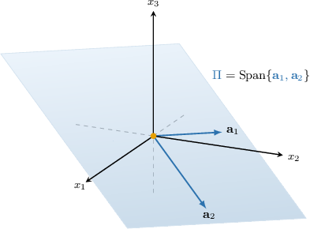
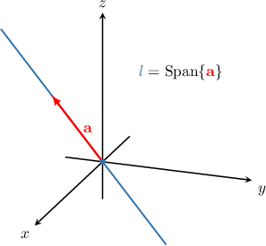
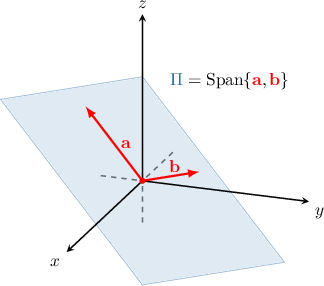

# Linear Span of Vectors in N-Dimensional Euclidean Space

Source: https://www.mathacademy.com/topics/1852?courseId=145
Topic ID: 1852

## Prerequisites

- [Gaussian Elimination For NxM Systems of Equations](./1733-gaussian-elimination-for-nxm-systems-of-equations.md)
- [Linear Combinations of Vectors in N-Dimensional Euclidean Space](./1851-linear-combinations-of-vectors-in-n-dimensional-euclidean-space.md)

## Lesson

### Introduction

Given two vectors $\mathbf{a}_1$ and $\mathbf{a}_2,$ the set of all possible linear combinations of $\mathbf{a}_1$ and $\mathbf{a}_2$ is

$$

U = \left\{ x_1 \mathbf{a}_1 + x_2 \mathbf{a}_2 \: : \: x_1,x_2\in\mathbb{R} \right\}.

$$

The set $U$ is also called the **linear span** of $\mathbf{a}_1$ and $\mathbf{a}_2,$ and is denoted by $\text{Span}\{\mathbf{a}_1, \mathbf{a}_2 \}.$ We say that $\mathbf{a}_1$ and $\mathbf{a}_2$ are the **generators** of $\text{Span}\{\mathbf{a}_1, \mathbf{a}_2 \}.$

For example, let's find the linear span generated by the following vectors:

$$

\begin{aligned}−1 \\ 1 \\ 0\end{aligned}

$$

From the definition of linear span, we know that if $\mathbf{b} \in \text{Span}\{\mathbf{a}_1, \mathbf{a}_2 \},$ then $\mathbf{b}$ must take the form

$$

\mathbf{b} = x_1\mathbf{a_1} + x_2\mathbf{a_2}

$$

for some $x_1,x_2\in\mathbb{R}.$ So, we have

$$

\begin{aligned}𝐛 & =𝑥_{1}𝐚_{𝟏}+𝑥_{2}𝐚_{𝟐} \\ & =𝑥_{1}\begin{matrix}−1 \\ 1 \\ 0\end{matrix}+𝑥_{2}\begin{matrix}3 \\ 2 \\ −1\end{matrix} \\ & =\begin{matrix}−𝑥_{1} \\ 𝑥_{1} \\ 0\end{matrix}+\begin{matrix}3𝑥_{2} \\ 2𝑥_{2} \\ −𝑥_{2}\end{matrix} \\ & =\begin{matrix}−𝑥_{1}+3𝑥_{2} \\ 𝑥_{1}+2𝑥_{2} \\ −𝑥_{2}\end{matrix}.\end{aligned}

$$

Therefore the linear span of $\mathbf{a}_1$ and $\mathbf{a}_2$ is

$$

\begin{aligned}−𝑥_{1}+3𝑥_{2} \\ 𝑥_{1}+2𝑥_{2} \\ −𝑥_{2}\end{aligned}

$$

Geometrically, $\text{Span}\{\mathbf{a}_1, \mathbf{a}_2 \}$ can be viewed as the plane $\Pi$ that passes through the origin and is parallel to the vectors $\mathbf{a}_1$ and $\mathbf{a}_2,$ as shown below.

### Example: Determining Whether a Vector Lies in the Span of Given Vectors

#### Question

Determine if $\mathbf{b}$ lies in $\text{Span}\{\mathbf{a_1}, \mathbf{a_2} \},$ where

$$

\begin{aligned}1 \\ 1 \\ 2\end{aligned}

$$

#### Explanation

We know that $\mathbf{b} \in \text{Span}\{\mathbf{a_1}, \mathbf{a_2} \}$ if there exist $x_1$ and $x_2$ such that

$$

\begin{aligned}𝑥_{1}𝐚_{𝟏}+𝑥_{2}𝐚_{𝟐} & =𝐛 \\ 𝑥_{1}\begin{matrix}1 \\ 1 \\ 2\end{matrix}+𝑥_{2}\begin{matrix}5 \\ 3 \\ 2\end{matrix} & =\begin{matrix}8 \\ 2 \\ −5\end{matrix}.\end{aligned}

$$

So, we have the following system of equations:

$$

\begin{aligned}𝑥_{1}+5𝑥_{2}=8 \\ 𝑥_{1}+3𝑥_{2}=2 \\ 2𝑥_{1}+2𝑥_{2}=−5\end{aligned}

$$

To solve the system above, we set up and row reduce an augmented matrix:

$$

\begin{aligned} & ∼\,\,\begin{matrix}1 & 5 & 8 \\ 1 & 3 & 2 \\ 2 & 2 & −5\end{matrix} & 𝑅_{2} & :=𝑅_{2}−𝑅_{1} \\ & ∼\begin{matrix}1 & 5 & 8 \\ 0 & −2 & −6 \\ 2 & 2 & −5\end{matrix} & 𝑅_{3} & :=𝑅_{3}−2𝑅_{1} \\ & ∼\begin{matrix}1 & 5 & 8 \\ 0 & −2 & −6 \\ 0 & −8 & −21\end{matrix} & 𝑅_{2} & :=−\frac{1}{2}𝑅_{2} \\ & ∼\begin{matrix}1 & 5 & 8 \\ 0 & 1 & 3 \\ 0 & −8 & −21\end{matrix} & 𝑅_{3} & :=𝑅_{3}+8𝑅_{2} \\ & ∼\begin{matrix}1 & 5 & 8 \\ 0 & 1 & 3 \\ 0 & 0 & 3\end{matrix} & 𝑅_{2} & ↔𝑅_{3}\end{aligned}

$$

The third row of the augmented matrix now corresponds to the equation $0x_1 + 0x_2 = 3,$ which has no solution.

So, there are no values of $x_1$ and $x_2$ such that

$$

\begin{aligned}𝑥_{1}𝐚_{𝟏}+𝑥_{2}𝐚_{𝟐} & =𝐛 \\ 𝑥_{1}\begin{matrix}1 \\ 2 \\ 1\end{matrix}+𝑥_{2}\begin{matrix}5 \\ 2 \\ 3\end{matrix} & =\begin{matrix}8 \\ −5 \\ 2\end{matrix}.\end{aligned}

$$

Therefore, we conclude that $\mathbf{b}$ does ** lie in $\text{Span}\{\mathbf{a_1}, \mathbf{a_2} \}.$

### Example: Finding the Value of an Unknown Such That a Vector Lies in the Span of Given Vectors

#### Question

Find the values of $k$ such that the vector $\mathbf{b}$ lies in $\text{Span}\{\mathbf{a}_1, \mathbf{a}_2 \},$ where

$$

\begin{aligned}1 \\ 5 \\ 7\end{aligned}

$$

#### Explanation

We know that $\mathbf{b} \in \text{Span}\{\mathbf{a_1}, \mathbf{a_2} \}$ if there exist $x_1$ and $x_2$ such that

$$

\begin{aligned}𝑥_{1}𝐚_{𝟏}+𝑥_{2}𝐚_{𝟐} & =𝐛 \\ 𝑥_{1}\begin{matrix}1 \\ 5 \\ 7\end{matrix}+𝑥_{2}\begin{matrix}−2 \\ 4 \\ 2\end{matrix} & =\begin{matrix}13 \\ −5 \\ 𝑘\end{matrix}.\end{aligned}

$$

So, we have the following system of equations:

$$

\begin{aligned}𝑥_{1}−2𝑥_{2}=13 \\ 5𝑥_{1}+4𝑥_{2}=−5 \\ 7𝑥_{1}+2𝑥_{2}=𝑘\end{aligned}

$$

To solve the system above, we set up and row reduce an augmented matrix:

$$

\begin{aligned} & ∼\,\,\begin{matrix}1 & −2 & 13 \\ 5 & 4 & −5 \\ 7 & 2 & 𝑘\end{matrix} & 𝑅_{2} & :=𝑅_{2}−5𝑅_{1} \\ & ∼\begin{matrix}1 & −2 & 13 \\ 0 & 14 & −70 \\ 7 & 2 & 𝑘\end{matrix} & 𝑅_{3} & :=𝑅_{3}−7𝑅_{1} \\ & ∼\begin{matrix}1 & −2 & 13 \\ 0 & 14 & −70 \\ 0 & 16 & 𝑘−91\end{matrix} & 𝑅_{2} & :=\frac{1}{14}𝑅_{2} \\ & ∼\begin{matrix}1 & −2 & 13 \\ 0 & 1 & −5 \\ 0 & 16 & 𝑘−91\end{matrix} & 𝑅_{3} & :=𝑅_{3}−16𝑅_{2} \\ & ∼\begin{matrix}1 & −2 & 13 \\ 0 & 1 & −5 \\ 0 & 0 & 𝑘−11\end{matrix} & & \end{aligned}

$$

The third row of the augmented matrix now corresponds to the equation $0x_1 + 0x_2 = k-11$. Therefore, the system has a solution only if

$$

0 = k-11 \quad \Rightarrow \quad k=11.

$$

### Geometric Interpretation of the Linear Span

The linear span of vectors can be interpreted geometrically as the points in space that can be reached by adding multiples of those vectors.

- The span of a single nonzero vector is a *line* through the origin. More precisely, if $\mathbf{a} \neq \mathbf{0},$ then $\text{Span}\{\mathbf{a} \}$ determines the *line* with direction vector $\mathbf{a}$ that passes through the origin. For instance, if then $\text{Span}\{\mathbf{a} \}$ represents the line $l$ *spanned* by $\mathbf{a}\mathbin{:}$

- The span of two non-parallel vectors is a *plane* through the origin. More precisely, if $\mathbf{a} \not\parallel \mathbf{b}$ ($\mathbf{a}$ and $\mathbf{b}$ are not parallel), then $\text{Span}\{\mathbf{a}, \mathbf{b} \}$ determines the *plane* with direction vectors $\mathbf{a}$ and $\mathbf{b}$ that passes through the origin. For instance, if then $\text{Span}\{\mathbf{a}, \mathbf{b} \}$ represents the plane $\Pi$ *spanned* by $\mathbf{a}$ and $\mathbf{b}\mathbin{:}$

### Example: Determining Whether a Vector Lies on a Plane

#### Question

Determine if the vector $\mathbf{u}$ lies on the plane $\;\Pi \,:\, \mathbf{r}=s \mathbf{b} + t \mathbf{c}, \, t,s \in \mathbb{R},$ where $\mathbf{b}=\langle 1, 4, 5 \rangle, \mathbf{c} = \langle 2, 4, 6 \rangle$ and $\mathbf{u}= \langle 2, 10, 12 \rangle.$

#### Explanation

By definition, $\mathbf{u} \in \Pi$ if there exist $t$ and $s$ such that

$$

\begin{aligned}𝑠𝐛+𝑡𝐜 & =𝐮 \\ 𝑠\begin{matrix}1 \\ 4 \\ 5\end{matrix}+𝑡\begin{matrix}2 \\ 4 \\ 6\end{matrix} & =\begin{matrix}2 \\ 10 \\ 12\end{matrix}.\end{aligned}

$$

So, we have the following system of equations:

$$

\begin{aligned}𝑠+2𝑡=2 \\ 4𝑠+4𝑡=10 \\ 5𝑠+6𝑡=12\end{aligned}

$$

To solve the system above, we set up and row reduce an augmented matrix:

$$

\begin{aligned} & ∼\,\,\begin{matrix}1 & 2 & 2 \\ 4 & 4 & 10 \\ 5 & 6 & 12\end{matrix} & 𝑅_{2} & :=𝑅_{2}−4𝑅_{1} \\ & ∼\begin{matrix}1 & 2 & 2 \\ 0 & −4 & 2 \\ 5 & 6 & 12\end{matrix} & 𝑅_{3} & :=𝑅_{3}−5𝑅_{1} \\ & ∼\begin{matrix}1 & 2 & 2 \\ 0 & −4 & 2 \\ 0 & −4 & 2\end{matrix} & 𝑅_{3} & :=𝑅_{3}−𝑅_{2} \\ & ∼\begin{matrix}1 & 2 & 2 \\ 0 & −4 & 2 \\ 0 & 0 & 0\end{matrix} & & \end{aligned}

$$

Now, we have the system

$$

\begin{aligned}𝑠+2𝑡=2 \\ −4𝑡=2 \\ 0=0.\end{aligned}

$$

From the second equation, we get

$$

-4t = 2 \qquad \Longrightarrow \qquad t = -\dfrac{1}{2}.

$$

Substituting into the first equation, we get

$$

\begin{aligned}𝑠+2𝑡 & =2 \\ 𝑠+2(−\frac{1}{2}) & =2 \\ 𝑠−1 & =2 \\ 𝑠 & =3.\end{aligned}

$$

Since we found a solution $s=3, \, t=-\dfrac{1}{2},$ we conclude that $\mathbf{u}$ does indeed lie on the plane $\Pi.$ In fact, we have

$$

\mathbf{u}=3\mathbf{b} - \dfrac{1}{2}\mathbf{c}.

$$
