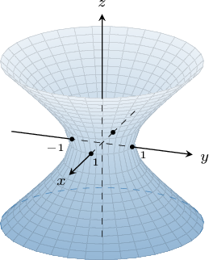
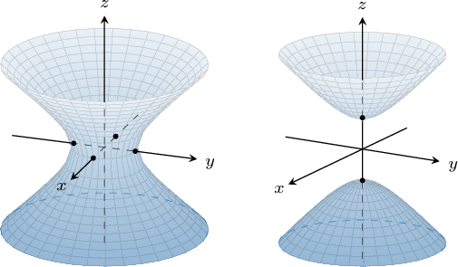
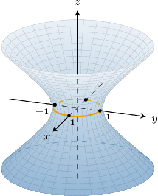
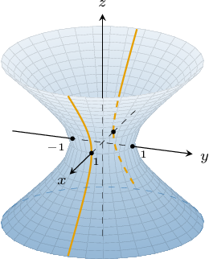
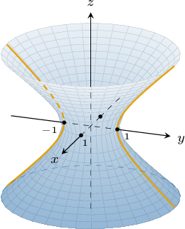
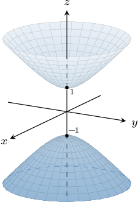
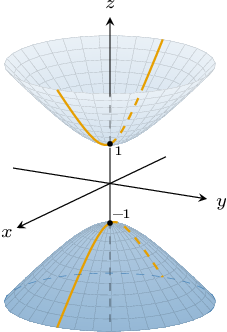
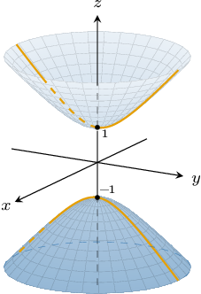
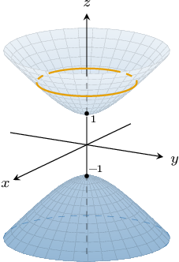

# Hyperboloids

Source: https://www.mathacademy.com/topics/1892?courseId=145
Topic ID: 1892

## Prerequisites

- [Finding Intercepts and Intersections of Hyperbolas](../../../high-school/integrated-math-honors/lessons/integrated-math-iii-honors/874-finding-intercepts-and-intersections-of-hyperbolas.md)
- [Ellipsoids](./1896-ellipsoids.md)

## Lesson

### Introduction

A **hyperboloid of one sheet** centered at $(x_0,y_0,z_0)$ is a quadric surface whose equation is given by

$$

\dfrac{(x-x_0)^2}{a^2} + \dfrac{(y-y_0)^2}{b^2} - \dfrac{(z-z_0)^2}{c^2} =1,

$$

where $a,$ $b,$ and $c$ are constants.

For example, the graph of the hyperboloid of one sheet

$$

x^2+y^2-z^2=1

$$

is shown below. It has its center at the origin, and the $z$-axis is the **axis of symmetry** of the hyperboloid.

The intercepts of this hyperboloid with the coordinate axes are as follows:

- the $x$-intercepts are $(\pm1,0,0)$

- the $y$-intercepts are $(0,\pm1,0)$

- there are no $z$-intercepts

### Hyperboloids of Two Sheets

A **hyperboloid of two sheets** centered at $(x_0, y_0, z_0)$ is given by

$$

\dfrac{(x-x_0)^2}{a^2} + \dfrac{(y-y_0)^2}{b^2} - \dfrac{(z-z_0)^2}{c^2} =-1.

$$

**Watch out!** This equation is similar to the general equation of a hyperboloid of one sheet. The only difference is the right-hand side is now $-1$ instead of $+1.$

For example, the graph of the hyperboloid of two sheets

$$

x^2+y^2-z^2=-1

$$

is represented below. It has its center at the origin, and the $z$-axis is the **axis of symmetry** of the hyperboloid.

The intercepts of this hyperboloid with the $z$-axis are $(0,0,\pm1).$ The surface does not intersect the $x$- or $y$-axes.

Calculating the intercepts of a hyperboloid with the coordinate axes is done in the same way as we've seen before with spheres and ellipsoids. Let's see some examples.

There is a simple way to distinguish between hyperboloids of one and two sheets by simply looking at the equations:

- *one* minus sign indicates hyperboloids of *one* sheet:

- *two* minus signs indicate hyperboloids of *two* sheets:

### Example: Identifying the Intercepts of a Hyperboloid

#### Question

Given the hyperboloid of one sheet $\dfrac{(x-3)^2}9 + \dfrac{(y+4)^2}{16} - \dfrac{(z-5)^2}{25} = 1,$ find its intercepts with the $x$-axis.

#### Explanation

To find the $x$-intercepts, we plug $y=0$ and $z=0$ into the equation:

$$

\begin{aligned}\frac{(𝑥−3)^{2}}{9}+\frac{(0+4)^{2}}{16}−\frac{(0−5)^{2}}{25} & =1 \\ \frac{(𝑥−3)^{2}}{9}+1−1 & =1 \\ \frac{(𝑥−3)^{2}}{9} & =1 \\ (𝑥−3)^{2} & =9 \\ 𝑥−3 & =±\sqrt{√9} \\ 𝑥 & =3±3 \\ 𝑥 & =0,6\end{aligned}

$$

Therefore, the intercepts with the $x$-axis are $(0,0,0)$ and $(6,0,0).$

### The Domain of a Hyperboloid

Let's consider the graphs a typical one-sheet and two-sheet hyperboloids centered at $O,$ as shown below.

Notice that a hyperboloid of two sheets is defined for any $(x,y) \in \mathbb{R}^2.$ In fact, for any point $(x,y)$ in the $xy$-plane, there are exactly two points on the hyperboloid.

On the other hand, the graph of a hyperboloid of one sheet does not contain points over the central elliptical region (close to the axis of symmetry).

For example, given the hyperboloid of one sheet $x^2 + y^2 - z^2 = 1,$ let's find the domain of $z = z(x,y).$

From the hyperboloid equation, we make $z$ the subject as follows:

$$

\begin{aligned}𝑥^{2}+𝑦^{2}−𝑧^{2} & =1 \\ 𝑥^{2}+𝑦^{2}−1 & =𝑧^{2} \\ 𝑧^{2} & =𝑥^{2}+𝑦^{2}−1 \\ 𝑧 & =±\sqrt{√𝑥^{2}+𝑦^{2}−1}\end{aligned}

$$

Since the square root is defined only for non-negative arguments, we have

$$

\begin{aligned}𝑥^{2}+𝑦^{2}−1 & ≥0 \\ 𝑥^{2}+𝑦^{2} & ≥1,\end{aligned}

$$

which gives the *exterior* and boundary of the circle $x^2 + y^2 = 1.$

Therefore, the domain of $z(x,y)$ for the hyperboloid $x^2+y^2-z^2 = 1$ is

$$

\left \{(x,y) \: : \: x^2 + y^2 \geq 1 \right\}.

$$

### Example: Identifying the Domain of a Hyperboloid

#### Question

Given the hyperboloid of two sheets $(x-1)^2 + y^2 - \dfrac{z^2}{4} = -1,$ find the domain of $z = z(x,y).$

#### Explanation

From the hyperboloid equation, we make $z$ the subject as follows:

$$

\begin{aligned}(𝑥−1)^{2}+𝑦^{2}−\frac{𝑧^{2}}{4} & =−1 \\ (𝑥−1)^{2}+𝑦^{2}+1 & =\frac{𝑧^{2}}{4}\end{aligned}

$$

$$

\begin{aligned}\frac{𝑧^{2}}{4} & =(𝑥−1)^{2}+𝑦^{2}+1 \\ 𝑧^{2} & =4((𝑥−1)^{2}+𝑦^{2}+1) \\ 𝑧 & =±2\sqrt{√(𝑥−1)^{2}+𝑦^{2}+1}\end{aligned}

$$

The square root is defined only for non-negative arguments. However, notice that for all $(x,y)\in\mathbb R^2,$ we have

$$

(x-1)^2 + y^2 + 1 \geq 0.

$$

Therefore, the domain of $z(x,y)$ is $\mathbb R^2.$

### Alternative Orientations of the Axis of Symmetry

So far, we've encountered hyperboloids whose axes of symmetry are parallel to the $z$-axis. Let's now consider the cases when a hyperboloid is oriented along the $x$- or the $y$-axes.

For a hyperboloid of one sheet centered at the origin, the other two cases are as follows:

- When the $y$ term is negative, the axis of symmetry is the $y$-axis.

- When the $x$ term is negative, the axis of symmetry is the $x$-axis.

Likewise, for a hyperboloid of two sheets centered at the origin, the other two cases are as follows:

- When the $y$ term is negative, the axis of symmetry is the $y$-axis.

- When the $x$ term is negative, the axis of symmetry is the $x$-axis.

### Traces of Hyperboloids of One Sheet

The traces of a hyperboloid of one sheet are either ellipses or hyperbolas.

For example, let's find the traces with the coordinate planes for the hyperboloid of one sheet given by

$$

x^2+y^2-z^2=1.

$$

- The trace of this surface in the $xy$-plane (when $z=0$) is given by the equation which is a circle centered at the origin of radius $1$ in the $xy$-plane.

- The trace of this surface in the $xz$-plane (when $y=0$) is given by the equation which is a hyperbola in the $xz$-plane centered at the origin.

- The trace of this surface in the $yz$-plane (when $x=0$) is given by the equation which is a hyperbola in the $yz$-plane centered at the origin.

### Traces of Hyperboloids of Two Sheets

The traces of a hyperboloid of two sheets are either ellipses, hyperbolas, a single point, or the empty set.

For example, let's find the traces with the coordinate planes for the hyperboloid of two sheets given by

$$

x^2+y^2-z^2=-1.

$$

- The trace of this surface in the $xy$-plane (when $z=0$) is the empty set since the surface does not intersect the $xy$-plane.

- The trace of this surface in the $xz$-plane (when $y=0$) is given by the equation which is a hyperbola in the $xz$-plane centered at the origin.

- The trace of this surface in the $yz$-plane (when $x=0$) is given by the equation which is a hyperbola in the $yz$-plane centered at the origin.

There are a few other cases we should note:

- The trace of our surface with the plane $z=1$ is a single point (the vertex of the upper sheet): Likewise, the trace of our surface with the plane $z=-1$ is another point (the vertex of the lower sheet):

- The trace of our surface with the horizontal plane $z=k$ for $|k| > 1$ is a circle:

### Example: Finding Traces of Hyperboloids

#### Question

The projection of the intersection between the hyperboloid of two sheets

$$

-\dfrac{(x-5)^2}{8} + \dfrac{y^2}{50} + (z-3)^2 = -1

$$

and the plane $z = 4$ onto the $xy$-plane is a hyperbola. What are the lengths of the semi-axes of the hyperbola?

#### Explanation

To find the intersection of the hyperboloid and the plane $z = 4,$ we substitute $z = 4$ into the equation of the hyperboloid:

$$

\begin{aligned}−\frac{(𝑥−5)^{2}}{8}+\frac{𝑦^{2}}{50}+(𝑧−3)^{2} & =−1 \\ −\frac{(𝑥−5)^{2}}{8}+\frac{𝑦^{2}}{50}+1=−1 & \\ −\frac{(𝑥−5)^{2}}{8}+\frac{𝑦^{2}}{50} & =−2 \\ \frac{(𝑥−5)^{2}}{8}−\frac{𝑦^{2}}{50} & =2 \\ \frac{(𝑥−5)^{2}}{16}−\frac{𝑦^{2}}{100} & =1 \\ \frac{(𝑥−5)^{2}}{4^{2}}−\frac{𝑦^{2}}{10^{2}} & =1\end{aligned}

$$

This gives us the equation of a hyperbola with semi-axes of lengths $4$ and $10.$
