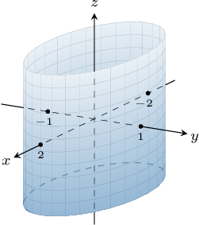
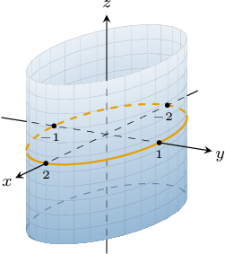
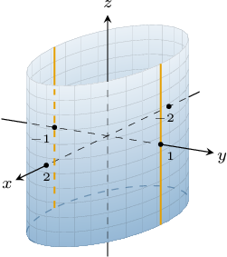
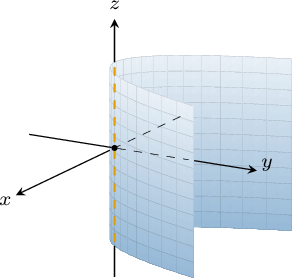
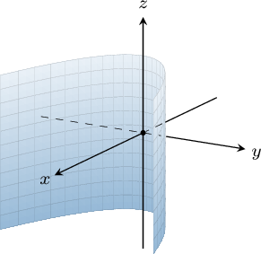
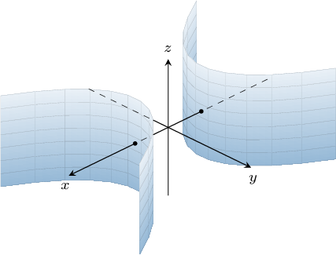
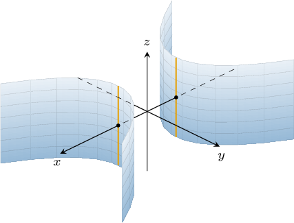
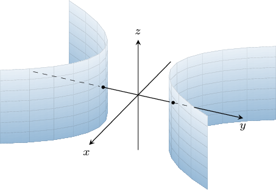

# Cylinders

Source: https://www.mathacademy.com/topics/1895?courseId=145
Topic ID: 1895

## Prerequisites

- [Equations of Hyperbolas Centered at a General Point](../../../high-school/integrated-math-honors/lessons/integrated-math-iii-honors/733-equations-of-hyperbolas-centered-at-a-general-point.md)
- [Ellipsoids](./1896-ellipsoids.md)

## Lesson

### Introduction

A **cylinder** is a surface made by the set of lines that pass through a plane curve $C$ in the $xy$-plane and are perpendicular to this plane. The curve $C$ is called the **base curve**.

The familiar two-dimensional conic sections (circles, ellipses, parabolas, and hyperbolas) can be used to describe cylinders. In this lesson, we'll explore these shapes.

An **elliptic cylinder** is a cylinder whose base curve $C$ is an ellipse. If the ellipse lies in the $xy$-plane and is centered at $(x_0,y_0,0)$, then the equation of our elliptic cylinder is given by

$$

\dfrac{(x-x_0)^2}{a^2} + \dfrac{(y-y_0)^2}{b^2} = 1,

$$

where $a$ and $b$ are the semi-axes of the ellipse $C.$ In particular, if $a=b$, we get a **circular cylinder.**

**Watch out!** This may look like the equation of a regular ellipse. However, since we're now describing a surface in three-dimensional space, we assume that the $z$-coordinate is arbitrary. Thus, if we want $z$ to feature in our equations explicitly, we would write

$$

\dfrac{(x-x_0)^2}{a^2} + \dfrac{(y-y_0)^2}{b^2} = 1, \qquad z=k

$$

where $k\in \mathbb R.$

For example, the graph of the elliptic cylinder

$$

\dfrac{x^2}{4} + y^2 = 1

$$

is shown below. The center of its base ellipse $C$ is at the origin, and the **axis** of the elliptic cylinder (the line through the center of the cylinder) is the $z$-axis.

Let's describe some properties of this elliptic cylinder:

- The trace of this surface in the $xy$-plane (when $z=0$) is given by the equation which is the base ellipse $C$ centered at the origin $(0,0,0)$ with semi-major and semi-minor axes of lengths $2$ and $1,$ respectively.

- The trace of this surface in the $xz$-plane (when $y=0$) is given by the equation which corresponds to two lines in the $xz$-plane.

- The trace of this surface in the $yz$-plane (when $x=0$) is given by the equation which corresponds to two lines in the $yz$-plane.

### Parabolic Cylinders

A **parabolic cylinder** is a cylinder whose base curve $C$ is a parabola.

If the parabola $C$ opens upward or downward when viewed from the $xy$-plane and its vertex is at $(x_0,y_0,0)$, then the equation of the parabolic cylinder is given by

$$

(x-x_0)^2 = 4p(y-y_0),

$$

where $p$ is a constant.

For example, the graph of the parabolic cylinder

$$

x^2 = y

$$

is shown below. Its base curve is an upward-opening parabola in the $xy$-plane with its vertex at the origin. The **axis** of the cylinder is the $z$-axis.

The trace of this parabolic cylinder can be either a parabola or a set of lines.

- The trace of this surface in the $xy$-plane (when $z=0$) is given by the equation which corresponds to the base parabola $C$ with its vertex at the origin $(0,0,0).$

- The trace of this surface in the $xz$-plane (when $y=0$) is given by the equation which corresponds to a line in the $xz$-plane.

- The trace of this surface in the $yz$-plane (when $x=0$) is given by the equation which corresponds to a line in the $yz$-plane.

On the other hand, if the base parabola $C$ is left-opening or right-opening when viewed from the $xy$-plane and its vertex is at $(x_0,y_0,0)$, then the equation of the parabolic cylinder is given by

$$

(y-y_0)^2 = 4p(x-x_0),

$$

where $p$ is a constant.

For example, the graph of the parabolic cylinder

$$

y^2 = x

$$

is shown below. Its base curve is a right-opening parabola in the $xy$-plane with its vertex at the origin. The cylinder's axis is the $z$-axis.

### Hyperbolic Cylinders

A **hyperbolic cylinder** is a cylinder whose base curve $C$ is a hyperbola.

If the hyperbola $C$ is horizontal in the $xy$-plane and is centered at $(x_0,y_0,0)$, then the equation of the hyperbolic cylinder is given by

$$

\dfrac{(x-x_0)^2}{a^2} - \dfrac{(y-y_0)^2}{b^2} = 1,

$$

where $a$ and $b$ are constants.

For example, the graph of the hyperbola cylinder

$$

x^2 - y^2 = 1

$$

is shown below. Its base curve is a horizontal hyperbola in the $xy$-plane centered at the origin. The **axis** of the cylinder is the $z$-axis.

The trace of this surface can be either a hyperbola, a set of lines, or the empty set.

- The trace of this surface in the $xy$-plane (when $z=0$) is given by the equation which is the base hyperbola $C$ centered at the origin $(0,0,0).$

- The trace of this surface in the $xz$-plane (when $y=0$) is given by the equation which corresponds to a pair of lines in the $xz$-plane.

- The trace of this surface in the $yz$-plane (when $x=0$) is the empty set.

On the other hand, if the base hyperbola $C$ is vertical when viewed from the $xy$-plane and is centered at $(x_0,y_0,0)$, then the equation of the hyperbolic cylinder is given by

$$

\dfrac{(y-y_0)^2}{b^2} - \dfrac{(x-x_0)^2}{a^2} = 1,

$$

where $a$ and $b$ are constants.

For example, the graph of the hyperbola cylinder

$$

y^2 - x^2 = 1

$$

is shown below. Its base curve is a vertical hyperbola in the $xy$-plane centered at the origin, and the cylinder's axis is the $z$-axis.

Note that for all of the cylinders discussed so far, the *domain* of each cylinder in the $xy$-plane is simply the base curve $C.$

### Example: The Domain of a Cylinder

#### Question

What is the domain in the $xy$-plane of the elliptic cylinder $\dfrac{x^2}{9} + (y+1)^2 = 1?$

#### Explanation

The full expression describing all points on our elliptic cylinder is

$$

\dfrac{x^2}{9} + (y+1)^2 = 1, \qquad z=k

$$

where $k \in \mathbb{R}$ can vary arbitrarily.

The domain of any cylinder in the $xy$-plane is its base curve. Hence, in this case, the domain is

$$

\left\{(x,y) \in \mathbb{R}^2 : \dfrac{x^2}{9} + (y+1)^2 = 1\right\}

$$

which can be written as

$$

\left\{ (x,y) \in \mathbb{R}^2 : \dfrac{x^2}{3^2} + \dfrac{(y+1)^2}{1^2} = 1\right\}.

$$

This is an ellipse centered at $(0,-1)$ with semi-axes of lengths $3$ and $1.$

### Elliptic Cylinders With Alternative Central Axes

So far, we've encountered cylinders whose axes are parallel to the $z$-axis. However, we can also define cylinders whose axes are parallel to the $x$- or $y$-axes. To do this, we simply need to describe a base curve in either the $yz$-plane or the $xz$-plane.

For an elliptic cylinder whose base ellipse $C$ is centered at the origin, the other two cases are as follows:

- Consider the elliptic cylinder $C$ whose base curve lies in the $xz$-plane. In this case, the axis of the elliptic cylinder is the $y$-axis, as shown below.

- Consider the elliptic cylinder $C$ whose base curve lies in the $yz$-plane. In this case, the axis of the elliptic cylinder is the $x$-axis, as shown below.

### Parabolic Cylinders With Alternative Central Axes

For a parabolic cylinder whose base parabola $C$ has its vertex at the origin, the other four cases are as follows:

- When $C$ is in the $xz$-plane and $p>0,$ the axis is the $y$-axis. Note that if $p < 0,$ we get a reflection in the $xy$-plane or $yz$-plane of the parabolic cylinders shown above.

- When $C$ is in the $yz$-plane and $p>0,$ the axis is the $x$-axis. Note that if $p<0,$ we get a reflection in the $xy$-plane or $xz$-plane of the parabolic cylinders shown above.

### Hyperbolic Cylinders With Alternative Central Axes

For a hyperbolic cylinder whose base hyperbola $C$ has its vertex at the origin, the other four cases are as follows:

- When $C$ is in the $xz$-plane, the axis of the hyperbolic cylinder is the $y$-axis.

- When $C$ is in the $yz$-plane, the axis of the hyperbolic cylinder is the $x$-axis.

### Example: Traces of Cylinders

#### Question

What is the trace in the $yz$-plane of the elliptic cylinder $\dfrac {x^2} 2 + \dfrac {(y-2)^2}4 = 1?$

#### Explanation

To find the trace in the $yz$-plane, we substitute $x=0$ into the equation of the cylinder, and simplify:

$$

\begin{aligned}\frac{0^{2}}{2}+\frac{(𝑦−2)^{2}}{4} & =1 \\ (𝑦−2)^{2} & =4 \\ 𝑦−2 & =±2 \\ 𝑦 & =2±2 \\ 𝑦 & =0,4\end{aligned}

$$

This gives us the equation of two lines $y=0$ and $y=4$ in the $yz$-plane.
