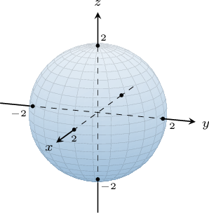
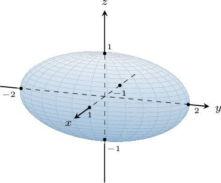
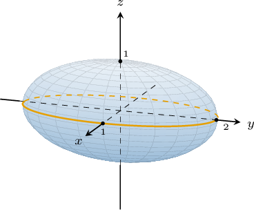
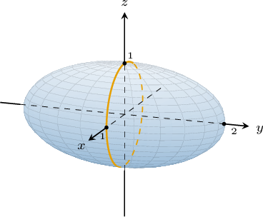
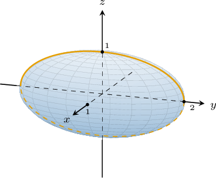
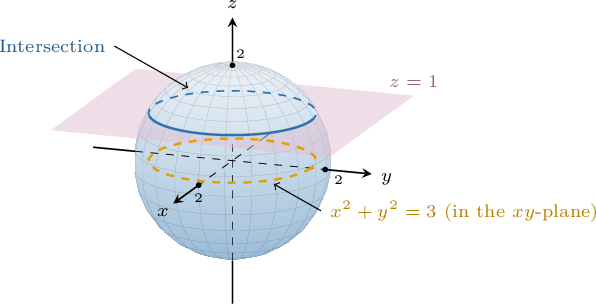

# Ellipsoids

Source: https://www.mathacademy.com/topics/1896?courseId=145
Topic ID: 1896

## Prerequisites

- [Determining Circle Properties by Completing the Square](../../../high-school/traditional/lessons/geometry/666-determining-circle-properties-by-completing-the-square.md)
- [Calculating Circle Intercepts](../../../high-school/traditional/lessons/geometry/844-calculating-circle-intercepts.md)
- [Finding Intercepts of Ellipses](../../../high-school/integrated-math-honors/lessons/integrated-math-iii-honors/850-finding-intercepts-of-ellipses.md)
- [The Cartesian Equation of a Plane](./1807-the-cartesian-equation-of-a-plane.md)
- [The Domain of a Multivariable Function](./1899-the-domain-of-a-multivariable-function.md)

## Lesson

### Introduction

A **quadric surface** is a surface in three-dimensional space whose equation is a second-degree polynomial in the variables $x,$ $y,$ and $z.$

The most general quadric surface has the form

$$

Ax^2+By^2+Cz^2+Dxy+Exz+Fyz+Gx+Hy+Iz+J = 0

$$

where $A,B,\ldots, J$ are all constants.

The simplest quadric surface is a **sphere**. A sphere of radius $r > 0$ centered at $O$ has the equation

$$

x^2+y^2+z^2 = r^2.

$$

For example, the equation

$$

x ^2 + y^2 + z ^2 =4

$$

represents the sphere of radius $r=\sqrt{4}=2$ centered at $(0,0,0),$ as shown below.

More generally, the equation of a sphere of radius $r > 0$ centered at $(x_0, y_0, z_0)$ is given by

$$

(x-x_0)^2 + (y-y_0)^2 + (z-z_0)^2 = r^2.

$$

### Example: Identifying the Center and Radius of a Sphere

#### Question

What are the radius $r$ and the coordinates of the center $C$ for the sphere $(x+1)^2 + y^2 + z^2 + 8z = 20?$

#### Explanation

The equation of a sphere centered at $(x_0, y_0, z_0)$ with radius $r > 0$ is given by

$$

(x-x_0)^2 + (y-y_0)^2 + (z-z_0)^2 = r^2.

$$

By completing the square for the variable $z$, we have

$$

\begin{aligned}(𝑥+1)^{2}+𝑦^{2}+𝑧^{2}+8𝑧 & =20 \\ (𝑥+1)^{2}+𝑦^{2}+(𝑧^{2}+8𝑧+16) & =20+16 \\ (𝑥+1)^{2}+𝑦^{2}+(𝑧+4)^{2} & =36.\end{aligned}

$$

Now, we can write our equation as

$$

(x-(-1))^2 + (y-0)^2 + (z-(-4))^2 = 6^2,

$$

which gives us the center at the point $C(-1,0,-4)$ and the radius $r=6.$

### Ellipsoids as Quadric Surfaces

An **ellipsoid** is a quadric surface similar to a sphere but may be stretched (or compressed) in one or more directions.

The equation of an ellipsoid centered at $(x_0, y_0, z_0)$ is given by

$$

\dfrac{(x-x_0)^2}{a^2} + \dfrac{(y-y_0)^2}{b^2} + \dfrac{(z-z_0)^2}{c^2} = 1

$$

where $a,b,$ and $c$ are the **semi-axes** of the ellipsoid parallel to the $x,y,$ and $z$ axes.

Note that when $a=b=c,$ we get a sphere. Thus, a sphere is a special case of an ellipsoid.

For example, the ellipsoid centered at $O$ with the equation

$$

x ^2 + \dfrac{y^2}{4} + z ^2 = 1

$$

is shown below.

We can find the intercepts of this ellipsoid with the $x,y,$ and $z$-axes as follows:

- To find the $x$-intercepts, we set $y=z=0$. This gives Thus, the $x$-intercepts of the ellipsoid are $(\pm 1,0,0).$

- To find the $y$-intercepts, we set $x=z=0$. This gives Thus, the $y$-intercepts of the ellipsoid are $(0,\pm 2,0).$

- To find the $z$-intercepts, we set $x=y=0$. This gives Thus, the $z$-intercepts of the ellipsoid are $(0,0,\pm 1).$

### Example: Calculating Intercepts of Spheres and Ellipsoids

#### Question

Given the ellipsoid $\dfrac {(x-2)^2} {2} + {y^2} + \dfrac{(z+1)^2}{2} =1,$ find its intercepts with the $x$-axis.

#### Explanation

To find the $x$-intercepts, we plug $y=0$ and $z=0$ into the equation:

$$

\begin{aligned}\frac{(𝑥−2)^{2}}{2}+(0)^{2}+\frac{(0+1)^{2}}{2} & =1 \\ \frac{(𝑥−2)^{2}}{2}+\frac{1}{2} & =1 \\ \frac{(𝑥−2)^{2}}{2} & =\frac{1}{2} \\ (𝑥−2)^{2} & =1 \\ 𝑥−2 & =±1 \\ 𝑥 & =2±1 \\ 𝑥 & =1,3\end{aligned}

$$

Therefore, the intercepts with the $x$-axis are $\left(1, 0, 0\right)$ and $\left(3, 0, 0\right).$

### Example: The Domain of a Sphere or Ellipsoid

#### Question

Given the ellipsoid $\dfrac {x^2} {4} + \dfrac {y^2} 9 + z^2 = 1$, find the domain of $z=z(x,y).$

#### Explanation

From the ellipsoid equation, we make $z$ the subject as follows:

$$

\begin{aligned}\frac{𝑥^{2}}{4}+\frac{𝑦^{2}}{9}+𝑧^{2} & =1 \\ 𝑧^{2} & =1−\frac{𝑥^{2}}{4}−\frac{𝑦^{2}}{9} \\ 𝑧 & =±\sqrt{√1−\frac{𝑥^{2}}{4}−\frac{𝑦^{2}}{9}}\end{aligned}

$$

Since the square root is defined only for non-negative arguments, we have the following:

$$

\begin{aligned}1−\frac{𝑥^{2}}{4}−\frac{𝑦^{2}}{9}≥0 \\ \frac{𝑥^{2}}{4}+\frac{𝑦^{2}}{9}≤1\end{aligned}

$$

which gives the interior of the ellipse $\dfrac {x^2} {4} + \dfrac {y^2} 9 = 1$ and its boundary.

Therefore, the domain is of $z = z(x,y)$ is given by

$$

\bigg\{ (x, y) \,:\, \dfrac {x^2} {4} + \dfrac {y^2} 9 \leq 1 \bigg\}.

$$

### The Traces of an Ellipsoid With the Coordinate Planes

The **trace** of a surface is the collection of points where the surface intersects a plane parallel to one of the coordinate planes.

For example, consider the following ellipsoid:

$$

x ^2 + \dfrac{y^2}{4} + z ^2 = 1

$$

Let's find the traces of this ellipsoid with the three coordinate planes:

- The trace of this surface in the $xy$-plane (when $z=0$) is given by the equation which is an ellipse centered at $(0,0)$ in the $xy$-plane with semi-axes $1$ and $2.$

- The trace in the $xz$-plane (when $y=0$) is given by the equation which is an ellipse centered at $(0,0)$ in the $xz$-plane with radius $1$ (remember that a circle is a special case of an ellipse).

- The trace in the $yz$-plane (when $x=0$) is given by the equation which is an ellipse centered at $(0,0)$ in the $yz$-plane with semi-axes $2$ and $1.$

For an ellipsoid, the traces are almost *always* ellipses! The only exceptions are if the plane and ellipsoid don't intersect (in which case the trace is the empty set) or if they intersect at a single point only.

### The Traces of an Ellipsoid With Other Planes

Now, consider the sphere

$$

x ^2 + y^2 + z ^2 =4.

$$

Let's find its intersection with the plane $z=1$ and the projection of the intersection onto the $xy$-plane.

To find the intersection, we substitute $z=1$ into the equation of the sphere:

$$

\begin{aligned}𝑥^{2}+𝑦^{2}+(1)^{2} & =4 \\ 𝑥^{2}+𝑦^{2}+1 & =4 \\ 𝑥^{2}+𝑦^{2} & =3 \\ 𝑥^{2}+𝑦^{2} & =(\sqrt{√3})^{2}\end{aligned}

$$

This gives the circle of radius $\sqrt{3}$ centered at $(0,0,1)$ in the plane $z=1,$ as shown below.

Projecting our circle onto the $xy$-plane, we get a circle of radius $\sqrt 3$ centered at $O$ in the $xy$-plane.

### Example: Describing Traces of Ellipsoids

#### Question

What is the trace in the $xy$-plane of the sphere $x^2 + (y+2)^2 + (z-3)^2 = 25?$

#### Explanation

To find the trace in the $xy$-plane, we substitute $z=0$ into the equation of the sphere:

$$

\begin{aligned}𝑥^{2}+(𝑦+2)^{2}+(0−3)^{2} & =25 \\ 𝑥^{2}+(𝑦+2)^{2}+9 & =25 \\ 𝑥^{2}+(𝑦+2)^{2} & =16\end{aligned}

$$

This gives us the equation of the circle of radius $4$ centered at $(0,-2)$ in the $xy$-plane.
