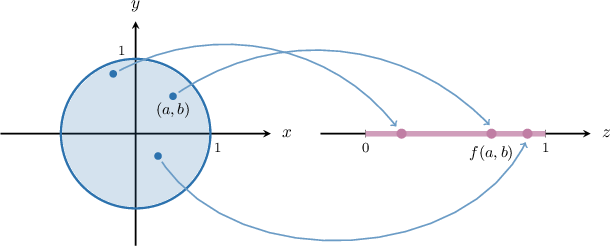
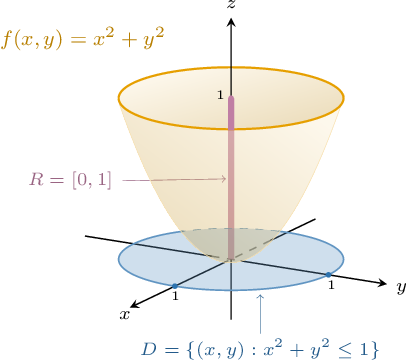
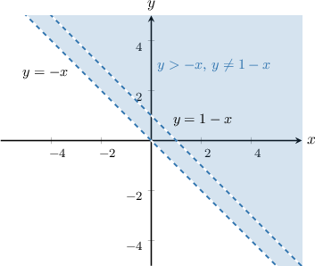

# The Domain of a Multivariable Function

Source: https://www.mathacademy.com/topics/1899?courseId=145
Topic ID: 1899

## Prerequisites

- [Graphing the Inverse Sine Function](../../../high-school/integrated-math-honors/lessons/integrated-math-iii-honors/1483-graphing-the-inverse-sine-function.md)
- [Graphing the Inverse Cosine Function](../../../high-school/integrated-math-honors/lessons/integrated-math-iii-honors/1486-graphing-the-inverse-cosine-function.md)
- [Properties of Transformed Exponential Functions](../../../high-school/traditional/lessons/algebra-ii/1609-properties-of-transformed-exponential-functions.md)
- [Properties of Transformed Logarithmic Functions](../../../high-school/traditional/lessons/algebra-ii/1610-properties-of-transformed-logarithmic-functions.md)
- [Properties of Transformed Square Root Functions](../../../high-school/traditional/lessons/algebra-ii/1875-properties-of-transformed-square-root-functions.md)
- [Domain and Range of Transformed Reciprocal Functions](../../../high-school/traditional/lessons/algebra-ii/2082-domain-and-range-of-transformed-reciprocal-functions.md)
- [Open and Closed Sets](./4097-open-and-closed-sets.md)

## Lesson

### Introduction

A function $f(x,y)$ of two variables is a rule that maps each pair of numbers $(x,y)\in D$ to a unique real number. Under this notation, $D\subseteq \mathbb R^2$ is the **domain** of $f.$

For instance, consider the following two-variable function:

$$

f(x,y) = \dfrac{\sin(xy)}{\sqrt{x-1}}

$$

We can evaluate this function by substituting concrete pairs of numbers for $x$ and $y{:}$

- Let's evaluate $f(x,y)$ at the point $(2, \pi).$ To do that, we substitute $x=2$ and $y=\pi$ into the function expression: Since $f(2,\pi)$ returned a unique real number, this means that $(2,\pi)$ belongs to the domain of $f,$ i.e., $(2,\pi)\in D.$

- Let's now try to evaluate $f(x,y)$ at the point $(0, \pi).$ To do that, we substitute $x=0$ and $y=\pi$ into the function expression: which is undefined over the real numbers. Since $f(0,\pi)$ did not return a unique *real* number, this means that $(0,\pi)\notin D.$

We can also have functions of three variables $f(x,y,z),$ functions of four variables, $f(x_1,x_2,x_3,x_4),$ etc. There is no limit to the number of variables a function can have. Functions with more than one variable are called **multivariable functions.**

### Example: Evaluating a Two-Variable Function

#### Question

The function $f(x,y)$ is defined as

$$

f(x,y) = y^2 - \log_3(x - 7).

$$

Evaluate this function at the point $(10,3).$

#### Explanation

To evaluate our multivariable function at the point $(10,3),$ we substitute $x = 10$ and $y = 3$ into the function expression:

$$

\begin{aligned}𝑓(10,3) & =(𝑦^{2}−log_{3}⁡(𝑥−7))_{(10,3)} \\ & =3^{2}−log_{3}⁡(10−7) \\ & =9−log_{3}⁡(3) \\ & =9−1 \\ & =8.\end{aligned}

$$

Therefore, $f(10,3)=8.$

### The Domain and Range of a Two-Variable Function

The **domain** of a multivariable function is the set of points where the function is defined.

For example, consider the function

$$

z = f(x,y) = \sqrt{1 -x^2 -y^2}.

$$

The function is well-defined at all points $(x,y)$ for which the expression under the square root is non-negative. As a result, the points in the domain must satisfy the following inequality:

$$

1 - x^2 - y^2 \geq 0 \qquad\Longrightarrow\qquad x^2 + y^2 \leq 1

$$

Therefore, the domain is

$$

D = \big\{ (x,y)\in\mathbb R^2 \,:\, x^2 + y^2 \leq 1 \big\}.

$$

Geometrically, the domain of our function is a disc of radius $1$ centered at the origin in the $xy$-plane, as shown on the left diagram below.

Each point in this domain is uniquely mapped to a real number $z.$ Possible values of $z$ can be visualized on a separate axis (depicted by the diagram on the right).

If $(x,y)$ is allowed to run over the entire domain, the set of points on the $z$-axis where the values of $f(x,y)$ land is called the **range** of the function. For this function, the range is $z\in [0,1].$

Note the following:

- When discussing a function's domain, we usually refer to the so-called **natural domain**, the largest set of values for which the function is defined.

- We can also *restrict* the domain of a function to a subset of the natural domain. For example, we might restrict the domain of $f$ to all values of $y$ in the upper-half plane. In this case, we'd write This gives a domain/range diagram that looks as follows. In this case, restricting the domain does not affect the range. However, in general, restricting the domain *will* affect the range.

### The Graph of a Two-Variable Function

Another way of visualizing a two-variable function is to draw its graph as a **surface** in a three-dimensional coordinate system.

For example, consider the function

$$

z = f(x,y) = x^2 +y^2, \quad (x,y)\in D

$$

where the (restricted) domain is given by the unit disc

$$

D = \big\{ (x,y)\in\mathbb R^2 \: : \: x^2+y^2 \leq 1 \big\}.

$$

The graph of $f$ is a surface that consists of all the points with coordinates

$$

(x, \, y, \, f(x,y)), \quad (x,y) \in D,

$$

as shown below.

Notice that range of $f$ is represented by the interval $R=[0,1]$ on the vertical $z$-axis. It consists of the possible $z$-coordinates of the points on our surface.

### Example: The Domain of a Function Involving Reciprocals and Radicals

#### Question

Find the domain of the function $z = \dfrac {\sqrt {y+1}}{x+y}.$

#### Explanation

The function is well-defined at all points $(x,y)$ for which the following conditions are satisfied:

- The expression in the denominator is not equal to zero, and

- the expression under the square root is non-negative.

As a result, the points in the domain must satisfy the following inequalities:

$$

\begin{aligned}𝑦+1≥0 \\ 𝑥+𝑦≠0\end{aligned}

$$

Therefore, the domain is

$$

\big\{ (x,y)\in\mathbb R^2 \,:\, y \geq -1, \: y \neq -x \big\}.

$$

### Example: The Domain of a Function Containing Exponential, Logarithmic, and Trigonometric Functions

#### Question

Find the domain of the function $z= \dfrac{\ln (2x+y)}{\sqrt{x}}.$

#### Explanation

The function is well-defined at all points $(x,y)$ for which the following conditions are satisfied:

- The expression under the logarithm is positive,

- the expression in the denominator is not equal to zero, and

- the expression under the square root is non-negative.

As a result, the points in the domain must satisfy the following inequalities:

$$

\begin{aligned}2𝑥+𝑦>0 \\ 𝑥>0\end{aligned}

$$

Therefore, the domain is

$$

\big\{(x, y)\in\mathbb R^2 \,:\, 2x+y >0, \: x > 0 \big\}.

$$

### Example: Sketching the Domain of a Multivariable Function

#### Question

Sketch the domain of $g(x,y)=\dfrac{1}{\ln(x+y)}.$

#### Explanation

The function is well-defined at all points $(x,y)$ for which the following conditions are satisfied:

- The expression under the logarithm is positive, and

- the expression in the denominator is not equal to zero.

As a result, the points in the domain must satisfy the following inequalities:

$$

\begin{aligned}𝑥+𝑦>0 \\ ln⁡(𝑥+𝑦)≠0\end{aligned}

$$

Therefore, the domain is

$$

D = \left \{ (x,y)\in\mathbb R^2 \, : \, y \gt -x, \, y \neq 1-x \right \}.

$$

Now, we plot the corresponding domain.

- Starting with $y> -x,$ we draw a dashed line $y=-x$ and shade the region ** the line.

- Then, we draw a dashed line $y=1-x$ through the shaded region.

The resulting domain is as follows:

